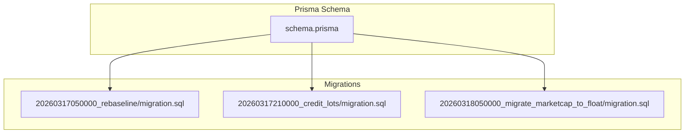
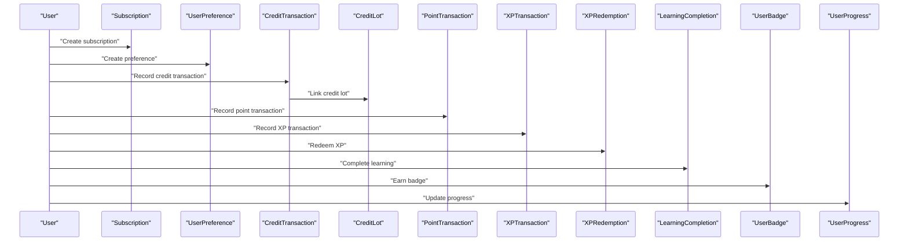
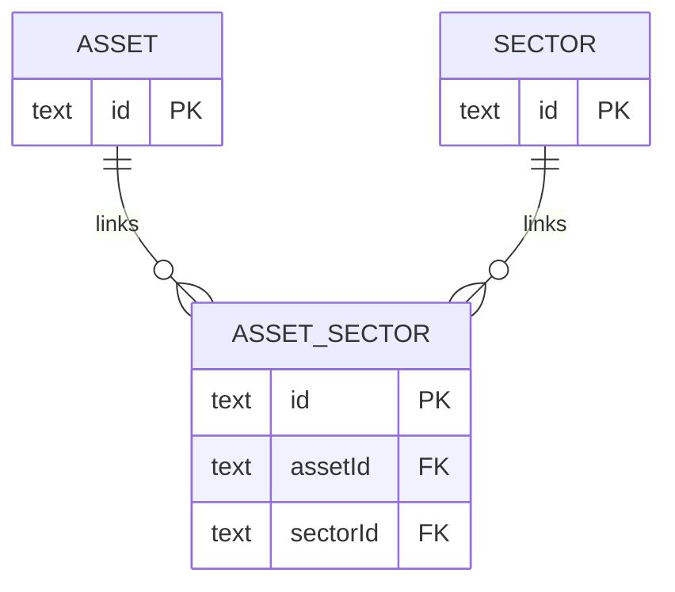
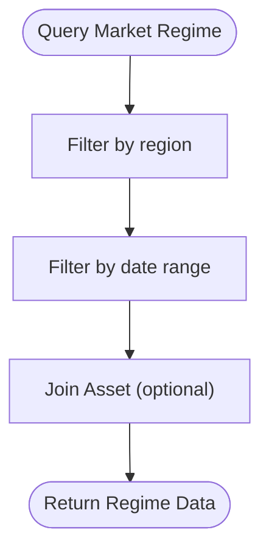
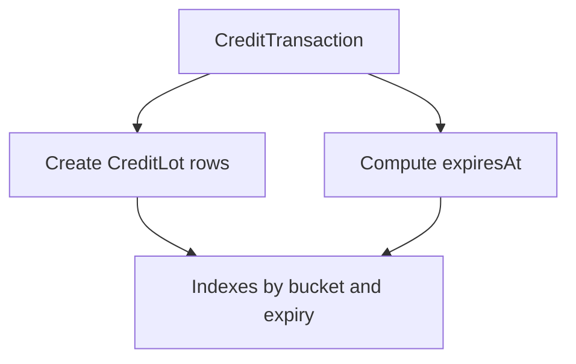
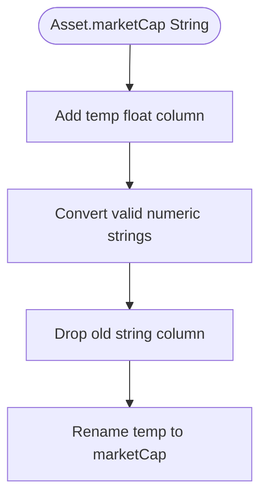
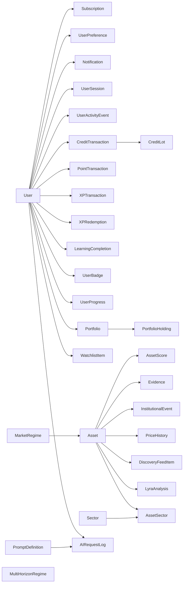

# Relationships & Constraints

<cite>
**Referenced Files in This Document**
- [schema.prisma](file://prisma/schema.prisma)
- [20260317050000_rebaseline/migration.sql](file://prisma/migrations/20260317050000_rebaseline/migration.sql)
- [20260317210000_credit_lots/migration.sql](file://prisma/migrations/20260317210000_credit_lots/migration.sql)
- [20260318050000_migrate_marketcap_to_float/migration.sql](file://prisma/migrations/20260318050000_migrate_marketcap_to_float/migration.sql)
- [seed.ts](file://prisma/seed.ts)
</cite>

## Table of Contents
1. [Introduction](#introduction)
2. [Project Structure](#project-structure)
3. [Core Components](#core-components)
4. [Architecture Overview](#architecture-overview)
5. [Detailed Component Analysis](#detailed-component-analysis)
6. [Dependency Analysis](#dependency-analysis)
7. [Performance Considerations](#performance-considerations)
8. [Troubleshooting Guide](#troubleshooting-guide)
9. [Conclusion](#conclusion)

## Introduction
This document explains the database relationships and constraints defined in LyraAlpha’s Prisma schema and the underlying PostgreSQL database. It focuses on:
- Foreign key relationships and their cascade behaviors
- Unique constraints and composite indexes
- Many-to-many relationships (e.g., Asset–Sector via AssetSector)
- Constraint definitions impacting data integrity
- Practical query patterns leveraging these relationships
- Indexing strategy and its performance implications

## Project Structure
The database model is defined in the Prisma schema and materialized by migrations. The schema declares models, relations, enums, and indexes. Migrations define primary keys, unique constraints, and foreign keys at the SQL level.

**Diagram sources**
- [schema.prisma](file://prisma/schema.prisma)
- [20260317050000_rebaseline/migration.sql](file://prisma/migrations/20260317050000_rebaseline/migration.sql)
- [20260317210000_credit_lots/migration.sql](file://prisma/migrations/20260317210000_credit_lots/migration.sql)
- [20260318050000_migrate_marketcap_to_float/migration.sql](file://prisma/migrations/20260318050000_migrate_marketcap_to_float/migration.sql)

**Section sources**
- [schema.prisma](file://prisma/schema.prisma)
- [20260317050000_rebaseline/migration.sql](file://prisma/migrations/20260317050000_rebaseline/migration.sql)

## Core Components
This section summarizes the principal entities and their relationships, focusing on referential integrity and constraints.

- Users and subscriptions
  - One-to-many: User → Subscription
  - Unique: providerSubId on Subscription
  - Cascade delete on child when parent is deleted
- Users and preferences
  - One-to-one: User → UserPreference (unique userId)
  - Cascade delete on child when parent is deleted
- Users and activity/notifications/sessions
  - One-to-many: User → Notification, UserSession, UserActivityEvent
  - Cascade delete on children when parent is deleted
- Users and financial/loyalty records
  - One-to-many: User → CreditTransaction, CreditLot, PointTransaction, XPTransaction, XPRedemption, LearningCompletion, UserBadge, UserProgress
  - Cascade delete on children when parent is deleted
- Users and portfolios/watchlists
  - One-to-many: User → Portfolio
  - One-to-many: User → WatchlistItem
  - Unique: (userId, assetId) on WatchlistItem
  - Cascade delete on children when parent is deleted
- Portfolios and holdings
  - One-to-many: Portfolio → PortfolioHolding
  - Unique: (portfolioId, assetId) on PortfolioHolding
  - Cascade delete on children when parent is deleted
- Assets and related analytics/data
  - One-to-many: Asset → AssetScore, Evidence, InstitutionalEvent, PriceHistory, DiscoveryFeedItem, LyraAnalysis
  - Unique: (assetId, date) on PriceHistory
  - Cascade delete on children when parent is deleted
- Asset–Sector many-to-many
  - Junction: AssetSector
  - Unique: (assetId, sectorId)
  - Composite index: (sectorId, isActive, eligibilityScore DESC)
  - Cascade delete on Asset-side relation
- Market regimes
  - Unique: (date, region) on MarketRegime and MultiHorizonRegime
- Users and AI logs
  - One-to-many: User → AIRequestLog
  - Optional relation to PromptDefinition with SET NULL on delete
  - Cascade delete on children when parent is deleted

**Section sources**
- [schema.prisma](file://prisma/schema.prisma)
- [20260317050000_rebaseline/migration.sql](file://prisma/migrations/20260317050000_rebaseline/migration.sql)

## Architecture Overview
The database architecture enforces referential integrity through foreign keys and uses composite indexes to optimize frequent queries. The many-to-many Asset–Sector relationship is modeled explicitly via a junction table.

```mermaid
erDiagram
USER {
text id PK
text email UK
text stripeCustomerId UK
}
SUBSCRIPTION {
text id PK
text userId FK
text providerSubId UK
}
USER_PREFERENCE {
text id PK
text userId UK
}
NOTIFICATION {
text id PK
text userId FK
}
USER_SESSION {
text id PK
text userId FK
}
USER_ACTIVITY_EVENT {
text id PK
text userId FK
}
CREDIT_TRANSACTION {
text id PK
text userId FK
}
CREDIT_LOT {
text id PK
text userId FK
text transactionId FK
}
POINT_TRANSACTION {
text id PK
text userId FK
}
XP_TRANSACTION {
text id PK
text userId FK
}
XP_REDEMPTION {
text id PK
text userId FK
}
LEARNING_COMPLETION {
text id PK
text userId FK
}
USER_BADGE {
text id PK
text userId FK
}
USER_PROGRESS {
text id PK
text userId UK
}
PORTFOLIO {
text id PK
text userId FK
}
PORTFOLIO_HOLDING {
text id PK
text portfolioId FK
text assetId FK
}
WATCHLIST_ITEM {
text id PK
text userId FK
text assetId FK
}
ASSET {
text id PK
text symbol UK
}
ASSET_SCORE {
text id PK
text assetId FK
}
EVIDENCE {
text id PK
text assetId FK
}
INSTITUTIONAL_EVENT {
text id PK
text assetId FK
}
PRICE_HISTORY {
text id PK
text assetId FK
}
DISCOVERY_FEED_ITEM {
text id PK
text assetId FK
}
LYRA_ANALYSIS {
text id PK
text assetId FK
}
SECTOR {
text id PK
text slug UK
}
ASSET_SECTOR {
text id PK
text assetId FK
text sectorId FK
}
MARKET_REGIME {
text id PK
text assetId FK
}
MULTI_HORIZON_REGIME {
text id PK
}
PROMPT_DEFINITION {
text id PK
text version UK
}
AI_REQUEST_LOG {
text id PK
text userId FK
text promptId FK
}
USER ||--o{ SUBSCRIPTION : "has"
USER ||--o{ USER_PREFERENCE : "has"
USER ||--o{ NOTIFICATION : "generates"
USER ||--o{ USER_SESSION : "generates"
USER ||--o{ USER_ACTIVITY_EVENT : "generates"
USER ||--o{ CREDIT_TRANSACTION : "generates"
USER ||--o{ CREDIT_LOT : "holds"
USER ||--o{ POINT_TRANSACTION : "generates"
USER ||--o{ XP_TRANSACTION : "generates"
USER ||--o{ XP_REDEMPTION : "redeems"
USER ||--o{ LEARNING_COMPLETION : "completes"
USER ||--o{ USER_BADGE : "earns"
USER ||--o{ USER_PROGRESS : "tracks"
USER ||--o{ PORTFOLIO : "owns"
USER ||--o{ WATCHLIST_ITEM : "manages"
PORTFOLIO ||--o{ PORTFOLIO_HOLDING : "contains"
ASSET ||--o{ ASSET_SCORE : "has"
ASSET ||--o{ EVIDENCE : "has"
ASSET ||--o{ INSTITUTIONAL_EVENT : "has"
ASSET ||--o{ PRICE_HISTORY : "has"
ASSET ||--o{ DISCOVERY_FEED_ITEM : "generates"
ASSET ||--o{ LYRA_ANALYSIS : "analyzes"
ASSET ||--o{ ASSET_SECTOR : "belongs_to"
SECTOR ||--o{ ASSET_SECTOR : "includes"
USER ||--o{ AI_REQUEST_LOG : "performs"
PROMPT_DEFINITION ||--o{ AI_REQUEST_LOG : "defines"
MARKET_REGIME ||--o{ ASSET : "optional_reference"
```

**Diagram sources**
- [schema.prisma](file://prisma/schema.prisma)
- [20260317050000_rebaseline/migration.sql](file://prisma/migrations/20260317050000_rebaseline/migration.sql)

## Detailed Component Analysis

### Users and Associated Data
- Subscriptions
  - Relationship: User → Subscription
  - Unique constraint: providerSubId
  - Cascade delete: children removed when user is deleted
- Preferences
  - Relationship: User → UserPreference (one-to-one via unique userId)
  - Cascade delete: child removed when user is deleted
- Notifications, Sessions, Activity Events
  - One-to-many from User to each; cascade deletes
- Financial and Loyalty Records
  - CreditTransaction, CreditLot, PointTransaction, XPTransaction, XPRedemption, LearningCompletion, UserBadge, UserProgress
  - All cascade delete on user deletion

**Diagram sources**
- [schema.prisma](file://prisma/schema.prisma)

**Section sources**
- [schema.prisma](file://prisma/schema.prisma)

### Asset–Sector Many-to-Many
- Junction table: AssetSector
- Unique constraint: (assetId, sectorId)
- Composite index: (sectorId, isActive, eligibilityScore DESC)
- Cascade behavior:
  - Deleting an Asset cascades to AssetSector rows
  - Deleting a Sector restricts deletion due to foreign key constraint on AssetSector

**Diagram sources**
- [schema.prisma](file://prisma/schema.prisma)
- [20260317050000_rebaseline/migration.sql](file://prisma/migrations/20260317050000_rebaseline/migration.sql)

**Section sources**
- [schema.prisma](file://prisma/schema.prisma)
- [20260317050000_rebaseline/migration.sql](file://prisma/migrations/20260317050000_rebaseline/migration.sql)

### Market Regimes and Time Series
- MarketRegime
  - Unique constraint: (date, region)
  - Optional Asset reference
- MultiHorizonRegime
  - Unique constraint: (date, region)
- PriceHistory
  - Unique constraint: (assetId, date)

**Diagram sources**
- [schema.prisma](file://prisma/schema.prisma)
- [20260317050000_rebaseline/migration.sql](file://prisma/migrations/20260317050000_rebaseline/migration.sql)

**Section sources**
- [schema.prisma](file://prisma/schema.prisma)
- [20260317050000_rebaseline/migration.sql](file://prisma/migrations/20260317050000_rebaseline/migration.sql)

### Credit System and Expiry
- CreditTransaction
  - Adds expiry timestamps derived from transaction types
- CreditLot
  - Per-lot balances and expiry
  - Indexes optimized for expiry scans and bucket queries
- Migration logic sets expiry dates and seeds initial lots per bucket

**Diagram sources**
- [20260317210000_credit_lots/migration.sql](file://prisma/migrations/20260317210000_credit_lots/migration.sql)

**Section sources**
- [20260317210000_credit_lots/migration.sql](file://prisma/migrations/20260317210000_credit_lots/migration.sql)

### Asset Metadata Evolution
- Market capitalization migrated from string to float safely
- Ensures numeric comparisons and indexing on Asset.marketCap

**Diagram sources**
- [20260318050000_migrate_marketcap_to_float/migration.sql](file://prisma/migrations/20260318050000_migrate_marketcap_to_float/migration.sql)

**Section sources**
- [20260318050000_migrate_marketcap_to_float/migration.sql](file://prisma/migrations/20260318050000_migrate_marketcap_to_float/migration.sql)

## Dependency Analysis
Foreign keys and indexes define the dependency graph. The following diagram highlights key dependencies and cascade behaviors.

**Diagram sources**
- [schema.prisma](file://prisma/schema.prisma)
- [20260317050000_rebaseline/migration.sql](file://prisma/migrations/20260317050000_rebaseline/migration.sql)

**Section sources**
- [schema.prisma](file://prisma/schema.prisma)
- [20260317050000_rebaseline/migration.sql](file://prisma/migrations/20260317050000_rebaseline/migration.sql)

## Performance Considerations
- Composite indexes
  - Asset: (assetGroup, compatibilityScore DESC), (type, compatibilityScore DESC), (region, type, lastPriceUpdate), (region, lastPriceUpdate), (region, changePercent DESC), coingeckoId
  - AssetScore: (assetId, type, date DESC), (date DESC), (type, date DESC, value)
  - InstitutionalEvent: (assetId, date), (type, date DESC)
  - MarketRegime: (assetId)
  - SectorRegime: (sectorId, date DESC), (date DESC)
  - PriceHistory: (assetId, date) unique
  - AssetSector: (sectorId, isActive, eligibilityScore DESC) unique (assetId, sectorId)
  - WatchlistItem: (userId, assetId) unique, (userId, region), (assetId)
  - PortfolioHolding: (portfolioId, assetId) unique, (portfolioId), (assetId)
  - DiscoveryFeedItem: multiple composite indexes for filtering and ordering
  - UserPreference: (userId) unique
  - Subscription: (providerSubId) unique, (userId), (status)
  - PaymentEvent: (eventId) unique, (userId), (processedAt)
  - AIRequestLog: (userId), (userId, createdAt DESC), (promptId), (embeddingStatus, createdAt ASC)
  - Notifications: (userId, createdAt DESC), (userId, read)
  - UserSession: (userId), (startedAt), (lastActivityAt)
  - UserActivityEvent: (userId, createdAt), (eventType, createdAt), (sessionId)
  - CreditTransaction: (userId, createdAt DESC), (userId, type, createdAt DESC), (expiresAt), (createdAt DESC)
  - CreditLot: (userId, bucket, expiresAt), (userId, remainingAmount), (transactionId)
  - Referral: (referrerId), (refereeId), (referrerId, refereeId) unique
  - PointTransaction: (userId), (createdAt DESC)
  - UserProgress: (userId) unique, (level DESC)
  - UserBadge: (userId, badgeSlug) unique
  - XPTransaction: (userId, createdAt DESC), (userId, action, createdAt DESC)
  - XPRedemption: (userId)
  - LearningCompletion: (userId, moduleSlug) unique
  - SupportConversation: (userId), (status, createdAt DESC)
  - SupportMessage: (conversationId, createdAt ASC)
  - SupportKnowledgeDoc: (id)
  - BillingAuditLog: (userId, timestamp DESC), (stripeEventId)
  - Portfolio: (userId, name) unique, (userId), (userId, region, updatedAt DESC)
  - PromoCode: (code) unique
  - WaitlistUser: (email) unique, (createdAt DESC), (status, createdAt DESC), (couponAccess)
- Cascade behaviors
  - Children cascade-delete on parent deletion for most relations, reducing orphan risk but increasing write cost on deletions
- Unique constraints
  - Enforce entity uniqueness and integrity (e.g., user email, providerSubId, asset symbol, (assetId, date) on PriceHistory)
- Indexing strategy
  - Supports frequent filters and sorts by region, date, type, and user-centric fields
  - Composite indexes optimize analytics-heavy queries (e.g., regime scoring, discovery feed ranking)

[No sources needed since this section provides general guidance]

## Troubleshooting Guide
- Integrity errors
  - Unique violations: Check unique indexes (e.g., user email, providerSubId, asset symbol, (assetId, date))
  - Foreign key violations: Ensure parent rows exist before inserting children
- Cascade deletion side effects
  - Deleting a User cascades to many child tables; confirm this is intended before deleting users
- Asset metadata conversion
  - If marketCap appears NULL after migration, verify numeric format and retry conversion
- Expiry and credit lot queries
  - Use indexes on (userId, bucket, expiresAt) and (userId, remainingAmount) for efficient expiry scans

**Section sources**
- [20260318050000_migrate_marketcap_to_float/migration.sql](file://prisma/migrations/20260318050000_migrate_marketcap_to_float/migration.sql)
- [20260317050000_rebaseline/migration.sql](file://prisma/migrations/20260317050000_rebaseline/migration.sql)

## Conclusion
LyraAlpha’s schema enforces strong referential integrity with carefully chosen cascade behaviors and a robust set of unique constraints and composite indexes. The explicit Asset–Sector many-to-many relationship and time-series models (MarketRegime, MultiHorizonRegime, PriceHistory) are optimized for analytical queries. The credit system’s separation of transactions and lots, along with dedicated indexes, supports efficient expiry and balance accounting. Together, these constructs provide a scalable and maintainable foundation for the platform’s data needs.