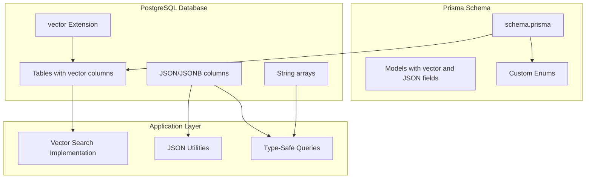
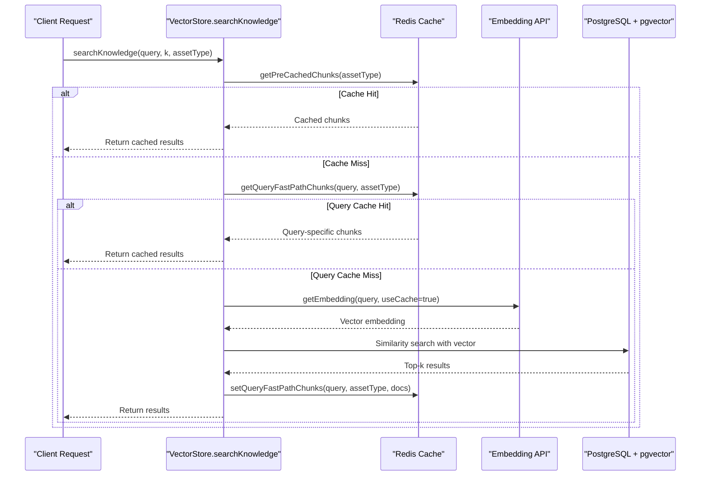
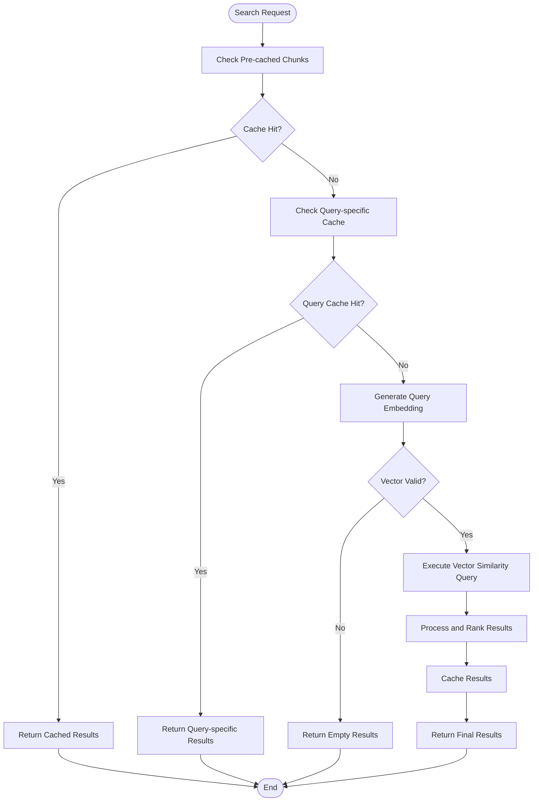
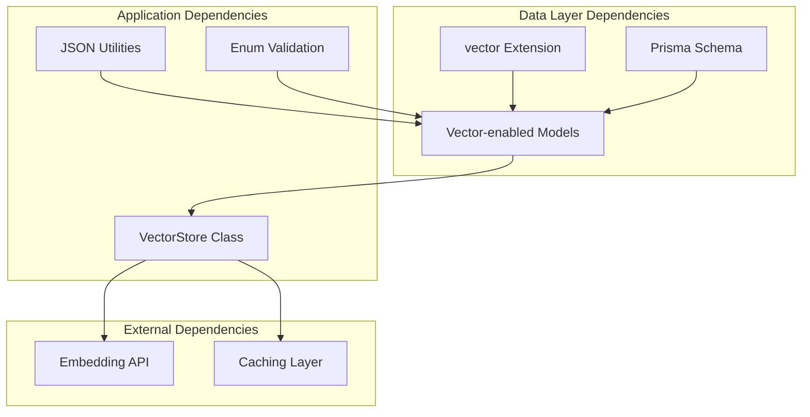

# Specialized Data Types

<cite>
**Referenced Files in This Document**
- [schema.prisma](file://prisma/schema.prisma)
- [rag.ts](file://src/lib/ai/rag.ts)
- [json.ts](file://src/lib/utils/json.ts)
- [migration.sql](file://docs/archive/prisma-migrations-2026-03-17/0_baseline/migration.sql)
- [extensions_schema_migration.sql](file://docs/archive/prisma-migrations-2026-03-17/20260214110458_move_extensions_to_extensions_schema/migration.sql)
- [blog_migration.sql](file://prisma/migrations/20260410000000_blog_post_table/migration.sql)
- [support_ai_responder.ts](file://src/lib/support/ai-responder.ts)
</cite>

## Table of Contents
1. [Introduction](#introduction)
2. [Project Structure](#project-structure)
3. [Core Components](#core-components)
4. [Architecture Overview](#architecture-overview)
5. [Detailed Component Analysis](#detailed-component-analysis)
6. [Dependency Analysis](#dependency-analysis)
7. [Performance Considerations](#performance-considerations)
8. [Troubleshooting Guide](#troubleshooting-guide)
9. [Conclusion](#conclusion)

## Introduction
This document provides comprehensive documentation for specialized data types and advanced Prisma features in LyraAlpha's database schema. It focuses on:
- Vector embedding types using PostgreSQL vector extension for semantic search and AI integration
- JSON/JSONB field usage for flexible data storage including metadata, configuration, and dynamic content
- Enum types like PlanTier, AssetType, SubscriptionStatus, and their business significance
- Custom database types and Unsupported type declarations for specialized columns
- Array types like string arrays and their usage patterns
- Examples of vector similarity searches, JSON querying, and enum validation
- Implementation of knowledge base embedding, vector search capabilities, and semantic retrieval functionality

## Project Structure
The specialized data types are primarily defined in the Prisma schema and implemented through PostgreSQL extensions and custom utilities:
- Prisma schema defines models, enums, and Unsupported vector types
- PostgreSQL migration files enable vector extension and create tables with vector columns
- Application code integrates vector similarity search and JSON handling utilities

**Diagram sources**
- [schema.prisma:10-15](file://prisma/schema.prisma#L10-L15)
- [migration.sql:5-5](file://docs/archive/prisma-migrations-2026-03-17/0_baseline/migration.sql#L5-L5)
- [rag.ts:187-271](file://src/lib/ai/rag.ts#L187-L271)

**Section sources**
- [schema.prisma:10-15](file://prisma/schema.prisma#L10-L15)
- [migration.sql:5-5](file://docs/archive/prisma-migrations-2026-03-17/0_baseline/migration.sql#L5-L5)

## Core Components
This section outlines the specialized data types and their roles in the system.

### Vector Embedding Types
- **Unsupported("vector")**: Declared in Prisma schema for KnowledgeDoc and AIRequestLog models
- **Dimension**: 1536-dimensional vectors for OpenAI embeddings
- **Storage**: PostgreSQL vector column type via pgvector extension
- **Usage**: Semantic similarity search using cosine distance operator

### JSON/JSONB Fields
- **Flexible Metadata**: Used for dynamic content, configurations, and structured data
- **Examples**: metadata, correlationData, factorData, performanceData
- **Validation**: Safe parsing utilities with Zod schema validation
- **Storage**: JSONB for efficient indexing and querying

### Enum Types
- **PlanTier**: STARTER, PRO, ELITE, ENTERPRISE for subscription levels
- **AssetType**: CRYPTO for asset categorization
- **SubscriptionStatus**: ACTIVE, PAST_DUE, CANCELED, INCOMPLETE, TRIALING
- **ScoreType**: Various scoring metrics for assets

### Array Types
- **String Arrays**: tags, keywords in BlogPost model
- **Usage**: Tag-based filtering and categorization

**Section sources**
- [schema.prisma:42-43](file://prisma/schema.prisma#L42-L43)
- [schema.prisma:173-179](file://prisma/schema.prisma#L173-L179)
- [schema.prisma:792-794](file://prisma/schema.prisma#L792-L794)
- [schema.prisma:820-826](file://prisma/schema.prisma#L820-L826)
- [schema.prisma:805-813](file://prisma/schema.prisma#L805-L813)
- [blog_migration.sql:10-15](file://prisma/migrations/20260410000000_blog_post_table/migration.sql#L10-L15)

## Architecture Overview
The vector search architecture combines Prisma ORM with PostgreSQL vector extension and application-level caching:

**Diagram sources**
- [rag.ts:677-786](file://src/lib/ai/rag.ts#L677-L786)
- [rag.ts:729-735](file://src/lib/ai/rag.ts#L729-L735)

**Section sources**
- [rag.ts:677-786](file://src/lib/ai/rag.ts#L677-L786)
- [rag.ts:729-735](file://src/lib/ai/rag.ts#L729-L735)

## Detailed Component Analysis

### Vector Search Implementation
The PrismaVectorStore class implements a sophisticated vector search system with multiple caching layers and safety mechanisms.

#### Core Components
- **Initialization**: Bootstraps knowledge base and manages hydration locks
- **Embedding Generation**: Handles batch processing with retry logic
- **Similarity Search**: Uses PostgreSQL vector operators for efficient retrieval
- **Caching Strategy**: Multi-level caching to optimize performance

#### Vector Similarity Search Flow

**Diagram sources**
- [rag.ts:677-786](file://src/lib/ai/rag.ts#L677-L786)
- [rag.ts:729-735](file://src/lib/ai/rag.ts#L729-L735)

#### Implementation Details
- **Threshold-based Filtering**: Configurable similarity thresholds per query complexity
- **Asset-type Boosting**: Prioritizes results relevant to specific asset types
- **Injection Prevention**: Validates retrieved chunks against security patterns
- **Quality Scoring**: Applies recency and content length heuristics

**Section sources**
- [rag.ts:187-271](file://src/lib/ai/rag.ts#L187-L271)
- [rag.ts:729-786](file://src/lib/ai/rag.ts#L729-L786)
- [rag.ts:807-823](file://src/lib/ai/rag.ts#L807-L823)

### JSON/JSONB Field Management
The system employs robust JSON handling with validation and error management.

#### Safe JSON Operations
- **Safe Parsing**: Graceful fallbacks for malformed JSON
- **Schema Validation**: Zod-based validation for type safety
- **Deep Cloning**: Structured clone with JSON fallback
- **Prisma Compatibility**: Proper casting for Prisma InputJsonValue

#### Usage Patterns
- **Metadata Storage**: Flexible key-value pairs for dynamic content
- **Configuration Data**: Structured settings and preferences
- **Dynamic Content**: Unstructured data with controlled validation

**Section sources**
- [json.ts:19-67](file://src/lib/utils/json.ts#L19-L67)
- [json.ts:172-192](file://src/lib/utils/json.ts#L172-L192)

### Enum Type Validation and Business Logic
Custom enums provide type safety and business rule enforcement across the application.

#### Enum Definitions and Usage
- **PlanTier**: Subscription level management with normalization
- **AssetType**: Asset categorization for specialized processing
- **SubscriptionStatus**: Payment lifecycle tracking
- **ScoreType**: Various analytical metrics for assets

#### Business Significance
- **Tier-aware Processing**: Different similarity thresholds per plan level
- **Feature Gates**: Plan-based feature access control
- **Billing Integration**: Subscription status validation

**Section sources**
- [schema.prisma:798-803](file://prisma/schema.prisma#L798-L803)
- [schema.prisma:792-794](file://prisma/schema.prisma#L792-L794)
- [schema.prisma:820-826](file://prisma/schema.prisma#L820-L826)
- [schema.prisma:805-813](file://prisma/schema.prisma#L805-L813)

### Array Type Implementation
String arrays provide flexible tagging and categorization capabilities.

#### Blog Post Arrays
- **tags**: Category-based organization
- **keywords**: SEO optimization and discoverability
- **Usage**: Efficient filtering and search operations

#### Implementation Approach
- **Direct Array Support**: Native PostgreSQL array type
- **Indexing Strategies**: Appropriate indexing for array operations
- **Query Patterns**: Efficient array containment and overlap operations

**Section sources**
- [blog_migration.sql:10-15](file://prisma/migrations/20260410000000_blog_post_table/migration.sql#L10-L15)

### Database Extension Setup
The PostgreSQL vector extension enables advanced similarity search capabilities.

#### Extension Configuration
- **Extension Creation**: vector extension enabled at database level
- **Schema Management**: Extensions moved to dedicated extensions schema
- **Compatibility**: pgvector integration for approximate nearest neighbor search

#### Migration Impact
- **Baseline Migration**: Creates vector extension and initial tables
- **Security Enhancement**: Moves extensions to isolated schema
- **Feature Enablement**: Provides foundation for AI-powered search

**Section sources**
- [migration.sql:5-5](file://docs/archive/prisma-migrations-2026-03-17/0_baseline/migration.sql#L5-L5)
- [extensions_schema_migration.sql:1-4](file://docs/archive/prisma-migrations-2026-03-17/20260214110458_move_extensions_to_extensions_schema/migration.sql#L1-L4)

## Dependency Analysis
The specialized data types create dependencies between Prisma models, PostgreSQL extensions, and application logic.

**Diagram sources**
- [schema.prisma:42-43](file://prisma/schema.prisma#L42-L43)
- [rag.ts:187-271](file://src/lib/ai/rag.ts#L187-L271)
- [json.ts:19-67](file://src/lib/utils/json.ts#L19-L67)

### Coupling and Cohesion Analysis
- **Vector Store**: High cohesion around similarity search operations
- **JSON Utilities**: Well-contained validation and parsing logic
- **Enum Management**: Centralized business rule enforcement
- **Database Extensions**: Loose coupling through Prisma ORM abstraction

**Section sources**
- [schema.prisma:10-15](file://prisma/schema.prisma#L10-L15)
- [rag.ts:187-271](file://src/lib/ai/rag.ts#L187-L271)
- [json.ts:19-67](file://src/lib/utils/json.ts#L19-L67)

## Performance Considerations
The specialized data types introduce specific performance characteristics and optimization opportunities.

### Vector Search Performance
- **Index Strategy**: HNSW/IVFFlat indexes for efficient similarity search
- **Batch Processing**: Concurrent embedding generation with backoff
- **Caching Layers**: Multi-level caching reduces database load
- **Threshold Filtering**: Reduces result set size early in query pipeline

### JSON/JSONB Optimization
- **Selective Indexing**: GIN indexes for JSONB operations
- **Schema Validation**: Prevents storage of invalid data structures
- **Efficient Serialization**: Optimized stringification and parsing

### Enum and Array Performance
- **Foreign Key Constraints**: Enforce referential integrity efficiently
- **Array Operations**: Optimized containment and overlap queries
- **Index Coverage**: Strategic indexing for frequent query patterns

## Troubleshooting Guide
Common issues and solutions for specialized data types.

### Vector Search Issues
- **Empty Results**: Verify embedding generation and vector validity checks
- **Performance Degradation**: Monitor cache hit rates and adjust thresholds
- **Memory Leaks**: Check embedding batch processing and resource cleanup

### JSON/JSONB Problems
- **Parsing Failures**: Implement proper error handling and fallbacks
- **Validation Errors**: Ensure schema alignment between models and data
- **Storage Issues**: Verify JSONB column constraints and indexing

### Enum Validation Errors
- **Unknown Values**: Implement normalization and fallback logic
- **Type Mismatches**: Use strict enum validation in API layers
- **Business Rule Violations**: Add comprehensive validation at multiple layers

**Section sources**
- [rag.ts:714-717](file://src/lib/ai/rag.ts#L714-L717)
- [json.ts:27-37](file://src/lib/utils/json.ts#L27-L37)
- [support_ai_responder.ts:243-256](file://src/lib/support/ai-responder.ts#L243-L256)

## Conclusion
LyraAlpha's database schema demonstrates sophisticated use of specialized data types to enable AI-powered features while maintaining type safety and performance. The combination of PostgreSQL vector extension, JSON/JSONB flexibility, enum-based business logic, and array-based categorization creates a robust foundation for semantic search and intelligent content retrieval. The implementation prioritizes security through validation, performance through caching and indexing, and maintainability through clear separation of concerns in the application layer.