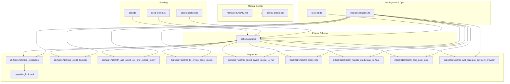
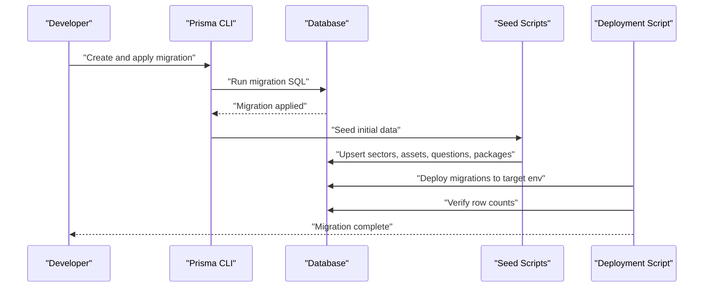
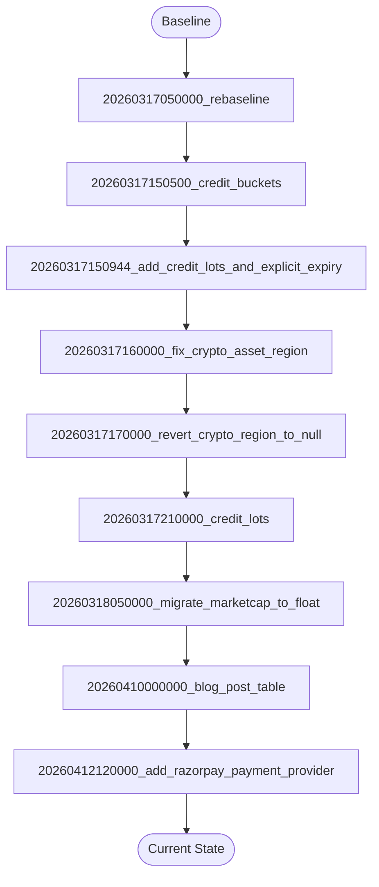
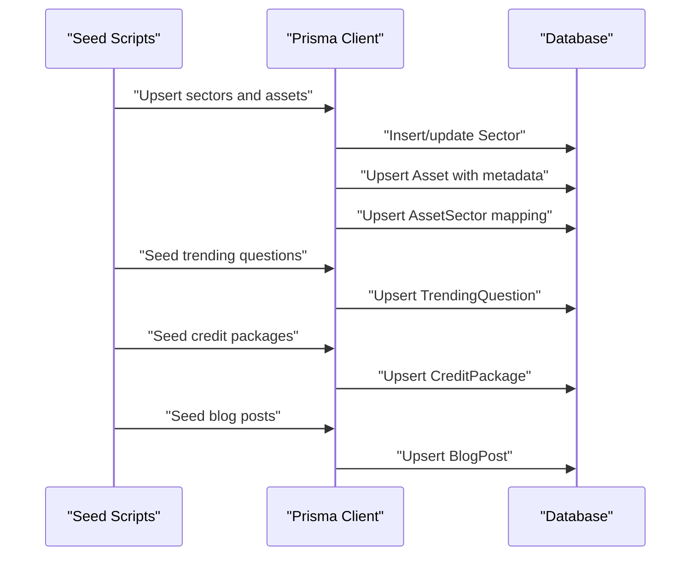
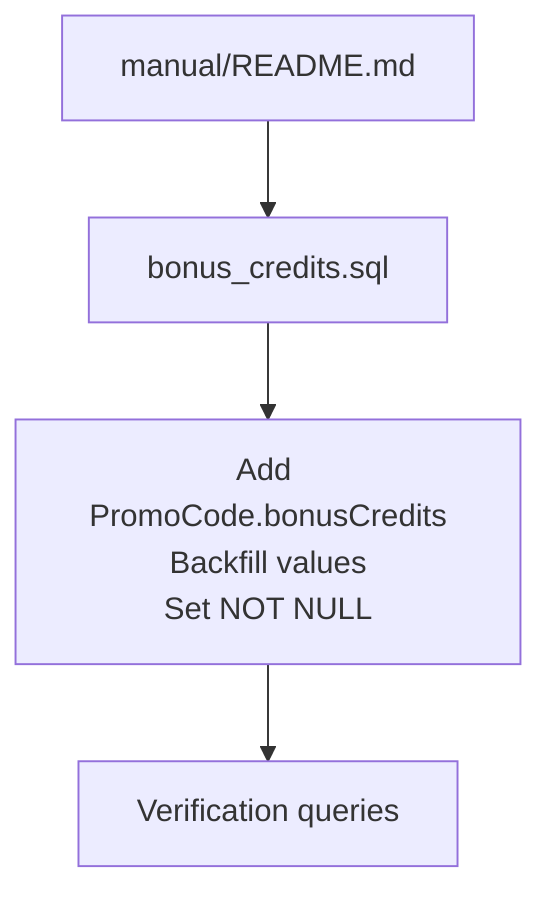
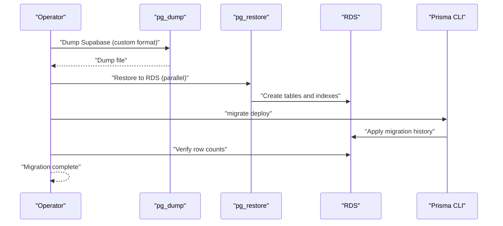
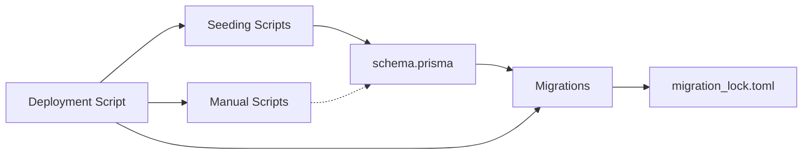

# Migrations & Seeding

<cite>
**Referenced Files in This Document**
- [schema.prisma](file://prisma/schema.prisma)
- [migration_lock.toml](file://prisma/migrations/migration_lock.toml)
- [20260317050000_rebaseline/migration.sql](file://prisma/migrations/20260317050000_rebaseline/migration.sql)
- [20260317150500_credit_buckets/migration.sql](file://prisma/migrations/20260317150500_credit_buckets/migration.sql)
- [20260317150944_add_credit_lots_and_explicit_expiry/migration.sql](file://prisma/migrations/20260317150944_add_credit_lots_and_explicit_expiry/migration.sql)
- [20260317160000_fix_crypto_asset_region/migration.sql](file://prisma/migrations/20260317160000_fix_crypto_asset_region/migration.sql)
- [20260317170000_revert_crypto_region_to_null/migration.sql](file://prisma/migrations/20260317170000_revert_crypto_region_to_null/migration.sql)
- [20260317210000_credit_lots/migration.sql](file://prisma/migrations/20260317210000_credit_lots/migration.sql)
- [20260318050000_migrate_marketcap_to_float/migration.sql](file://prisma/migrations/20260318050000_migrate_marketcap_to_float/migration.sql)
- [20260410000000_blog_post_table/migration.sql](file://prisma/migrations/20260410000000_blog_post_table/migration.sql)
- [20260412120000_add_razorpay_payment_provider/migration.sql](file://prisma/migrations/20260412120000_add_razorpay_payment_provider/migration.sql)
- [seed.ts](file://prisma/seed.ts)
- [seed-credits.ts](file://prisma/seed-credits.ts)
- [seed-questions.ts](file://prisma/seed-questions.ts)
- [reset-db.ts](file://scripts/reset-db.ts)
- [migrate-database.ts](file://scripts/migrate-database.ts)
- [manual/README.md](file://prisma/manual/README.md)
- [bonus_credits.sql](file://prisma/manual/bonus_credits.sql)
</cite>

## Table of Contents
1. [Introduction](#introduction)
2. [Project Structure](#project-structure)
3. [Core Components](#core-components)
4. [Architecture Overview](#architecture-overview)
5. [Detailed Component Analysis](#detailed-component-analysis)
6. [Dependency Analysis](#dependency-analysis)
7. [Performance Considerations](#performance-considerations)
8. [Troubleshooting Guide](#troubleshooting-guide)
9. [Conclusion](#conclusion)
10. [Appendices](#appendices)

## Introduction
This document explains LyraAlpha’s database migration and seeding system. It covers the migration workflow from a baseline to the current state, the seeding process for initial data (credit packages, questions, and system defaults), manual migration scripts for special operations, and best practices for safe rollouts. It also documents how schema changes relate to data transformations, provides examples for adding new migrations and handling breaking changes, and outlines testing, validation, and production deployment strategies.

## Project Structure
The migration and seeding system is organized under:
- Prisma schema and migrations: define the evolving database schema and ordered migration steps
- Seeding scripts: populate initial data for assets, sectors, trending questions, and credit packages
- Manual migration scripts: out-of-band SQL patches kept for historical reference and reproducibility
- Deployment and verification scripts: orchestrate cross-environment migrations and row-count validation

**Diagram sources**
- [schema.prisma](file://prisma/schema.prisma)
- [20260317050000_rebaseline/migration.sql](file://prisma/migrations/20260317050000_rebaseline/migration.sql)
- [20260317150500_credit_buckets/migration.sql](file://prisma/migrations/20260317150500_credit_buckets/migration.sql)
- [20260317150944_add_credit_lots_and_explicit_expiry/migration.sql](file://prisma/migrations/20260317150944_add_credit_lots_and_explicit_expiry/migration.sql)
- [20260317160000_fix_crypto_asset_region/migration.sql](file://prisma/migrations/20260317160000_fix_crypto_asset_region/migration.sql)
- [20260317170000_revert_crypto_region_to_null/migration.sql](file://prisma/migrations/20260317170000_revert_crypto_region_to_null/migration.sql)
- [20260317210000_credit_lots/migration.sql](file://prisma/migrations/20260317210000_credit_lots/migration.sql)
- [20260318050000_migrate_marketcap_to_float/migration.sql](file://prisma/migrations/20260318050000_migrate_marketcap_to_float/migration.sql)
- [20260410000000_blog_post_table/migration.sql](file://prisma/migrations/20260410000000_blog_post_table/migration.sql)
- [20260412120000_add_razorpay_payment_provider/migration.sql](file://prisma/migrations/20260412120000_add_razorpay_payment_provider/migration.sql)
- [migration_lock.toml](file://prisma/migrations/migration_lock.toml)
- [seed.ts](file://prisma/seed.ts)
- [seed-credits.ts](file://prisma/seed-credits.ts)
- [seed-questions.ts](file://prisma/seed-questions.ts)
- [manual/README.md](file://prisma/manual/README.md)
- [bonus_credits.sql](file://prisma/manual/bonus_credits.sql)
- [migrate-database.ts](file://scripts/migrate-database.ts)
- [reset-db.ts](file://scripts/reset-db.ts)

**Section sources**
- [schema.prisma](file://prisma/schema.prisma)
- [migration_lock.toml](file://prisma/migrations/migration_lock.toml)

## Core Components
- Prisma schema defines models, enums, relations, and indexes. It is the source of truth for the database structure.
- Migrations are ordered SQL scripts under prisma/migrations/. Each migration folder corresponds to a timestamped step that evolves the schema and may transform data.
- Seeding scripts populate initial data for assets, sectors, trending questions, and credit packages.
- Manual scripts handle out-of-band fixes and reconciliations.
- Deployment scripts orchestrate cross-environment migrations and verification.

Key responsibilities:
- schema.prisma: defines domain models and relationships
- migration_lock.toml: records applied migrations to prevent reapplication
- seed.ts: seeds sectors, assets, mappings, trending questions, and blog posts
- seed-credits.ts: seeds credit packages
- seed-questions.ts: seeds trending questions
- reset-db.ts: truncates and re-seeds baseline assets
- migrate-database.ts: dumps from Supabase, restores to RDS, deploys migrations, verifies row counts
- manual/*.sql: one-off patches and reconciliation scripts

**Section sources**
- [schema.prisma](file://prisma/schema.prisma)
- [migration_lock.toml](file://prisma/migrations/migration_lock.toml)
- [seed.ts](file://prisma/seed.ts)
- [seed-credits.ts](file://prisma/seed-credits.ts)
- [seed-questions.ts](file://prisma/seed-questions.ts)
- [reset-db.ts](file://scripts/reset-db.ts)
- [migrate-database.ts](file://scripts/migrate-database.ts)
- [manual/README.md](file://prisma/manual/README.md)
- [bonus_credits.sql](file://prisma/manual/bonus_credits.sql)

## Architecture Overview
The migration and seeding architecture follows a deterministic, versioned approach:
- Prisma generates migration SQL from schema changes
- Each migration is idempotent where possible and includes schema and data transformations
- Seeding runs after migrations to populate initial system data
- Manual scripts handle exceptional cases outside the standard Prisma flow
- Deployment scripts automate cross-environment migration and validation

**Diagram sources**
- [schema.prisma](file://prisma/schema.prisma)
- [20260317050000_rebaseline/migration.sql](file://prisma/migrations/20260317050000_rebaseline/migration.sql)
- [seed.ts](file://prisma/seed.ts)
- [seed-credits.ts](file://prisma/seed-credits.ts)
- [seed-questions.ts](file://prisma/seed-questions.ts)
- [migrate-database.ts](file://scripts/migrate-database.ts)

## Detailed Component Analysis

### Migration Workflow: Baseline to Current State
The migration history begins with a comprehensive baseline and continues with targeted schema and data changes.

**Diagram sources**
- [20260317050000_rebaseline/migration.sql](file://prisma/migrations/20260317050000_rebaseline/migration.sql)
- [20260317150500_credit_buckets/migration.sql](file://prisma/migrations/20260317150500_credit_buckets/migration.sql)
- [20260317150944_add_credit_lots_and_explicit_expiry/migration.sql](file://prisma/migrations/20260317150944_add_credit_lots_and_explicit_expiry/migration.sql)
- [20260317160000_fix_crypto_asset_region/migration.sql](file://prisma/migrations/20260317160000_fix_crypto_asset_region/migration.sql)
- [20260317170000_revert_crypto_region_to_null/migration.sql](file://prisma/migrations/20260317170000_revert_crypto_region_to_null/migration.sql)
- [20260317210000_credit_lots/migration.sql](file://prisma/migrations/20260317210000_credit_lots/migration.sql)
- [20260318050000_migrate_marketcap_to_float/migration.sql](file://prisma/migrations/20260318050000_migrate_marketcap_to_float/migration.sql)
- [20260410000000_blog_post_table/migration.sql](file://prisma/migrations/20260410000000_blog_post_table/migration.sql)
- [20260412120000_add_razorpay_payment_provider/migration.sql](file://prisma/migrations/20260412120000_add_razorpay_payment_provider/migration.sql)

#### Migration Details and Purpose
- 20260317050000_rebaseline: Creates the baseline schema, enums, tables, indexes, and foreign keys. This establishes the foundational structure for assets, sectors, regimes, user gamification, portfolios, and supporting entities.
- 20260317150500_credit_buckets: Introduces separate credit balance columns for monthly, bonus, and purchased credits on the User table and backfills values from the existing credits field.
- 20260317150944_add_credit_lots_and_explicit_expiry: Adjusts default timestamps for CreditLot.updatedAt to align with intended semantics.
- 20260317160000_fix_crypto_asset_region: Corrects region assignment for crypto assets to “US” to unify regional queries.
- 20260317170000_revert_crypto_region_to_null: Reverts to null (globally available) to fix incorrect regional filtering assumptions.
- 20260317210000_credit_lots: Adds the CreditLot table and bucketing logic, creates indexes, and backfills credit lots from user balances with appropriate expiry policies.
- 20260318050000_migrate_marketcap_to_float: Safely migrates Asset.marketCap from string to float, preserving valid numeric values and converting invalid ones to null.
- 20260410000000_blog_post_table: Adds the BlogPost table to support content management.
- 20260412120000_add_razorpay_payment_provider: Extends enums and related fields to support Razorpay as a payment provider.

**Section sources**
- [20260317050000_rebaseline/migration.sql](file://prisma/migrations/20260317050000_rebaseline/migration.sql)
- [20260317150500_credit_buckets/migration.sql](file://prisma/migrations/20260317150500_credit_buckets/migration.sql)
- [20260317150944_add_credit_lots_and_explicit_expiry/migration.sql](file://prisma/migrations/20260317150944_add_credit_lots_and_explicit_expiry/migration.sql)
- [20260317160000_fix_crypto_asset_region/migration.sql](file://prisma/migrations/20260317160000_fix_crypto_asset_region/migration.sql)
- [20260317170000_revert_crypto_region_to_null/migration.sql](file://prisma/migrations/20260317170000_revert_crypto_region_to_null/migration.sql)
- [20260317210000_credit_lots/migration.sql](file://prisma/migrations/20260317210000_credit_lots/migration.sql)
- [20260318050000_migrate_marketcap_to_float/migration.sql](file://prisma/migrations/20260318050000_migrate_marketcap_to_float/migration.sql)
- [20260410000000_blog_post_table/migration.sql](file://prisma/migrations/20260410000000_blog_post_table/migration.sql)
- [20260412120000_add_razorpay_payment_provider/migration.sql](file://prisma/migrations/20260412120000_add_razorpay_payment_provider/migration.sql)

### Seeding Process
The seeding system initializes the discovery universe, trending questions, and credit packages.

**Diagram sources**
- [seed.ts](file://prisma/seed.ts)
- [seed-credits.ts](file://prisma/seed-credits.ts)
- [seed-questions.ts](file://prisma/seed-questions.ts)

#### Seed.ts: Discovery Universe and Blog Posts
- Seeds sectors and maps crypto assets to sectors with randomized metadata and scores
- Upserts trending questions and blog posts from static content

**Section sources**
- [seed.ts](file://prisma/seed.ts)

#### Seed-credits.ts: Credit Packages
- Upserts predefined credit packages with names, credits, bonuses, prices, and sort orders

**Section sources**
- [seed-credits.ts](file://prisma/seed-credits.ts)

#### Seed-questions.ts: Trending Questions
- Upserts curated trending questions with categories and display ordering

**Section sources**
- [seed-questions.ts](file://prisma/seed-questions.ts)

### Manual Migration Scripts
Manual scripts are used for out-of-band fixes and reconciliations.

**Diagram sources**
- [manual/README.md](file://prisma/manual/README.md)
- [bonus_credits.sql](file://prisma/manual/bonus_credits.sql)

**Section sources**
- [manual/README.md](file://prisma/manual/README.md)
- [bonus_credits.sql](file://prisma/manual/bonus_credits.sql)

### Deployment and Cross-Environment Migration
The deployment script automates migration from Supabase to AWS RDS, ensuring extensions, parallel restore, and row-count verification.

**Diagram sources**
- [migrate-database.ts](file://scripts/migrate-database.ts)

**Section sources**
- [migrate-database.ts](file://scripts/migrate-database.ts)

## Dependency Analysis
- schema.prisma defines models and enums that migrations alter and data seeding populates
- migration_lock.toml tracks applied migrations to avoid duplicates
- Seeding depends on Prisma client and the final schema state
- Manual scripts depend on specific table states and are not auto-applied
- Deployment scripts depend on external tools (pg_dump, pg_restore, psql) and environment variables

**Diagram sources**
- [schema.prisma](file://prisma/schema.prisma)
- [migration_lock.toml](file://prisma/migrations/migration_lock.toml)
- [seed.ts](file://prisma/seed.ts)
- [seed-credits.ts](file://prisma/seed-credits.ts)
- [seed-questions.ts](file://prisma/seed-questions.ts)
- [migrate-database.ts](file://scripts/migrate-database.ts)
- [manual/README.md](file://prisma/manual/README.md)

**Section sources**
- [schema.prisma](file://prisma/schema.prisma)
- [migration_lock.toml](file://prisma/migrations/migration_lock.toml)
- [migrate-database.ts](file://scripts/migrate-database.ts)

## Performance Considerations
- Parallel restore: The deployment script uses parallel workers for faster restoration
- Indexes and constraints: Migrations create necessary indexes to optimize reads and writes
- Data types: Converting market capitalization to float improves numeric comparisons and reduces casting overhead
- Idempotency: Many migrations use IF NOT EXISTS checks to avoid repeated work

[No sources needed since this section provides general guidance]

## Troubleshooting Guide
Common issues and resolutions:
- Missing tools: The deployment script validates presence of pg_dump, pg_restore, and psql
- Extension conflicts: The deployment script enables vector, pg_trgm, and btree_gin; warnings are tolerated if already present
- Row mismatches: The deployment script compares row counts across tables and fails fast if mismatched
- Manual script applicability: Manual scripts must be applied carefully and only to databases that do not already have the changes

Operational checks:
- Verify extensions are enabled on the target database
- Confirm environment variables for source and target URLs are set
- Run a dry run before applying changes
- Review pg_restore warnings and resolve conflicts before cutting over

**Section sources**
- [migrate-database.ts](file://scripts/migrate-database.ts)
- [manual/README.md](file://prisma/manual/README.md)

## Conclusion
LyraAlpha’s migration and seeding system combines Prisma-managed migrations with targeted data transformations, robust seeding for initial content, and operational scripts for cross-environment deployments. The approach emphasizes idempotency, verification, and backward compatibility, supported by manual scripts for exceptional cases and comprehensive validation.

[No sources needed since this section summarizes without analyzing specific files]

## Appendices

### Adding a New Migration and Backward Compatibility
Steps to add a new migration safely:
- Modify schema.prisma to reflect desired schema changes
- Generate and review the migration SQL
- Ensure data transformations are included in the same migration where possible
- Keep backward compatibility by using nullable columns, default values, and reversible operations
- Test locally and in staging before deploying to production

Examples of schema/data changes in the migration set:
- Adding new tables and indexes
- Extending enums and related fields
- Introducing bucketed credit storage with expiry logic
- Converting string metrics to numeric types

**Section sources**
- [schema.prisma](file://prisma/schema.prisma)
- [20260317210000_credit_lots/migration.sql](file://prisma/migrations/20260317210000_credit_lots/migration.sql)
- [20260318050000_migrate_marketcap_to_float/migration.sql](file://prisma/migrations/20260318050000_migrate_marketcap_to_float/migration.sql)

### Rollback Procedures
Rollback strategy:
- Prefer reversible schema changes within migrations
- Use manual scripts for targeted fixes when necessary
- Maintain a clean baseline and incremental steps to simplify rollbacks
- Always verify data integrity after rollback

**Section sources**
- [manual/README.md](file://prisma/manual/README.md)
- [bonus_credits.sql](file://prisma/manual/bonus_credits.sql)

### Production Deployment Strategies
- Use the deployment script for cross-environment migrations
- Enable required extensions on the target database
- Perform a dry run first
- Verify row counts and application health before cutting over
- Update DNS and webhook endpoints after successful migration

**Section sources**
- [migrate-database.ts](file://scripts/migrate-database.ts)

### Migration Testing, Validation, and Verification
Testing and verification checklist:
- Run migrations locally and in staging
- Seed test data to validate queries and indexes
- Compare row counts between environments
- Monitor CloudWatch and logs after deployment
- Validate critical paths (billing, credits, discovery feed)

**Section sources**
- [seed.ts](file://prisma/seed.ts)
- [seed-credits.ts](file://prisma/seed-credits.ts)
- [seed-questions.ts](file://prisma/seed-questions.ts)
- [migrate-database.ts](file://scripts/migrate-database.ts)