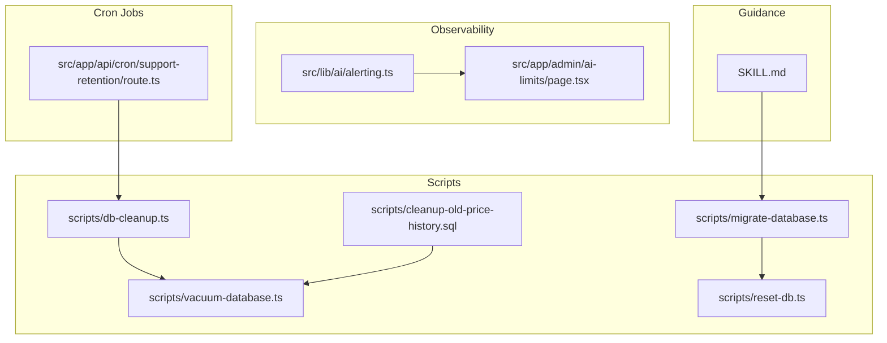
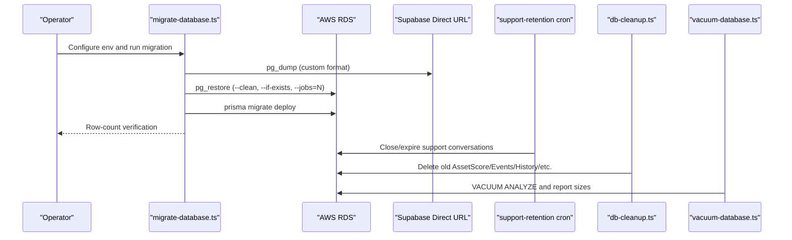
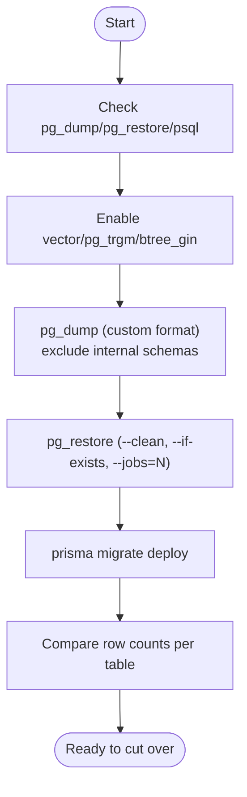
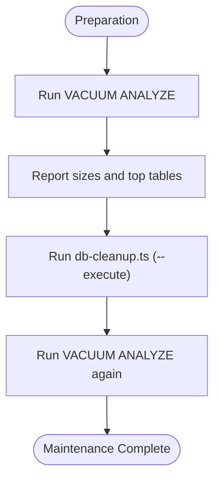
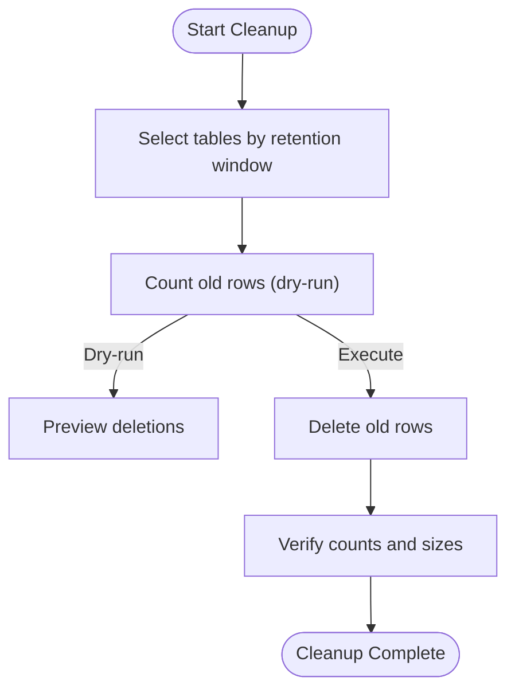
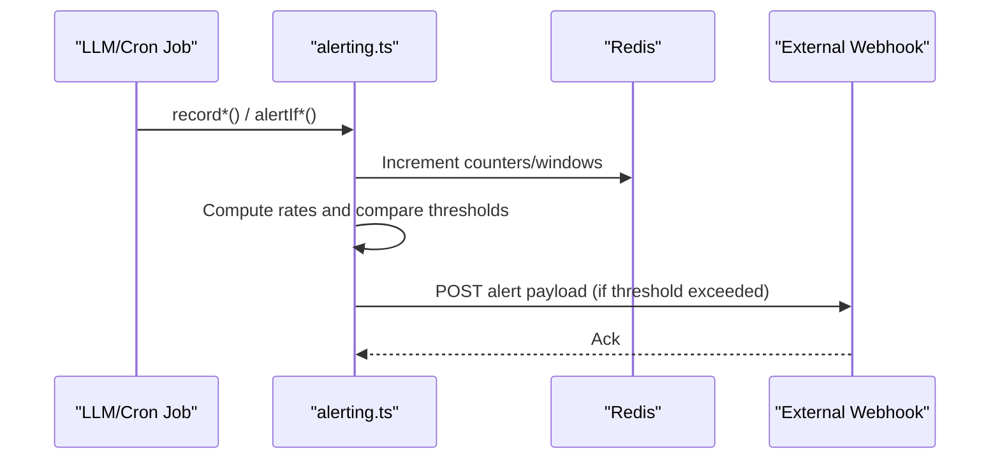
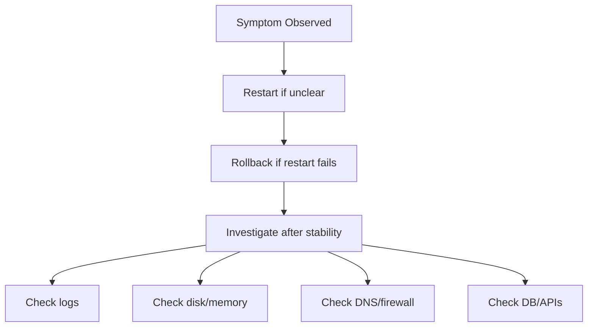
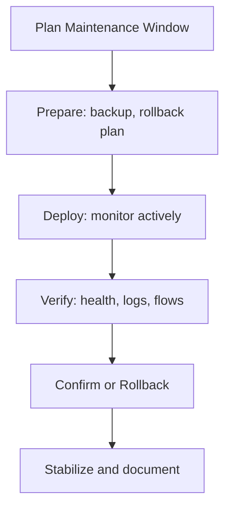
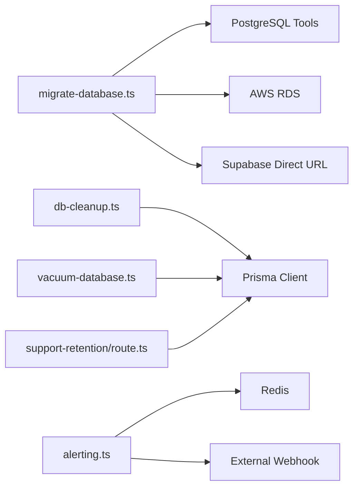

# Operational Procedures

<cite>
**Referenced Files in This Document**
- [migrate-database.ts](file://scripts/migrate-database.ts)
- [vacuum-database.ts](file://scripts/vacuum-database.ts)
- [db-cleanup.ts](file://scripts/db-cleanup.ts)
- [cleanup-old-price-history.sql](file://scripts/cleanup-old-price-history.sql)
- [reset-db.ts](file://scripts/reset-db.ts)
- [support-retention/route.ts](file://src/app/api/cron/support-retention/route.ts)
- [alerting.ts](file://src/lib/ai/alerting.ts)
- [page.tsx](file://src/app/admin/ai-limits/page.tsx)
- [SKILL.md](file://.windsurf/skills/deployment-procedures/SKILL.md)
</cite>

## Table of Contents
1. [Introduction](#introduction)
2. [Project Structure](#project-structure)
3. [Core Components](#core-components)
4. [Architecture Overview](#architecture-overview)
5. [Detailed Component Analysis](#detailed-component-analysis)
6. [Dependency Analysis](#dependency-analysis)
7. [Performance Considerations](#performance-considerations)
8. [Troubleshooting Guide](#troubleshooting-guide)
9. [Conclusion](#conclusion)
10. [Appendices](#appendices)

## Introduction
This document defines LyraAlpha’s operational procedures for data management across backup and restore, maintenance, archival and retention, monitoring and alerting, and emergency response. It consolidates repository-backed scripts and handlers to provide repeatable, safe, and observable workflows for database operations in production-like environments.

## Project Structure
Operational procedures are implemented primarily through:
- Scripts under scripts/ for backup/restore, maintenance, cleanup, and reset
- Cron endpoints under src/app/api/cron/ for automated retention and maintenance
- Alerting utilities under src/lib/ai/alerting.ts for observability
- Deployment and rollback guidance under .windsurf/skills/deployment-procedures/SKILL.md

**Diagram sources**
- [migrate-database.ts:1-272](file://scripts/migrate-database.ts#L1-L272)
- [vacuum-database.ts:1-58](file://scripts/vacuum-database.ts#L1-L58)
- [db-cleanup.ts:1-137](file://scripts/db-cleanup.ts#L1-L137)
- [cleanup-old-price-history.sql:1-105](file://scripts/cleanup-old-price-history.sql#L1-L105)
- [reset-db.ts:1-68](file://scripts/reset-db.ts#L1-L68)
- [support-retention/route.ts:1-61](file://src/app/api/cron/support-retention/route.ts#L1-L61)
- [alerting.ts:1-477](file://src/lib/ai/alerting.ts#L1-L477)
- [page.tsx:40-452](file://src/app/admin/ai-limits/page.tsx#L40-L452)
- [SKILL.md:1-242](file://.windsurf/skills/deployment-procedures/SKILL.md#L1-L242)

**Section sources**
- [migrate-database.ts:1-272](file://scripts/migrate-database.ts#L1-L272)
- [vacuum-database.ts:1-58](file://scripts/vacuum-database.ts#L1-L58)
- [db-cleanup.ts:1-137](file://scripts/db-cleanup.ts#L1-L137)
- [cleanup-old-price-history.sql:1-105](file://scripts/cleanup-old-price-history.sql#L1-L105)
- [reset-db.ts:1-68](file://scripts/reset-db.ts#L1-L68)
- [support-retention/route.ts:1-61](file://src/app/api/cron/support-retention/route.ts#L1-L61)
- [alerting.ts:1-477](file://src/lib/ai/alerting.ts#L1-L477)
- [page.tsx:40-452](file://src/app/admin/ai-limits/page.tsx#L40-L452)
- [SKILL.md:1-242](file://.windsurf/skills/deployment-procedures/SKILL.md#L1-L242)

## Core Components
- Database migration and restore pipeline for moving from a direct Supabase connection to AWS RDS
- Vacuum and analyze routine for reclaiming space and updating statistics
- Automated cleanup of stale data with configurable retention windows
- Dedicated cleanup script for price history archiving/cleanup
- Support conversation retention cron for lifecycle management
- Alerting subsystem for AI-related KPIs with webhook delivery
- Deployment and rollback guidance for safe production changes

**Section sources**
- [migrate-database.ts:1-272](file://scripts/migrate-database.ts#L1-L272)
- [vacuum-database.ts:1-58](file://scripts/vacuum-database.ts#L1-L58)
- [db-cleanup.ts:1-137](file://scripts/db-cleanup.ts#L1-L137)
- [cleanup-old-price-history.sql:1-105](file://scripts/cleanup-old-price-history.sql#L1-L105)
- [support-retention/route.ts:1-61](file://src/app/api/cron/support-retention/route.ts#L1-L61)
- [alerting.ts:1-477](file://src/lib/ai/alerting.ts#L1-L477)
- [SKILL.md:1-242](file://.windsurf/skills/deployment-procedures/SKILL.md#L1-L242)

## Architecture Overview
The operational architecture ties together scripts, cron jobs, and alerting into a cohesive data management ecosystem.

**Diagram sources**
- [migrate-database.ts:99-230](file://scripts/migrate-database.ts#L99-L230)
- [support-retention/route.ts:18-56](file://src/app/api/cron/support-retention/route.ts#L18-L56)
- [db-cleanup.ts:37-130](file://scripts/db-cleanup.ts#L37-L130)
- [vacuum-database.ts:9-58](file://scripts/vacuum-database.ts#L9-L58)

## Detailed Component Analysis

### Database Backup and Restore
- Purpose: Migrate data from a Supabase direct URL to AWS RDS using pg_dump/pg_restore with parallel workers and extension provisioning.
- Inputs: Environment variables for source and target database URLs; optional dry-run toggle.
- Steps:
  - Validate required tools
  - Enable required extensions on target
  - Export from Supabase (excluding internal schemas)
  - Import to RDS with parallel restore
  - Deploy Prisma migration history
  - Verify row counts per table
- Outputs: Verified migration readiness and next steps for DNS and webhook updates.

**Diagram sources**
- [migrate-database.ts:70-230](file://scripts/migrate-database.ts#L70-L230)

**Section sources**
- [migrate-database.ts:1-272](file://scripts/migrate-database.ts#L1-L272)

### Automated Backup Schedules and Disaster Recovery Protocols
- Backup schedule: Not defined in the repository. Operators should define and enforce periodic backups externally (e.g., using native RDS snapshots or continuous backups) aligned with RPO/RTO targets.
- Recovery procedures:
  - Validate backup integrity
  - Restore to a staging environment first (dry-run style)
  - Cut over DNS/traffic after verification
  - Monitor CloudWatch and logs post-cut over

[No sources needed since this section provides general guidance]

### Database Maintenance Tasks
- Vacuum and analyze:
  - Reclaims disk space and updates statistics for optimal query planning.
  - Reports database/table sizes before/after.
- Index rebuilding:
  - Index optimization is handled by Prisma-managed migrations and schema updates; rebuild indices as part of migration deployments when adding/removing indexes.
- Performance tuning:
  - Combine vacuum/analytics with retention and cleanup to maintain query performance.

**Diagram sources**
- [vacuum-database.ts:9-58](file://scripts/vacuum-database.ts#L9-L58)
- [db-cleanup.ts:37-130](file://scripts/db-cleanup.ts#L37-L130)

**Section sources**
- [vacuum-database.ts:1-58](file://scripts/vacuum-database.ts#L1-L58)
- [db-cleanup.ts:1-137](file://scripts/db-cleanup.ts#L1-L137)

### Data Archival Strategies, Retention Policies, and Cleanup Procedures
- Retention windows:
  - AssetScore: keep last 30 days
  - InstitutionalEvent: keep last 90 days
  - PriceHistory: keep last 365 days
  - MarketRegime/SectorRegime/MultiHorizonRegime: keep last 90 days
  - Evidence: keep last 90 days
  - AIRequestLog: keep last 30 days
- Cleanup strategy:
  - Dry-run first to preview deletions
  - Execute deletions with --execute
  - Use dedicated SQL script for price history archiving/cleanup with batch deletion guidance
- Support retention:
  - Auto-close idle conversations after 2+ days
  - Hard-delete older than 7 days

**Diagram sources**
- [db-cleanup.ts:37-130](file://scripts/db-cleanup.ts#L37-L130)
- [cleanup-old-price-history.sql:13-87](file://scripts/cleanup-old-price-history.sql#L13-L87)
- [support-retention/route.ts:18-56](file://src/app/api/cron/support-retention/route.ts#L18-L56)

**Section sources**
- [db-cleanup.ts:1-137](file://scripts/db-cleanup.ts#L1-L137)
- [cleanup-old-price-history.sql:1-105](file://scripts/cleanup-old-price-history.sql#L1-L105)
- [support-retention/route.ts:1-61](file://src/app/api/cron/support-retention/route.ts#L1-L61)

### Operational Monitoring, Metrics, and Alerting Thresholds
- AI alerting subsystem:
  - Daily cost threshold, RAG zero-result rate, web search failures, output validation failure rate, fallback rate, latency budget violation, cost estimation drift, low-grounding RAG rate, and cron LLM observability.
  - Webhook delivery to Slack/Discord via AI_ALERT_WEBHOOK_URL with HTTPS validation and 15-minute cooldown.
- Admin thresholds UI:
  - Editable thresholds surfaced in the admin UI with units and descriptions.

**Diagram sources**
- [alerting.ts:83-477](file://src/lib/ai/alerting.ts#L83-L477)
- [page.tsx:40-452](file://src/app/admin/ai-limits/page.tsx#L40-L452)

**Section sources**
- [alerting.ts:1-477](file://src/lib/ai/alerting.ts#L1-L477)
- [page.tsx:40-452](file://src/app/admin/ai-limits/page.tsx#L40-L452)

### Emergency Procedures for Data Corruption, Performance Degradation, and System Failures
- Service-down priority:
  - Assess symptoms, attempt restart, rollback if restart does not help, investigate after stability.
- Investigation order:
  - Logs, resources (disk/memory), network, dependencies (database/APIs).
- Rollback principles:
  - Speed over perfection, avoid compounding errors, communicate, post-mortem after stabilization.
- Zero-downtime strategies:
  - Rolling, blue-green, or canary deployments depending on risk and validation needs.

**Diagram sources**
- [SKILL.md:184-201](file://.windsurf/skills/deployment-procedures/SKILL.md#L184-L201)

**Section sources**
- [SKILL.md:184-201](file://.windsurf/skills/deployment-procedures/SKILL.md#L184-L201)

### Maintenance Windows, Downtime Procedures, and Rollback Strategies
- Maintenance windows:
  - Schedule cleanup and vacuum during off-peak hours; batch-delete price history during planned maintenance.
- Downtime procedures:
  - Use blue-green or canary strategies for risky schema/index changes; verify health endpoints and logs.
- Rollback strategies:
  - Platform-appropriate rollback (e.g., redeploy previous commit, image tag, kubectl rollout undo).
- Database reset:
  - Truncates dependent tables and seeds baseline assets for test/staging environments.

**Diagram sources**
- [SKILL.md:81-131](file://.windsurf/skills/deployment-procedures/SKILL.md#L81-L131)
- [reset-db.ts:24-58](file://scripts/reset-db.ts#L24-L58)

**Section sources**
- [SKILL.md:1-242](file://.windsurf/skills/deployment-procedures/SKILL.md#L1-L242)
- [reset-db.ts:1-68](file://scripts/reset-db.ts#L1-L68)

## Dependency Analysis
- Scripts depend on:
  - Environment variables for source/target database URLs
  - PostgreSQL toolchain (pg_dump, pg_restore, psql)
  - Prisma client for vacuum and cleanup operations
- Cron jobs depend on:
  - Database connectivity and Prisma ORM
- Alerting depends on:
  - Redis for counters and caching
  - Webhook URL for external notifications

**Diagram sources**
- [migrate-database.ts:21-31](file://scripts/migrate-database.ts#L21-L31)
- [db-cleanup.ts:23-26](file://scripts/db-cleanup.ts#L23-L26)
- [vacuum-database.ts:7-7](file://scripts/vacuum-database.ts#L7-L7)
- [support-retention/route.ts:2-4](file://src/app/api/cron/support-retention/route.ts#L2-L4)
- [alerting.ts:1-4](file://src/lib/ai/alerting.ts#L1-L4)

**Section sources**
- [migrate-database.ts:1-272](file://scripts/migrate-database.ts#L1-L272)
- [db-cleanup.ts:1-137](file://scripts/db-cleanup.ts#L1-L137)
- [vacuum-database.ts:1-58](file://scripts/vacuum-database.ts#L1-L58)
- [support-retention/route.ts:1-61](file://src/app/api/cron/support-retention/route.ts#L1-L61)
- [alerting.ts:1-477](file://src/lib/ai/alerting.ts#L1-L477)

## Performance Considerations
- Use parallel restore (pg_restore --jobs=N) for large datasets.
- Batch-delete large partitions (e.g., price history) to minimize table locks.
- Schedule vacuum/analytics after bulk deletes to maintain query planner statistics.
- Monitor AI cost spikes and latency budgets to prevent runaway costs and degraded SLAs.

[No sources needed since this section provides general guidance]

## Troubleshooting Guide
- Migration failures:
  - Verify tool availability and environment variables; review pg_restore stderr for warnings vs errors.
- Vacuum/analytics errors:
  - Check database connectivity and permissions; rerun after resolving transient issues.
- Cleanup discrepancies:
  - Use dry-run mode to preview deletions; confirm counts before executing.
- Alerting not firing:
  - Ensure AI_ALERT_WEBHOOK_URL is set to a valid HTTPS URL; verify Redis connectivity.

**Section sources**
- [migrate-database.ts:133-169](file://scripts/migrate-database.ts#L133-L169)
- [vacuum-database.ts:9-58](file://scripts/vacuum-database.ts#L9-L58)
- [db-cleanup.ts:37-130](file://scripts/db-cleanup.ts#L37-L130)
- [alerting.ts:38-81](file://src/lib/ai/alerting.ts#L38-L81)

## Conclusion
LyraAlpha’s operational procedures combine robust migration and restore tooling, automated cleanup and retention, proactive vacuuming, and comprehensive alerting. By following the outlined workflows—especially around backup, verification, and rollback—the team can maintain a healthy, high-performance database with minimal disruption.

[No sources needed since this section summarizes without analyzing specific files]

## Appendices
- Example environment variables for migration:
  - SUPABASE_DIRECT_URL
  - RDS_URL
  - DRY_RUN (optional)
- Admin thresholds:
  - Editable in the admin UI; thresholds are applied at runtime.

**Section sources**
- [migrate-database.ts:10-19](file://scripts/migrate-database.ts#L10-L19)
- [page.tsx:421-443](file://src/app/admin/ai-limits/page.tsx#L421-L443)