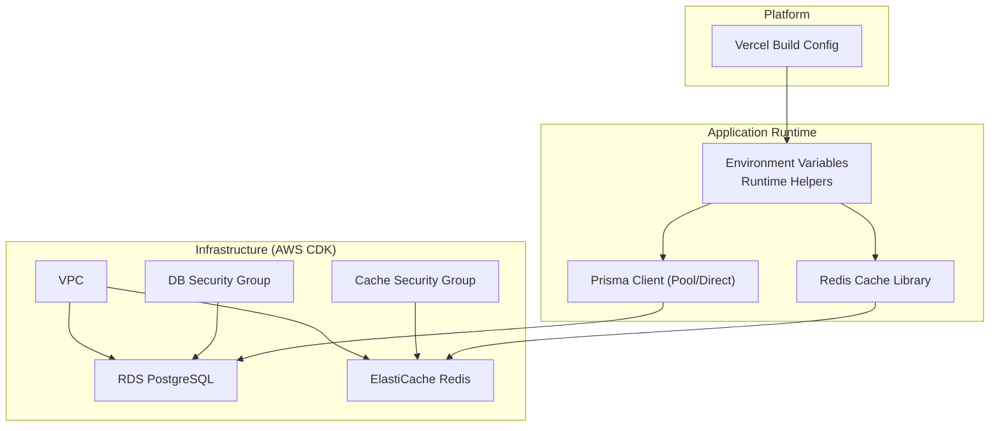
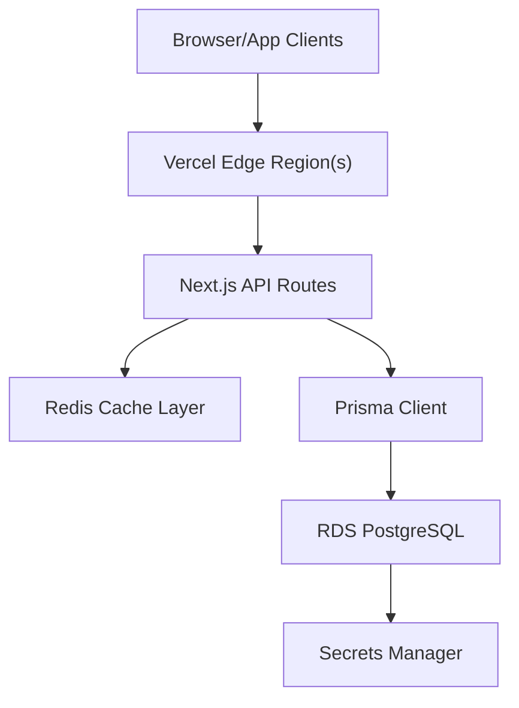
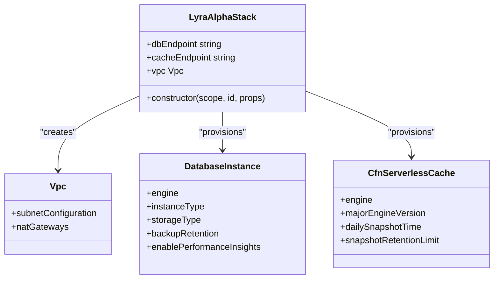
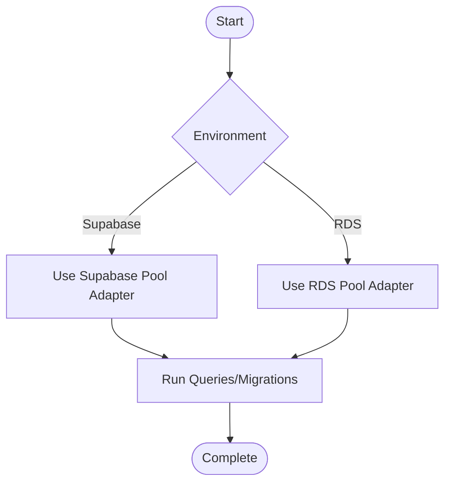
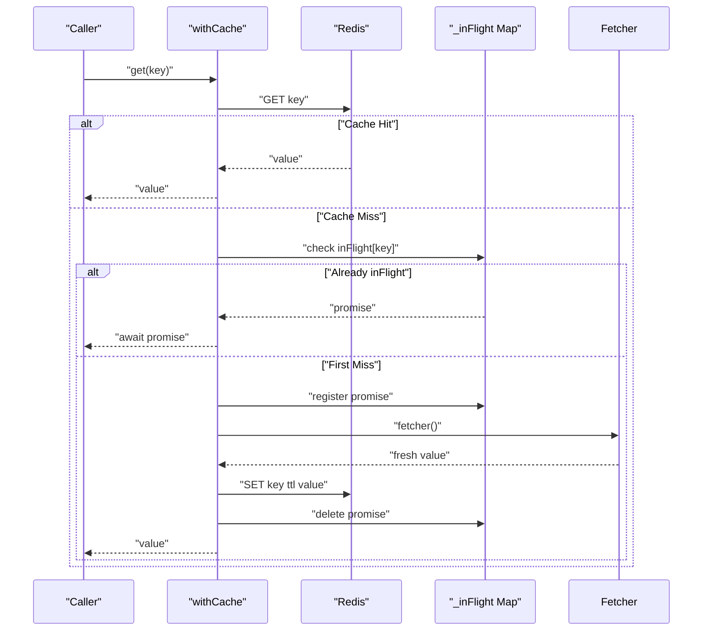
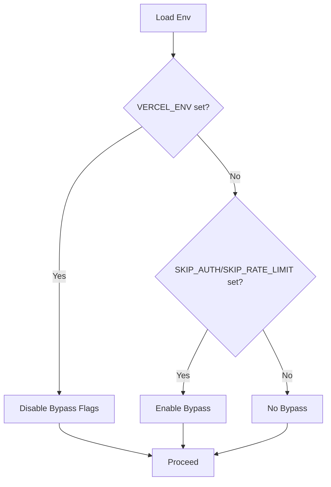
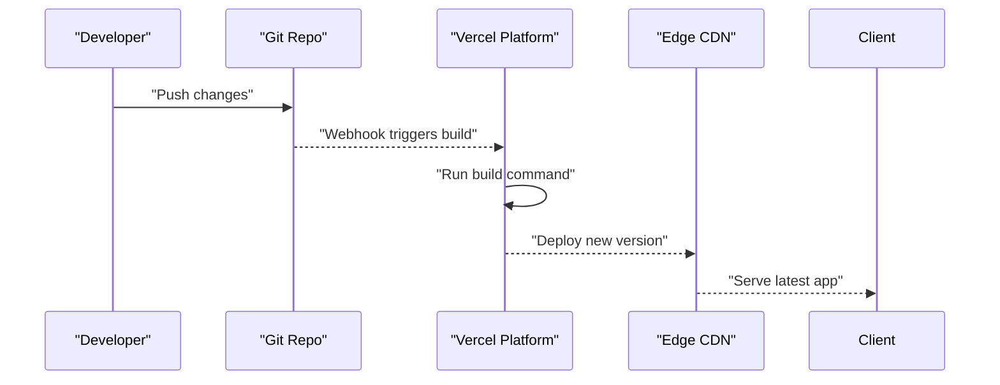
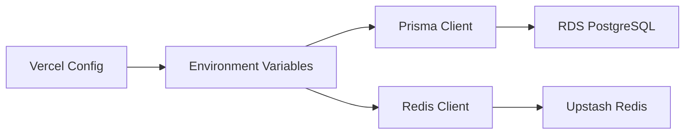

# Deployment & Operations

<cite>
**Referenced Files in This Document**
- [cdk.ts](file://infrastructure/cdk/bin/cdk.ts)
- [lyraalpha-stack.ts](file://infrastructure/cdk/lib/lyraalpha-stack.ts)
- [vercel.json](file://vercel.json)
- [package.json](file://package.json)
- [runtime-env.ts](file://src/lib/runtime-env.ts)
- [config.ts](file://src/lib/config.ts)
- [cache.ts](file://src/lib/cache.ts)
- [redis.ts](file://src/lib/redis.ts)
- [prisma.ts](file://src/lib/prisma.ts)
- [prisma-aws.ts](file://src/lib/prisma-aws.ts)
- [schema.prisma](file://prisma/schema.prisma)
</cite>

## Table of Contents
1. [Introduction](#introduction)
2. [Project Structure](#project-structure)
3. [Core Components](#core-components)
4. [Architecture Overview](#architecture-overview)
5. [Detailed Component Analysis](#detailed-component-analysis)
6. [Dependency Analysis](#dependency-analysis)
7. [Performance Considerations](#performance-considerations)
8. [Troubleshooting Guide](#troubleshooting-guide)
9. [Conclusion](#conclusion)
10. [Appendices](#appendices)

## Introduction
This document provides comprehensive deployment and operations guidance for LyraAlpha. It covers cloud infrastructure provisioning with AWS CDK, database and caching configuration, deployment pipeline with Vercel, environment management, rollback procedures, monitoring and observability, operational runbooks, backup and disaster recovery, capacity planning, and environment-specific configurations and secrets management.

## Project Structure
LyraAlpha’s deployment and operations span several areas:
- Infrastructure-as-Code (AWS CDK) defines the VPC, RDS PostgreSQL, and ElastiCache Redis resources.
- Application runtime reads environment variables for configuration and selects appropriate database adapters depending on hosting environment.
- Caching is implemented via Upstash Redis with robust metrics and deduplication.
- Vercel configuration controls the build process for serverless deployments.

**Diagram sources**
- [lyraalpha-stack.ts:26-42](file://infrastructure/cdk/lib/lyraalpha-stack.ts#L26-L42)
- [lyraalpha-stack.ts:44-56](file://infrastructure/cdk/lib/lyraalpha-stack.ts#L44-L56)
- [lyraalpha-stack.ts:95-106](file://infrastructure/cdk/lib/lyraalpha-stack.ts#L95-L106)
- [lyraalpha-stack.ts:108-124](file://infrastructure/cdk/lib/lyraalpha-stack.ts#L108-L124)
- [runtime-env.ts:1-59](file://src/lib/runtime-env.ts#L1-L59)
- [prisma.ts:29-42](file://src/lib/prisma.ts#L29-L42)
- [prisma-aws.ts:16-32](file://src/lib/prisma-aws.ts#L16-L32)
- [redis.ts:49-65](file://src/lib/redis.ts#L49-L65)
- [vercel.json:1-4](file://vercel.json#L1-L4)

**Section sources**
- [cdk.ts:1-17](file://infrastructure/cdk/bin/cdk.ts#L1-L17)
- [lyraalpha-stack.ts:1-155](file://infrastructure/cdk/lib/lyraalpha-stack.ts#L1-L155)
- [vercel.json:1-4](file://vercel.json#L1-L4)
- [package.json:5-30](file://package.json#L5-L30)

## Core Components
- AWS CDK Stack provisions:
  - VPC with public and private subnets and NAT gateway.
  - RDS PostgreSQL instance with performance insights, backup retention, and credentials stored in Secrets Manager.
  - ElastiCache Redis (Serverless) with subnet group and security group.
- Application configuration:
  - Environment helpers for Vercel regions, auth/rate-limit bypass, and required env validation.
  - API endpoints and retry/cache/pagination configuration constants.
  - Next.js cache strategy wrapper for database-heavy queries.
- Caching:
  - Upstash Redis client with automatic JSON serialization/deserialization, date revival, metrics, and in-flight deduplication.
- Database:
  - Dual Prisma client modes:
    - Supabase-focused pooling for serverless (pool sizes tuned for concurrency).
    - RDS-focused pooling with strict SSL and higher pool sizes for production.

**Section sources**
- [lyraalpha-stack.ts:26-127](file://infrastructure/cdk/lib/lyraalpha-stack.ts#L26-L127)
- [runtime-env.ts:1-59](file://src/lib/runtime-env.ts#L1-L59)
- [config.ts:6-83](file://src/lib/config.ts#L6-L83)
- [cache.ts:10-21](file://src/lib/cache.ts#L10-L21)
- [redis.ts:49-326](file://src/lib/redis.ts#L49-L326)
- [prisma.ts:29-65](file://src/lib/prisma.ts#L29-L65)
- [prisma-aws.ts:16-48](file://src/lib/prisma-aws.ts#L16-L48)

## Architecture Overview
The deployment architecture integrates AWS-managed services with a Next.js application hosted on Vercel. The stack is designed for scalability and resilience with clear separation of concerns for compute, data, and caching.

**Diagram sources**
- [lyraalpha-stack.ts:69-91](file://infrastructure/cdk/lib/lyraalpha-stack.ts#L69-L91)
- [lyraalpha-stack.ts:115-124](file://infrastructure/cdk/lib/lyraalpha-stack.ts#L115-L124)
- [prisma.ts:29-65](file://src/lib/prisma.ts#L29-L65)
- [redis.ts:49-65](file://src/lib/redis.ts#L49-L65)
- [runtime-env.ts:50-59](file://src/lib/runtime-env.ts#L50-L59)

## Detailed Component Analysis

### AWS CDK Infrastructure
- VPC:
  - Public and private subnets with NAT gateway for egress.
  - Security groups restrict traffic to required ports.
- RDS:
  - PostgreSQL 15.4, t3.micro instance, GP2 storage, backup retention 7 days, performance insights enabled.
  - Credentials managed via Secrets Manager; removal policy set to snapshot.
- ElastiCache:
  - Redis Serverless, subnet group across private subnets, security group ingress from VPC CIDR.
  - Daily snapshots retained for 7 days.

**Diagram sources**
- [lyraalpha-stack.ts:26-42](file://infrastructure/cdk/lib/lyraalpha-stack.ts#L26-L42)
- [lyraalpha-stack.ts:69-91](file://infrastructure/cdk/lib/lyraalpha-stack.ts#L69-L91)
- [lyraalpha-stack.ts:108-124](file://infrastructure/cdk/lib/lyraalpha-stack.ts#L108-L124)

**Section sources**
- [cdk.ts:7-16](file://infrastructure/cdk/bin/cdk.ts#L7-L16)
- [lyraalpha-stack.ts:26-153](file://infrastructure/cdk/lib/lyraalpha-stack.ts#L26-L153)

### Database Provisioning and Migration
- Prisma schema defines the data model and indexes.
- Two Prisma client modes:
  - Supabase mode: optimized for serverless with conservative pool sizes and SSL configuration.
  - RDS mode: higher pool sizes and strict SSL for production environments.
- Migration scripts and commands are exposed via npm scripts.

**Diagram sources**
- [prisma.ts:29-65](file://src/lib/prisma.ts#L29-L65)
- [prisma-aws.ts:16-48](file://src/lib/prisma-aws.ts#L16-L48)
- [schema.prisma:1-20](file://prisma/schema.prisma#L1-L20)

**Section sources**
- [prisma.ts:29-65](file://src/lib/prisma.ts#L29-L65)
- [prisma-aws.ts:16-48](file://src/lib/prisma-aws.ts#L16-L48)
- [schema.prisma:1-20](file://prisma/schema.prisma#L1-L20)
- [package.json:11-16](file://package.json#L11-L16)

### Caching Configuration
- Upstash Redis client initialization with environment guards and fallback to a no-op client when missing credentials.
- Robust cache utilities:
  - Serialization/deserialization with date revival.
  - Metrics collection for cache hits/misses by key prefix.
  - In-flight request deduplication to prevent thundering herds.
  - Stale-while-revalidate pattern for latency-sensitive data.
- Next.js cache wrapper for database-heavy queries with TTL and tags.

**Diagram sources**
- [redis.ts:338-373](file://src/lib/redis.ts#L338-L373)
- [redis.ts:388-454](file://src/lib/redis.ts#L388-L454)

**Section sources**
- [redis.ts:49-326](file://src/lib/redis.ts#L49-L326)
- [cache.ts:10-21](file://src/lib/cache.ts#L10-L21)

### Environment Management and Runtime Behavior
- Vercel-specific runtime helpers:
  - Preferred region selection via environment variable.
  - Auth and rate-limit bypass flags gated to non-Vercel environments or explicit test bypass.
  - Required environment validation with descriptive errors.
- API endpoint overrides are supported for broker integrations to prevent SSRF.

**Diagram sources**
- [runtime-env.ts:1-59](file://src/lib/runtime-env.ts#L1-L59)
- [config.ts:6-59](file://src/lib/config.ts#L6-L59)

**Section sources**
- [runtime-env.ts:1-59](file://src/lib/runtime-env.ts#L1-L59)
- [config.ts:6-83](file://src/lib/config.ts#L6-L83)

### Deployment Pipeline (Vercel)
- Build command is configured in Vercel configuration.
- Environment variables are managed via Vercel project settings and pushed securely.
- Regional preference for API routes can be controlled via environment variable.

**Diagram sources**
- [vercel.json:1-4](file://vercel.json#L1-L4)
- [runtime-env.ts:50-59](file://src/lib/runtime-env.ts#L50-L59)

**Section sources**
- [vercel.json:1-4](file://vercel.json#L1-L4)
- [package.json:5-10](file://package.json#L5-L10)

### Rollback Procedures
- Vercel rollbacks:
  - Use Vercel dashboard to revert to a previous stable deployment.
  - Tag releases and pin to immutable commit hashes for safer rollbacks.
- Database migrations:
  - Keep migration history intact; use Prisma migration commands to roll back to a specific migration if necessary.
  - Maintain a staging environment to validate rollbacks before production.

[No sources needed since this section provides general guidance]

### Monitoring and Observability
- Database:
  - Enable performance insights on RDS for query and instance metrics.
  - Monitor slow queries and replica lag via CloudWatch.
- Caching:
  - Track cache hit/miss ratios and per-prefix metrics via Redis pipeline metrics.
  - Log cache operations conditionally for sampling.
- Application:
  - Use Next.js telemetry hooks and structured logging for latency and error tracking.
  - Configure alerts for cache failures, database timeouts, and high error rates.

[No sources needed since this section provides general guidance]

### Operational Runbooks
- Incident Response:
  - Define escalation tiers and communication channels.
  - Use cache stats and database logs to triage performance issues.
- Maintenance Scheduling:
  - Schedule database maintenance windows during off-peak hours.
  - Batch cache invalidation by prefix to minimize impact.
- Health Checks:
  - Implement synthetic checks for critical API routes and cache endpoints.
  - Monitor cache client availability and Redis INFO output.

[No sources needed since this section provides general guidance]

### Backup Strategies and Disaster Recovery
- Database:
  - RDS automated backups retained for 7 days; enable cross-region replication for DR.
  - Snapshot manually before major changes.
- Caching:
  - ElastiCache snapshots retained for 7 days; validate restoration in staging.
- Secrets:
  - Store database credentials in Secrets Manager; rotate regularly and audit access.

**Section sources**
- [lyraalpha-stack.ts:86-88](file://infrastructure/cdk/lib/lyraalpha-stack.ts#L86-L88)
- [lyraalpha-stack.ts:122-124](file://infrastructure/cdk/lib/lyraalpha-stack.ts#L122-L124)

### Capacity Planning
- Database:
  - Adjust Prisma pool sizes based on observed concurrency and Supabase/RDS limits.
  - Monitor query duration and optimize slow queries.
- Caching:
  - Tune TTLs and leverage stale-while-revalidate to reduce origin load.
  - Monitor cache hit ratios and scale Redis as needed.
- Compute:
  - Use Vercel’s regional edge placement to reduce latency.
  - Scale API routes horizontally; monitor cold starts and concurrency.

[No sources needed since this section provides general guidance]

### Environment-Specific Configurations and Secrets Management
- Environment variables:
  - Use Vercel project settings for production; separate preview/staging environments.
  - Enforce required env validation at startup.
- Secrets:
  - Store database credentials in Secrets Manager and reference via environment variables.
  - Avoid committing secrets to the repository.

**Section sources**
- [runtime-env.ts:33-39](file://src/lib/runtime-env.ts#L33-L39)
- [lyraalpha-stack.ts:58-67](file://infrastructure/cdk/lib/lyraalpha-stack.ts#L58-L67)

## Dependency Analysis
The application depends on environment-driven configuration, database connectivity, and caching layers. The following diagram highlights key dependencies.

**Diagram sources**
- [runtime-env.ts:1-59](file://src/lib/runtime-env.ts#L1-L59)
- [prisma.ts:29-65](file://src/lib/prisma.ts#L29-L65)
- [redis.ts:49-65](file://src/lib/redis.ts#L49-L65)
- [vercel.json:1-4](file://vercel.json#L1-L4)

**Section sources**
- [runtime-env.ts:1-59](file://src/lib/runtime-env.ts#L1-L59)
- [prisma.ts:29-65](file://src/lib/prisma.ts#L29-L65)
- [redis.ts:49-65](file://src/lib/redis.ts#L49-L65)
- [vercel.json:1-4](file://vercel.json#L1-L4)

## Performance Considerations
- Database:
  - Use connection pooling appropriate to the platform (Supabase vs RDS).
  - Keep migrations minimal and scheduled during low traffic.
- Caching:
  - Apply TTLs judiciously; use stale-while-revalidate for latency-sensitive endpoints.
  - Monitor in-flight deduplication thresholds to avoid memory pressure.
- Compute:
  - Place API routes in preferred regions to reduce latency.
  - Pre-warm routes during off-hours to improve cold start behavior.

[No sources needed since this section provides general guidance]

## Troubleshooting Guide
- Missing environment variables:
  - Use the required env validator to surface configuration errors early.
- Redis connectivity:
  - Verify Upstash credentials; fallback to no-op client indicates misconfiguration.
  - Inspect cache metrics and sampling logs to diagnose performance issues.
- Database connectivity:
  - Confirm Prisma pool sizes and SSL settings match the target environment.
  - Review slow query logs and adjust indexing strategy.

**Section sources**
- [runtime-env.ts:33-39](file://src/lib/runtime-env.ts#L33-L39)
- [redis.ts:142-174](file://src/lib/redis.ts#L142-L174)
- [prisma.ts:29-65](file://src/lib/prisma.ts#L29-L65)

## Conclusion
LyraAlpha’s deployment and operations framework leverages AWS CDK for infrastructure, Upstash Redis for caching, and Vercel for scalable application delivery. By combining environment-driven configuration, robust caching primitives, and dual Prisma client modes tailored to Supabase and RDS, the system achieves reliability, performance, and operability. Adhering to the procedures outlined here ensures smooth deployments, effective monitoring, and resilient operations.

## Appendices
- Recommended operational tasks:
  - Weekly cache stats review and database performance insights review.
  - Monthly secrets rotation and access audits.
  - Quarterly capacity planning reviews aligned with usage trends.

[No sources needed since this section provides general guidance]