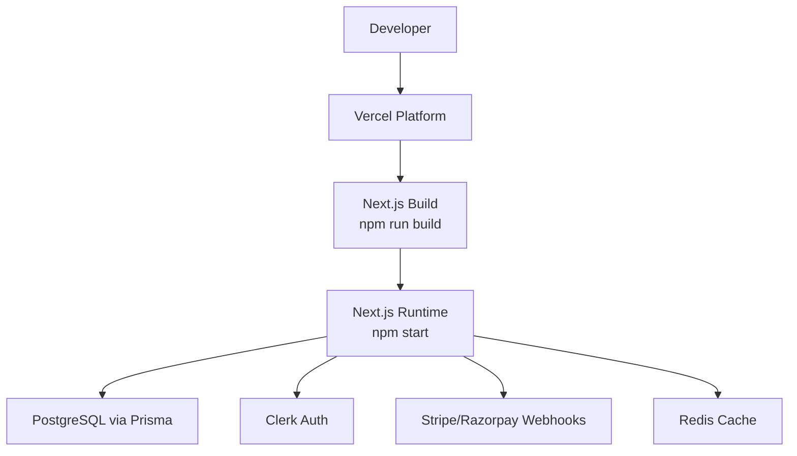
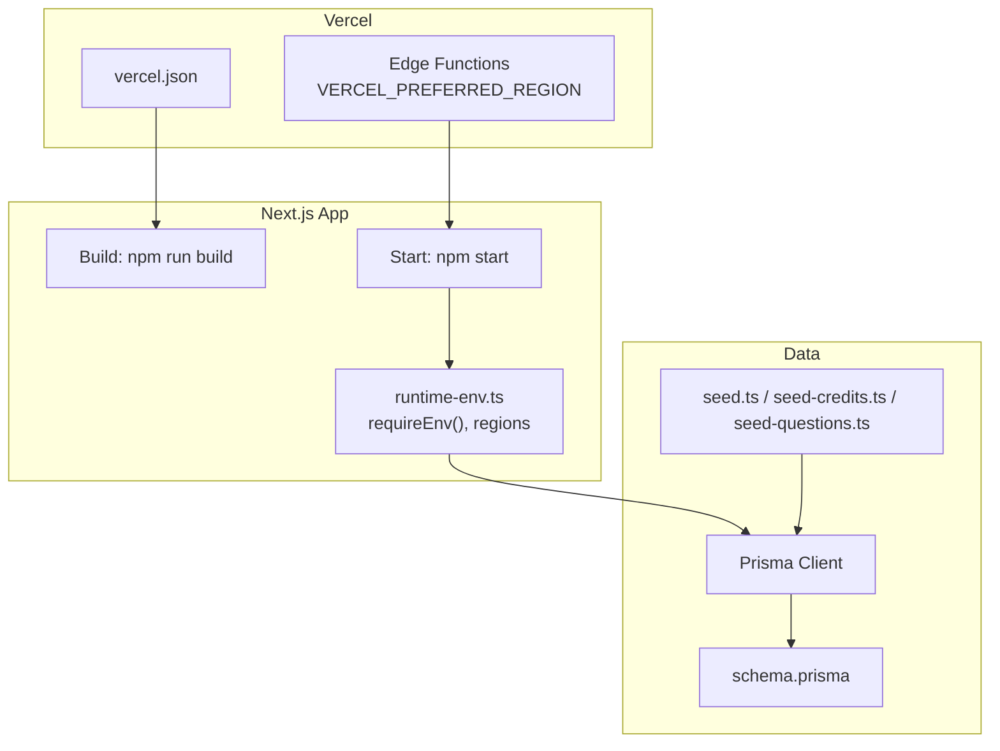
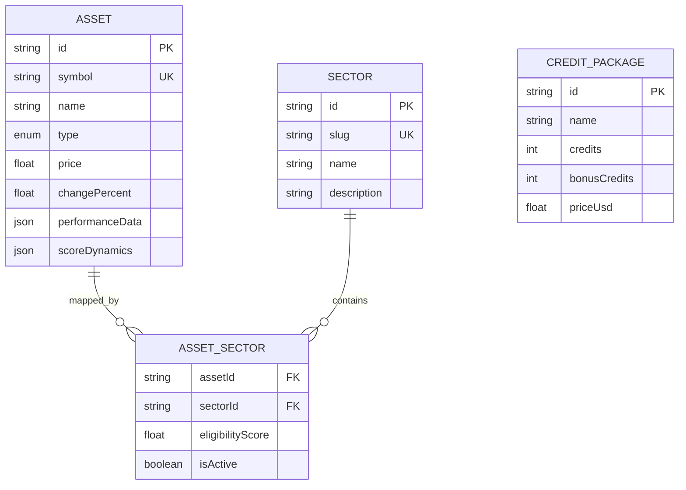
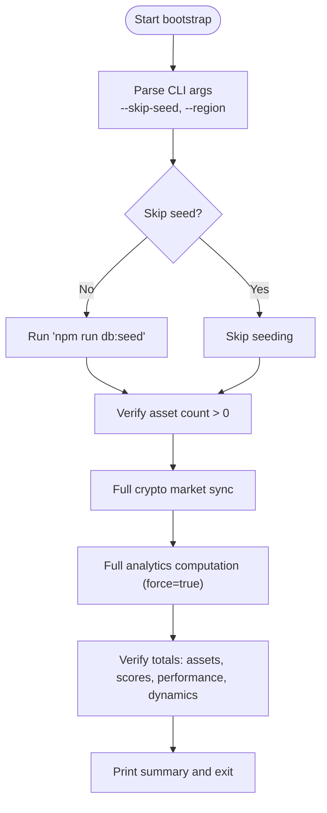
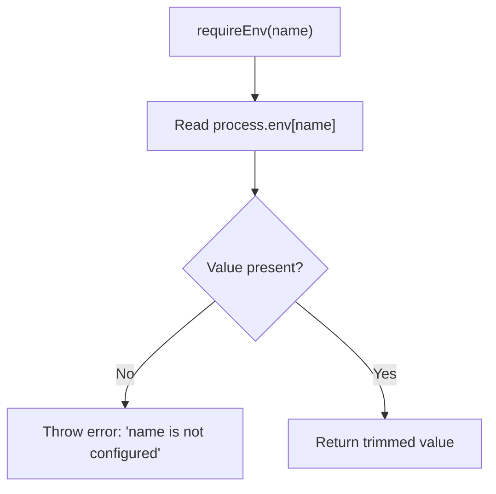
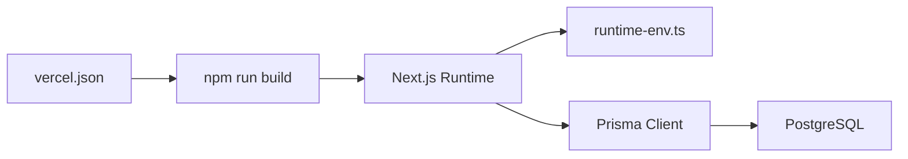

# Deployment Pipeline

<cite>
**Referenced Files in This Document**
- [vercel.json](file://vercel.json)
- [package.json](file://package.json)
- [scripts/bootstrap.ts](file://scripts/bootstrap.ts)
- [prisma/schema.prisma](file://prisma/schema.prisma)
- [prisma/seed.ts](file://prisma/seed.ts)
- [prisma/seed-credits.ts](file://prisma/seed-credits.ts)
- [prisma/seed-questions.ts](file://prisma/seed-questions.ts)
- [src/lib/runtime-env.ts](file://src/lib/runtime-env.ts)
- [next.config.ts](file://next.config.ts)
- [README.md](file://README.md)
- [docs/ENV_SETUP.md](file://docs/ENV_SETUP.md)
- [docs/production-deployment-checklist.md](file://docs/production-deployment-checklist.md)
</cite>

## Table of Contents
1. [Introduction](#introduction)
2. [Project Structure](#project-structure)
3. [Core Components](#core-components)
4. [Architecture Overview](#architecture-overview)
5. [Detailed Component Analysis](#detailed-component-analysis)
6. [Dependency Analysis](#dependency-analysis)
7. [Performance Considerations](#performance-considerations)
8. [Troubleshooting Guide](#troubleshooting-guide)
9. [Conclusion](#conclusion)
10. [Appendices](#appendices)

## Introduction
This document describes the deployment pipeline for LyraAlpha, focusing on Vercel configuration, build processes, environment variable management, CI/CD workflows, bootstrap and database seeding, environment management across development, staging, and production, rollback procedures, deployment verification, and secrets management.

## Project Structure
LyraAlpha is a Next.js application with a Prisma-based backend and extensive operational scripts. The deployment pipeline centers around:
- Vercel for hosting and edge routing
- Next.js build and runtime
- Prisma for schema, migrations, and seeding
- Operational scripts for bootstrapping and maintenance

**Diagram sources**
- [vercel.json:1-4](file://vercel.json#L1-L4)
- [package.json:5-30](file://package.json#L5-L30)
- [prisma/schema.prisma:1-10](file://prisma/schema.prisma#L1-L10)

**Section sources**
- [vercel.json:1-4](file://vercel.json#L1-L4)
- [package.json:5-30](file://package.json#L5-L30)

## Core Components
- Vercel configuration defines the build command used by the platform.
- Next.js scripts orchestrate building, starting, database migrations, seeding, and testing.
- Prisma schema and seeders define the initial dataset and ongoing data operations.
- Runtime environment helpers enforce safe environment usage and region selection for edge functions.

Key deployment-related scripts and commands:
- Build: npm run build
- Start: npm start
- Post-install Prisma generation: npm run postinstall
- Database operations: migrate deploy, migrate diff, migrate resolve, db seed, db push
- Testing: test, test:watch
- Performance prewarm: perf:prewarm
- Cron and scheduler setup: qstash:setup

**Section sources**
- [vercel.json:1-4](file://vercel.json#L1-L4)
- [package.json:5-30](file://package.json#L5-L30)
- [prisma/schema.prisma:1-10](file://prisma/schema.prisma#L1-L10)

## Architecture Overview
The deployment pipeline integrates Vercel-hosted Next.js with a PostgreSQL database managed by Prisma. Environment variables are validated at runtime, and optional auth/rate limit bypasses are supported for local and E2E contexts.

**Diagram sources**
- [vercel.json:1-4](file://vercel.json#L1-L4)
- [package.json:5-30](file://package.json#L5-L30)
- [src/lib/runtime-env.ts:33-59](file://src/lib/runtime-env.ts#L33-L59)
- [prisma/schema.prisma:1-10](file://prisma/schema.prisma#L1-L10)
- [prisma/seed.ts:242-381](file://prisma/seed.ts#L242-L381)

**Section sources**
- [src/lib/runtime-env.ts:1-59](file://src/lib/runtime-env.ts#L1-L59)
- [prisma/schema.prisma:1-10](file://prisma/schema.prisma#L1-L10)

## Detailed Component Analysis

### Vercel Deployment Configuration
- Build command: npm run build
- No custom build overrides are configured; Vercel uses the repository’s Next.js build.

Operational implications:
- Ensure NEXT_PUBLIC_* variables are configured in Vercel’s environment settings.
- Use Vercel’s preview/staging branches for staging deployments.

**Section sources**
- [vercel.json:1-4](file://vercel.json#L1-L4)

### Build and Runtime Scripts
- Build: next build
- Start: next start
- Post-install: prisma generate
- Database lifecycle: migrate deploy, migrate diff, migrate resolve, db push
- Seeding: db seed (runs seed.ts and related seeders)
- Testing: vitest with increased heap for performance
- Prewarm: prewarm routes for performance
- Scheduler setup: QStash schedules

**Section sources**
- [package.json:5-30](file://package.json#L5-L30)

### Database Schema and Seeding
- Prisma schema defines models for assets, sectors, regimes, users, credits, and more.
- Initial seeding seeds sectors, assets, trending questions, and blog posts.
- Credit packages are seeded separately for pricing tiers.

**Diagram sources**
- [prisma/schema.prisma:59-124](file://prisma/schema.prisma#L59-L124)
- [prisma/schema.prisma:319-352](file://prisma/schema.prisma#L319-L352)
- [prisma/schema.prisma:604-616](file://prisma/schema.prisma#L604-L616)
- [prisma/seed.ts:146-240](file://prisma/seed.ts#L146-L240)
- [prisma/seed-credits.ts:4-21](file://prisma/seed-credits.ts#L4-L21)

**Section sources**
- [prisma/schema.prisma:59-124](file://prisma/schema.prisma#L59-L124)
- [prisma/seed.ts:242-381](file://prisma/seed.ts#L242-L381)
- [prisma/seed-credits.ts:1-29](file://prisma/seed-credits.ts#L1-L29)

### Bootstrap Script and Initial Database Seeding
The bootstrap script performs a full initialization of a new environment or after a reset:
- Optional skip-seed
- Region-specific bootstrap (--region)
- Runs db:seed, validates asset presence, then triggers full crypto market sync and analytics computation
- Provides verification counts and timing

**Diagram sources**
- [scripts/bootstrap.ts:36-111](file://scripts/bootstrap.ts#L36-L111)

**Section sources**
- [scripts/bootstrap.ts:1-118](file://scripts/bootstrap.ts#L1-L118)

### Environment Variable Management and Validation
- Runtime helpers:
  - requireEnv(name): throws if a required environment variable is missing
  - getConfiguredAppUrl/getAppUrlFromRequest: derive app URL from configured or request origin
  - PREFERRED_REGION: reads VERCEL_PREFERRED_REGION and defaults to "bom1"
  - Auth and rate limit bypass flags are gated behind Vercel checks and E2E bypass flag

**Diagram sources**
- [src/lib/runtime-env.ts:33-39](file://src/lib/runtime-env.ts#L33-L39)

**Section sources**
- [src/lib/runtime-env.ts:1-59](file://src/lib/runtime-env.ts#L1-L59)

### CI/CD Workflow and Automated Testing
- Testing: vitest run with increased memory; watch mode also available
- Build verification: build:check (typecheck + next build)
- Post-install Prisma generation ensures client code is generated after install
- Cron and scheduler setup: qstash:setup for scheduled tasks

Recommended CI stages:
- Install dependencies
- Typecheck and build verification
- Run unit and integration tests
- Deploy to staging on pull requests or feature branches
- Deploy to production on protected branch pushes or tags

**Section sources**
- [package.json:21-29](file://package.json#L21-L29)

### Staging and Production Releases
- Use Vercel’s preview/staging branches for staging deployments.
- Production deployments target the production branch.
- Configure environment variables per environment in Vercel:
  - NEXT_PUBLIC_APP_URL
  - VERCEL_PREFERRED_REGION
  - Auth, payments, and caching credentials
- Use Vercel’s branch-based deployments and environment variables to manage differences across environments.

[No sources needed since this section provides general guidance]

### Rollback Procedures
- Vercel rollback:
  - Use Vercel’s dashboard to revert to a previous deployment.
  - Alternatively, redeploy a known-good commit or tag.
- Database rollback:
  - Use Prisma migrations to roll back to a previous migration if needed.
  - Keep migration history intact and avoid downgrading below supported versions.

**Section sources**
- [package.json:11-16](file://package.json#L11-L16)

### Deployment Verification and Post-Deployment Validation
- Smoke tests: hit key routes (e.g., home, dashboard, auth endpoints) to confirm rendering and basic functionality.
- Data validation: verify seeded assets and sectors are present.
- Cron jobs: trigger scheduler setup and confirm scheduled tasks are registered.
- Health checks: monitor logs and error rates in Vercel and external monitoring.

**Section sources**
- [prisma/seed.ts:242-381](file://prisma/seed.ts#L242-L381)
- [package.json:27-29](file://package.json#L27-L29)

### Secrets Management and Secure Credential Handling
- Store secrets in Vercel’s environment variables (encrypted at rest).
- Use requireEnv to enforce that critical variables are set at runtime.
- Avoid committing secrets to the repository; rely on Vercel’s secret management.
- For local development, use a .env file and ensure it is not committed.

**Section sources**
- [src/lib/runtime-env.ts:33-39](file://src/lib/runtime-env.ts#L33-L39)
- [docs/ENV_SETUP.md](file://docs/ENV_SETUP.md)

## Dependency Analysis
- Vercel depends on the repository’s build command.
- Next.js depends on Prisma client generation and runtime environment variables.
- Prisma depends on PostgreSQL connectivity and migration scripts.
- Operational scripts depend on environment variables and database availability.

**Diagram sources**
- [vercel.json:1-4](file://vercel.json#L1-L4)
- [package.json:5-30](file://package.json#L5-L30)
- [src/lib/runtime-env.ts:1-59](file://src/lib/runtime-env.ts#L1-L59)

**Section sources**
- [vercel.json:1-4](file://vercel.json#L1-L4)
- [package.json:5-30](file://package.json#L5-L30)

## Performance Considerations
- Use the prewarm script to warm frequently accessed routes.
- Configure VERCEL_PREFERRED_REGION to optimize latency for target regions.
- Monitor build sizes and optimize bundles to reduce cold starts.

**Section sources**
- [package.json:17-17](file://package.json#L17-L17)

## Troubleshooting Guide
- Missing environment variables:
  - requireEnv throws if a required variable is not set; ensure all variables are configured in Vercel.
- Build failures:
  - Run build:check to validate TypeScript and build.
- Database issues:
  - Use migrate status, migrate deploy, and db push to diagnose and align schema.
- Bootstrap failures:
  - Confirm asset count after seeding; ensure sufficient permissions and network access for external APIs.

**Section sources**
- [src/lib/runtime-env.ts:33-39](file://src/lib/runtime-env.ts#L33-L39)
- [package.json:11-16](file://package.json#L11-L16)
- [scripts/bootstrap.ts:57-63](file://scripts/bootstrap.ts#L57-L63)

## Conclusion
LyraAlpha’s deployment pipeline leverages Vercel for hosting, Next.js for the frontend runtime, and Prisma for data operations. Robust environment validation, a comprehensive bootstrap script, and clear separation of concerns across environments enable reliable deployments. Adopt the recommended CI/CD practices, perform thorough verification, and manage secrets securely to maintain a resilient production pipeline.

[No sources needed since this section summarizes without analyzing specific files]

## Appendices

### Environment Management Across Environments
- Development: local .env, minimal runtime bypass for E2E.
- Staging: Vercel preview branch with staging environment variables.
- Production: Vercel production branch with production environment variables.

**Section sources**
- [src/lib/runtime-env.ts:5-13](file://src/lib/runtime-env.ts#L5-L13)
- [docs/ENV_SETUP.md](file://docs/ENV_SETUP.md)

### Production Checklist
- Review environment variables in Vercel.
- Confirm database migrations applied.
- Validate seeding outcomes.
- Smoke-test critical routes.
- Confirm scheduled tasks are active.
- Monitor logs and alerts.

**Section sources**
- [docs/production-deployment-checklist.md](file://docs/production-deployment-checklist.md)