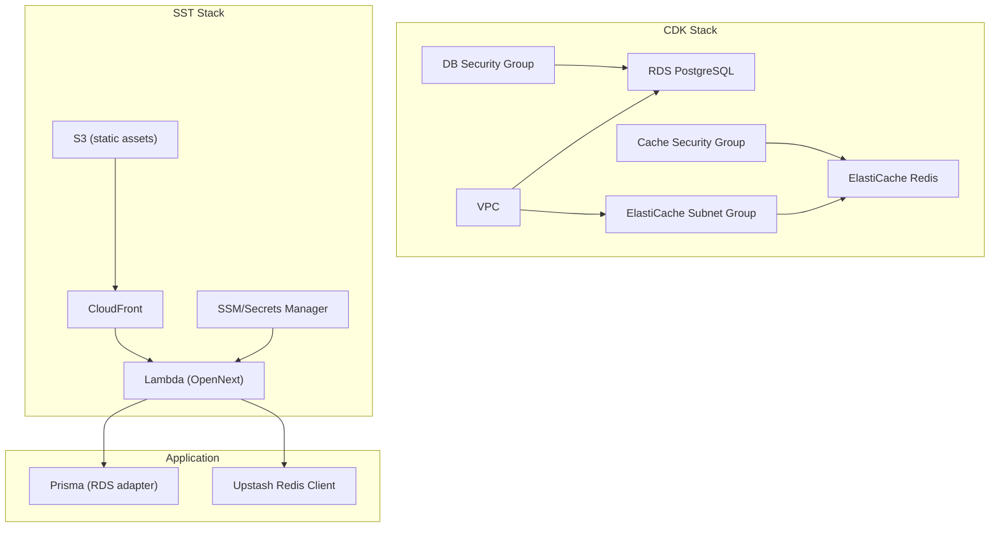
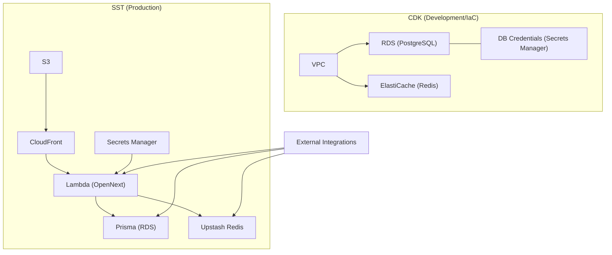
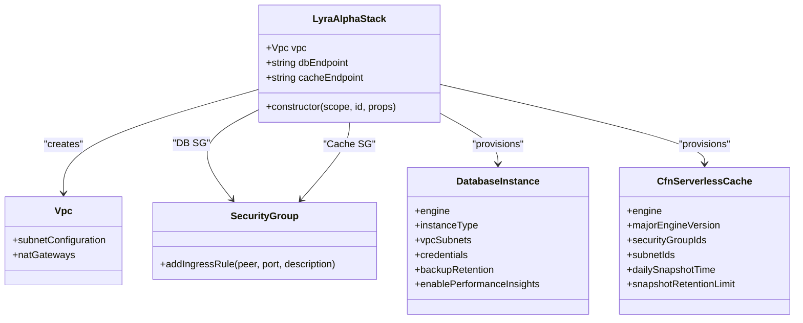
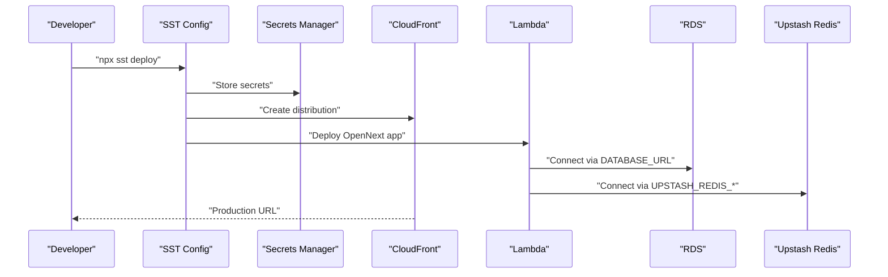
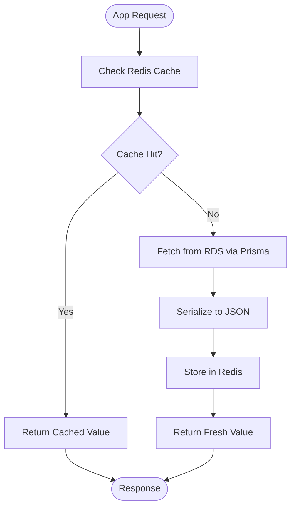
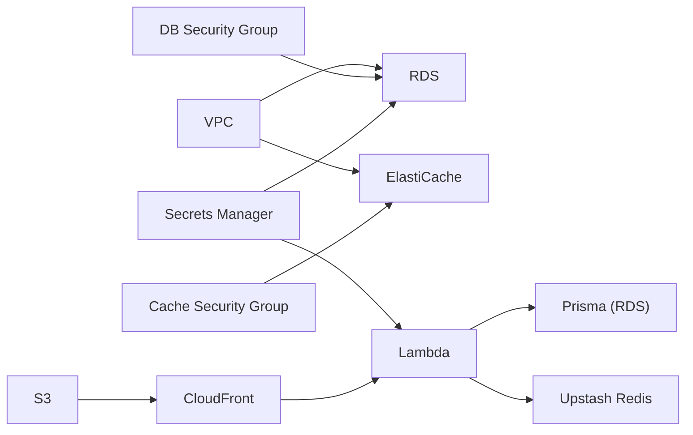

# Infrastructure Setup

<cite>
**Referenced Files in This Document**
- [cdk.ts](file://infrastructure/cdk/bin/cdk.ts)
- [lyraalpha-stack.ts](file://infrastructure/cdk/lib/lyraalpha-stack.ts)
- [package.json](file://infrastructure/cdk/package.json)
- [tsconfig.json](file://infrastructure/cdk/tsconfig.json)
- [sst.config.ts](file://sst.config.ts)
- [AWS_MIGRATION_GUIDE.md](file://docs/AWS_MIGRATION_GUIDE.md)
- [ENV_SETUP.md](file://docs/ENV_SETUP.md)
- [prisma-aws.ts](file://src/lib/prisma-aws.ts)
- [redis.ts](file://src/lib/redis.ts)
</cite>

## Table of Contents
1. [Introduction](#introduction)
2. [Project Structure](#project-structure)
3. [Core Components](#core-components)
4. [Architecture Overview](#architecture-overview)
5. [Detailed Component Analysis](#detailed-component-analysis)
6. [Dependency Analysis](#dependency-analysis)
7. [Performance Considerations](#performance-considerations)
8. [Troubleshooting Guide](#troubleshooting-guide)
9. [Conclusion](#conclusion)
10. [Appendices](#appendices)

## Introduction
This document explains how LyraAlpha deploys and operates its AWS infrastructure using two complementary approaches:
- AWS CDK: A foundational stack that provisions a VPC, RDS PostgreSQL database, and ElastiCache Redis for development or isolated environments.
- SST (Ion) + OpenNext: The production-grade hosting stack that deploys the Next.js application to AWS Lambda with CloudFront and S3, connects to an RDS PostgreSQL database, and integrates Upstash Redis for caching.

The document covers:
- Stack configuration and resource provisioning
- Networking and security groups
- Database and caching setup
- Environment-specific variations
- Cost optimization strategies
- CDK deployment workflow and infrastructure modification procedures
- Integration with Vercel deployment and migration artifacts

## Project Structure
The infrastructure is split across:
- AWS CDK: A minimal stack for VPC, RDS, and ElastiCache
- SST: The production hosting stack that provisions Lambda, CloudFront, and links secrets and environment variables
- Application libraries: Prisma adapter for RDS and Upstash Redis client

**Diagram sources**
- [lyraalpha-stack.ts:27-42](file://infrastructure/cdk/lib/lyraalpha-stack.ts#L27-L42)
- [lyraalpha-stack.ts:44-56](file://infrastructure/cdk/lib/lyraalpha-stack.ts#L44-L56)
- [lyraalpha-stack.ts:95-106](file://infrastructure/cdk/lib/lyraalpha-stack.ts#L95-L106)
- [lyraalpha-stack.ts:108-124](file://infrastructure/cdk/lib/lyraalpha-stack.ts#L108-L124)
- [sst.config.ts:39-102](file://sst.config.ts#L39-L102)
- [prisma-aws.ts:17-32](file://src/lib/prisma-aws.ts#L17-L32)
- [redis.ts:49-63](file://src/lib/redis.ts#L49-L63)

**Section sources**
- [cdk.ts:1-17](file://infrastructure/cdk/bin/cdk.ts#L1-L17)
- [lyraalpha-stack.ts:18-155](file://infrastructure/cdk/lib/lyraalpha-stack.ts#L18-L155)
- [sst.config.ts:1-166](file://sst.config.ts#L1-L166)
- [prisma-aws.ts:1-51](file://src/lib/prisma-aws.ts#L1-L51)
- [redis.ts:1-455](file://src/lib/redis.ts#L1-L455)

## Core Components
- AWS CDK Stack
  - VPC with public/private subnets and NAT gateway
  - RDS PostgreSQL instance in private subnet with credentials stored in Secrets Manager
  - ElastiCache Redis (Serverless) in private subnets with subnet group and security group
  - Outputs for database endpoint/port, cache endpoint/port, and DB secret ARN
- SST Stack
  - Next.js application deployed via OpenNext to Lambda with CloudFront and S3
  - Secret management for database URL, Clerk, Stripe, Upstash, and other integrations
  - Environment variables for runtime behavior and feature flags
  - Optional custom domain with ACM certificate and Route 53
- Application Libraries
  - Prisma adapter configured for RDS with SSL and connection pooling
  - Upstash Redis client wrapper with cache helpers, metrics, and deduplication

**Section sources**
- [lyraalpha-stack.ts:26-42](file://infrastructure/cdk/lib/lyraalpha-stack.ts#L26-L42)
- [lyraalpha-stack.ts:69-91](file://infrastructure/cdk/lib/lyraalpha-stack.ts#L69-L91)
- [lyraalpha-stack.ts:95-124](file://infrastructure/cdk/lib/lyraalpha-stack.ts#L95-L124)
- [lyraalpha-stack.ts:128-153](file://infrastructure/cdk/lib/lyraalpha-stack.ts#L128-L153)
- [sst.config.ts:19-60](file://sst.config.ts#L19-L60)
- [sst.config.ts:63-102](file://sst.config.ts#L63-L102)
- [prisma-aws.ts:13-32](file://src/lib/prisma-aws.ts#L13-L32)
- [redis.ts:49-63](file://src/lib/redis.ts#L49-L63)

## Architecture Overview
The system comprises two primary stacks:
- CDK stack for development and isolated environments
- SST stack for production hosting and scaling

**Diagram sources**
- [lyraalpha-stack.ts:27-42](file://infrastructure/cdk/lib/lyraalpha-stack.ts#L27-L42)
- [lyraalpha-stack.ts:69-91](file://infrastructure/cdk/lib/lyraalpha-stack.ts#L69-L91)
- [lyraalpha-stack.ts:115-124](file://infrastructure/cdk/lib/lyraalpha-stack.ts#L115-L124)
- [sst.config.ts:39-102](file://sst.config.ts#L39-L102)
- [prisma-aws.ts:17-32](file://src/lib/prisma-aws.ts#L17-L32)
- [redis.ts:49-63](file://src/lib/redis.ts#L49-L63)

## Detailed Component Analysis

### AWS CDK Stack: VPC, RDS, ElastiCache
- VPC
  - Two AZs, one NAT gateway
  - Public and private subnet configurations
- RDS PostgreSQL
  - Postgres 15.4, t3.micro instance type
  - Private subnet placement
  - Backup retention, performance insights enabled
  - Deletion protection disabled by default (recommended to enable in production)
- ElastiCache Redis (Serverless)
  - Redis 7, subnet group for private subnets
  - Security group allows inbound on 6379 from VPC CIDR
- Outputs
  - Database endpoint and port
  - Cache endpoint and port
  - DB secret ARN

**Diagram sources**
- [lyraalpha-stack.ts:27-42](file://infrastructure/cdk/lib/lyraalpha-stack.ts#L27-L42)
- [lyraalpha-stack.ts:44-56](file://infrastructure/cdk/lib/lyraalpha-stack.ts#L44-L56)
- [lyraalpha-stack.ts:95-106](file://infrastructure/cdk/lib/lyraalpha-stack.ts#L95-L106)
- [lyraalpha-stack.ts:115-124](file://infrastructure/cdk/lib/lyraalpha-stack.ts#L115-L124)

**Section sources**
- [lyraalpha-stack.ts:26-42](file://infrastructure/cdk/lib/lyraalpha-stack.ts#L26-L42)
- [lyraalpha-stack.ts:69-91](file://infrastructure/cdk/lib/lyraalpha-stack.ts#L69-L91)
- [lyraalpha-stack.ts:95-124](file://infrastructure/cdk/lib/lyraalpha-stack.ts#L95-L124)
- [lyraalpha-stack.ts:128-153](file://infrastructure/cdk/lib/lyraalpha-stack.ts#L128-L153)

### SST Stack: Hosting, Secrets, Environment
- Hosting
  - Next.js via OpenNext on Lambda
  - CloudFront for CDN and HTTPS
  - S3 for static assets
- Secrets
  - DatabaseUrl, DirectUrl, Clerk, Stripe, Azure OpenAI, Upstash Redis, cron secret, and others
- Environment variables
  - Clerk public keys and redirect URLs
  - Feature flags for caching and rate limiting
  - Prisma pool sizes tailored for RDS
- Optional custom domain
  - Domain block with DNS delegation and ACM certificate provisioning

**Diagram sources**
- [sst.config.ts:19-60](file://sst.config.ts#L19-L60)
- [sst.config.ts:39-102](file://sst.config.ts#L39-L102)
- [prisma-aws.ts:17-32](file://src/lib/prisma-aws.ts#L17-L32)
- [redis.ts:49-63](file://src/lib/redis.ts#L49-L63)

**Section sources**
- [sst.config.ts:16-166](file://sst.config.ts#L16-L166)

### Database Connectivity and Caching
- RDS connectivity
  - Prisma adapter configured with SSL and connection pooling
  - Separate pooling and direct adapters for different workloads
- Redis caching
  - Upstash Redis client with automatic JSON serialization/deserialization
  - Cache helpers for get/set/del/invalidate, metrics, and in-flight deduplication

**Diagram sources**
- [prisma-aws.ts:17-32](file://src/lib/prisma-aws.ts#L17-L32)
- [redis.ts:142-195](file://src/lib/redis.ts#L142-L195)

**Section sources**
- [prisma-aws.ts:13-32](file://src/lib/prisma-aws.ts#L13-L32)
- [redis.ts:49-63](file://src/lib/redis.ts#L49-L63)

## Dependency Analysis
- CDK stack dependencies
  - VPC provides subnets for RDS and ElastiCache
  - Security groups enforce inbound access policies
  - Secrets Manager holds DB credentials
- SST stack dependencies
  - Secrets Manager supplies DATABASE_URL and other secrets
  - Prisma connects to RDS; Upstash Redis provides caching
  - CloudFront and Lambda form the application delivery chain

**Diagram sources**
- [lyraalpha-stack.ts:27-42](file://infrastructure/cdk/lib/lyraalpha-stack.ts#L27-L42)
- [lyraalpha-stack.ts:44-56](file://infrastructure/cdk/lib/lyraalpha-stack.ts#L44-L56)
- [lyraalpha-stack.ts:95-106](file://infrastructure/cdk/lib/lyraalpha-stack.ts#L95-L106)
- [sst.config.ts:19-60](file://sst.config.ts#L19-L60)
- [prisma-aws.ts:17-32](file://src/lib/prisma-aws.ts#L17-L32)
- [redis.ts:49-63](file://src/lib/redis.ts#L49-L63)

**Section sources**
- [lyraalpha-stack.ts:26-42](file://infrastructure/cdk/lib/lyraalpha-stack.ts#L26-L42)
- [sst.config.ts:19-60](file://sst.config.ts#L19-L60)

## Performance Considerations
- Database
  - Use RDS with appropriate instance sizing and storage autoscaling
  - Enable performance insights and backups
  - Consider enabling deletion protection in production
- Caching
  - Tune cache TTLs and sampling rates for metrics
  - Use in-flight deduplication to avoid thundering herds
- Hosting
  - Use ARM64 Lambda for cost/performance balance
  - Configure warm instances to reduce cold starts
  - Adjust timeouts for streaming and cron workloads

[No sources needed since this section provides general guidance]

## Troubleshooting Guide
- CDK deployment
  - Ensure AWS credentials and region are configured
  - Build TypeScript and run synthesis before deploy
  - Use diffs to review changes prior to deployment
- Database connectivity
  - Verify DATABASE_URL and SSL settings
  - Confirm security group rules allow inbound from the VPC
- Redis connectivity
  - Validate UPSTASH_REDIS_REST_URL and token
  - Monitor cache metrics and fallback behavior
- SST deployment
  - Confirm secrets are set via SST secret commands
  - Check CloudFront distribution and Lambda logs for errors

**Section sources**
- [cdk.ts:8-16](file://infrastructure/cdk/bin/cdk.ts#L8-L16)
- [package.json:6-16](file://infrastructure/cdk/package.json#L6-L16)
- [prisma-aws.ts:13-14](file://src/lib/prisma-aws.ts#L13-L14)
- [redis.ts:49-63](file://src/lib/redis.ts#L49-L63)
- [sst.config.ts:19-60](file://sst.config.ts#L19-L60)

## Conclusion
LyraAlpha’s infrastructure combines a straightforward AWS CDK stack for development and a robust SST-based production stack for hosting. The CDK stack establishes secure networking and foundational data services, while the SST stack delivers scalable, serverless application hosting with integrated secrets and environment management. Together, they support efficient database and caching operations, clear deployment workflows, and practical cost optimization strategies.

[No sources needed since this section summarizes without analyzing specific files]

## Appendices

### Environment Variables and Secrets
- Required environment variables for production operation
- Secrets managed via SST and consumed by the application

**Section sources**
- [ENV_SETUP.md:14-84](file://docs/ENV_SETUP.md#L14-L84)
- [sst.config.ts:19-60](file://sst.config.ts#L19-L60)

### Migration from Vercel + Supabase to AWS (Reference)
- Steps for migrating database to RDS, enabling pgvector, and deploying via SST
- Cost breakdown and rollback plan

**Section sources**
- [AWS_MIGRATION_GUIDE.md:38-117](file://docs/AWS_MIGRATION_GUIDE.md#L38-L117)
- [AWS_MIGRATION_GUIDE.md:120-203](file://docs/AWS_MIGRATION_GUIDE.md#L120-L203)
- [AWS_MIGRATION_GUIDE.md:385-399](file://docs/AWS_MIGRATION_GUIDE.md#L385-L399)

### CDK Deployment Workflow
- Build, synthesize, diff, deploy, and destroy lifecycle
- Stack configuration and outputs

**Section sources**
- [cdk.ts:8-16](file://infrastructure/cdk/bin/cdk.ts#L8-L16)
- [package.json:6-16](file://infrastructure/cdk/package.json#L6-L16)
- [tsconfig.json:2-25](file://infrastructure/cdk/tsconfig.json#L2-L25)
- [lyraalpha-stack.ts:128-153](file://infrastructure/cdk/lib/lyraalpha-stack.ts#L128-L153)