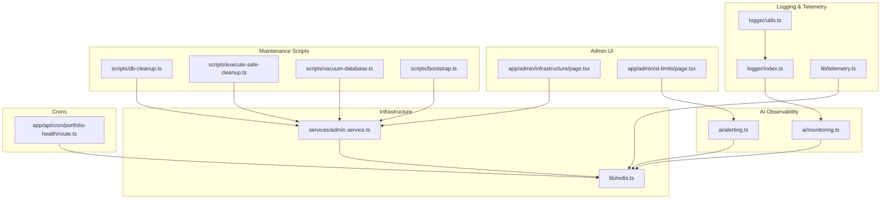
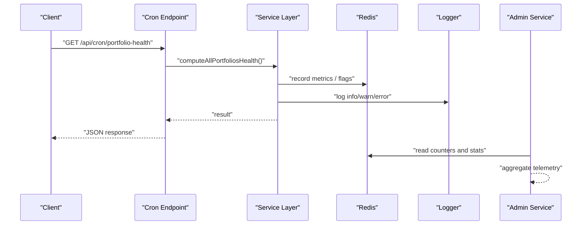
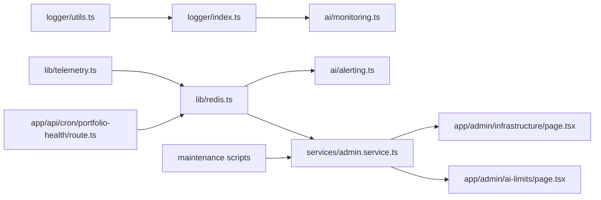

# Monitoring & Observability

<cite>
**Referenced Files in This Document**
- [logger/index.ts](file://src/lib/logger/index.ts)
- [logger/utils.ts](file://src/lib/logger/utils.ts)
- [redis.ts](file://src/lib/redis.ts)
- [telemetry.ts](file://src/lib/telemetry.ts)
- [ai/monitoring.ts](file://src/lib/ai/monitoring.ts)
- [ai/alerting.ts](file://src/lib/ai/alerting.ts)
- [services/admin.service.ts](file://src/lib/services/admin.service.ts)
- [app/api/cron/portfolio-health/route.ts](file://src/app/api/cron/portfolio-health/route.ts)
- [app/admin/ai-limits/page.tsx](file://src/app/admin/ai-limits/page.tsx)
- [app/admin/infrastructure/page.tsx](file://src/app/admin/infrastructure/page.tsx)
- [scripts/db-cleanup.ts](file://scripts/db-cleanup.ts)
- [scripts/execute-safe-cleanup.ts](file://scripts/execute-safe-cleanup.ts)
- [scripts/vacuum-database.ts](file://scripts/vacuum-database.ts)
- [scripts/bootstrap.ts](file://scripts/bootstrap.ts)
</cite>

## Table of Contents
1. [Introduction](#introduction)
2. [Project Structure](#project-structure)
3. [Core Components](#core-components)
4. [Architecture Overview](#architecture-overview)
5. [Detailed Component Analysis](#detailed-component-analysis)
6. [Dependency Analysis](#dependency-analysis)
7. [Performance Considerations](#performance-considerations)
8. [Troubleshooting Guide](#troubleshooting-guide)
9. [Conclusion](#conclusion)
10. [Appendices](#appendices)

## Introduction
This document provides comprehensive monitoring and observability guidance for LyraAlpha. It covers logging infrastructure, performance metrics collection, error tracking, alerting, maintenance scripts for system health, and integration points with external monitoring tools. It also outlines telemetry patterns for user behavior analytics and system performance monitoring, along with best practices and operational procedures.

## Project Structure
LyraAlpha’s observability spans several layers:
- Logging and sanitization utilities
- Telemetry sampling for Redis operations
- Redis-backed alerting and cache metrics
- Structured AI telemetry for model routing, retrieval, and memory
- Admin dashboards for infrastructure and usage
- Maintenance scripts for database cleanup and optimization

**Diagram sources**
- [logger/index.ts:1-91](file://src/lib/logger/index.ts#L1-L91)
- [logger/utils.ts:1-78](file://src/lib/logger/utils.ts#L1-L78)
- [telemetry.ts:1-30](file://src/lib/telemetry.ts#L1-L30)
- [ai/monitoring.ts:1-127](file://src/lib/ai/monitoring.ts#L1-L127)
- [ai/alerting.ts:1-477](file://src/lib/ai/alerting.ts#L1-L477)
- [redis.ts:1-455](file://src/lib/redis.ts#L1-L455)
- [services/admin.service.ts:1000-1199](file://src/lib/services/admin.service.ts#L1000-L1199)
- [app/admin/infrastructure/page.tsx:31-57](file://src/app/admin/infrastructure/page.tsx#L31-L57)
- [app/admin/ai-limits/page.tsx:40-49](file://src/app/admin/ai-limits/page.tsx#L40-L49)
- [app/api/cron/portfolio-health/route.ts:1-29](file://src/app/api/cron/portfolio-health/route.ts#L1-L29)
- [scripts/db-cleanup.ts:1-137](file://scripts/db-cleanup.ts#L1-L137)
- [scripts/execute-safe-cleanup.ts:1-207](file://scripts/execute-safe-cleanup.ts#L1-L207)
- [scripts/vacuum-database.ts:1-58](file://scripts/vacuum-database.ts#L1-L58)
- [scripts/bootstrap.ts:1-118](file://scripts/bootstrap.ts#L1-L118)

**Section sources**
- [logger/index.ts:1-91](file://src/lib/logger/index.ts#L1-L91)
- [redis.ts:1-455](file://src/lib/redis.ts#L1-L455)
- [ai/monitoring.ts:1-127](file://src/lib/ai/monitoring.ts#L1-L127)
- [ai/alerting.ts:1-477](file://src/lib/ai/alerting.ts#L1-L477)
- [services/admin.service.ts:1000-1199](file://src/lib/services/admin.service.ts#L1000-L1199)
- [app/admin/infrastructure/page.tsx:31-57](file://src/app/admin/infrastructure/page.tsx#L31-L57)
- [app/admin/ai-limits/page.tsx:40-49](file://src/app/admin/ai-limits/page.tsx#L40-L49)
- [app/api/cron/portfolio-health/route.ts:1-29](file://src/app/api/cron/portfolio-health/route.ts#L1-L29)
- [scripts/db-cleanup.ts:1-137](file://scripts/db-cleanup.ts#L1-L137)
- [scripts/execute-safe-cleanup.ts:1-207](file://scripts/execute-safe-cleanup.ts#L1-L207)
- [scripts/vacuum-database.ts:1-58](file://scripts/vacuum-database.ts#L1-L58)
- [scripts/bootstrap.ts:1-118](file://scripts/bootstrap.ts#L1-L118)

## Core Components
- Logging and sanitization: Centralized logger with environment-aware formatting, redaction, and child logger creation. Utilities include error sanitization, duration formatting, and sensitive data redaction helpers.
- Telemetry sampling: Optional timing wrapper around Redis operations with probabilistic sampling and structured logging.
- Redis utilities: Robust client initialization, cache get/set/del, in-flight deduplication, pipeline metrics, and cache stats aggregation.
- AI monitoring: Structured logging for model routing, retrieval metrics, context budget metrics, and memory events.
- AI alerting: Threshold-based alerting with Redis-backed sliding windows, mitigation flags, webhook delivery, and cooldowns.
- Admin services: Aggregates Redis telemetry for admin dashboards, including usage stats and infrastructure health.
- Admin dashboards: Infrastructure and AI limits pages consume admin service data to render health and alerting state.
- Maintenance scripts: Automated cleanup, safe cleanup, vacuum, and bootstrap scripts for database hygiene and initial setup.

**Section sources**
- [logger/index.ts:1-91](file://src/lib/logger/index.ts#L1-L91)
- [logger/utils.ts:1-78](file://src/lib/logger/utils.ts#L1-L78)
- [telemetry.ts:1-30](file://src/lib/telemetry.ts#L1-L30)
- [redis.ts:1-455](file://src/lib/redis.ts#L1-L455)
- [ai/monitoring.ts:1-127](file://src/lib/ai/monitoring.ts#L1-L127)
- [ai/alerting.ts:1-477](file://src/lib/ai/alerting.ts#L1-L477)
- [services/admin.service.ts:1000-1199](file://src/lib/services/admin.service.ts#L1000-L1199)
- [app/admin/infrastructure/page.tsx:31-57](file://src/app/admin/infrastructure/page.tsx#L31-L57)
- [app/admin/ai-limits/page.tsx:40-49](file://src/app/admin/ai-limits/page.tsx#L40-L49)
- [scripts/db-cleanup.ts:1-137](file://scripts/db-cleanup.ts#L1-L137)
- [scripts/execute-safe-cleanup.ts:1-207](file://scripts/execute-safe-cleanup.ts#L1-L207)
- [scripts/vacuum-database.ts:1-58](file://scripts/vacuum-database.ts#L1-L58)
- [scripts/bootstrap.ts:1-118](file://scripts/bootstrap.ts#L1-L118)

## Architecture Overview
The observability architecture centers on:
- Structured logs emitted by services and AI telemetry modules
- Redis for ephemeral metrics, sliding windows, and mitigation flags
- Admin service aggregations feeding dashboards
- Cron endpoints for periodic health computations
- Maintenance scripts for database cleanup and optimization

**Diagram sources**
- [app/api/cron/portfolio-health/route.ts:1-29](file://src/app/api/cron/portfolio-health/route.ts#L1-L29)
- [redis.ts:1-455](file://src/lib/redis.ts#L1-L455)
- [logger/index.ts:1-91](file://src/lib/logger/index.ts#L1-L91)
- [services/admin.service.ts:1000-1199](file://src/lib/services/admin.service.ts#L1000-L1199)

## Detailed Component Analysis

### Logging Infrastructure
- Environment-aware logging: JSON logs in production, pretty-printed in development. Configurable log level and redaction of sensitive fields.
- Child logger creation: Adds contextual metadata to all logs for easier filtering and correlation.
- Error sanitization: Converts thrown errors into structured objects with name, message, and stack, including cause recursion.
- Utility helpers: Duration formatting and redaction of sensitive keys in objects.

Best practices:
- Always log at appropriate levels (trace/debug/info/warn/error/fatal).
- Use child loggers to attach service, operation, and request IDs.
- Redact sensitive fields in logs and request bodies.

**Section sources**
- [logger/index.ts:1-91](file://src/lib/logger/index.ts#L1-L91)
- [logger/utils.ts:1-78](file://src/lib/logger/utils.ts#L1-L78)

### Telemetry Sampling for Redis Operations
- Optional timing wrapper around Redis operations with probabilistic sampling controlled by environment variables.
- Logs operation name, duration in milliseconds, and optional metadata for downstream analysis.

Operational guidance:
- Enable sampling in staging/production for targeted insights.
- Use metadata to group operations by key prefix or TTL to identify hotspots.

**Section sources**
- [telemetry.ts:1-30](file://src/lib/telemetry.ts#L1-L30)
- [redis.ts:142-195](file://src/lib/redis.ts#L142-L195)

### Redis Utilities and Metrics
- Robust client initialization with fallback to a no-op client when environment variables are missing.
- Cache operations with JSON serialization, date revival, and in-flight deduplication to prevent thundering herds.
- Pipeline metrics and cache stats aggregation with TTL-based rotation.
- Lock primitives with fail-open and fail-closed variants for idempotency and safety.

Operational guidance:
- Monitor Redis INFO output via admin service for health indicators.
- Use pipeline metrics to track event rates across pipelines.
- Apply cache stats sampling to avoid overhead in high-throughput environments.

**Section sources**
- [redis.ts:1-455](file://src/lib/redis.ts#L1-L455)

### AI Monitoring and Telemetry
- Structured logging for model routing decisions, retrieval metrics, context budget usage, and memory events.
- Events include identifiers (model, tier), outcomes (hit/miss/success), and durations/tokens for cost-latency analysis.

Operational guidance:
- Parse structured logs to build dashboards for routing decisions and retrieval effectiveness.
- Correlate memory outcomes with latency to identify bottlenecks.

**Section sources**
- [ai/monitoring.ts:1-127](file://src/lib/ai/monitoring.ts#L1-L127)

### AI Alerting and Mitigation
- Threshold-based alerting with Redis-backed sliding windows and mitigation flags.
- Supported alerts include daily cost spikes, web search outages, RAG zero-result rate, output validation failure rate, fallback rate elevation, latency budget violations, and cost estimation drift.
- Webhook delivery with HTTPS validation, cooldowns, and deduplication for cron alerts.

Operational guidance:
- Configure thresholds via environment variables.
- Use mitigation flags to temporarily switch to backup models when fallback rate exceeds mitigation threshold.
- Monitor admin AI limits page for current alerting state and thresholds.

**Section sources**
- [ai/alerting.ts:1-477](file://src/lib/ai/alerting.ts#L1-L477)
- [app/admin/ai-limits/page.tsx:40-49](file://src/app/admin/ai-limits/page.tsx#L40-L49)

### Admin Services and Dashboards
- Aggregates Redis telemetry for admin dashboards, including usage stats, action breakdowns, and infrastructure health.
- Infrastructure page renders cache hit rates and database table counts.
- Usage page consumes admin service data to present KPIs and trends.

Operational guidance:
- Use admin dashboards to monitor cache health, Redis utilization, and usage trends.
- Investigate anomalies by correlating Redis counters with logs.

**Section sources**
- [services/admin.service.ts:1000-1199](file://src/lib/services/admin.service.ts#L1000-L1199)
- [app/admin/infrastructure/page.tsx:31-57](file://src/app/admin/infrastructure/page.tsx#L31-L57)

### Cron Health Checks
- Cron endpoint for portfolio health computes and logs results, enabling periodic system-wide checks.
- Uses cron auth and logging middleware to ensure secure and observable executions.

Operational guidance:
- Monitor cron logs for failures and long-running operations.
- Use maxDuration and preferredRegion to tune cold start and regional performance.

**Section sources**
- [app/api/cron/portfolio-health/route.ts:1-29](file://src/app/api/cron/portfolio-health/route.ts#L1-L29)

### Maintenance Scripts for System Health
- Database cleanup script prunes stale data across multiple tables and prints dry-run summaries before deletion.
- Safe cleanup script removes duplicates, orphaned records, and empty knowledge documents.
- Vacuum database script reclaims space and updates statistics after cleanup.
- Bootstrap script seeds data and performs full crypto harvesting and analytics computation.

Operational guidance:
- Schedule database cleanup and vacuum during off-peak hours.
- Use safe cleanup to address recurring anomalies without manual intervention.
- Run bootstrap after DB resets or environment initialization.

**Section sources**
- [scripts/db-cleanup.ts:1-137](file://scripts/db-cleanup.ts#L1-L137)
- [scripts/execute-safe-cleanup.ts:1-207](file://scripts/execute-safe-cleanup.ts#L1-L207)
- [scripts/vacuum-database.ts:1-58](file://scripts/vacuum-database.ts#L1-L58)
- [scripts/bootstrap.ts:1-118](file://scripts/bootstrap.ts#L1-L118)

## Dependency Analysis

**Diagram sources**
- [logger/index.ts:1-91](file://src/lib/logger/index.ts#L1-L91)
- [logger/utils.ts:1-78](file://src/lib/logger/utils.ts#L1-L78)
- [telemetry.ts:1-30](file://src/lib/telemetry.ts#L1-L30)
- [redis.ts:1-455](file://src/lib/redis.ts#L1-L455)
- [ai/monitoring.ts:1-127](file://src/lib/ai/monitoring.ts#L1-L127)
- [ai/alerting.ts:1-477](file://src/lib/ai/alerting.ts#L1-L477)
- [services/admin.service.ts:1000-1199](file://src/lib/services/admin.service.ts#L1000-L1199)
- [app/admin/infrastructure/page.tsx:31-57](file://src/app/admin/infrastructure/page.tsx#L31-L57)
- [app/admin/ai-limits/page.tsx:40-49](file://src/app/admin/ai-limits/page.tsx#L40-L49)
- [app/api/cron/portfolio-health/route.ts:1-29](file://src/app/api/cron/portfolio-health/route.ts#L1-L29)
- [scripts/db-cleanup.ts:1-137](file://scripts/db-cleanup.ts#L1-L137)
- [scripts/execute-safe-cleanup.ts:1-207](file://scripts/execute-safe-cleanup.ts#L1-L207)
- [scripts/vacuum-database.ts:1-58](file://scripts/vacuum-database.ts#L1-L58)
- [scripts/bootstrap.ts:1-118](file://scripts/bootstrap.ts#L1-L118)

**Section sources**
- [logger/index.ts:1-91](file://src/lib/logger/index.ts#L1-L91)
- [redis.ts:1-455](file://src/lib/redis.ts#L1-L455)
- [ai/alerting.ts:1-477](file://src/lib/ai/alerting.ts#L1-L477)
- [services/admin.service.ts:1000-1199](file://src/lib/services/admin.service.ts#L1000-L1199)
- [app/admin/infrastructure/page.tsx:31-57](file://src/app/admin/infrastructure/page.tsx#L31-L57)
- [app/admin/ai-limits/page.tsx:40-49](file://src/app/admin/ai-limits/page.tsx#L40-L49)
- [app/api/cron/portfolio-health/route.ts:1-29](file://src/app/api/cron/portfolio-health/route.ts#L1-L29)
- [scripts/db-cleanup.ts:1-137](file://scripts/db-cleanup.ts#L1-L137)
- [scripts/execute-safe-cleanup.ts:1-207](file://scripts/execute-safe-cleanup.ts#L1-L207)
- [scripts/vacuum-database.ts:1-58](file://scripts/vacuum-database.ts#L1-L58)
- [scripts/bootstrap.ts:1-118](file://scripts/bootstrap.ts#L1-L118)

## Performance Considerations
- Use telemetry sampling to minimize overhead in production while retaining visibility.
- Employ in-flight deduplication and stale-while-revalidate patterns to reduce thundering herds and latency spikes.
- Monitor cache hit rates and Redis INFO metrics to identify bottlenecks.
- Schedule heavy maintenance tasks (cleanup, vacuum) during off-peak hours.
- Tune cron maxDuration and preferredRegion for optimal cold starts and regional performance.

[No sources needed since this section provides general guidance]

## Troubleshooting Guide
Common issues and resolutions:
- Redis initialization failures: The client falls back to a no-op implementation. Check environment variables and logs for initialization errors.
- Alert webhook delivery failures: HTTPS validation and cooldowns prevent repeated failures; inspect logs for URL validation warnings.
- Cache misses causing thundering herds: Enable in-flight deduplication and adjust TTLs to balance freshness and load.
- Excessive daily costs: Review alert thresholds and mitigation flags; investigate spikes in fallback rate or latency violations.
- Database bloat: Run safe cleanup and vacuum database scripts to reclaim space and update statistics.

**Section sources**
- [redis.ts:1-455](file://src/lib/redis.ts#L1-L455)
- [ai/alerting.ts:1-477](file://src/lib/ai/alerting.ts#L1-L477)
- [scripts/db-cleanup.ts:1-137](file://scripts/db-cleanup.ts#L1-L137)
- [scripts/execute-safe-cleanup.ts:1-207](file://scripts/execute-safe-cleanup.ts#L1-L207)
- [scripts/vacuum-database.ts:1-58](file://scripts/vacuum-database.ts#L1-L58)

## Conclusion
LyraAlpha’s observability stack combines structured logging, Redis-backed telemetry, and admin dashboards to provide comprehensive monitoring and alerting. Maintenance scripts ensure database health, while cron endpoints enable periodic system checks. By leveraging these components and following the best practices outlined, teams can maintain a resilient, observable system.

[No sources needed since this section summarizes without analyzing specific files]

## Appendices

### Alerting Thresholds Reference
- Daily cost threshold (USD)
- RAG zero-result rate threshold (%)
- Web search consecutive failures threshold
- Output validation failure rate threshold (%)
- Fallback rate alert threshold (%)
- Fallback rate mitigation threshold (%)
- Latency budget violation rate threshold (%)
- Cost estimation drift threshold (%)

**Section sources**
- [app/admin/ai-limits/page.tsx:40-49](file://src/app/admin/ai-limits/page.tsx#L40-L49)
- [ai/alerting.ts:10-30](file://src/lib/ai/alerting.ts#L10-L30)

### Telemetry Fields for AI Monitoring
- Model routing: model, tier, tokens, wasFallback, duration
- Model cache: modelFamily, plan, tier, operation, outcome
- Retrieval metrics: tier, responseMode, knowledgeChars, memoryChars, webChars, sourceCount
- Context budget metrics: tier, responseMode, staticPromptLength, contextLength, historyLength
- Memory events: userId, source, outcome, noteCount, latencyMs

**Section sources**
- [ai/monitoring.ts:11-126](file://src/lib/ai/monitoring.ts#L11-L126)