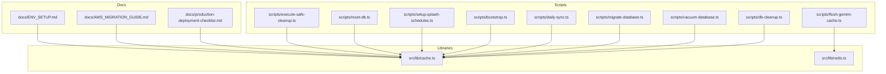
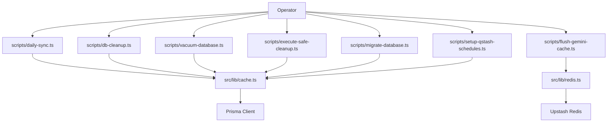
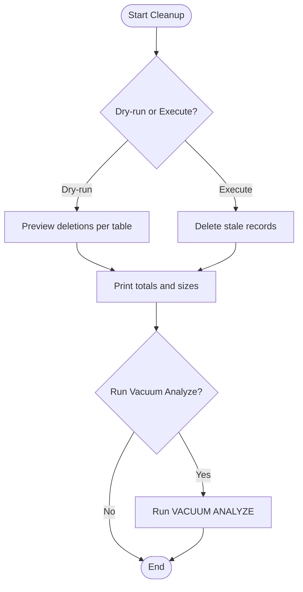
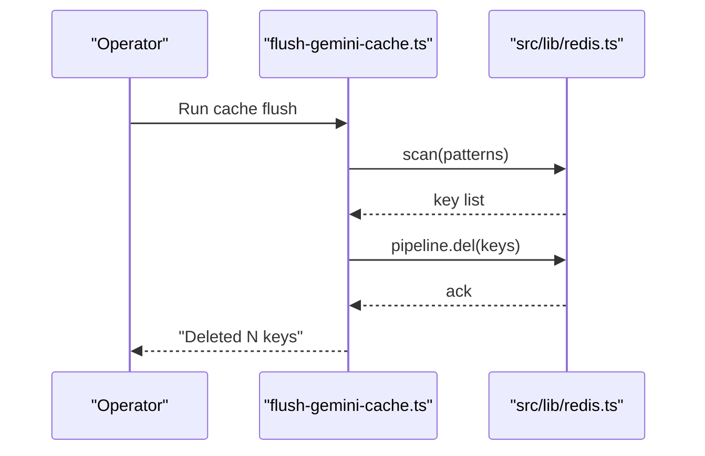
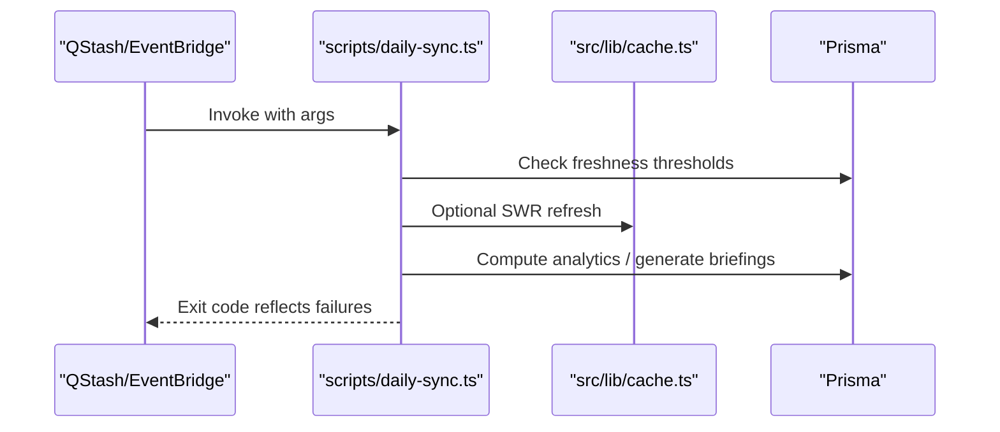
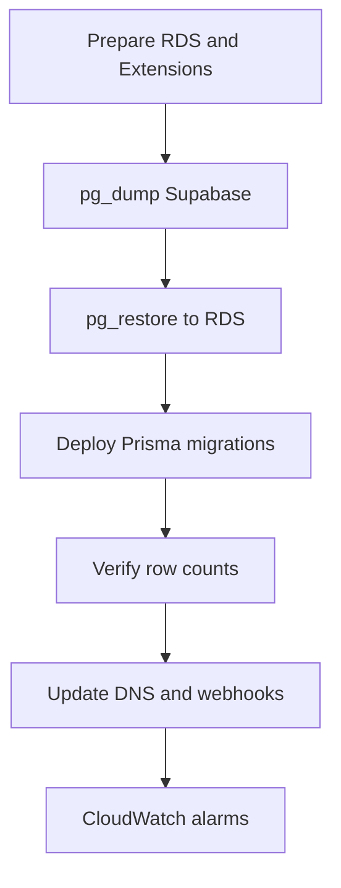
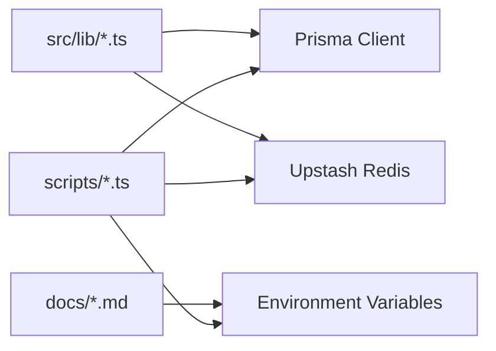

# Operational Procedures

<cite>
**Referenced Files in This Document**
- [db-cleanup.ts](file://scripts/db-cleanup.ts)
- [vacuum-database.ts](file://scripts/vacuum-database.ts)
- [flush-gemini-cache.ts](file://scripts/flush-gemini-cache.ts)
- [migrate-database.ts](file://scripts/migrate-database.ts)
- [daily-sync.ts](file://scripts/daily-sync.ts)
- [bootstrap.ts](file://scripts/bootstrap.ts)
- [cache.ts](file://src/lib/cache.ts)
- [redis.ts](file://src/lib/redis.ts)
- [production-deployment-checklist.md](file://docs/production-deployment-checklist.md)
- [AWS_MIGRATION_GUIDE.md](file://docs/AWS_MIGRATION_GUIDE.md)
- [ENV_SETUP.md](file://docs/ENV_SETUP.md)
- [setup-qstash-schedules.ts](file://scripts/setup-qstash-schedules.ts)
- [reset-db.ts](file://scripts/reset-db.ts)
- [execute-safe-cleanup.ts](file://scripts/execute-safe-cleanup.ts)
</cite>

## Table of Contents
1. [Introduction](#introduction)
2. [Project Structure](#project-structure)
3. [Core Components](#core-components)
4. [Architecture Overview](#architecture-overview)
5. [Detailed Component Analysis](#detailed-component-analysis)
6. [Dependency Analysis](#dependency-analysis)
7. [Performance Considerations](#performance-considerations)
8. [Troubleshooting Guide](#troubleshooting-guide)
9. [Conclusion](#conclusion)
10. [Appendices](#appendices)

## Introduction
This document defines the operational procedures for LyraAlpha maintenance and operations. It covers daily tasks such as database maintenance, cache management, and system cleanup; incident response and emergency procedures; disaster recovery; maintenance scheduling and capacity planning; optimization procedures; backup and archival strategies; and operational runbooks for common scenarios, escalations, and cross-team coordination. It also includes a production deployment checklist and change control guidance.

## Project Structure
Operational tasks are primarily implemented as Node/TypeScript scripts under the scripts/ directory and integrated into the Next.js application via src/lib modules for caching and Redis. Cron scheduling is managed via Upstash QStash, with AWS migration guidance provided for EventBridge-based scheduling.

**Diagram sources**
- [db-cleanup.ts:1-137](file://scripts/db-cleanup.ts#L1-L137)
- [vacuum-database.ts:1-58](file://scripts/vacuum-database.ts#L1-L58)
- [flush-gemini-cache.ts:1-36](file://scripts/flush-gemini-cache.ts#L1-L36)
- [migrate-database.ts:1-272](file://scripts/migrate-database.ts#L1-L272)
- [daily-sync.ts:1-123](file://scripts/daily-sync.ts#L1-L123)
- [bootstrap.ts:1-118](file://scripts/bootstrap.ts#L1-L118)
- [setup-qstash-schedules.ts:1-117](file://scripts/setup-qstash-schedules.ts#L1-L117)
- [reset-db.ts:1-68](file://scripts/reset-db.ts#L1-L68)
- [execute-safe-cleanup.ts:1-207](file://scripts/execute-safe-cleanup.ts#L1-L207)
- [cache.ts:1-21](file://src/lib/cache.ts#L1-L21)
- [redis.ts:1-455](file://src/lib/redis.ts#L1-L455)
- [production-deployment-checklist.md:1-114](file://docs/production-deployment-checklist.md#L1-L114)
- [AWS_MIGRATION_GUIDE.md:1-440](file://docs/AWS_MIGRATION_GUIDE.md#L1-L440)
- [ENV_SETUP.md:1-173](file://docs/ENV_SETUP.md#L1-L173)

**Section sources**
- [db-cleanup.ts:1-137](file://scripts/db-cleanup.ts#L1-L137)
- [vacuum-database.ts:1-58](file://scripts/vacuum-database.ts#L1-L58)
- [flush-gemini-cache.ts:1-36](file://scripts/flush-gemini-cache.ts#L1-L36)
- [migrate-database.ts:1-272](file://scripts/migrate-database.ts#L1-L272)
- [daily-sync.ts:1-123](file://scripts/daily-sync.ts#L1-L123)
- [bootstrap.ts:1-118](file://scripts/bootstrap.ts#L1-L118)
- [setup-qstash-schedules.ts:1-117](file://scripts/setup-qstash-schedules.ts#L1-L117)
- [reset-db.ts:1-68](file://scripts/reset-db.ts#L1-L68)
- [execute-safe-cleanup.ts:1-207](file://scripts/execute-safe-cleanup.ts#L1-L207)
- [cache.ts:1-21](file://src/lib/cache.ts#L1-L21)
- [redis.ts:1-455](file://src/lib/redis.ts#L1-L455)
- [production-deployment-checklist.md:1-114](file://docs/production-deployment-checklist.md#L1-L114)
- [AWS_MIGRATION_GUIDE.md:1-440](file://docs/AWS_MIGRATION_GUIDE.md#L1-L440)
- [ENV_SETUP.md:1-173](file://docs/ENV_SETUP.md#L1-L173)

## Core Components
- Database maintenance scripts:
  - Scheduled pruning of stale analytics and intelligence data.
  - Vacuum and analyze for performance and space reclamation.
  - Safe cleanup of duplicates and orphaned records.
  - Database reset and bootstrap for initial or recovery states.
- Cache management:
  - Redis-backed cache with TTL, metrics, and in-flight deduplication.
  - Utilities to flush model-specific cache prefixes.
- Daily synchronization:
  - Crypto market sync, daily briefing generation, and housekeeping.
- Migration and deployment:
  - Supabase to AWS RDS migration with pg_dump/pg_restore and extension setup.
  - Production deployment checklist and environment requirements.
- Scheduling:
  - QStash cron schedule registration and updates.

**Section sources**
- [db-cleanup.ts:1-137](file://scripts/db-cleanup.ts#L1-L137)
- [vacuum-database.ts:1-58](file://scripts/vacuum-database.ts#L1-L58)
- [execute-safe-cleanup.ts:1-207](file://scripts/execute-safe-cleanup.ts#L1-L207)
- [reset-db.ts:1-68](file://scripts/reset-db.ts#L1-L68)
- [redis.ts:1-455](file://src/lib/redis.ts#L1-L455)
- [flush-gemini-cache.ts:1-36](file://scripts/flush-gemini-cache.ts#L1-L36)
- [daily-sync.ts:1-123](file://scripts/daily-sync.ts#L1-L123)
- [migrate-database.ts:1-272](file://scripts/migrate-database.ts#L1-L272)
- [production-deployment-checklist.md:1-114](file://docs/production-deployment-checklist.md#L1-L114)
- [AWS_MIGRATION_GUIDE.md:1-440](file://docs/AWS_MIGRATION_GUIDE.md#L1-L440)
- [setup-qstash-schedules.ts:1-117](file://scripts/setup-qstash-schedules.ts#L1-L117)

## Architecture Overview
Operational flows integrate scripts with the application runtime and external services. The cache layer sits atop Redis, while database operations leverage Prisma. Cron orchestration is handled by QStash (or EventBridge after migration).

**Diagram sources**
- [daily-sync.ts:1-123](file://scripts/daily-sync.ts#L1-L123)
- [db-cleanup.ts:1-137](file://scripts/db-cleanup.ts#L1-L137)
- [vacuum-database.ts:1-58](file://scripts/vacuum-database.ts#L1-L58)
- [execute-safe-cleanup.ts:1-207](file://scripts/execute-safe-cleanup.ts#L1-L207)
- [flush-gemini-cache.ts:1-36](file://scripts/flush-gemini-cache.ts#L1-L36)
- [migrate-database.ts:1-272](file://scripts/migrate-database.ts#L1-L272)
- [setup-qstash-schedules.ts:1-117](file://scripts/setup-qstash-schedules.ts#L1-L117)
- [cache.ts:1-21](file://src/lib/cache.ts#L1-L21)
- [redis.ts:1-455](file://src/lib/redis.ts#L1-L455)

## Detailed Component Analysis

### Database Maintenance and Cleanup
- Purpose: Keep the database lean and performant by pruning stale data and cleaning anomalies.
- Daily prune script:
  - Removes old AssetScore, InstitutionalEvent, PriceHistory, MarketRegime, SectorRegime, MultiHorizonRegime, Evidence, AIRequestLog.
  - Supports dry-run and execute modes.
- Vacuum analyze:
  - Reclaims space and updates statistics; prints top tables by size.
- Safe cleanup:
  - Removes stale AI logs, duplicate trending questions, orphaned asset scores, and empty knowledge documents.
- Reset and bootstrap:
  - Resets DB state and seeds baseline assets; supports region filtering and skipping seed.

**Diagram sources**
- [db-cleanup.ts:1-137](file://scripts/db-cleanup.ts#L1-L137)
- [vacuum-database.ts:1-58](file://scripts/vacuum-database.ts#L1-L58)
- [execute-safe-cleanup.ts:1-207](file://scripts/execute-safe-cleanup.ts#L1-L207)

**Section sources**
- [db-cleanup.ts:1-137](file://scripts/db-cleanup.ts#L1-L137)
- [vacuum-database.ts:1-58](file://scripts/vacuum-database.ts#L1-L58)
- [execute-safe-cleanup.ts:1-207](file://scripts/execute-safe-cleanup.ts#L1-L207)
- [reset-db.ts:1-68](file://scripts/reset-db.ts#L1-L68)

### Cache Management
- Redis client:
  - Initializes from environment; falls back to a no-op client if credentials are missing.
  - Provides get/set/del, atomic NX locks, scanning and pipelining, metrics recording, and in-flight dedup.
- Cache wrappers:
  - Next.js cache strategy with TTL and tags.
  - withCache and stale-while-revalidate with automatic dedup and envelope refresh.
- Cache flushing:
  - Pattern-based key scanning and deletion for model and educational caches.

**Diagram sources**
- [flush-gemini-cache.ts:1-36](file://scripts/flush-gemini-cache.ts#L1-L36)
- [redis.ts:1-455](file://src/lib/redis.ts#L1-L455)

**Section sources**
- [redis.ts:1-455](file://src/lib/redis.ts#L1-L455)
- [cache.ts:1-21](file://src/lib/cache.ts#L1-L21)
- [flush-gemini-cache.ts:1-36](file://scripts/flush-gemini-cache.ts#L1-L36)

### Daily Synchronization
- Scope: Crypto-only sync with optional skips and dry-run.
- Phases:
  - Crypto market data and analytics compute if refresh threshold exceeded.
  - Daily market briefing generation.
  - Optional Lyra components: trending questions and daily brief.
  - Housekeeping: prune stale intelligence data.
- Logging and exit codes indicate success or partial failure.

**Diagram sources**
- [daily-sync.ts:1-123](file://scripts/daily-sync.ts#L1-L123)
- [cache.ts:1-21](file://src/lib/cache.ts#L1-L21)

**Section sources**
- [daily-sync.ts:1-123](file://scripts/daily-sync.ts#L1-L123)

### Migration and Disaster Recovery
- Supabase to AWS RDS:
  - Uses pg_dump (custom format) and pg_restore with parallel workers.
  - Enables pgvector and related extensions on RDS.
  - Deploys Prisma migration history and verifies row counts.
- Post-migration:
  - Configure QStash schedules, update DNS, and set alarms.
  - Rollback plan leverages DNS TTL and keeping Vercel live.

**Diagram sources**
- [migrate-database.ts:1-272](file://scripts/migrate-database.ts#L1-L272)
- [AWS_MIGRATION_GUIDE.md:1-440](file://docs/AWS_MIGRATION_GUIDE.md#L1-L440)

**Section sources**
- [migrate-database.ts:1-272](file://scripts/migrate-database.ts#L1-L272)
- [AWS_MIGRATION_GUIDE.md:1-440](file://docs/AWS_MIGRATION_GUIDE.md#L1-L440)

### Scheduling and Cron
- QStash schedules:
  - Registers, updates, and prunes cron schedules for crypto sync, news, daily briefing, engagement, and housekeeping.
- AWS migration:
  - EventBridge Scheduler invokes HTTP endpoints with Authorization header.

**Section sources**
- [setup-qstash-schedules.ts:1-117](file://scripts/setup-qstash-schedules.ts#L1-L117)
- [AWS_MIGRATION_GUIDE.md:207-262](file://docs/AWS_MIGRATION_GUIDE.md#L207-L262)

### Capacity Planning and Optimization
- Database:
  - Regular vacuum analyze after cleanup.
  - Index and schema improvements are part of migration history.
- Cache:
  - TTL tuning, metrics sampling, and in-flight dedup reduce thundering herds.
  - Prefix-based invalidation and SWR improve resilience.
- Scaling:
  - AWS migration reduces hosting cost and improves resource control.

**Section sources**
- [vacuum-database.ts:1-58](file://scripts/vacuum-database.ts#L1-L58)
- [redis.ts:1-455](file://src/lib/redis.ts#L1-L455)
- [AWS_MIGRATION_GUIDE.md:1-440](file://docs/AWS_MIGRATION_GUIDE.md#L1-L440)

## Dependency Analysis
Operational scripts depend on:
- Prisma for database operations.
- Upstash Redis for caching and metrics.
- QStash for cron orchestration.
- Environment variables for secrets and endpoints.

**Diagram sources**
- [db-cleanup.ts:1-137](file://scripts/db-cleanup.ts#L1-L137)
- [vacuum-database.ts:1-58](file://scripts/vacuum-database.ts#L1-L58)
- [execute-safe-cleanup.ts:1-207](file://scripts/execute-safe-cleanup.ts#L1-L207)
- [reset-db.ts:1-68](file://scripts/reset-db.ts#L1-L68)
- [daily-sync.ts:1-123](file://scripts/daily-sync.ts#L1-L123)
- [migrate-database.ts:1-272](file://scripts/migrate-database.ts#L1-L272)
- [setup-qstash-schedules.ts:1-117](file://scripts/setup-qstash-schedules.ts#L1-L117)
- [redis.ts:1-455](file://src/lib/redis.ts#L1-L455)
- [cache.ts:1-21](file://src/lib/cache.ts#L1-L21)
- [production-deployment-checklist.md:1-114](file://docs/production-deployment-checklist.md#L1-L114)
- [ENV_SETUP.md:1-173](file://docs/ENV_SETUP.md#L1-L173)

**Section sources**
- [redis.ts:1-455](file://src/lib/redis.ts#L1-L455)
- [cache.ts:1-21](file://src/lib/cache.ts#L1-L21)
- [production-deployment-checklist.md:1-114](file://docs/production-deployment-checklist.md#L1-L114)
- [ENV_SETUP.md:1-173](file://docs/ENV_SETUP.md#L1-L173)

## Performance Considerations
- Database:
  - Use vacuum analyze after bulk deletes.
  - Monitor table sizes and hotspots.
- Cache:
  - Tune TTL and sampling rates.
  - Use in-flight dedup to prevent thundering herds.
- Cron:
  - Align schedules to UTC and minimize overlap.
- Migration:
  - Parallel restore and extension enablement reduce downtime.

[No sources needed since this section provides general guidance]

## Troubleshooting Guide
- Redis connectivity:
  - If credentials are missing, the client falls back to a no-op; verify environment variables.
  - Use redisInfo for basic diagnostics when available.
- Cache misses and staleness:
  - Verify TTL and SWR envelopes; check in-flight map size limits.
- Database errors:
  - Check Prisma logs and run vacuum analyze.
  - Validate row counts post-migration.
- Cron failures:
  - Confirm Authorization header and schedule presence in QStash.
- DNS cutover rollback:
  - Lower TTL and switch back quickly if issues arise.

**Section sources**
- [redis.ts:1-455](file://src/lib/redis.ts#L1-L455)
- [vacuum-database.ts:1-58](file://scripts/vacuum-database.ts#L1-L58)
- [migrate-database.ts:1-272](file://scripts/migrate-database.ts#L1-L272)
- [AWS_MIGRATION_GUIDE.md:369-382](file://docs/AWS_MIGRATION_GUIDE.md#L369-L382)

## Conclusion
LyraAlpha’s operational procedures combine automated scripts, robust caching, and resilient scheduling to maintain performance and reliability. Adhering to the runbooks outlined here ensures predictable maintenance, smooth rollouts, and rapid recovery from incidents.

[No sources needed since this section summarizes without analyzing specific files]

## Appendices

### Daily Operational Tasks
- Database:
  - Run cleanup script (dry-run first).
  - Execute vacuum analyze.
  - Periodic safe cleanup of duplicates and orphaned records.
- Cache:
  - Flush model-specific prefixes when needed.
  - Monitor cache stats and adjust sampling.
- System:
  - Daily sync with optional skips and dry-run.
  - Verify cron health and schedule updates.

**Section sources**
- [db-cleanup.ts:1-137](file://scripts/db-cleanup.ts#L1-L137)
- [vacuum-database.ts:1-58](file://scripts/vacuum-database.ts#L1-L58)
- [execute-safe-cleanup.ts:1-207](file://scripts/execute-safe-cleanup.ts#L1-L207)
- [flush-gemini-cache.ts:1-36](file://scripts/flush-gemini-cache.ts#L1-L36)
- [daily-sync.ts:1-123](file://scripts/daily-sync.ts#L1-L123)
- [setup-qstash-schedules.ts:1-117](file://scripts/setup-qstash-schedules.ts#L1-L117)

### Incident Response Playbook
- Severity levels and response cadence.
- Post-incident blameless review with timelines and action items.
- Toil reduction workflow: identify, classify, automate, validate.

**Section sources**
- [.windsurf/agents/sre-engineer.md:84-114](file://.windsurf/agents/sre-engineer.md#L84-L114)

### Emergency Procedures
- Service down priority: assess, quick fix, rollback, investigate.
- Investigation order: logs, resources, network, dependencies.
- Rollback principles: speed, single change, communication, post-mortem.

**Section sources**
- [.windsurf/skills/deployment-procedures/SKILL.md:184-229](file://.windsurf/skills/deployment-procedures/SKILL.md#L184-L229)

### Disaster Recovery Protocols
- Migration from Vercel + Supabase to AWS with SST/OpenNext + RDS + Redis.
- Pre-migration: create RDS, enable extensions, run migration script, test connection.
- Post-migration: deploy, set schedules, update DNS and webhooks, monitor alarms.
- Rollback: switch DNS back to Vercel if needed.

**Section sources**
- [AWS_MIGRATION_GUIDE.md:1-440](file://docs/AWS_MIGRATION_GUIDE.md#L1-L440)
- [migrate-database.ts:1-272](file://scripts/migrate-database.ts#L1-L272)

### Maintenance Scheduling and Capacity Planning
- Cron schedule management via QStash with retries and updates.
- AWS migration replaces QStash with EventBridge Scheduler.
- Capacity: monitor RDS CPU, connections, and Lambda errors; plan upgrades accordingly.

**Section sources**
- [setup-qstash-schedules.ts:1-117](file://scripts/setup-qstash-schedules.ts#L1-L117)
- [AWS_MIGRATION_GUIDE.md:207-346](file://docs/AWS_MIGRATION_GUIDE.md#L207-L346)

### System Optimization Procedures
- Database: vacuum analyze, index/schema improvements.
- Cache: TTL tuning, metrics sampling, SWR, in-flight dedup.
- Migration: parallel restore, extension enablement, row count verification.

**Section sources**
- [vacuum-database.ts:1-58](file://scripts/vacuum-database.ts#L1-L58)
- [redis.ts:1-455](file://src/lib/redis.ts#L1-L455)
- [AWS_MIGRATION_GUIDE.md:80-117](file://docs/AWS_MIGRATION_GUIDE.md#L80-L117)

### Backup Strategies, Data Archival, and Long-Term Storage
- RDS backup retention configured during migration.
- Keep Supabase on free plan temporarily for rollback confidence.
- Archive long-term logs and artifacts externally as needed.

**Section sources**
- [AWS_MIGRATION_GUIDE.md:348-365](file://docs/AWS_MIGRATION_GUIDE.md#L348-L365)

### Operational Runbooks for Common Scenarios
- Cache flush:
  - Scan and delete model/educational cache keys.
- Database reset:
  - Truncate dependent tables, seed baseline assets.
- Safe cleanup:
  - Remove stale AI logs, duplicates, orphaned scores, empty knowledge docs.

**Section sources**
- [flush-gemini-cache.ts:1-36](file://scripts/flush-gemini-cache.ts#L1-L36)
- [reset-db.ts:1-68](file://scripts/reset-db.ts#L1-L68)
- [execute-safe-cleanup.ts:1-207](file://scripts/execute-safe-cleanup.ts#L1-L207)

### Escalation Procedures and Cross-Team Coordination
- Define SLOs, error budget burn alerts, and golden signals.
- Document runbooks for top failure modes and rollback procedures.
- Establish on-call rotation and escalation path.
- Validate readiness with load and chaos tests.

**Section sources**
- [.windsurf/agents/sre-engineer.md:104-114](file://.windsurf/agents/sre-engineer.md#L104-L114)

### Production Deployment Checklist and Change Control
- Preflight: lint, typecheck, tests, build, UX/SEO audits.
- Runtime hardening: auth/rate-limit bypass restrictions, graceful degradation, secret hygiene.
- Required environment variables: Vercel/Next.js, Clerk, Supabase/Prisma, Redis/QStash, Stripe, AMI, notifications, AI/data providers.
- Pre-deploy checks in Vercel and post-deploy verification.
- Advisory follow-ups and security rotations.

**Section sources**
- [production-deployment-checklist.md:1-114](file://docs/production-deployment-checklist.md#L1-L114)
- [ENV_SETUP.md:1-173](file://docs/ENV_SETUP.md#L1-L173)