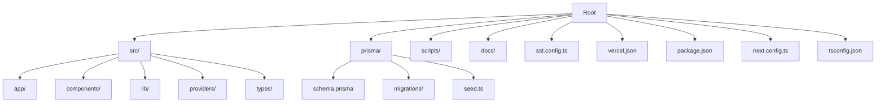
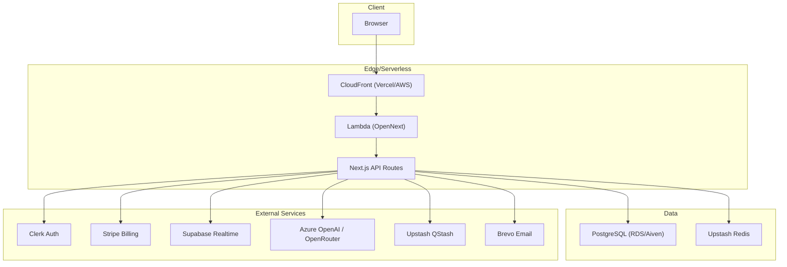
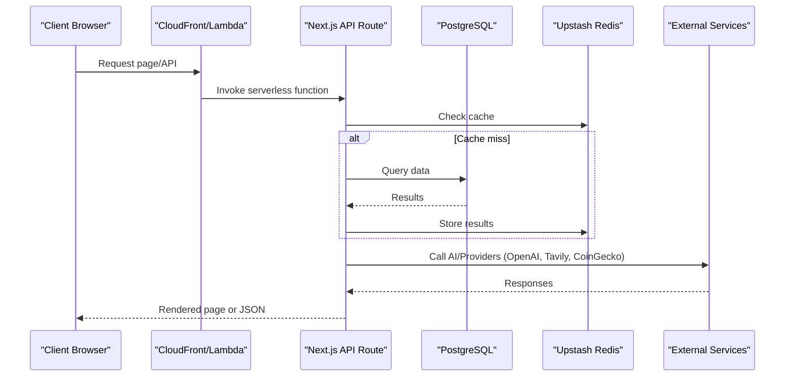
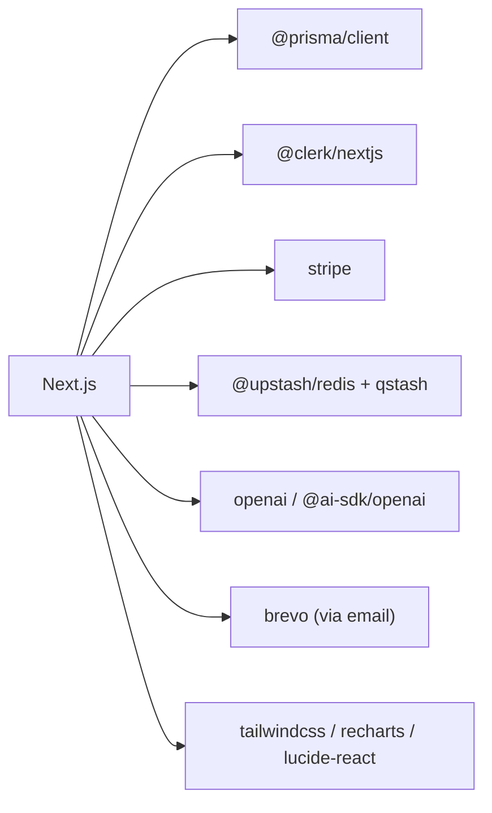

# Getting Started

<cite>
**Referenced Files in This Document**
- [README.md](file://README.md)
- [package.json](file://package.json)
- [next.config.ts](file://next.config.ts)
- [tsconfig.json](file://tsconfig.json)
- [prisma/schema.prisma](file://prisma/schema.prisma)
- [prisma/seed.ts](file://prisma/seed.ts)
- [scripts/bootstrap.ts](file://scripts/bootstrap.ts)
- [docs/ENV_SETUP.md](file://docs/ENV_SETUP.md)
- [docs/AWS_MIGRATION_GUIDE.md](file://docs/AWS_MIGRATION_GUIDE.md)
- [docs/production-deployment-checklist.md](file://docs/production-deployment-checklist.md)
- [vercel.json](file://vercel.json)
- [sst.config.ts](file://sst.config.ts)
- [src/lib/runtime-env.ts](file://src/lib/runtime-env.ts)
- [src/lib/config.ts](file://src/lib/config.ts)
</cite>

## Table of Contents
1. [Introduction](#introduction)
2. [Project Structure](#project-structure)
3. [Core Components](#core-components)
4. [Architecture Overview](#architecture-overview)
5. [Detailed Component Analysis](#detailed-component-analysis)
6. [Dependency Analysis](#dependency-analysis)
7. [Performance Considerations](#performance-considerations)
8. [Troubleshooting Guide](#troubleshooting-guide)
9. [Conclusion](#conclusion)
10. [Appendices](#appendices)

## Introduction
LyraAlpha is a Next.js financial intelligence platform focused on equities, crypto, commodities, portfolio analysis, and market research. It integrates AI agents, real-time data, and modern cloud infrastructure to deliver a robust analytics experience. This guide helps you set up the development environment, run the application locally, configure environment variables, and prepare for production deployments on Vercel or AWS.

## Project Structure
At a high level, the repository is a Next.js application with:
- Application code under src/
- Prisma schema and migrations under prisma/
- Scripts for bootstrapping and data synchronization under scripts/
- Documentation under docs/
- Infrastructure configuration for AWS via SST under sst.config.ts
- Build and deployment configuration for Vercel under vercel.json

**Diagram sources**
- [package.json:1-125](file://package.json#L1-L125)
- [next.config.ts:1-232](file://next.config.ts#L1-L232)
- [tsconfig.json:1-47](file://tsconfig.json#L1-L47)
- [prisma/schema.prisma:1-800](file://prisma/schema.prisma#L1-L800)
- [prisma/seed.ts:1-392](file://prisma/seed.ts#L1-L392)
- [sst.config.ts:1-166](file://sst.config.ts#L1-L166)
- [vercel.json:1-4](file://vercel.json#L1-L4)

**Section sources**
- [README.md:1-31](file://README.md#L1-L31)
- [package.json:1-125](file://package.json#L1-L125)
- [next.config.ts:1-232](file://next.config.ts#L1-L232)
- [tsconfig.json:1-47](file://tsconfig.json#L1-L47)

## Core Components
- Application runtime and routing: Next.js app under src/app/, with API routes under src/app/api/.
- Authentication and user management: Clerk integration for sign-in/sign-up, sessions, and webhooks.
- Database: PostgreSQL via Prisma ORM; schema defines models for assets, users, subscriptions, credits, and analytics.
- Real-time and chat: Supabase for live chat and frontend access.
- Caching and rate limiting: Upstash Redis for caching and rate limiting.
- Background jobs: Upstash QStash for scheduled tasks and retries.
- AI and embeddings: Azure OpenAI and OpenRouter integrations for Lyra and Myra.
- Payments: Stripe for checkout, subscriptions, and webhooks.
- Notifications: Brevo for email, VAPID for browser push notifications.
- Data providers: CoinGecko for crypto market data, Tavily for web search, NewsData for crypto news.

**Section sources**
- [docs/ENV_SETUP.md:1-173](file://docs/ENV_SETUP.md#L1-L173)
- [prisma/schema.prisma:1-800](file://prisma/schema.prisma#L1-L800)
- [src/lib/config.ts:1-83](file://src/lib/config.ts#L1-L83)

## Architecture Overview
The platform follows a modern cloud-native architecture:
- Frontend: Next.js App Router with server actions and API routes.
- Backend: Serverless functions (Vercel or AWS Lambda) serving API endpoints.
- Data plane: PostgreSQL for relational data, Upstash Redis for caching and rate limits.
- AI/ML: Azure OpenAI and OpenRouter for chat, embeddings, and research augmentation.
- Integrations: Clerk (auth), Stripe (billing), Supabase (realtime), Brevo (email), Upstash (QStash and Redis).

**Diagram sources**
- [docs/AWS_MIGRATION_GUIDE.md:1-440](file://docs/AWS_MIGRATION_GUIDE.md#L1-L440)
- [sst.config.ts:1-166](file://sst.config.ts#L1-L166)
- [docs/ENV_SETUP.md:1-173](file://docs/ENV_SETUP.md#L1-L173)

## Detailed Component Analysis

### Development Environment Requirements
- Node.js: The project targets Next.js 16 and TypeScript. Ensure Node.js meets the version requirements implied by the lockfile and dependencies.
- PostgreSQL: Required for the application database. The Prisma schema defines the schema and indexes.
- Prisma CLI: Used for migrations, seeding, and schema management.
- Optional: AWS CLI and SST for AWS deployment; Vercel CLI for Vercel deployments.

Verification steps:
- Confirm Node.js version satisfies Next.js and TypeScript requirements.
- Confirm PostgreSQL is reachable and pgvector extension is enabled for vector embeddings.
- Verify Prisma CLI availability and that DATABASE_URL/DIRECT_URL are configured.

**Section sources**
- [package.json:1-125](file://package.json#L1-L125)
- [prisma/schema.prisma:1-800](file://prisma/schema.prisma#L1-L800)
- [docs/AWS_MIGRATION_GUIDE.md:18-34](file://docs/AWS_MIGRATION_GUIDE.md#L18-L34)

### Environment Variables
Set the following environment variables for local development and production. Refer to the environment setup guide for the complete list and production-specific notes.

Core variables (local):
- NEXT_PUBLIC_APP_URL
- DATABASE_URL
- DIRECT_URL
- NEXT_PUBLIC_CLERK_PUBLISHABLE_KEY
- CLERK_SECRET_KEY
- CLERK_WEBHOOK_SECRET
- NEXT_PUBLIC_CLERK_SIGN_IN_URL
- NEXT_PUBLIC_CLERK_SIGN_UP_URL
- STRIPE_SECRET_KEY
- NEXT_PUBLIC_STRIPE_PUBLISHABLE_KEY
- STRIPE_WEBHOOK_SECRET
- STRIPE_PRO_PRICE_ID
- STRIPE_ELITE_PRICE_ID
- UPSTASH_REDIS_REST_URL
- UPSTASH_REDIS_REST_TOKEN
- QSTASH_TOKEN
- QSTASH_CURRENT_SIGNING_KEY
- QSTASH_NEXT_SIGNING_KEY
- CRON_SECRET
- NEXT_PUBLIC_SUPABASE_URL
- NEXT_PUBLIC_SUPABASE_ANON_KEY
- OPENAI_API_KEY
- AZURE_OPENAI_API_KEY
- AZURE_OPENAI_ENDPOINT
- AZURE_OPENAI_CHAT_DEPLOYMENT
- AZURE_OPENAI_EMBEDDING_DEPLOYMENT
- AZURE_OPENAI_DEPLOYMENT_LYRA_FULL
- AZURE_OPENAI_DEPLOYMENT_LYRA_MINI
- AZURE_OPENAI_DEPLOYMENT_LYRA_NANO
- AZURE_OPENAI_DEPLOYMENT_MYRA
- AZURE_OPENAI_DEPLOYMENT_VOICE
- NEXT_PUBLIC_VAPID_PUBLIC_KEY
- VAPID_PRIVATE_KEY
- VAPID_EMAIL
- BREVO_API_KEY
- BREVO_SENDER_EMAIL
- BREVO_SENDER_NAME
- BREVO_ONBOARDING_LIST_ID
- BREVO_BLOG_LIST_ID
- COINGECKO_API_KEY
- NEWSDATA_API_KEY
- TAVILY_API_KEY

Runtime flags (optional):
- SKIP_AUTH
- SKIP_RATE_LIMIT
- ENABLE_LEGACY_YAHOO_INTELLIGENCE
- ENABLE_EDU_CACHE
- ENABLE_TRENDING_FALLBACK

**Section sources**
- [docs/ENV_SETUP.md:1-173](file://docs/ENV_SETUP.md#L1-L173)
- [src/lib/runtime-env.ts:1-59](file://src/lib/runtime-env.ts#L1-L59)

### Installation and Initial Setup
1. Install dependencies
   - Run the standard install command to fetch all dependencies.

2. Configure environment variables
   - Copy the template to .env and populate required variables as per the environment setup guide.

3. Prepare the database
   - Generate Prisma client and apply migrations.
   - Seed the database with sectors, assets, trending questions, and blog posts.

4. Start the development server
   - Launch the Next.js dev server and open the application in your browser.

Verification:
- Confirm the dashboard loads and Clerk authentication is active.
- Verify seeded assets and sectors are visible in discovery and portfolio views.

**Section sources**
- [README.md:10-27](file://README.md#L10-L27)
- [package.json:5-30](file://package.json#L5-L30)
- [prisma/seed.ts:1-392](file://prisma/seed.ts#L1-L392)

### Local Development Workflow
- Run the dev server locally.
- Access the application at the configured port.
- Use the provided scripts for building, testing, linting, and type checking.

Optional bootstrap script:
- Use the bootstrap script to seed the database, run a full crypto market sync, and compute analytics.

**Section sources**
- [README.md:10-27](file://README.md#L10-L27)
- [scripts/bootstrap.ts:1-118](file://scripts/bootstrap.ts#L1-L118)

### Running the Application
- Development: Start the Next.js dev server and navigate to the local URL.
- Production build: Build the application and start the production server.
- Testing: Run the test suite with Vitest.

**Section sources**
- [README.md:19-27](file://README.md#L19-L27)
- [package.json:5-30](file://package.json#L5-L30)

### Accessing Environments
- Local development: http://localhost:3000
- Production (Vercel): The project is configured for Vercel with the project name “lyraalpha”.
- AWS (SST): Deploy via SST to AWS Lambda and CloudFront; use the provided configuration and migration guide.

**Section sources**
- [README.md:28-31](file://README.md#L28-L31)
- [vercel.json:1-4](file://vercel.json#L1-4)
- [sst.config.ts:1-166](file://sst.config.ts#L1-L166)

### Production Deployment Configurations

#### Vercel Deployment
- Build command is configured to use the standard build script.
- Ensure all production environment variables are set in the Vercel project.
- Verify Clerk, Stripe, Supabase, and Upstash credentials are correct and not exposed.

**Section sources**
- [vercel.json:1-4](file://vercel.json#L1-4)
- [docs/production-deployment-checklist.md:23-94](file://docs/production-deployment-checklist.md#L23-L94)

#### AWS Deployment (SST/OpenNext)
- Use SST to provision Lambda, CloudFront, RDS, and Upstash resources.
- Migrate database from Supabase to RDS and enable pgvector.
- Set secrets via SST and deploy staging and production stacks.
- Configure EventBridge Scheduler to invoke cron endpoints.

**Section sources**
- [docs/AWS_MIGRATION_GUIDE.md:1-440](file://docs/AWS_MIGRATION_GUIDE.md#L1-L440)
- [sst.config.ts:1-166](file://sst.config.ts#L1-L166)

### API and Data Flow (Conceptual)

[No sources needed since this diagram shows conceptual workflow, not actual code structure]

## Dependency Analysis
- Next.js and React: Core framework and UI library.
- Prisma: Database ORM with PostgreSQL adapter.
- Clerk: Authentication and user management.
- Stripe: Billing and subscriptions.
- Supabase: Realtime and anonymous access.
- Upstash: Redis and QStash.
- OpenAI/Azure OpenAI: AI and embeddings.
- Brevo: Email notifications.
- Playwright/Vitest: E2E and unit testing.

**Diagram sources**
- [package.json:31-94](file://package.json#L31-L94)

**Section sources**
- [package.json:1-125](file://package.json#L1-L125)

## Performance Considerations
- Use Upstash Redis for caching and rate limiting to reduce database load.
- Enable appropriate cache headers for API routes and static assets.
- Optimize database queries with indexes defined in the Prisma schema.
- Use server actions and streaming where appropriate for AI responses.
- Monitor Lambda and RDS metrics in AWS; adjust timeouts and memory as needed.

[No sources needed since this section provides general guidance]

## Troubleshooting Guide
Common setup issues and resolutions:
- Missing environment variables
  - Ensure all required variables are set in .env and loaded by the runtime.
  - Use the environment setup guide to validate required keys.

- Database connection failures
  - Verify DATABASE_URL and DIRECT_URL point to a reachable PostgreSQL instance.
  - Confirm pgvector is enabled on RDS if migrating from Supabase.

- Authentication not working
  - Check Clerk publishable and secret keys and webhook secrets.
  - Ensure redirect URLs are correct for local development.

- Stripe webhooks not received
  - Confirm webhook URLs and secrets match the deployed environment.
  - Verify return URLs resolve from NEXT_PUBLIC_APP_URL or request origin.

- Redis/QStash misconfiguration
  - Validate REST URL and tokens; ensure malformed values fail gracefully.
  - Reconfigure cron schedules if changed.

- Production hardening
  - Disable auth and rate limit bypass flags in production.
  - Validate all environment variables in Vercel or SST.

**Section sources**
- [docs/ENV_SETUP.md:1-173](file://docs/ENV_SETUP.md#L1-L173)
- [docs/production-deployment-checklist.md:11-114](file://docs/production-deployment-checklist.md#L11-L114)
- [src/lib/runtime-env.ts:1-59](file://src/lib/runtime-env.ts#L1-L59)

## Conclusion
You now have the essentials to set up LyraAlpha locally, configure environment variables, seed the database, and run the development server. For production, choose Vercel or AWS (SST/OpenNext) based on your infrastructure preferences, and follow the deployment checklists to ensure a secure and reliable rollout.

[No sources needed since this section summarizes without analyzing specific files]

## Appendices

### Appendix A: Environment Variable Reference
- Core: NEXT_PUBLIC_APP_URL, DATABASE_URL, DIRECT_URL, NEXT_PUBLIC_CLERK_PUBLISHABLE_KEY, CLERK_SECRET_KEY, CLERK_WEBHOOK_SECRET, STRIPE_SECRET_KEY, STRIPE_WEBHOOK_SECRET, STRIPE_PRO_PRICE_ID, STRIPE_ELITE_PRICE_ID, NEXT_PUBLIC_SUPABASE_URL, NEXT_PUBLIC_SUPABASE_ANON_KEY, UPSTASH_REDIS_REST_URL, UPSTASH_REDIS_REST_TOKEN, QSTASH_TOKEN, QSTASH_CURRENT_SIGNING_KEY, QSTASH_NEXT_SIGNING_KEY, CRON_SECRET
- AI/Providers: OPENAI_API_KEY, AZURE_OPENAI_API_KEY, AZURE_OPENAI_ENDPOINT, AZURE_OPENAI_CHAT_DEPLOYMENT, AZURE_OPENAI_EMBEDDING_DEPLOYMENT, AZURE_OPENAI_DEPLOYMENT_LYRA_FULL, AZURE_OPENAI_DEPLOYMENT_LYRA_MINI, AZURE_OPENAI_DEPLOYMENT_LYRA_NANO, AZURE_OPENAI_DEPLOYMENT_MYRA, AZURE_OPENAI_DEPLOYMENT_VOICE, TAVILY_API_KEY, COINGECKO_API_KEY, NEWSDATA_API_KEY
- Notifications: NEXT_PUBLIC_VAPID_PUBLIC_KEY, VAPID_PRIVATE_KEY, VAPID_EMAIL, BREVO_API_KEY, BREVO_SENDER_EMAIL, BREVO_SENDER_NAME, BREVO_ONBOARDING_LIST_ID, BREVO_BLOG_LIST_ID
- Runtime flags: SKIP_AUTH, SKIP_RATE_LIMIT, ENABLE_LEGACY_YAHOO_INTELLIGENCE, ENABLE_EDU_CACHE, ENABLE_TRENDING_FALLBACK

**Section sources**
- [docs/ENV_SETUP.md:1-173](file://docs/ENV_SETUP.md#L1-L173)

### Appendix B: Next.js and Build Configuration
- Next.js configuration includes security headers, image remote patterns, server actions allowed origins, and cache headers.
- TypeScript configuration enforces strict typing and path aliases.

**Section sources**
- [next.config.ts:1-232](file://next.config.ts#L1-L232)
- [tsconfig.json:1-47](file://tsconfig.json#L1-L47)