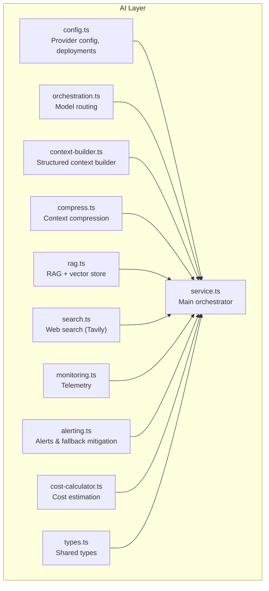
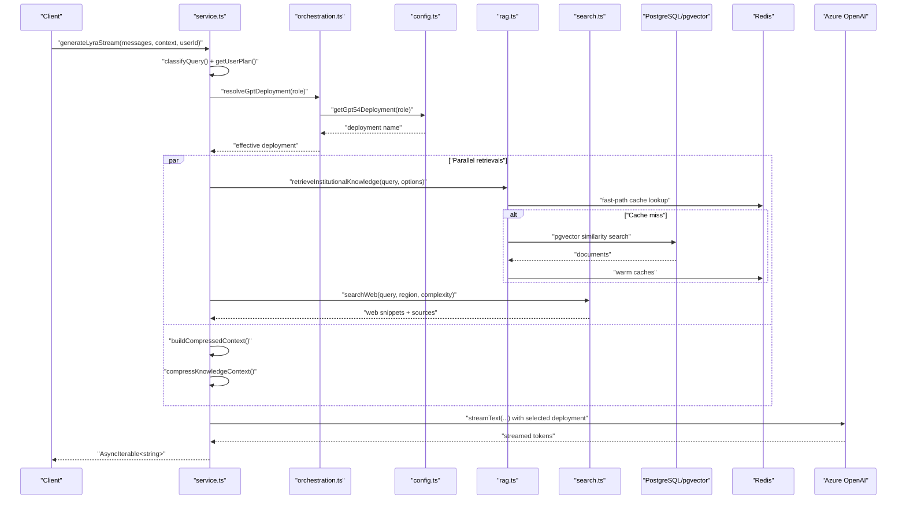
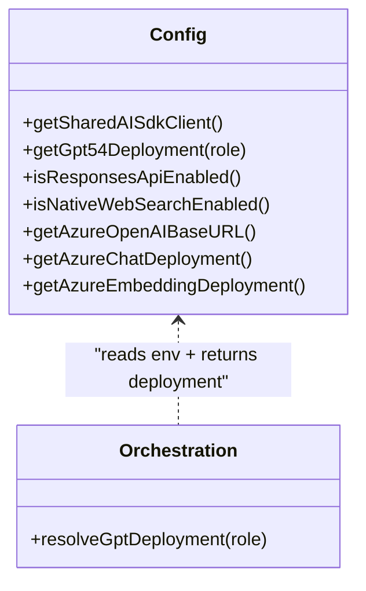
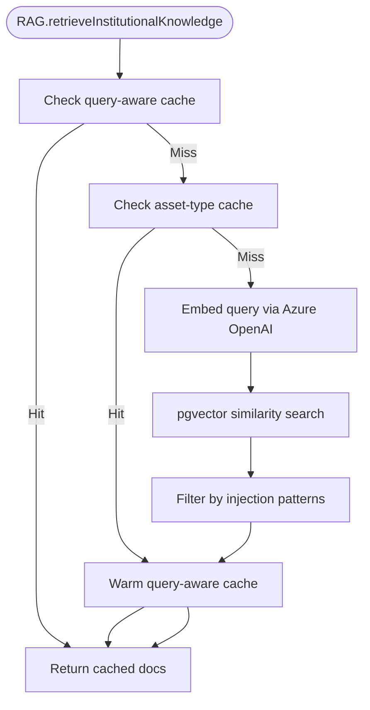
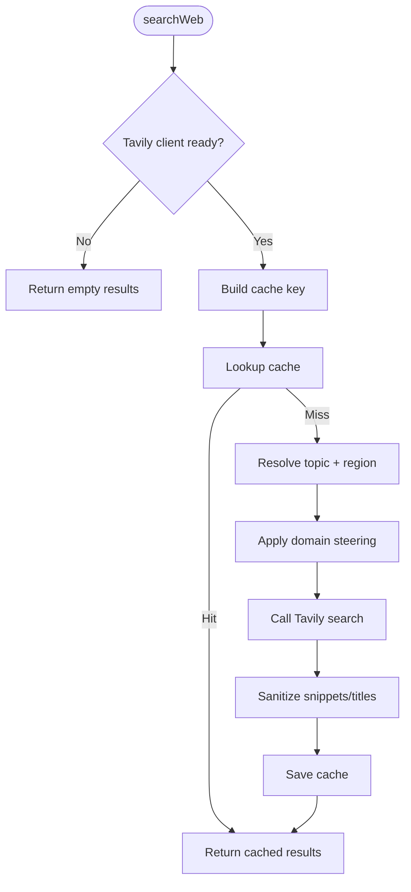
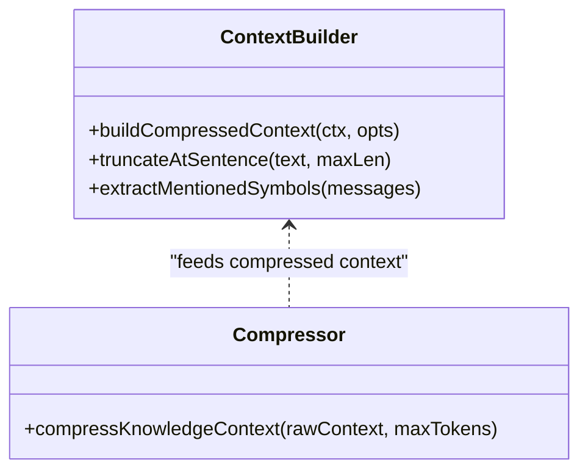
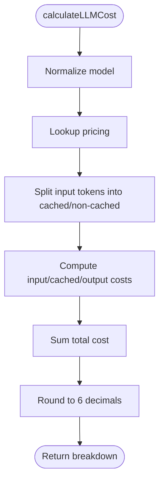
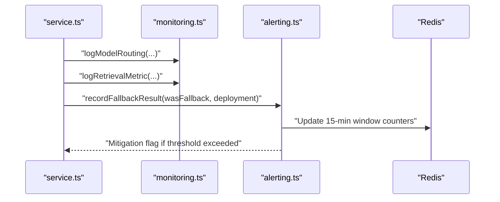
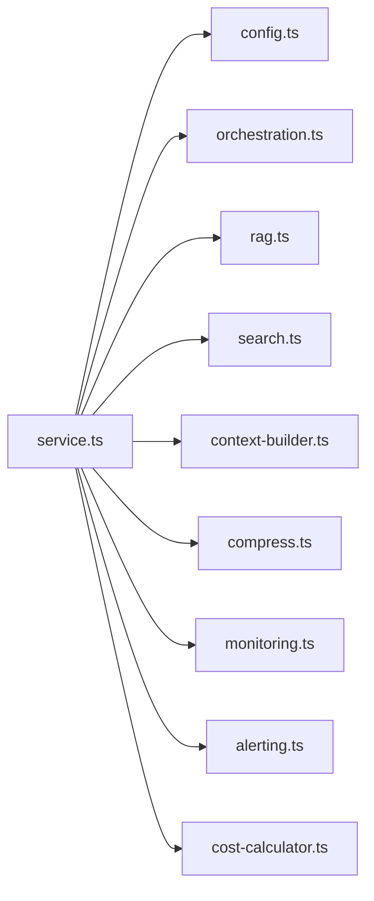

# AI Providers & Services

<cite>
**Referenced Files in This Document**
- [service.ts](file://src/lib/ai/service.ts)
- [config.ts](file://src/lib/ai/config.ts)
- [rag.ts](file://src/lib/ai/rag.ts)
- [search.ts](file://src/lib/ai/search.ts)
- [context-builder.ts](file://src/lib/ai/context-builder.ts)
- [compress.ts](file://src/lib/ai/compress.ts)
- [monitoring.ts](file://src/lib/ai/monitoring.ts)
- [alerting.ts](file://src/lib/ai/alerting.ts)
- [cost-calculator.ts](file://src/lib/ai/cost-calculator.ts)
- [types.ts](file://src/lib/ai/types.ts)
- [orchestration.ts](file://src/lib/ai/orchestration.ts)
- [ai-responder.ts](file://src/lib/support/ai-responder.ts)
</cite>

## Table of Contents
1. [Introduction](#introduction)
2. [Project Structure](#project-structure)
3. [Core Components](#core-components)
4. [Architecture Overview](#architecture-overview)
5. [Detailed Component Analysis](#detailed-component-analysis)
6. [Dependency Analysis](#dependency-analysis)
7. [Performance Considerations](#performance-considerations)
8. [Troubleshooting Guide](#troubleshooting-guide)
9. [Conclusion](#conclusion)

## Introduction
This document describes the AI service integrations in LyraAlpha, focusing on the AI provider abstraction layer, RAG (Retrieval-Augmented Generation) implementation, vector embeddings management, and semantic search capabilities. It explains provider configuration, API key management, rate limiting, cost optimization strategies, error handling patterns, and performance monitoring. It also documents the AI service factory pattern, provider switching logic, and fallback strategies for high availability.

## Project Structure
The AI subsystem is organized around a modular architecture:
- Provider abstraction and configuration
- RAG and vector store management
- Web search integration
- Context building and compression
- Cost calculation and monitoring
- Alerting and fallback mitigation
- Support KB search optimization

**Diagram sources**
- [config.ts:1-389](file://src/lib/ai/config.ts#L1-L389)
- [service.ts:1-800](file://src/lib/ai/service.ts#L1-L800)
- [context-builder.ts:1-824](file://src/lib/ai/context-builder.ts#L1-L824)
- [compress.ts:1-123](file://src/lib/ai/compress.ts#L1-L123)
- [rag.ts:1-1231](file://src/lib/ai/rag.ts#L1-L1231)
- [search.ts:1-337](file://src/lib/ai/search.ts#L1-L337)
- [monitoring.ts:1-127](file://src/lib/ai/monitoring.ts#L1-L127)
- [alerting.ts:1-477](file://src/lib/ai/alerting.ts#L1-L477)
- [cost-calculator.ts:1-313](file://src/lib/ai/cost-calculator.ts#L1-L313)
- [orchestration.ts:1-7](file://src/lib/ai/orchestration.ts#L1-L7)
- [types.ts:1-69](file://src/lib/ai/types.ts#L1-L69)

**Section sources**
- [config.ts:1-389](file://src/lib/ai/config.ts#L1-L389)
- [service.ts:1-800](file://src/lib/ai/service.ts#L1-L800)

## Core Components
- Provider abstraction and configuration: Centralized provider setup, deployment selection, and feature flags for Azure OpenAI.
- RAG engine: Vector store backed by PostgreSQL/pgvector, with Redis caching, fast-path warm caches, and robust embedding generation.
- Web search: Tavily integration with domain steering, regional targeting, and circuit breaker.
- Context builder: Structured, token-efficient context assembly with pruning and sentence-aware truncation.
- Compression: Fast, low-verbosity compression using a dedicated nano model with cache and injection filtering.
- Cost calculator: Tokenization and cost estimation for GPT-5.4 family and voice channels.
- Monitoring and alerting: Structured telemetry and alert thresholds with webhook delivery and automatic mitigation.

**Section sources**
- [config.ts:1-389](file://src/lib/ai/config.ts#L1-L389)
- [rag.ts:1-1231](file://src/lib/ai/rag.ts#L1-L1231)
- [search.ts:1-337](file://src/lib/ai/search.ts#L1-L337)
- [context-builder.ts:1-824](file://src/lib/ai/context-builder.ts#L1-L824)
- [compress.ts:1-123](file://src/lib/ai/compress.ts#L1-L123)
- [cost-calculator.ts:1-313](file://src/lib/ai/cost-calculator.ts#L1-L313)
- [monitoring.ts:1-127](file://src/lib/ai/monitoring.ts#L1-L127)
- [alerting.ts:1-477](file://src/lib/ai/alerting.ts#L1-L477)

## Architecture Overview
The AI service orchestrates multiple data sources and providers to produce a cost- and latency-optimized response. It classifies query complexity, resolves user plan and tier, selects appropriate model deployments, and conditionally augments responses with RAG, web search, memory, and cross-sector context.

**Diagram sources**
- [service.ts:383-800](file://src/lib/ai/service.ts#L383-L800)
- [orchestration.ts:1-7](file://src/lib/ai/orchestration.ts#L1-L7)
- [config.ts:33-56](file://src/lib/ai/config.ts#L33-L56)
- [rag.ts:1033-1093](file://src/lib/ai/rag.ts#L1033-L1093)
- [search.ts:170-337](file://src/lib/ai/search.ts#L170-L337)

## Detailed Component Analysis

### Provider Abstraction and Configuration
- Shared AI SDK client: A singleton AI SDK client is created once and reused across services to reduce connection overhead.
- Azure OpenAI configuration: Base URL and deployment names are derived from environment variables with graceful fallbacks.
- GPT-5.4 role-based routing: Multiple deployments enable role-specific routing (e.g., “lyra-full”, “lyra-mini”, “lyra-nano”, “myra”).
- Feature flags: Responses API and native web search toggles control provider capabilities.

**Diagram sources**
- [config.ts:16-122](file://src/lib/ai/config.ts#L16-L122)
- [orchestration.ts:1-7](file://src/lib/ai/orchestration.ts#L1-L7)

**Section sources**
- [config.ts:1-389](file://src/lib/ai/config.ts#L1-L389)
- [orchestration.ts:1-7](file://src/lib/ai/orchestration.ts#L1-L7)

### RAG Engine and Vector Embeddings
- Vector store: PostgreSQL with pgvector for similarity search; chunked knowledge base with metadata and embeddings.
- Embedding generation: Azure OpenAI embeddings with Redis caching for query vectors and batch processing for memory logs.
- Fast-path caching: Query-aware and asset-type caches to avoid embedding calls for repeated queries.
- Injection filtering: Post-retrieval filtering of retrieved chunks and memory snippets to prevent prompt injection.
- Hydration and warming: Background hydration of knowledge base and pre-warming of asset-type caches.

**Diagram sources**
- [rag.ts:676-823](file://src/lib/ai/rag.ts#L676-L823)
- [rag.ts:1033-1093](file://src/lib/ai/rag.ts#L1033-L1093)

**Section sources**
- [rag.ts:1-1231](file://src/lib/ai/rag.ts#L1-L1231)

### Web Search Integration
- Tavily client: Lazily initialized with API key; topic and region-aware search with domain steering for crypto-focused sources.
- Circuit breaker: Redis-backed counter to detect and degrade gracefully after consecutive failures.
- Cache: Deterministic cache key including region, topic hint, and query to avoid redundant calls.
- Sanitization: Snippet and title sanitization against injection patterns.

**Diagram sources**
- [search.ts:69-337](file://src/lib/ai/search.ts#L69-L337)

**Section sources**
- [search.ts:1-337](file://src/lib/ai/search.ts#L1-L337)

### Context Building and Compression
- Structured context builder: Produces a compact, token-efficient representation of assets, prices, regimes, signals, and optional enriched data.
- Sentence-aware truncation: Ensures clean cuts at sentence boundaries to preserve readability.
- Smart asset list: Curated subset of assets to reduce token usage and prevent hallucinations.
- Compression: Uses a dedicated nano model to compress raw context into dense bullet lists with cache and injection filtering.

**Diagram sources**
- [context-builder.ts:80-618](file://src/lib/ai/context-builder.ts#L80-L618)
- [compress.ts:46-123](file://src/lib/ai/compress.ts#L46-L123)

**Section sources**
- [context-builder.ts:1-824](file://src/lib/ai/context-builder.ts#L1-L824)
- [compress.ts:1-123](file://src/lib/ai/compress.ts#L1-L123)
- [types.ts:1-69](file://src/lib/ai/types.ts#L1-L69)

### Cost Calculation and Optimization
- Tokenization: Uses tiktoken encoders for accurate token counts; fallback estimation when encoding fails.
- Pricing: Model-specific pricing for GPT-5.4 family; cost breakdown includes cached input tokens.
- Voice costs: Dedicated pricing and estimation for gpt-realtime-mini audio/text tokens.
- Cost ceilings: Estimators and drift alerts to maintain budget alignment.

**Diagram sources**
- [cost-calculator.ts:293-313](file://src/lib/ai/cost-calculator.ts#L293-L313)

**Section sources**
- [cost-calculator.ts:1-313](file://src/lib/ai/cost-calculator.ts#L1-L313)

### Monitoring and Alerting
- Telemetry: Structured logging for model routing, cache events, retrieval metrics, and context budgets.
- Alerts: Threshold-based alerting for daily cost, RAG zero-result rate, web search outages, validation failures, fallback rate, latency violations, and cost estimation drift.
- Mitigation: Automatic fallback mitigation flag to switch to backup models when fallback rate exceeds a configured threshold.

**Diagram sources**
- [monitoring.ts:49-127](file://src/lib/ai/monitoring.ts#L49-L127)
- [alerting.ts:213-294](file://src/lib/ai/alerting.ts#L213-L294)

**Section sources**
- [monitoring.ts:1-127](file://src/lib/ai/monitoring.ts#L1-L127)
- [alerting.ts:1-477](file://src/lib/ai/alerting.ts#L1-L477)

### Support Knowledge Base Search (BM25)
- Small, static support KB uses BM25 full-text search to avoid embedding calls and achieve sub-10ms latency.
- Falls back to vector search when BM25 returns fewer than a threshold number of results.

**Section sources**
- [ai-responder.ts:243-277](file://src/lib/support/ai-responder.ts#L243-L277)

## Dependency Analysis
- Service orchestrates RAG, web search, context building, compression, and provider calls.
- Config and orchestration provide deployment selection and feature flags.
- Monitoring and alerting integrate across components to maintain reliability and cost control.

**Diagram sources**
- [service.ts:1-800](file://src/lib/ai/service.ts#L1-L800)
- [config.ts:1-389](file://src/lib/ai/config.ts#L1-L389)
- [orchestration.ts:1-7](file://src/lib/ai/orchestration.ts#L1-L7)
- [rag.ts:1-1231](file://src/lib/ai/rag.ts#L1-L1231)
- [search.ts:1-337](file://src/lib/ai/search.ts#L1-L337)
- [context-builder.ts:1-824](file://src/lib/ai/context-builder.ts#L1-L824)
- [compress.ts:1-123](file://src/lib/ai/compress.ts#L1-L123)
- [monitoring.ts:1-127](file://src/lib/ai/monitoring.ts#L1-L127)
- [alerting.ts:1-477](file://src/lib/ai/alerting.ts#L1-L477)
- [cost-calculator.ts:1-313](file://src/lib/ai/cost-calculator.ts#L1-L313)

**Section sources**
- [service.ts:1-800](file://src/lib/ai/service.ts#L1-L800)

## Performance Considerations
- Parallel retrievals: RAG, web search, and asset enrichment are executed concurrently to minimize latency.
- Caching: Redis caches for embeddings, fast-path chunks, asset-type caches, and compression outputs reduce redundant calls.
- Early exits: Trivial queries, early model cache hits, and educational cache hits return immediately.
- Compression: Low-verbosity compression reduces context size and token usage.
- Budget-awareness: Tiered routing, max output token caps, and daily token caps control cost and latency.
- Circuit breakers and fallbacks: Degradation strategies protect availability during provider outages.

[No sources needed since this section provides general guidance]

## Troubleshooting Guide
- Provider configuration errors: Verify Azure OpenAI endpoint, API key, and deployment names; ensure graceful fallbacks are configured.
- RAG failures: Check embedding API connectivity, vector dimension/format, and pgvector similarity thresholds; review low-grounding alerts.
- Web search outages: Inspect circuit breaker state and domain steering; confirm Tavily API key and regional domains.
- Cost overruns: Review daily token caps, tier configurations, and cost estimation drift alerts.
- Fallback mitigation: When fallback rate exceeds threshold, mitigation flag triggers backup model selection; investigate root causes.
- Logging and telemetry: Use structured logs emitted by monitoring/alerting modules to diagnose routing, retrieval, and latency issues.

**Section sources**
- [config.ts:64-122](file://src/lib/ai/config.ts#L64-L122)
- [rag.ts:389-412](file://src/lib/ai/rag.ts#L389-L412)
- [search.ts:19-337](file://src/lib/ai/search.ts#L19-L337)
- [alerting.ts:213-294](file://src/lib/ai/alerting.ts#L213-L294)
- [monitoring.ts:49-127](file://src/lib/ai/monitoring.ts#L49-L127)

## Conclusion
LyraAlpha’s AI services combine a robust provider abstraction, efficient RAG with vector embeddings, intelligent web search, and comprehensive cost and performance controls. The system emphasizes high availability through caching, fallbacks, and alerting, while maintaining strict cost and latency budgets via tiered routing and monitoring.