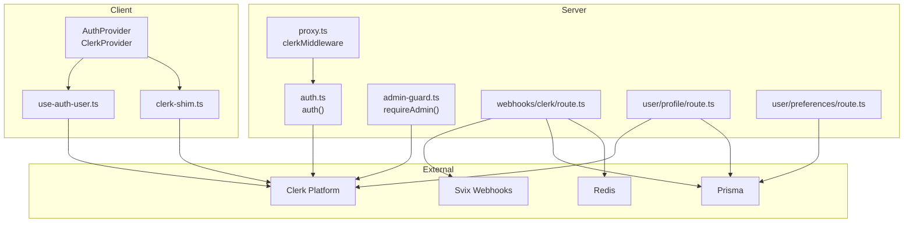
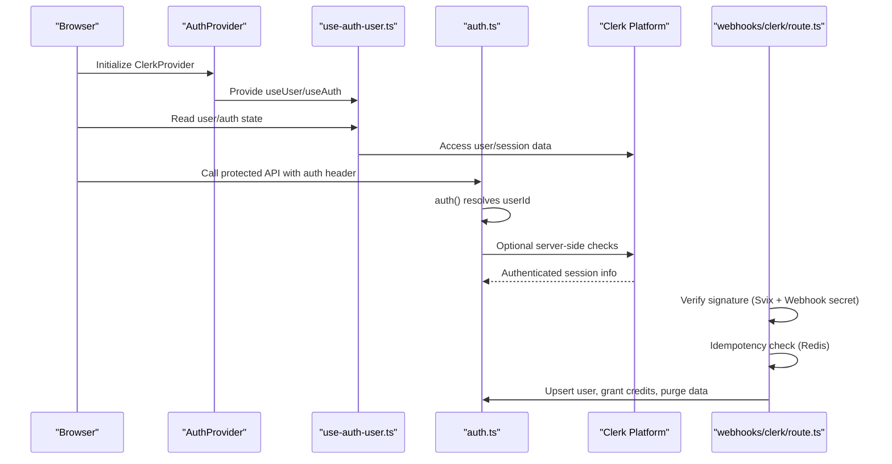
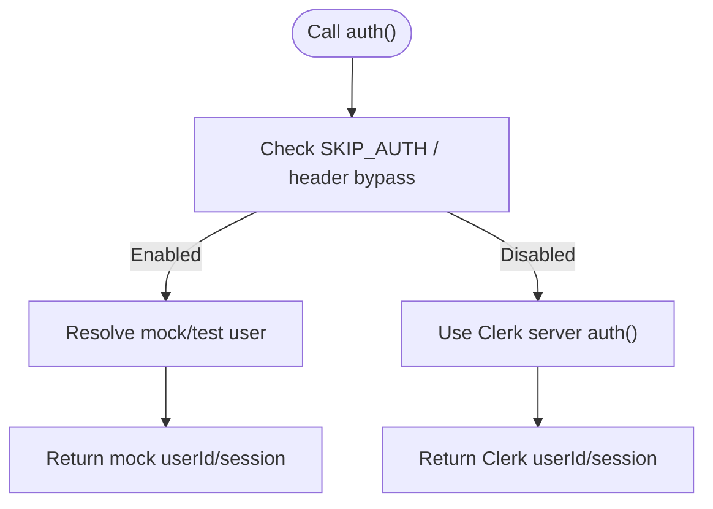
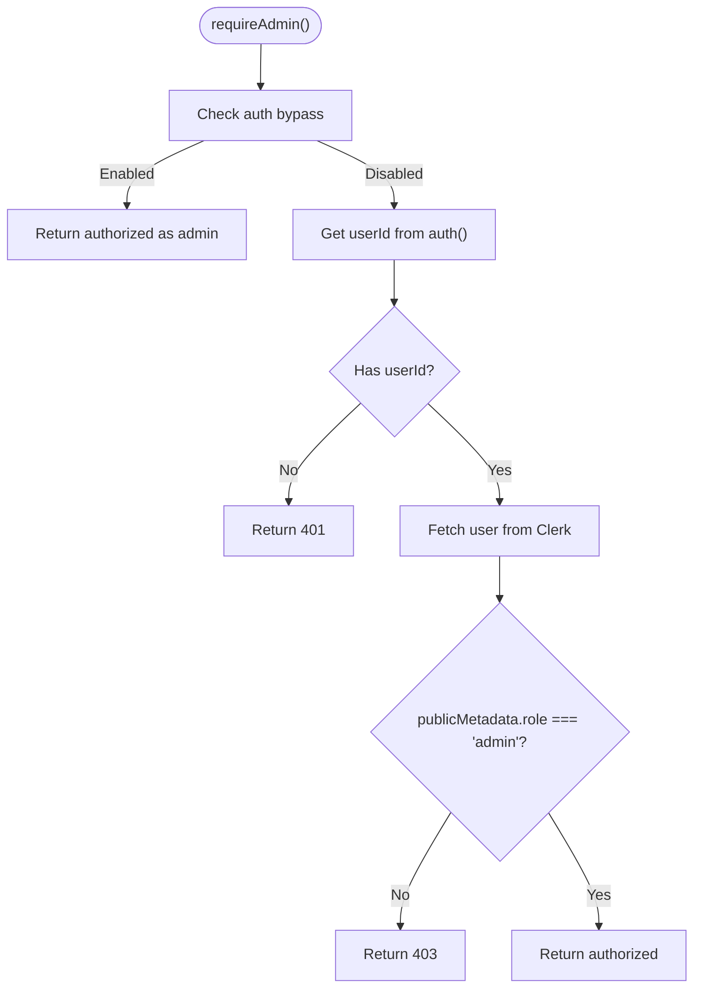
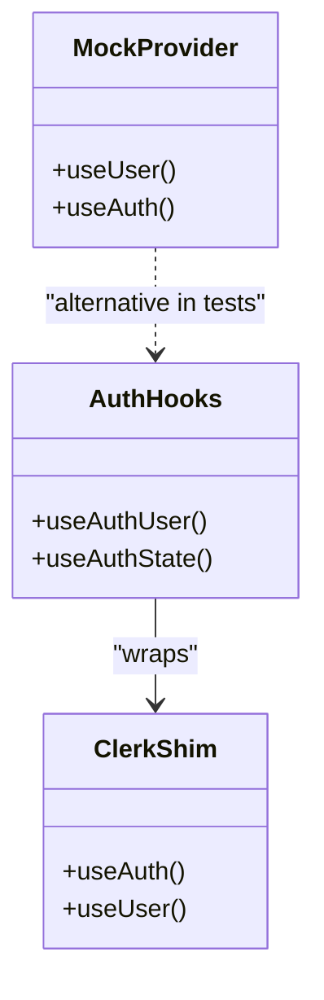
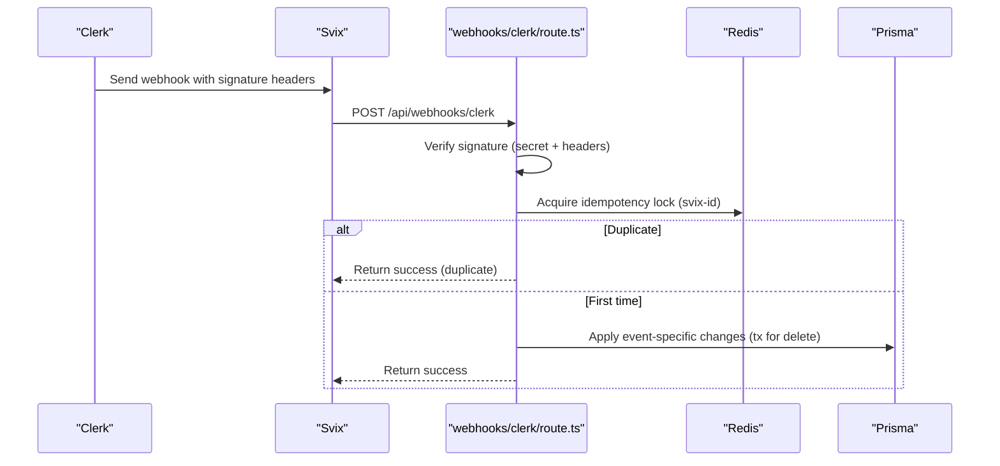
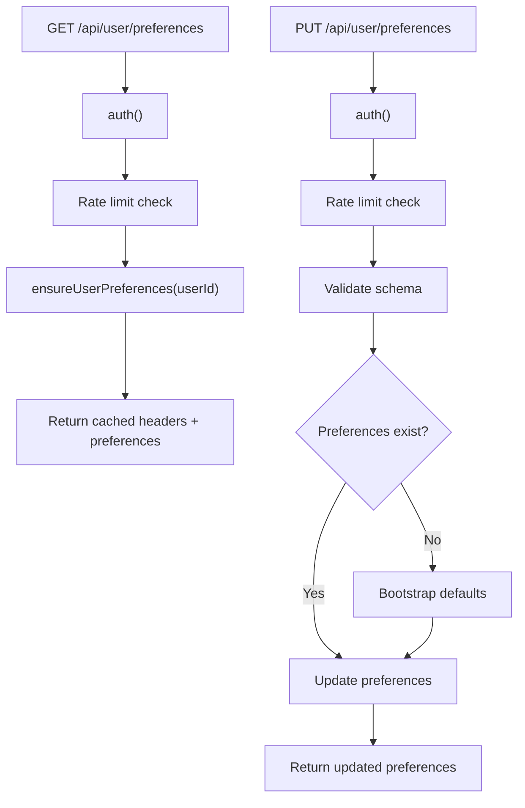
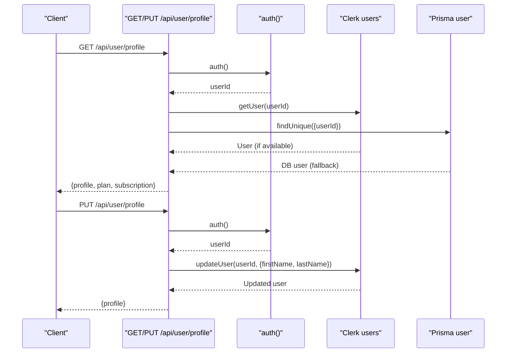

# Authentication Integrations

<cite>
**Referenced Files in This Document**
- [src/lib/auth.ts](file://src/lib/auth.ts)
- [src/lib/middleware/admin-guard.ts](file://src/lib/middleware/admin-guard.ts)
- [src/lib/runtime-env.ts](file://src/lib/runtime-env.ts)
- [src/lib/clerk-shim.ts](file://src/lib/clerk-shim.ts)
- [src/hooks/use-auth-user.ts](file://src/hooks/use-auth-user.ts)
- [src/providers/auth-provider.tsx](file://src/providers/auth-provider.tsx)
- [src/providers/mock-clerk-provider.tsx](file://src/providers/mock-clerk-provider.tsx)
- [src/app/api/webhooks/clerk/route.ts](file://src/app/api/webhooks/clerk/route.ts)
- [src/app/api/user/preferences/route.ts](file://src/app/api/user/preferences/route.ts)
- [src/app/api/user/profile/route.ts](file://src/app/api/user/profile/route.ts)
- [src/app/api/webhooks/clerk/route.test.ts](file://src/app/api/webhooks/clerk/route.test.ts)
- [src/app/dashboard/settings/page.tsx](file://src/app/dashboard/settings/page.tsx)
- [src/proxy.ts](file://src/proxy.ts)
- [package-lock.json](file://package-lock.json)
</cite>

## Table of Contents
1. [Introduction](#introduction)
2. [Project Structure](#project-structure)
3. [Core Components](#core-components)
4. [Architecture Overview](#architecture-overview)
5. [Detailed Component Analysis](#detailed-component-analysis)
6. [Dependency Analysis](#dependency-analysis)
7. [Performance Considerations](#performance-considerations)
8. [Troubleshooting Guide](#troubleshooting-guide)
9. [Conclusion](#conclusion)
10. [Appendices](#appendices)

## Introduction
This document explains how the application integrates Clerk identity platform for authentication and user lifecycle management. It covers server-side session validation, client-side authentication state management, role-based access control, and webhook processing for user creation, updates, deletion, and authentication events. It also documents configuration requirements, environment setup, security considerations for authentication tokens, user preference synchronization, profile management, multi-factor authentication setup, guest user patterns, social login providers, enterprise SSO, troubleshooting, session debugging, and security best practices.

## Project Structure
Authentication and identity-related logic is organized across server middleware, API routes, client hooks, providers, and webhooks:
- Server session and auth helpers: [src/lib/auth.ts](file://src/lib/auth.ts), [src/lib/middleware/admin-guard.ts](file://src/lib/middleware/admin-guard.ts), [src/lib/runtime-env.ts](file://src/lib/runtime-env.ts)
- Client authentication state: [src/hooks/use-auth-user.ts](file://src/hooks/use-auth-user.ts), [src/lib/clerk-shim.ts](file://src/lib/clerk-shim.ts), [src/providers/auth-provider.tsx](file://src/providers/auth-provider.tsx), [src/providers/mock-clerk-provider.tsx](file://src/providers/mock-clerk-provider.tsx)
- Webhooks: [src/app/api/webhooks/clerk/route.ts](file://src/app/api/webhooks/clerk/route.ts)
- User APIs: [src/app/api/user/preferences/route.ts](file://src/app/api/user/preferences/route.ts), [src/app/api/user/profile/route.ts](file://src/app/api/user/profile/route.ts)
- Proxy/middleware: [src/proxy.ts](file://src/proxy.ts)
- Dependencies: [package-lock.json](file://package-lock.json)



**Diagram sources**
- [src/providers/auth-provider.tsx:1-11](file://src/providers/auth-provider.tsx#L1-L11)
- [src/hooks/use-auth-user.ts:1-69](file://src/hooks/use-auth-user.ts#L1-L69)
- [src/lib/clerk-shim.ts:1-33](file://src/lib/clerk-shim.ts#L1-L33)
- [src/proxy.ts:81-103](file://src/proxy.ts#L81-L103)
- [src/lib/auth.ts:32-89](file://src/lib/auth.ts#L32-L89)
- [src/lib/middleware/admin-guard.ts:17-55](file://src/lib/middleware/admin-guard.ts#L17-L55)
- [src/app/api/webhooks/clerk/route.ts:50-378](file://src/app/api/webhooks/clerk/route.ts#L50-L378)
- [src/app/api/user/profile/route.ts:16-128](file://src/app/api/user/profile/route.ts#L16-L128)
- [src/app/api/user/preferences/route.ts:25-119](file://src/app/api/user/preferences/route.ts#L25-L119)

**Section sources**
- [src/lib/auth.ts:1-89](file://src/lib/auth.ts#L1-L89)
- [src/lib/middleware/admin-guard.ts:1-56](file://src/lib/middleware/admin-guard.ts#L1-L56)
- [src/lib/runtime-env.ts:1-59](file://src/lib/runtime-env.ts#L1-L59)
- [src/lib/clerk-shim.ts:1-33](file://src/lib/clerk-shim.ts#L1-L33)
- [src/hooks/use-auth-user.ts:1-69](file://src/hooks/use-auth-user.ts#L1-L69)
- [src/providers/auth-provider.tsx:1-11](file://src/providers/auth-provider.tsx#L1-L11)
- [src/providers/mock-clerk-provider.tsx:1-81](file://src/providers/mock-clerk-provider.tsx#L1-L81)
- [src/app/api/webhooks/clerk/route.ts:1-379](file://src/app/api/webhooks/clerk/route.ts#L1-L379)
- [src/app/api/user/preferences/route.ts:1-119](file://src/app/api/user/preferences/route.ts#L1-L119)
- [src/app/api/user/profile/route.ts:1-128](file://src/app/api/user/profile/route.ts#L1-L128)
- [src/proxy.ts:81-103](file://src/proxy.ts#L81-L103)
- [package-lock.json:1214-1291](file://package-lock.json#L1214-L1291)

## Core Components
- Server session and auth helper: Provides memoized privileged email allowlist, auth bypass logic, and a unified auth() function that returns either a mocked identity during development or Clerk’s server auth.
- Admin guard: Enforces role-based access control by checking Clerk user public metadata for admin role.
- Runtime environment: Controls auth and rate limit bypass flags and validates required environment variables.
- Client authentication hooks: Provide Clerk user and auth state with optional client-side bypass for local development.
- Clerk provider shim: Exposes Clerk primitives via a thin wrapper and custom hooks.
- Webhooks: Validates and processes Clerk user lifecycle events with idempotency, GDPR-compliant deletion, and plan caching invalidation.
- User APIs: Profile read/write and preferences read/write with rate limiting and Clerk-backed authoritative data.
- Proxy/middleware: Clerk middleware integration and CORS handling for API routes.

**Section sources**
- [src/lib/auth.ts:32-89](file://src/lib/auth.ts#L32-L89)
- [src/lib/middleware/admin-guard.ts:17-55](file://src/lib/middleware/admin-guard.ts#L17-L55)
- [src/lib/runtime-env.ts:15-31](file://src/lib/runtime-env.ts#L15-L31)
- [src/hooks/use-auth-user.ts:34-68](file://src/hooks/use-auth-user.ts#L34-L68)
- [src/lib/clerk-shim.ts:15-32](file://src/lib/clerk-shim.ts#L15-L32)
- [src/providers/auth-provider.tsx:5-10](file://src/providers/auth-provider.tsx#L5-L10)
- [src/app/api/webhooks/clerk/route.ts:50-378](file://src/app/api/webhooks/clerk/route.ts#L50-L378)
- [src/app/api/user/profile/route.ts:16-128](file://src/app/api/user/profile/route.ts#L16-L128)
- [src/app/api/user/preferences/route.ts:25-119](file://src/app/api/user/preferences/route.ts#L25-L119)
- [src/proxy.ts:81-103](file://src/proxy.ts#L81-L103)

## Architecture Overview
The system uses Clerk for authentication on both client and server. Server routes use a unified auth() function to resolve the current user, optionally bypassing auth in controlled environments. Clerk webhooks drive user lifecycle events with idempotency and GDPR-compliant deletion. Client-side hooks provide user and auth state with a development bypass. The proxy integrates Clerk middleware and handles CORS for API routes.



**Diagram sources**
- [src/providers/auth-provider.tsx:5-10](file://src/providers/auth-provider.tsx#L5-L10)
- [src/hooks/use-auth-user.ts:34-68](file://src/hooks/use-auth-user.ts#L34-L68)
- [src/lib/auth.ts:32-89](file://src/lib/auth.ts#L32-L89)
- [src/app/api/webhooks/clerk/route.ts:50-378](file://src/app/api/webhooks/clerk/route.ts#L50-L378)

## Detailed Component Analysis

### Server Session and Auth Helper
- Unified auth() function:
  - Supports auth bypass via environment flags and headers, with safeguards to prevent bypass on Vercel.
  - Resolves a deterministic test user or seeds a user by plan for E2E scenarios.
  - Returns Clerk server auth otherwise.
- Privileged email allowlist:
  - Memoized list of admin emails refreshed periodically.
  - Used by admin guard and webhook logic to determine admin status.



**Diagram sources**
- [src/lib/auth.ts:32-89](file://src/lib/auth.ts#L32-L89)
- [src/lib/runtime-env.ts:15-31](file://src/lib/runtime-env.ts#L15-L31)

**Section sources**
- [src/lib/auth.ts:32-89](file://src/lib/auth.ts#L32-L89)
- [src/lib/runtime-env.ts:15-31](file://src/lib/runtime-env.ts#L15-L31)

### Admin Guard (Role-Based Access Control)
- Enforces admin-only access by checking Clerk user public metadata for a specific role.
- Supports dev-mode bypass controlled by environment flags.
- Returns 401/403/500 depending on state and errors.



**Diagram sources**
- [src/lib/middleware/admin-guard.ts:17-55](file://src/lib/middleware/admin-guard.ts#L17-L55)

**Section sources**
- [src/lib/middleware/admin-guard.ts:17-55](file://src/lib/middleware/admin-guard.ts#L17-L55)

### Client-Side Authentication State Management
- useAuthUser/useAuthState wrap Clerk hooks with a client-side auth bypass for local development.
- A mock provider is available for testing and isolated environments.



**Diagram sources**
- [src/hooks/use-auth-user.ts:34-68](file://src/hooks/use-auth-user.ts#L34-L68)
- [src/providers/mock-clerk-provider.tsx:21-81](file://src/providers/mock-clerk-provider.tsx#L21-L81)
- [src/lib/clerk-shim.ts:15-32](file://src/lib/clerk-shim.ts#L15-L32)

**Section sources**
- [src/hooks/use-auth-user.ts:1-69](file://src/hooks/use-auth-user.ts#L1-L69)
- [src/providers/mock-clerk-provider.tsx:1-81](file://src/providers/mock-clerk-provider.tsx#L1-L81)
- [src/lib/clerk-shim.ts:1-33](file://src/lib/clerk-shim.ts#L1-L33)

### Clerk Webhook Processing
- Signature verification using Clerk webhook secret and Svix headers.
- Idempotency using Redis to prevent duplicate processing.
- Supported events:
  - user.created: Upsert user, grant sign-up bonus credits, upsert preferences, send welcome email.
  - user.updated: Upsert user, preserve ELITE plan for admins or existing ELITE users, grant sign-up bonus if missing.
  - user.deleted: GDPR-compliant anonymization and content purge via a transaction.
- Robust error handling: releases idempotency lock on failure to allow retries.



**Diagram sources**
- [src/app/api/webhooks/clerk/route.ts:50-378](file://src/app/api/webhooks/clerk/route.ts#L50-L378)

**Section sources**
- [src/app/api/webhooks/clerk/route.ts:40-92](file://src/app/api/webhooks/clerk/route.ts#L40-L92)
- [src/app/api/webhooks/clerk/route.ts:95-364](file://src/app/api/webhooks/clerk/route.ts#L95-L364)
- [src/app/api/webhooks/clerk/route.ts:370-375](file://src/app/api/webhooks/clerk/route.ts#L370-L375)

### User Preference Synchronization
- GET /api/user/preferences returns user preferences with caching headers and rate limiting.
- PUT /api/user/preferences validates input, ensures preferences exist, and updates fields while preserving onboarding timestamps.



**Diagram sources**
- [src/app/api/user/preferences/route.ts:25-119](file://src/app/api/user/preferences/route.ts#L25-L119)

**Section sources**
- [src/app/api/user/preferences/route.ts:25-119](file://src/app/api/user/preferences/route.ts#L25-L119)

### Profile Management
- GET /api/user/profile merges Clerk user data with database user data, with a fallback to DB for missing Clerk fields.
- PUT /api/user/profile updates Clerk user profile fields and returns the updated profile.



**Diagram sources**
- [src/app/api/user/profile/route.ts:16-128](file://src/app/api/user/profile/route.ts#L16-L128)

**Section sources**
- [src/app/api/user/profile/route.ts:16-128](file://src/app/api/user/profile/route.ts#L16-L128)

### Proxy and Middleware Integration
- Clerk middleware is integrated in the proxy to normalize local dev URLs, handle CORS preflight, and manage cookies for referral codes.

**Section sources**
- [src/proxy.ts:81-103](file://src/proxy.ts#L81-L103)

## Dependency Analysis
- Clerk SDK integration:
  - Client: @clerk/nextjs and @clerk/clerk-react are used via providers and hooks.
  - Server: @clerk/nextjs/server for server-side auth and user retrieval.
- Webhooks:
  - svix for signature verification and header parsing.
  - Zod for event schema validation.
- Persistence:
  - Prisma for user and preference operations.
  - Redis for webhook idempotency locks.

```mermaid
graph LR
Clerk["@clerk/nextjs (client/server)"] --> Hooks["use-auth-user.ts"]
Clerk --> Shim["clerk-shim.ts"]
Clerk --> Webhook["webhooks/clerk/route.ts"]
Prisma["Prisma"] <- --> Webhook
Redis["Redis"] <- --> Webhook
Zod["Zod"] <- --> Webhook
Svix["svix"] <- --> Webhook
```

**Diagram sources**
- [package-lock.json:1214-1291](file://package-lock.json#L1214-L1291)
- [src/app/api/webhooks/clerk/route.ts:1-15](file://src/app/api/webhooks/clerk/route.ts#L1-L15)

**Section sources**
- [package-lock.json:1214-1291](file://package-lock.json#L1214-L1291)
- [src/app/api/webhooks/clerk/route.ts:1-15](file://src/app/api/webhooks/clerk/route.ts#L1-L15)

## Performance Considerations
- Memoized admin allowlist refreshes periodically to avoid frequent environment reads.
- Webhook idempotency uses Redis with a 24-hour TTL to prevent duplicate processing while allowing retry windows.
- Transactional deletions in user deletion webhook reduce round-trips by parallelizing independent deletes.
- Rate limiting on user preferences and profile endpoints prevents abuse and reduces DB load.
- Caching headers on preferences endpoint improve client-side caching behavior.

[No sources needed since this section provides general guidance]

## Troubleshooting Guide
Common issues and resolutions:
- Missing or invalid webhook signature:
  - Ensure CLERK_WEBHOOK_SECRET is set and matches the Clerk webhook secret.
  - Verify Svix headers are present and forwarded.
- Duplicate webhook processing:
  - Idempotency lock keys are used; failures release the lock to allow retries.
- Admin access denied:
  - Confirm user’s public metadata role is set to admin in Clerk Dashboard.
- Auth bypass unexpectedly active:
  - Check SKIP_AUTH and header bypass flags; bypass is disabled on Vercel.
- Profile fetch fallback:
  - When Clerk profile fetch fails, DB fallback is used; verify DB user record.
- Client auth bypass:
  - Localhost with localStorage flag enables mock user; disable flag to test real auth.

**Section sources**
- [src/app/api/webhooks/clerk/route.ts:53-67](file://src/app/api/webhooks/clerk/route.ts#L53-L67)
- [src/app/api/webhooks/clerk/route.ts:89-92](file://src/app/api/webhooks/clerk/route.ts#L89-L92)
- [src/lib/middleware/admin-guard.ts:38-44](file://src/lib/middleware/admin-guard.ts#L38-L44)
- [src/lib/runtime-env.ts:15-31](file://src/lib/runtime-env.ts#L15-L31)
- [src/app/api/user/profile/route.ts:54-60](file://src/app/api/user/profile/route.ts#L54-L60)
- [src/hooks/use-auth-user.ts:16-32](file://src/hooks/use-auth-user.ts#L16-L32)

## Conclusion
The application integrates Clerk comprehensively for authentication, RBAC, and user lifecycle management. Server-side auth helpers and middleware provide secure, configurable access, while client hooks enable seamless user state handling. Webhooks ensure idempotent, GDPR-compliant user operations, and user APIs maintain synchronized preferences and profiles. The architecture balances security, performance, and developer experience with robust error handling and testing support.

[No sources needed since this section summarizes without analyzing specific files]

## Appendices

### Configuration Requirements and Environment Setup
- Required environment variables:
  - CLERK_WEBHOOK_SECRET: Clerk webhook secret for signature verification.
  - NEXT_PUBLIC_APP_URL: Application URL used for redirects and links.
  - ADMIN_EMAIL_ALLOWLIST: Comma-separated list of admin emails.
  - Optional:
    - SKIP_AUTH, SKIP_RATE_LIMIT: Enable auth and rate limit bypass in development.
    - LYRA_E2E_USER_ID: Deterministic test user ID for E2E.
    - LYRA_E2E_USER_PLAN: Seed a user by plan for E2E.
- Clerk provider configuration:
  - AuthProvider sets ClerkProvider with a local clerk.js URL and disables telemetry.

**Section sources**
- [src/app/api/webhooks/clerk/route.ts:51-56](file://src/app/api/webhooks/clerk/route.ts#L51-L56)
- [src/lib/runtime-env.ts:41-48](file://src/lib/runtime-env.ts#L41-L48)
- [src/lib/auth.ts:15-30](file://src/lib/auth.ts#L15-L30)
- [src/providers/auth-provider.tsx:7-8](file://src/providers/auth-provider.tsx#L7-L8)

### Security Considerations for Authentication Tokens
- Webhook verification:
  - Uses both Clerk webhook secret and Svix headers to verify authenticity.
- Idempotency:
  - Redis-based locks prevent duplicate processing and protect against retries.
- Admin guard:
  - Enforces role-based access using Clerk user metadata.
- Auth bypass:
  - Disabled on Vercel; enabled only in local dev or E2E contexts.

**Section sources**
- [src/app/api/webhooks/clerk/route.ts:70-84](file://src/app/api/webhooks/clerk/route.ts#L70-L84)
- [src/app/api/webhooks/clerk/route.ts:43-48](file://src/app/api/webhooks/clerk/route.ts#L43-L48)
- [src/lib/middleware/admin-guard.ts:21-24](file://src/lib/middleware/admin-guard.ts#L21-L24)
- [src/lib/runtime-env.ts:5-13](file://src/lib/runtime-env.ts#L5-L13)

### User Preference Synchronization and Profile Management
- Preferences:
  - Ensures existence, applies defaults, and updates fields while preserving onboarding timestamps.
- Profile:
  - Merges Clerk and DB data with fallback; updates Clerk fields via server SDK.

**Section sources**
- [src/app/api/user/preferences/route.ts:63-111](file://src/app/api/user/preferences/route.ts#L63-L111)
- [src/app/api/user/profile/route.ts:26-84](file://src/app/api/user/profile/route.ts#L26-L84)

### Multi-Factor Authentication and Enterprise SSO
- Multi-factor authentication:
  - Clerk supports MFA; integrate via Clerk dashboard and client components.
- Enterprise SSO:
  - Configure SSO providers in Clerk dashboard; client components handle sign-in flows.

[No sources needed since this section provides general guidance]

### Guest Users and Social Login Providers
- Guest users:
  - Use Clerk guest sign-in flows; enforce policies via server auth guards.
- Social login:
  - Enable providers in Clerk dashboard; client components render sign-in buttons.

[No sources needed since this section provides general guidance]

### Integration Patterns and Best Practices
- Use auth() consistently across server routes for session resolution.
- Prefer Clerk server SDK for sensitive operations; client hooks for UI state.
- Always verify webhook signatures and apply idempotency.
- Keep admin roles in Clerk user metadata; enforce via admin guard.
- Use rate limits on user-facing APIs; leverage caching headers where appropriate.

[No sources needed since this section provides general guidance]