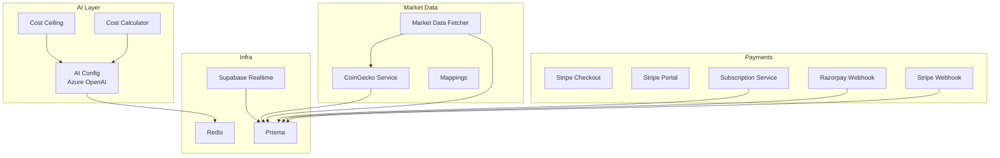
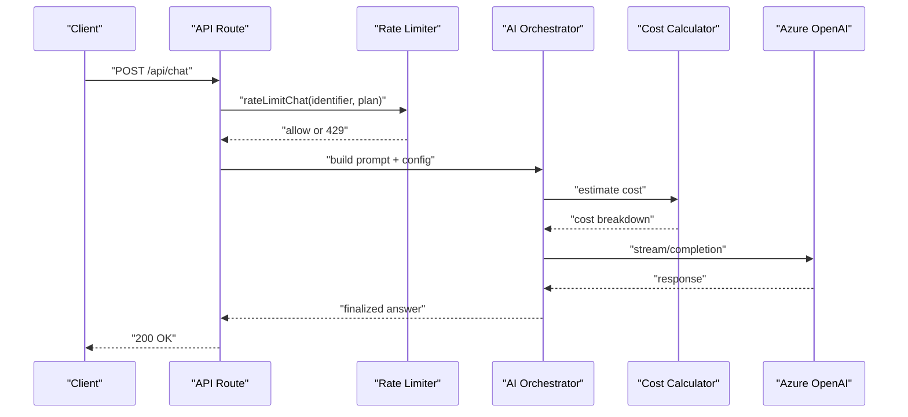
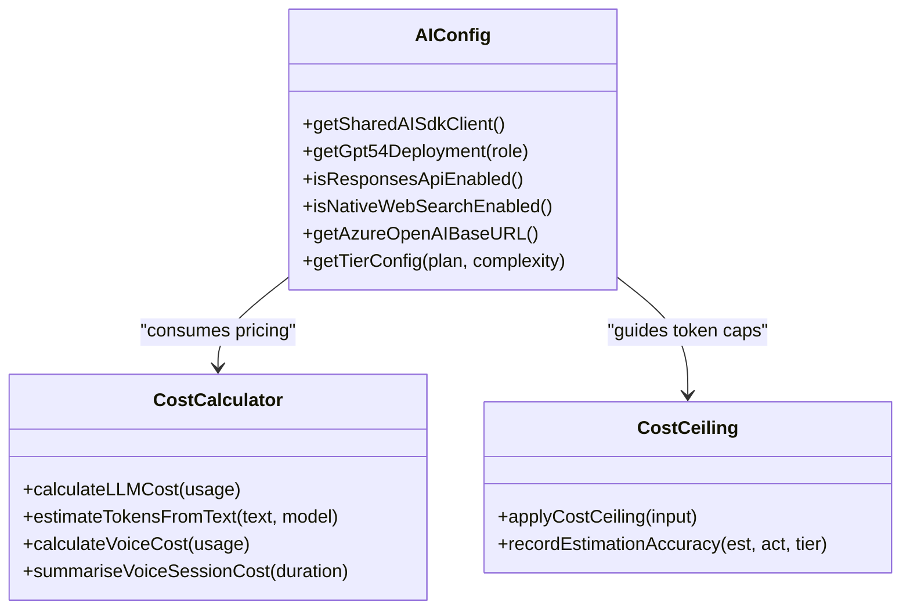
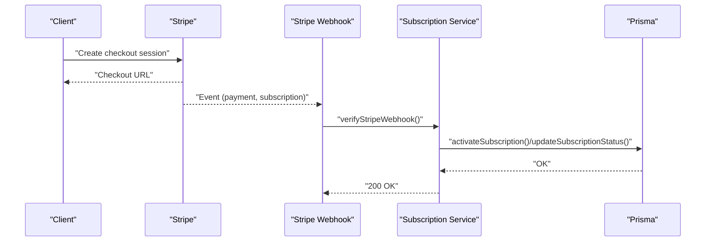
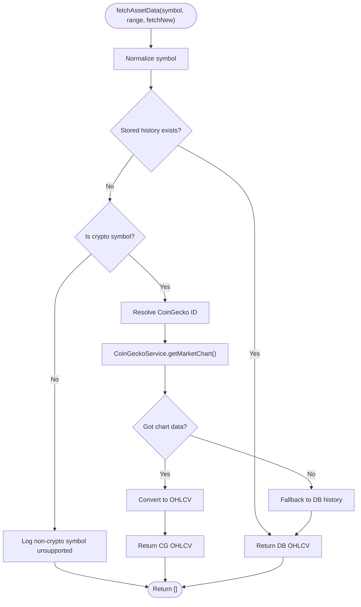
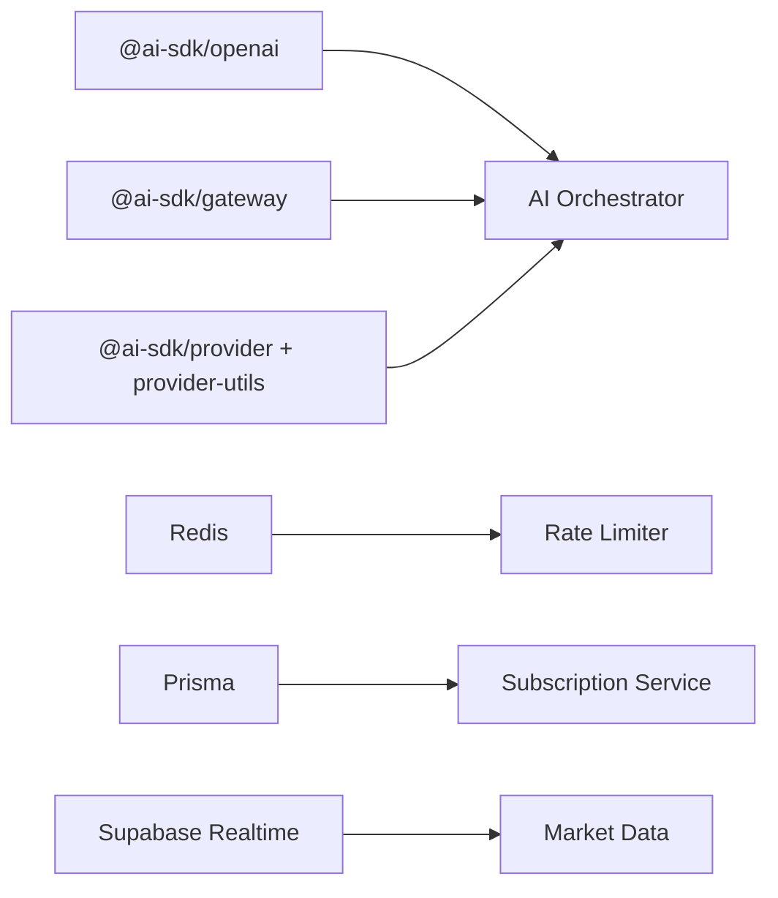

# Integrations & External APIs

<cite>
**Referenced Files in This Document**
- [src/lib/ai/config.ts](file://src/lib/ai/config.ts)
- [src/lib/ai/cost-calculator.ts](file://src/lib/ai/cost-calculator.ts)
- [src/lib/ai/cost-ceiling.ts](file://src/lib/ai/cost-ceiling.ts)
- [src/lib/rate-limit/index.ts](file://src/lib/rate-limit/index.ts)
- [src/lib/rate-limit/config.ts](file://src/lib/rate-limit/config.ts)
- [src/lib/rate-limit/errors.ts](file://src/lib/rate-limit/errors.ts)
- [src/lib/config.ts](file://src/lib/config.ts)
- [src/lib/market-data.ts](file://src/lib/market-data.ts)
- [src/lib/services/coingecko.service.ts](file://src/lib/services/coingecko.service.ts)
- [src/lib/services/coingecko-mapping.ts](file://src/lib/services/coingecko-mapping.ts)
- [src/lib/payments/subscription.service.ts](file://src/lib/payments/subscription.service.ts)
- [src/app/api/webhooks/stripe/route.ts](file://src/app/api/webhooks/stripe/route.ts)
- [src/app/api/webhooks/razorpay/route.ts](file://src/app/api/webhooks/razorpay/route.ts)
- [src/lib/payments/webhook-verify.ts](file://src/lib/payments/webhook-verify.ts)
- [src/app/api/stripe/checkout/route.ts](file://src/app/api/stripe/checkout/route.ts)
- [src/app/api/stripe/portal/route.ts](file://src/app/api/stripe/portal/route.ts)
- [src/app/api/stocks/[symbol]/analytics/route.ts](file://src/app/api/stocks/[symbol]/analytics/route.ts)
- [src/lib/supabase-realtime.ts](file://src/lib/supabase-realtime.ts)
- [src/lib/redis.ts](file://src/lib/redis.ts)
- [src/lib/prisma.ts](file://src/lib/prisma.ts)
- [src/lib/logger/index.ts](file://src/lib/logger/index.ts)
- [src/lib/telemetry.ts](file://src/lib/telemetry.ts)
- [src/lib/runtime-env.ts](file://src/lib/runtime-env.ts)
- [src/lib/api-response.ts](file://src/lib/api-response.ts)
- [package-lock.json](file://package-lock.json)
</cite>

## Table of Contents
1. [Introduction](#introduction)
2. [Project Structure](#project-structure)
3. [Core Components](#core-components)
4. [Architecture Overview](#architecture-overview)
5. [Detailed Component Analysis](#detailed-component-analysis)
6. [Dependency Analysis](#dependency-analysis)
7. [Performance Considerations](#performance-considerations)
8. [Troubleshooting Guide](#troubleshooting-guide)
9. [Conclusion](#conclusion)
10. [Appendices](#appendices)

## Introduction
This document explains LyraAlpha’s integrations with external services, focusing on:
- AI service integrations (Azure OpenAI) and cost optimization
- Payment processing integrations (Stripe and Razorpay) with webhook handling and subscription lifecycle
- Market data provider integrations (CoinGecko) and third-party API connections
- Authentication patterns, rate limiting, error handling, and retry mechanisms
- Configuration requirements, environment setup, and troubleshooting

## Project Structure
LyraAlpha organizes integration logic primarily under:
- src/lib/ai/* for AI orchestration, cost calculation, and safety controls
- src/lib/rate-limit/* for rate limiting across endpoints
- src/lib/config.ts for external API endpoint overrides and retry/cache/pagination configs
- src/lib/market-data.ts and src/lib/services/* for market data and provider integrations
- src/lib/payments/* and src/app/api/webhooks/* for payment processing and webhooks
- src/lib/supabase-realtime.ts for real-time streaming
- src/lib/redis.ts, src/lib/prisma.ts for persistence and caching

**Diagram sources**
- [src/lib/ai/config.ts:1-389](file://src/lib/ai/config.ts#L1-L389)
- [src/lib/ai/cost-calculator.ts:1-313](file://src/lib/ai/cost-calculator.ts#L1-L313)
- [src/lib/ai/cost-ceiling.ts:1-174](file://src/lib/ai/cost-ceiling.ts#L1-L174)
- [src/lib/payments/subscription.service.ts:1-309](file://src/lib/payments/subscription.service.ts#L1-L309)
- [src/lib/market-data.ts:1-113](file://src/lib/market-data.ts#L1-L113)
- [src/lib/services/coingecko.service.ts](file://src/lib/services/coingecko.service.ts)
- [src/lib/services/coingecko-mapping.ts](file://src/lib/services/coingecko-mapping.ts)
- [src/lib/supabase-realtime.ts](file://src/lib/supabase-realtime.ts)
- [src/lib/redis.ts](file://src/lib/redis.ts)
- [src/lib/prisma.ts](file://src/lib/prisma.ts)

**Section sources**
- [src/lib/ai/config.ts:1-389](file://src/lib/ai/config.ts#L1-L389)
- [src/lib/rate-limit/index.ts:1-372](file://src/lib/rate-limit/index.ts#L1-L372)
- [src/lib/config.ts:1-83](file://src/lib/config.ts#L1-L83)
- [src/lib/market-data.ts:1-113](file://src/lib/market-data.ts#L1-L113)
- [src/lib/payments/subscription.service.ts:1-309](file://src/lib/payments/subscription.service.ts#L1-L309)
- [src/lib/supabase-realtime.ts](file://src/lib/supabase-realtime.ts)

## Core Components
- AI Orchestration and Cost Controls
  - Azure OpenAI integration with deployment routing and feature flags
  - Tiered configuration per plan, latency budgets, and token caps
  - Cost calculator and cost ceiling to prevent runaway expenses
- Rate Limiting
  - Sliding window and fixed window limiters per endpoint type
  - Fail-open behavior with timeouts and analytics
- Payments
  - Stripe checkout, portal, and webhooks
  - Razorpay webhook verification and idempotent event processing
  - Subscription lifecycle management and plan resolution
- Market Data
  - Historical OHLCV retrieval with database fallback and CoinGecko integration
  - Crypto symbol mapping and provider-specific endpoints
- Third-Party API Connections
  - Broker connector endpoints and subgraph endpoints
  - Retry/backoff configuration and cache TTLs
- Real-Time Streaming
  - Supabase Realtime integration for live feeds

**Section sources**
- [src/lib/ai/config.ts:1-389](file://src/lib/ai/config.ts#L1-L389)
- [src/lib/ai/cost-calculator.ts:1-313](file://src/lib/ai/cost-calculator.ts#L1-L313)
- [src/lib/ai/cost-ceiling.ts:1-174](file://src/lib/ai/cost-ceiling.ts#L1-L174)
- [src/lib/rate-limit/index.ts:1-372](file://src/lib/rate-limit/index.ts#L1-L372)
- [src/lib/rate-limit/config.ts:62-106](file://src/lib/rate-limit/config.ts#L62-L106)
- [src/lib/rate-limit/errors.ts:1-50](file://src/lib/rate-limit/errors.ts#L1-L50)
- [src/lib/payments/subscription.service.ts:1-309](file://src/lib/payments/subscription.service.ts#L1-L309)
- [src/lib/market-data.ts:1-113](file://src/lib/market-data.ts#L1-L113)
- [src/lib/config.ts:1-83](file://src/lib/config.ts#L1-L83)

## Architecture Overview
The integrations follow a layered approach:
- AI layer orchestrates model selection, cost control, and safety gates
- Rate limiting enforces quotas per plan and endpoint type
- Payments manage billing events and subscription states
- Market data layer retrieves and caches provider data
- Infrastructure services (Redis, Prisma, Supabase) provide persistence and real-time updates

**Diagram sources**
- [src/lib/rate-limit/index.ts:94-190](file://src/lib/rate-limit/index.ts#L94-L190)
- [src/lib/ai/config.ts:124-389](file://src/lib/ai/config.ts#L124-L389)
- [src/lib/ai/cost-calculator.ts:293-313](file://src/lib/ai/cost-calculator.ts#L293-L313)

## Detailed Component Analysis

### AI Service Integrations (Azure OpenAI)
- Provider: Azure OpenAI
- Configuration
  - Shared AI SDK client and embedding client
  - Deployment routing by role (e.g., Lyra Nano/Mini/Full)
  - Feature flags for Responses API and native web search
  - Environment-driven base URL normalization and deployment validation
- Tiered Orchestration
  - Plan-based configuration for max tokens, reasoning effort, RAG, web search, cross-sector, and latency budgets
  - History caps per plan to control memory usage
- Cost Control
  - Token estimation and exact counting
  - Cost calculator for text and voice sessions
  - Cost ceiling to truncate oversized contexts before calls

**Diagram sources**
- [src/lib/ai/config.ts:1-389](file://src/lib/ai/config.ts#L1-L389)
- [src/lib/ai/cost-calculator.ts:1-313](file://src/lib/ai/cost-calculator.ts#L1-L313)
- [src/lib/ai/cost-ceiling.ts:1-174](file://src/lib/ai/cost-ceiling.ts#L1-L174)

**Section sources**
- [src/lib/ai/config.ts:1-389](file://src/lib/ai/config.ts#L1-L389)
- [src/lib/ai/cost-calculator.ts:1-313](file://src/lib/ai/cost-calculator.ts#L1-L313)
- [src/lib/ai/cost-ceiling.ts:1-174](file://src/lib/ai/cost-ceiling.ts#L1-L174)

### Payment Processing Integrations (Stripe and Razorpay)
- Stripe
  - Checkout session creation and customer portal routing
  - Webhook verification with signature validation and replay protection
  - Idempotent event processing and subscription lifecycle management
- Razorpay
  - Webhook verification with HMAC signature and timestamp checks
  - Idempotent event recording and subscription activation/update
  - Plan resolution and customer ID linking

**Diagram sources**
- [src/app/api/stripe/checkout/route.ts](file://src/app/api/stripe/checkout/route.ts)
- [src/app/api/stripe/portal/route.ts](file://src/app/api/stripe/portal/route.ts)
- [src/app/api/webhooks/stripe/route.ts](file://src/app/api/webhooks/stripe/route.ts)
- [src/lib/payments/subscription.service.ts:88-161](file://src/lib/payments/subscription.service.ts#L88-L161)

**Section sources**
- [src/app/api/stripe/checkout/route.ts](file://src/app/api/stripe/checkout/route.ts)
- [src/app/api/stripe/portal/route.ts](file://src/app/api/stripe/portal/route.ts)
- [src/app/api/webhooks/stripe/route.ts](file://src/app/api/webhooks/stripe/route.ts)
- [src/lib/payments/subscription.service.ts:1-309](file://src/lib/payments/subscription.service.ts#L1-L309)
- [src/lib/payments/webhook-verify.ts:42-71](file://src/lib/payments/webhook-verify.ts#L42-L71)

### Market Data Provider Integrations
- Data Source: Database-backed OHLCV with fallback to CoinGecko for crypto assets
- Retrieval Logic
  - Symbol normalization and coverage checks
  - Gap detection and incremental fetch windows
  - Fallback to stored history if provider fetch fails
- Provider Endpoints
  - CoinGecko service and mapping utilities
  - Broker connector endpoints and DeFi subgraphs (configurable via environment)

**Diagram sources**
- [src/lib/market-data.ts:23-113](file://src/lib/market-data.ts#L23-L113)
- [src/lib/services/coingecko.service.ts](file://src/lib/services/coingecko.service.ts)
- [src/lib/services/coingecko-mapping.ts](file://src/lib/services/coingecko-mapping.ts)

**Section sources**
- [src/lib/market-data.ts:1-113](file://src/lib/market-data.ts#L1-L113)
- [src/lib/services/coingecko.service.ts](file://src/lib/services/coingecko.service.ts)
- [src/lib/services/coingecko-mapping.ts](file://src/lib/services/coingecko-mapping.ts)
- [src/lib/config.ts:61-83](file://src/lib/config.ts#L61-L83)

### Third-Party API Connections (Broker Connectors and Subgraphs)
- Broker Connectors
  - Base URLs configurable via environment variables
  - Endpoints for holdings, transactions, balances, tax reports
- DeFi Subgraphs
  - Uniswap, Pancakeswap, Sushiswap subgraphs per chain
- Retry and Caching
  - Retry configuration with exponential backoff and jitter
  - Cache TTLs for different resource types
  - Pagination bounds

**Section sources**
- [src/lib/config.ts:1-83](file://src/lib/config.ts#L1-L83)
- [package-lock.json:129-144](file://package-lock.json#L129-L144)

### Real-Time Streaming Services
- Supabase Realtime integration for live feeds
- Used for real-time market updates and interactive dashboards

**Section sources**
- [src/lib/supabase-realtime.ts](file://src/lib/supabase-realtime.ts)

### Authentication Patterns
- Clerk-based authentication for user sessions
- Rate limit bypass via headers for testing and internal tools
- Secure webhook verification with HMAC signatures and timestamp checks

**Section sources**
- [src/lib/runtime-env.ts](file://src/lib/runtime-env.ts)
- [src/lib/payments/webhook-verify.ts:74-128](file://src/lib/payments/webhook-verify.ts#L74-L128)

### Rate Limiting, Error Handling, and Retries
- Rate Limiting
  - Sliding window for chat bursts, fixed window for discovery/general
  - Parallel checks for daily and monthly chat limits
  - Fail-open behavior with timeouts; logging and telemetry
- Error Handling
  - Standardized error responses and sanitized logs
  - Idempotency for payment events
- Retries
  - Configurable retry attempts, base delay, max delay, and jitter

**Section sources**
- [src/lib/rate-limit/index.ts:1-372](file://src/lib/rate-limit/index.ts#L1-L372)
- [src/lib/rate-limit/config.ts:62-106](file://src/lib/rate-limit/config.ts#L62-L106)
- [src/lib/rate-limit/errors.ts:1-50](file://src/lib/rate-limit/errors.ts#L1-L50)
- [src/lib/config.ts:61-83](file://src/lib/config.ts#L61-L83)
- [src/lib/api-response.ts](file://src/lib/api-response.ts)
- [src/lib/logger/index.ts](file://src/lib/logger/index.ts)

## Dependency Analysis
External dependencies relevant to integrations:
- AI SDK providers (@ai-sdk/openai, @ai-sdk/gateway)
- OpenAI client for embeddings
- Redis for rate limiting and caching
- Prisma for billing audit logs and event records

**Diagram sources**
- [package-lock.json:129-144](file://package-lock.json#L129-L144)
- [src/lib/redis.ts](file://src/lib/redis.ts)
- [src/lib/prisma.ts](file://src/lib/prisma.ts)
- [src/lib/supabase-realtime.ts](file://src/lib/supabase-realtime.ts)

**Section sources**
- [package-lock.json:129-144](file://package-lock.json#L129-L144)
- [src/lib/redis.ts](file://src/lib/redis.ts)
- [src/lib/prisma.ts](file://src/lib/prisma.ts)

## Performance Considerations
- AI
  - Use tiered token caps and latency budgets to bound costs and response times
  - Apply cost ceiling to truncate oversized contexts proactively
  - Prefer cached inputs for voice sessions to reduce audio token billing
- Rate Limiting
  - Parallel Redis checks for chat to minimize latency
  - Fail-open with telemetry to maintain UX during transient failures
- Market Data
  - Incremental fetch windows to avoid redundant provider calls
  - Database fallback to reduce provider load and latency
- Payments
  - Idempotent event processing prevents duplicate processing and retries
  - Plan-based mapping reduces lookup overhead

[No sources needed since this section provides general guidance]

## Troubleshooting Guide
- AI Integration
  - Verify Azure OpenAI endpoint normalization and deployment keys
  - Check tier configuration and latency budgets for slow responses
  - Confirm cost calculator model mapping and token estimation
- Rate Limiting
  - Inspect rate limit headers and timeouts; adjust plan tiers if needed
  - Review fail-open logs for transient Redis issues
- Payments
  - Validate webhook signatures and timestamps; ensure event IDs are unique
  - Confirm subscription status transitions and audit logs
- Market Data
  - Check symbol mappings and provider availability; verify fallback to DB
  - Monitor incremental fetch windows and gaps
- Real-Time Streaming
  - Confirm Supabase credentials and channel subscriptions

**Section sources**
- [src/lib/ai/config.ts:64-122](file://src/lib/ai/config.ts#L64-L122)
- [src/lib/rate-limit/index.ts:66-79](file://src/lib/rate-limit/index.ts#L66-L79)
- [src/lib/payments/webhook-verify.ts:74-128](file://src/lib/payments/webhook-verify.ts#L74-L128)
- [src/lib/market-data.ts:75-113](file://src/lib/market-data.ts#L75-L113)
- [src/lib/supabase-realtime.ts](file://src/lib/supabase-realtime.ts)

## Conclusion
LyraAlpha’s integration strategy emphasizes robust orchestration, strict cost controls, resilient rate limiting, and secure payment handling. The modular design enables easy extension to additional providers while maintaining performance and reliability.

[No sources needed since this section summarizes without analyzing specific files]

## Appendices

### Configuration Requirements and Environment Setup
- AI
  - Azure OpenAI endpoint and deployment keys
  - Feature flags for Responses API and native web search
- Payments
  - Stripe publishable/test keys and webhook secrets
  - Razorpay webhook secret and plan IDs
- Market Data
  - Broker connector base URLs (overrideable)
  - CoinGecko service availability
- Infrastructure
  - Redis host/port/password
  - Prisma database connection
  - Supabase Realtime credentials

**Section sources**
- [src/lib/ai/config.ts:64-122](file://src/lib/ai/config.ts#L64-L122)
- [src/lib/payments/subscription.service.ts:21-33](file://src/lib/payments/subscription.service.ts#L21-L33)
- [src/lib/config.ts:6-59](file://src/lib/config.ts#L6-L59)
- [src/lib/redis.ts](file://src/lib/redis.ts)
- [src/lib/prisma.ts](file://src/lib/prisma.ts)
- [src/lib/supabase-realtime.ts](file://src/lib/supabase-realtime.ts)

### API Workflows and Examples
- AI Chat
  - Endpoint: POST /api/chat
  - Flow: rate limit → AI orchestration → cost estimation → Azure OpenAI → response
- Stripe Checkout
  - Endpoint: POST /api/stripe/checkout
  - Flow: create session → redirect to Stripe → webhook updates → subscription activation
- Razorpay Webhook
  - Endpoint: POST /api/webhooks/razorpay
  - Flow: verify signature → idempotent event → activate/update subscription

**Section sources**
- [src/app/api/stocks/[symbol]/analytics/route.ts](file://src/app/api/stocks/[symbol]/analytics/route.ts#L31-L60)
- [src/app/api/stripe/checkout/route.ts](file://src/app/api/stripe/checkout/route.ts)
- [src/app/api/webhooks/razorpay/route.ts:30-154](file://src/app/api/webhooks/razorpay/route.ts#L30-L154)