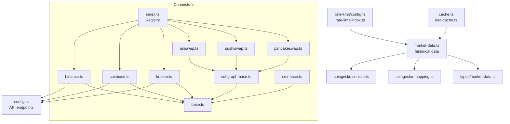
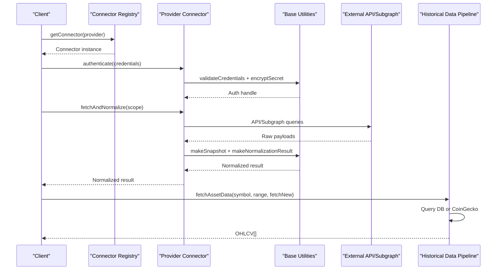
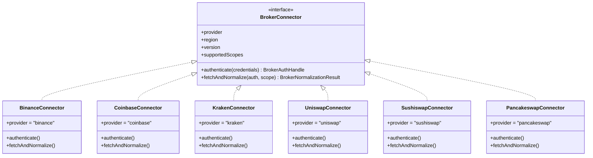
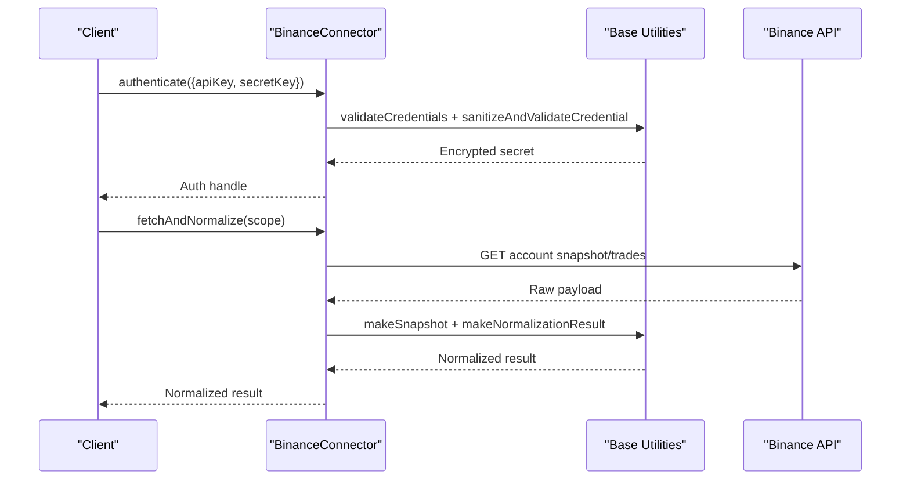
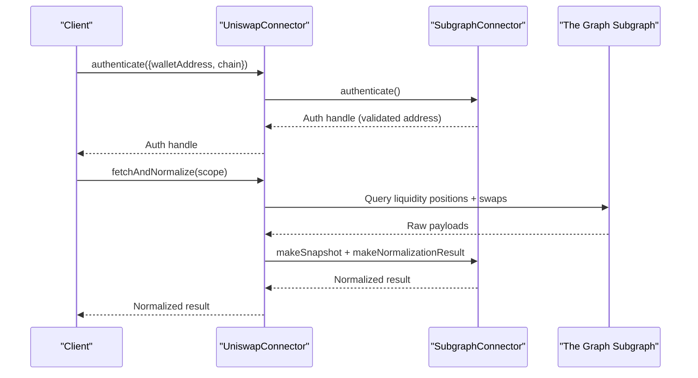
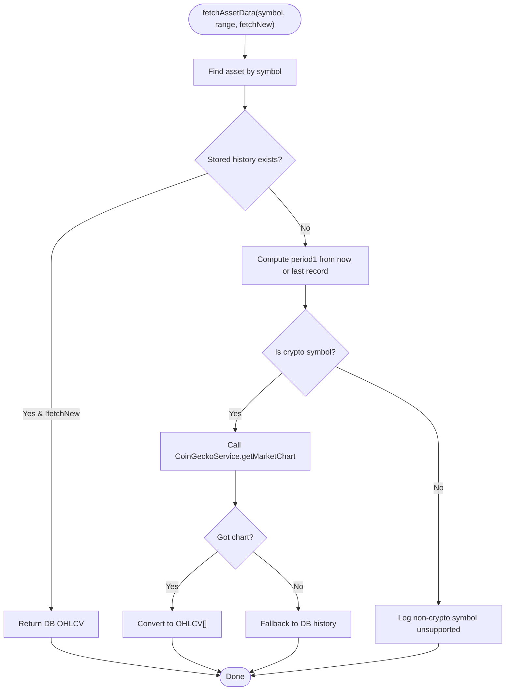
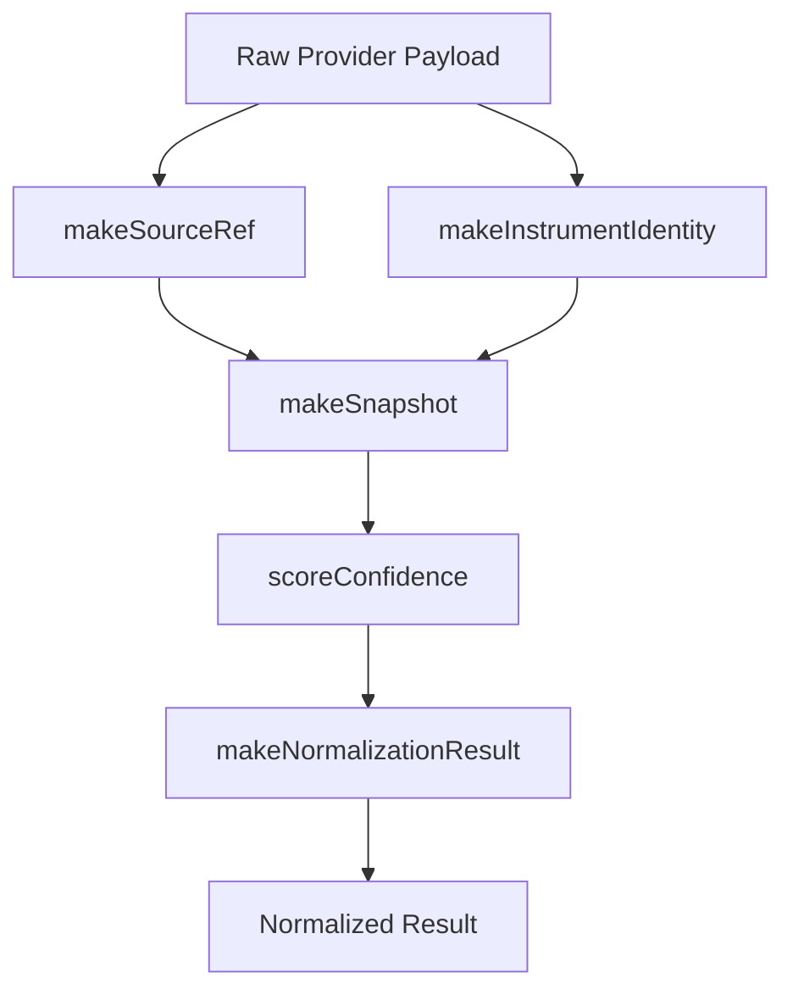
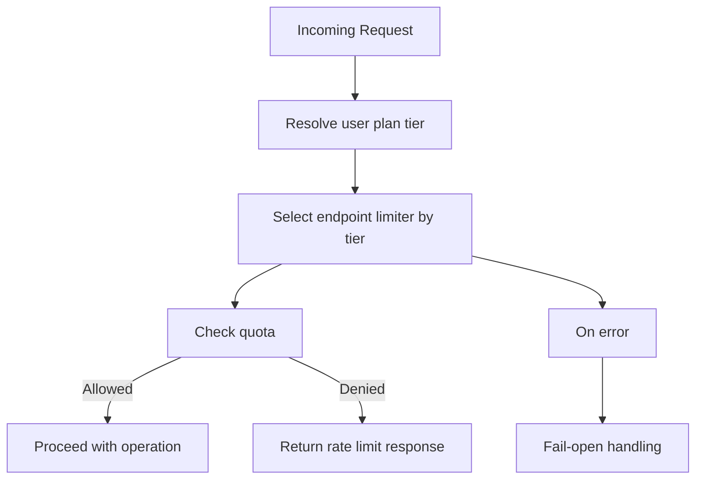
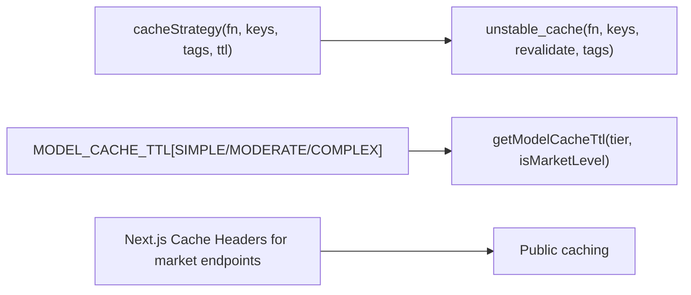
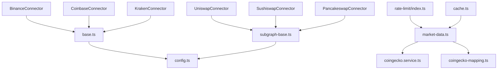

# Market Data Feeds

<cite>
**Referenced Files in This Document**
- [src/lib/connectors/index.ts](file://src/lib/connectors/index.ts)
- [src/lib/connectors/binance.ts](file://src/lib/connectors/binance.ts)
- [src/lib/connectors/coinbase.ts](file://src/lib/connectors/coinbase.ts)
- [src/lib/connectors/kraken.ts](file://src/lib/connectors/kraken.ts)
- [src/lib/connectors/uniswap.ts](file://src/lib/connectors/uniswap.ts)
- [src/lib/connectors/sushiswap.ts](file://src/lib/connectors/sushiswap.ts)
- [src/lib/connectors/pancakeswap.ts](file://src/lib/connectors/pancakeswap.ts)
- [src/lib/connectors/subgraph-base.ts](file://src/lib/connectors/subgraph-base.ts)
- [src/lib/connectors/base.ts](file://src/lib/connectors/base.ts)
- [src/lib/connectors/cex-base.ts](file://src/lib/connectors/cex-base.ts)
- [src/lib/config.ts](file://src/lib/config.ts)
- [src/lib/market-data.ts](file://src/lib/market-data.ts)
- [src/types/market-data.ts](file://src/types/market-data.ts)
- [src/lib/rate-limit/config.ts](file://src/lib/rate-limit/config.ts)
- [src/lib/rate-limit/index.ts](file://src/lib/rate-limit/index.ts)
- [src/lib/cache.ts](file://src/lib/cache.ts)
- [src/lib/ai/lyra-cache.ts](file://src/lib/ai/lyra-cache.ts)
- [src/lib/services/coingecko.service.ts](file://src/lib/services/coingecko.service.ts)
- [src/lib/services/coingecko-mapping.ts](file://src/lib/services/coingecko-mapping.ts)
- [src/lib/services/market-sync.service.ts](file://src/lib/services/market-sync.service.ts)
- [src/lib/engines/market-regime.ts](file://src/lib/engines/market-regime.ts)
- [src/components/portfolio/broker-connect-dialog.tsx](file://src/components/portfolio/broker-connect-dialog.tsx)
- [next.config.ts](file://next.config.ts)
</cite>

## Table of Contents
1. [Introduction](#introduction)
2. [Project Structure](#project-structure)
3. [Core Components](#core-components)
4. [Architecture Overview](#architecture-overview)
5. [Detailed Component Analysis](#detailed-component-analysis)
6. [Dependency Analysis](#dependency-analysis)
7. [Performance Considerations](#performance-considerations)
8. [Troubleshooting Guide](#troubleshooting-guide)
9. [Conclusion](#conclusion)
10. [Appendices](#appendices)

## Introduction
This document describes the market data integration architecture for both centralized (CEX) and decentralized (DEX) exchanges. It covers connector implementations for Binance, Coinbase, Kraken, and DEXs (Uniswap, Sushiswap, PancakeSwap). It explains historical data ingestion, real-time streaming capabilities, order book synchronization, data normalization, caching, rate limiting, and reliability strategies. Configuration, authentication, and data freshness guarantees are documented alongside service architecture and performance optimization techniques.

## Project Structure
The market data system is organized around:
- Provider connectors (CEX and DEX) under connectors/
- Shared base abstractions and utilities under connectors/base.ts and connectors/cex-base.ts
- Historical market data retrieval and normalization under market-data.ts and coingecko service
- Rate limiting and caching utilities
- Next.js caching headers for public market endpoints

**Diagram sources**
- [src/lib/connectors/index.ts:1-33](file://src/lib/connectors/index.ts#L1-L33)
- [src/lib/connectors/binance.ts:1-179](file://src/lib/connectors/binance.ts#L1-L179)
- [src/lib/connectors/coinbase.ts:1-289](file://src/lib/connectors/coinbase.ts#L1-L289)
- [src/lib/connectors/kraken.ts:1-43](file://src/lib/connectors/kraken.ts#L1-L43)
- [src/lib/connectors/uniswap.ts:1-26](file://src/lib/connectors/uniswap.ts#L1-L26)
- [src/lib/connectors/sushiswap.ts:1-27](file://src/lib/connectors/sushiswap.ts#L1-L27)
- [src/lib/connectors/pancakeswap.ts:1-21](file://src/lib/connectors/pancakeswap.ts#L1-L21)
- [src/lib/connectors/subgraph-base.ts:1-327](file://src/lib/connectors/subgraph-base.ts#L1-L327)
- [src/lib/connectors/base.ts:1-420](file://src/lib/connectors/base.ts#L1-L420)
- [src/lib/connectors/cex-base.ts:1-96](file://src/lib/connectors/cex-base.ts#L1-L96)
- [src/lib/config.ts:1-49](file://src/lib/config.ts#L1-L49)
- [src/lib/market-data.ts:1-113](file://src/lib/market-data.ts#L1-L113)
- [src/lib/services/coingecko.service.ts](file://src/lib/services/coingecko.service.ts)
- [src/lib/services/coingecko-mapping.ts](file://src/lib/services/coingecko-mapping.ts)
- [src/lib/rate-limit/config.ts:12-106](file://src/lib/rate-limit/config.ts#L12-L106)
- [src/lib/rate-limit/index.ts:242-281](file://src/lib/rate-limit/index.ts#L242-L281)
- [src/lib/cache.ts:1-21](file://src/lib/cache.ts#L1-L21)
- [src/lib/ai/lyra-cache.ts:1-21](file://src/lib/ai/lyra-cache.ts#L1-L21)
- [src/types/market-data.ts:1-13](file://src/types/market-data.ts#L1-L13)

**Section sources**
- [src/lib/connectors/index.ts:1-33](file://src/lib/connectors/index.ts#L1-L33)
- [src/lib/config.ts:1-49](file://src/lib/config.ts#L1-L49)
- [src/lib/market-data.ts:1-113](file://src/lib/market-data.ts#L1-L113)

## Core Components
- Connector registry and provider-specific connectors for CEXs and DEXs
- Base connector utilities for authentication, normalization, retries, and caching
- Historical market data pipeline using CoinGecko for crypto assets
- Rate limiting and caching layers for reliability and performance
- Market quote model and market sync service for derived metrics

**Section sources**
- [src/lib/connectors/index.ts:1-33](file://src/lib/connectors/index.ts#L1-L33)
- [src/lib/connectors/base.ts:1-420](file://src/lib/connectors/base.ts#L1-L420)
- [src/lib/market-data.ts:1-113](file://src/lib/market-data.ts#L1-L113)
- [src/types/market-data.ts:1-13](file://src/types/market-data.ts#L1-L13)

## Architecture Overview
The system integrates external market data through standardized connectors. CEX connectors authenticate via API keys/secrets and fetch holdings, transactions, and balances. DEX connectors authenticate via wallet addresses and query subgraphs for liquidity positions and swap transactions. Historical market data is retrieved from CoinGecko for crypto assets and stored in the database. Derived market metrics are computed and cached.

**Diagram sources**
- [src/lib/connectors/index.ts:21-27](file://src/lib/connectors/index.ts#L21-L27)
- [src/lib/connectors/binance.ts:32-86](file://src/lib/connectors/binance.ts#L32-L86)
- [src/lib/connectors/coinbase.ts:32-86](file://src/lib/connectors/coinbase.ts#L32-L86)
- [src/lib/connectors/kraken.ts:32-43](file://src/lib/connectors/kraken.ts#L32-L43)
- [src/lib/connectors/subgraph-base.ts:43-115](file://src/lib/connectors/subgraph-base.ts#L43-L115)
- [src/lib/connectors/base.ts:63-102](file://src/lib/connectors/base.ts#L63-L102)
- [src/lib/market-data.ts:23-113](file://src/lib/market-data.ts#L23-L113)

## Detailed Component Analysis

### Connector Registry and Providers
- Registry maps provider identifiers to connector instances for Binance, Coinbase, Kraken, Uniswap, Sushiswap, and PancakeSwap.
- Each connector implements a common interface for authentication and data normalization.

**Diagram sources**
- [src/lib/connectors/index.ts:12-19](file://src/lib/connectors/index.ts#L12-L19)
- [src/lib/connectors/binance.ts:26-30](file://src/lib/connectors/binance.ts#L26-L30)
- [src/lib/connectors/coinbase.ts:26-30](file://src/lib/connectors/coinbase.ts#L26-L30)
- [src/lib/connectors/kraken.ts:26-30](file://src/lib/connectors/kraken.ts#L26-L30)
- [src/lib/connectors/uniswap.ts:5-24](file://src/lib/connectors/uniswap.ts#L5-L24)
- [src/lib/connectors/sushiswap.ts:5-25](file://src/lib/connectors/sushiswap.ts#L5-L25)
- [src/lib/connectors/pancakeswap.ts:5-20](file://src/lib/connectors/pancakeswap.ts#L5-L20)

**Section sources**
- [src/lib/connectors/index.ts:1-33](file://src/lib/connectors/index.ts#L1-L33)

### Centralized Exchange Connectors (CEX)
- Binance, Coinbase, and Kraken connectors extend a base CEX pattern and use provider-specific API endpoints.
- Authentication validates and sanitizes credentials, encrypts secrets, and returns an auth handle with provider metadata.
- Data normalization produces holdings, transactions, and balances snapshots.

**Diagram sources**
- [src/lib/connectors/binance.ts:32-86](file://src/lib/connectors/binance.ts#L32-L86)
- [src/lib/connectors/coinbase.ts:32-86](file://src/lib/connectors/coinbase.ts#L32-L86)
- [src/lib/connectors/kraken.ts:32-43](file://src/lib/connectors/kraken.ts#L32-L43)
- [src/lib/connectors/base.ts:63-102](file://src/lib/connectors/base.ts#L63-L102)
- [src/lib/config.ts:14-37](file://src/lib/config.ts#L14-L37)

**Section sources**
- [src/lib/connectors/binance.ts:1-179](file://src/lib/connectors/binance.ts#L1-L179)
- [src/lib/connectors/coinbase.ts:1-289](file://src/lib/connectors/coinbase.ts#L1-L289)
- [src/lib/connectors/kraken.ts:1-43](file://src/lib/connectors/kraken.ts#L1-L43)
- [src/lib/connectors/cex-base.ts:1-96](file://src/lib/connectors/cex-base.ts#L1-L96)
- [src/lib/config.ts:1-49](file://src/lib/config.ts#L1-L49)

### Decentralized Exchange Connectors (DEX)
- Uniswap, Sushiswap, and PancakeSwap connectors extend a subgraph base connector.
- Authentication requires a wallet address and optional chain selection; the connector validates the address and returns an auth handle.
- Data fetching queries subgraphs for liquidity positions and swap transactions; balances require blockchain RPC integration.

**Diagram sources**
- [src/lib/connectors/uniswap.ts:5-24](file://src/lib/connectors/uniswap.ts#L5-L24)
- [src/lib/connectors/sushiswap.ts:5-25](file://src/lib/connectors/sushiswap.ts#L5-L25)
- [src/lib/connectors/pancakeswap.ts:5-20](file://src/lib/connectors/pancakeswap.ts#L5-L20)
- [src/lib/connectors/subgraph-base.ts:43-115](file://src/lib/connectors/subgraph-base.ts#L43-L115)

**Section sources**
- [src/lib/connectors/uniswap.ts:1-26](file://src/lib/connectors/uniswap.ts#L1-L26)
- [src/lib/connectors/sushiswap.ts:1-27](file://src/lib/connectors/sushiswap.ts#L1-L27)
- [src/lib/connectors/pancakeswap.ts:1-21](file://src/lib/connectors/pancakeswap.ts#L1-L21)
- [src/lib/connectors/subgraph-base.ts:1-327](file://src/lib/connectors/subgraph-base.ts#L1-L327)

### Historical Market Data Ingestion
- fetchAssetData retrieves asset metadata and either returns stored OHLCV history or fetches from CoinGecko for crypto assets.
- If CoinGecko is unavailable, it falls back to database history.
- The service maps CoinGecko charts to internal OHLCV format.

**Diagram sources**
- [src/lib/market-data.ts:23-113](file://src/lib/market-data.ts#L23-L113)
- [src/lib/services/coingecko.service.ts](file://src/lib/services/coingecko.service.ts)
- [src/lib/services/coingecko-mapping.ts](file://src/lib/services/coingecko-mapping.ts)

**Section sources**
- [src/lib/market-data.ts:1-113](file://src/lib/market-data.ts#L1-L113)

### Real-Time Streaming and Order Book Synchronization
- The current connector implementations focus on historical and on-demand data retrieval via REST APIs and subgraph queries.
- Real-time streaming and order book synchronization are not implemented in the referenced connector files; they would require WebSocket connections and incremental updates not present in the analyzed code.

[No sources needed since this section provides general guidance]

### Market Depth Tracking and Order Book Synchronization
- No explicit market depth or order book synchronization logic was identified in the analyzed connector files.
- DEX liquidity positions are available via subgraph queries; order book depth is not implemented.

[No sources needed since this section provides general guidance]

### Data Transformation and Normalization
- Base utilities provide factories for source references, instrument identities, snapshots, and normalization results.
- Confidence scoring considers presence of contract address, exchange, market price, cost basis, and unrealized PnL.
- Scope filtering enables selective data fetching.

**Diagram sources**
- [src/lib/connectors/base.ts:149-270](file://src/lib/connectors/base.ts#L149-L270)
- [src/lib/connectors/base.ts:202-217](file://src/lib/connectors/base.ts#L202-L217)

**Section sources**
- [src/lib/connectors/base.ts:1-420](file://src/lib/connectors/base.ts#L1-L420)

### Quality Assurance Measures
- Validation of credentials and safe string sanitization before encryption.
- Retry logic with exponential backoff and jitter for upstream failures.
- Timeout handling for network requests.
- Warning aggregation during normalization for partial failures.

**Section sources**
- [src/lib/connectors/base.ts:40-59](file://src/lib/connectors/base.ts#L40-L59)
- [src/lib/connectors/base.ts:274-318](file://src/lib/connectors/base.ts#L274-L318)

### Rate Limiting Strategies
- Endpoint-specific rate limiters with sliding or fixed windows per plan tier.
- Dedicated marketdata rate limiter with higher allowances for higher tiers.
- Fail-open behavior on rate limit errors to maintain availability.

**Diagram sources**
- [src/lib/rate-limit/config.ts:12-106](file://src/lib/rate-limit/config.ts#L12-L106)
- [src/lib/rate-limit/index.ts:242-281](file://src/lib/rate-limit/index.ts#L242-L281)

**Section sources**
- [src/lib/rate-limit/config.ts:12-106](file://src/lib/rate-limit/config.ts#L12-L106)
- [src/lib/rate-limit/index.ts:242-281](file://src/lib/rate-limit/index.ts#L242-L281)

### Connection Pooling and Reliability
- Supabase connection pooling guidance suggests using a transaction pooler port for serverless environments.
- The codebase uses a shared fetch client with timeouts and retry logic for upstream calls.

**Section sources**
- [.windsurf/agents/database-optimizer.md:116-125](file://.windsurf/agents/database-optimizer.md#L116-L125)
- [src/lib/connectors/base.ts:274-318](file://src/lib/connectors/base.ts#L274-L318)

### Caching Strategies
- Next.js cache wrapper for database-heavy queries with TTL and tags.
- AI/lyra cache TTLs vary by model complexity and whether queries are market-level vs asset-level.
- Public market endpoints cache headers configured at the framework level.

**Diagram sources**
- [src/lib/cache.ts:10-20](file://src/lib/cache.ts#L10-L20)
- [src/lib/ai/lyra-cache.ts:1-21](file://src/lib/ai/lyra-cache.ts#L1-L21)
- [next.config.ts:195-213](file://next.config.ts#L195-L213)

**Section sources**
- [src/lib/cache.ts:1-21](file://src/lib/cache.ts#L1-L21)
- [src/lib/ai/lyra-cache.ts:1-21](file://src/lib/ai/lyra-cache.ts#L1-L21)
- [next.config.ts:195-213](file://next.config.ts#L195-L213)

### Market Data Service Architecture
- Market sync service computes derived signals (trend, momentum, volatility, liquidity, sentiment, trust) from cleaned historical OHLCV.
- Market regime context caching improves performance for regime-aware computations.

**Section sources**
- [src/lib/services/market-sync.service.ts:570-603](file://src/lib/services/market-sync.service.ts#L570-L603)
- [src/lib/engines/market-regime.ts:80-110](file://src/lib/engines/market-regime.ts#L80-L110)

## Dependency Analysis
- Connectors depend on base utilities for validation, encryption, normalization, and HTTP requests.
- DEX connectors depend on subgraph endpoints; CEX connectors depend on provider API endpoints.
- Historical data depends on CoinGecko service and database storage.
- Rate limiting and caching utilities are consumed by data retrieval and market sync services.

**Diagram sources**
- [src/lib/connectors/binance.ts:1-179](file://src/lib/connectors/binance.ts#L1-L179)
- [src/lib/connectors/coinbase.ts:1-289](file://src/lib/connectors/coinbase.ts#L1-L289)
- [src/lib/connectors/kraken.ts:1-43](file://src/lib/connectors/kraken.ts#L1-L43)
- [src/lib/connectors/uniswap.ts:1-26](file://src/lib/connectors/uniswap.ts#L1-L26)
- [src/lib/connectors/sushiswap.ts:1-27](file://src/lib/connectors/sushiswap.ts#L1-L27)
- [src/lib/connectors/pancakeswap.ts:1-21](file://src/lib/connectors/pancakeswap.ts#L1-L21)
- [src/lib/connectors/subgraph-base.ts:1-327](file://src/lib/connectors/subgraph-base.ts#L1-L327)
- [src/lib/connectors/base.ts:1-420](file://src/lib/connectors/base.ts#L1-L420)
- [src/lib/config.ts:1-49](file://src/lib/config.ts#L1-L49)
- [src/lib/market-data.ts:1-113](file://src/lib/market-data.ts#L1-L113)
- [src/lib/services/coingecko.service.ts](file://src/lib/services/coingecko.service.ts)
- [src/lib/services/coingecko-mapping.ts](file://src/lib/services/coingecko-mapping.ts)
- [src/lib/rate-limit/index.ts:242-281](file://src/lib/rate-limit/index.ts#L242-L281)
- [src/lib/cache.ts:1-21](file://src/lib/cache.ts#L1-L21)

**Section sources**
- [src/lib/connectors/index.ts:1-33](file://src/lib/connectors/index.ts#L1-L33)
- [src/lib/connectors/base.ts:1-420](file://src/lib/connectors/base.ts#L1-L420)

## Performance Considerations
- Use pagination helpers to avoid large payloads and improve throughput.
- Apply caching for expensive database queries and model responses.
- Prefer CoinGecko for crypto OHLCV to reduce latency compared to rolling historical collection.
- Tune rate limiter windows and request caps per plan tier to balance user experience and provider quotas.

[No sources needed since this section provides general guidance]

## Troubleshooting Guide
Common issues and resolutions:
- Authentication failures: Verify required credentials, sanitization, and encryption keys.
- Upstream errors and timeouts: Inspect retry behavior and network timeouts.
- Rate limiting: Review plan tier limits and adjust client-side throttling.
- Data gaps: Confirm CoinGecko availability and database fallback logic.

**Section sources**
- [src/lib/connectors/base.ts:63-102](file://src/lib/connectors/base.ts#L63-L102)
- [src/lib/connectors/base.ts:274-318](file://src/lib/connectors/base.ts#L274-L318)
- [src/lib/rate-limit/index.ts:242-281](file://src/lib/rate-limit/index.ts#L242-L281)
- [src/lib/market-data.ts:75-113](file://src/lib/market-data.ts#L75-L113)

## Conclusion
The market data integration leverages a modular connector architecture supporting both CEX and DEX providers. Historical data is ingested from CoinGecko for crypto assets with robust fallbacks. Normalization ensures consistent data structures across providers. Rate limiting and caching strategies enhance reliability and performance. Real-time streaming and order book synchronization are not implemented in the analyzed code and would require additional WebSocket integrations and incremental update mechanisms.

## Appendices

### Configuration and Authentication
- Environment variables for provider endpoints and encryption keys are required.
- Wallet address validation is enforced for DEX connectors.

**Section sources**
- [src/lib/config.ts:1-49](file://src/lib/config.ts#L1-L49)
- [src/lib/connectors/subgraph-base.ts:43-72](file://src/lib/connectors/subgraph-base.ts#L43-L72)

### Data Freshness Guarantees
- Historical data retrieval checks last recorded timestamps and avoids redundant fetches.
- Market sync service computes signals from cleaned historical data.

**Section sources**
- [src/lib/market-data.ts:54-73](file://src/lib/market-data.ts#L54-L73)
- [src/lib/services/market-sync.service.ts:570-603](file://src/lib/services/market-sync.service.ts#L570-L603)

### Market Quote Model
- MarketQuote defines standardized fields for price, change percent, market cap, and volumes.

**Section sources**
- [src/types/market-data.ts:1-13](file://src/types/market-data.ts#L1-L13)