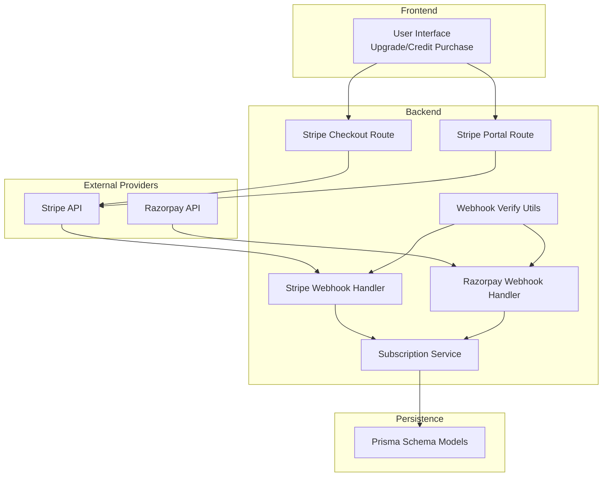
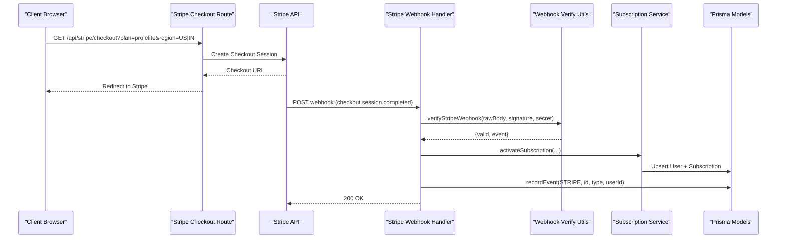
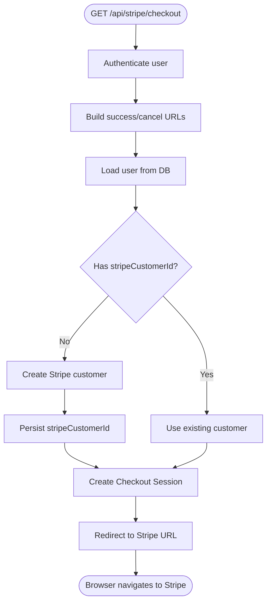
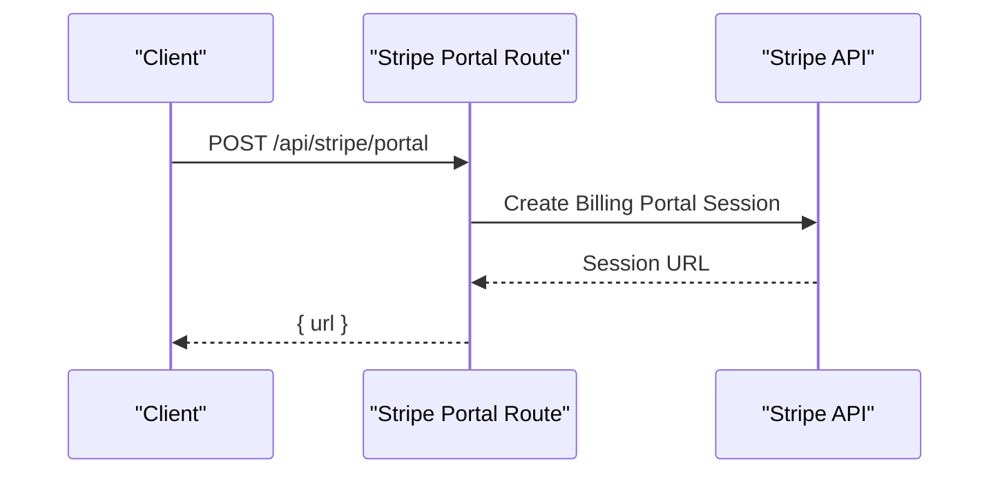
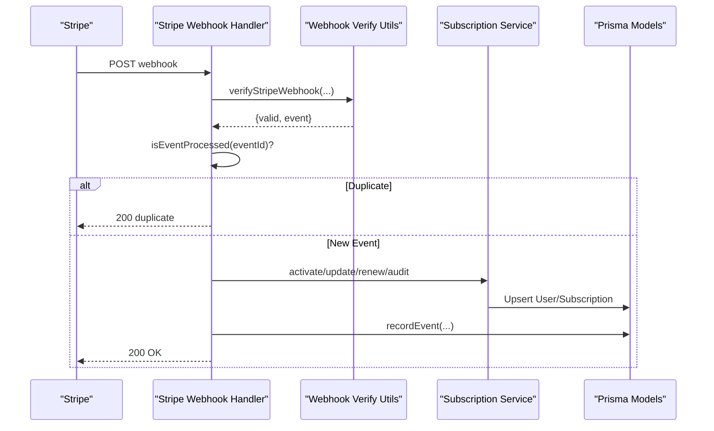
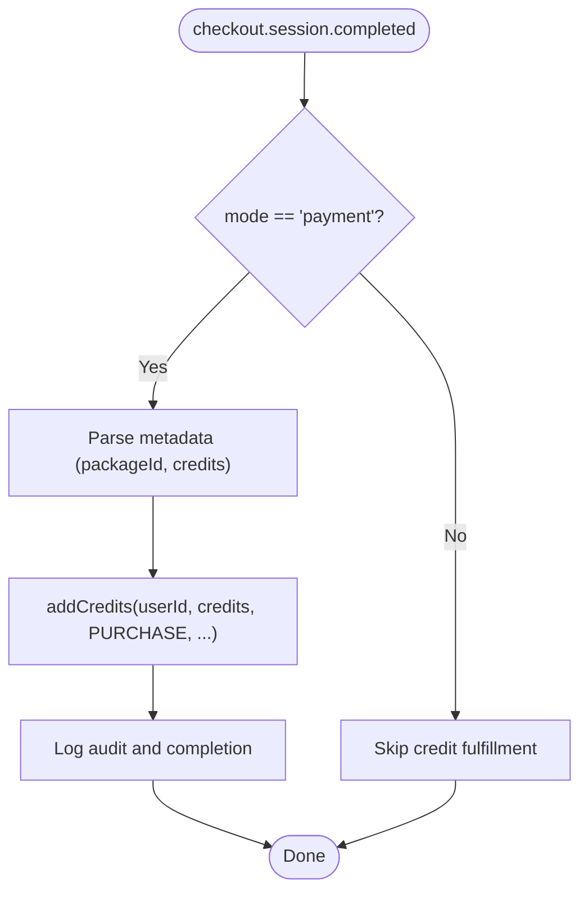
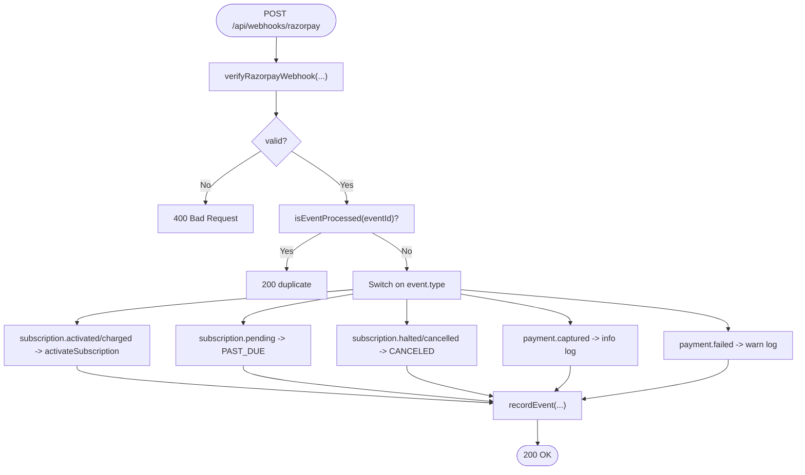
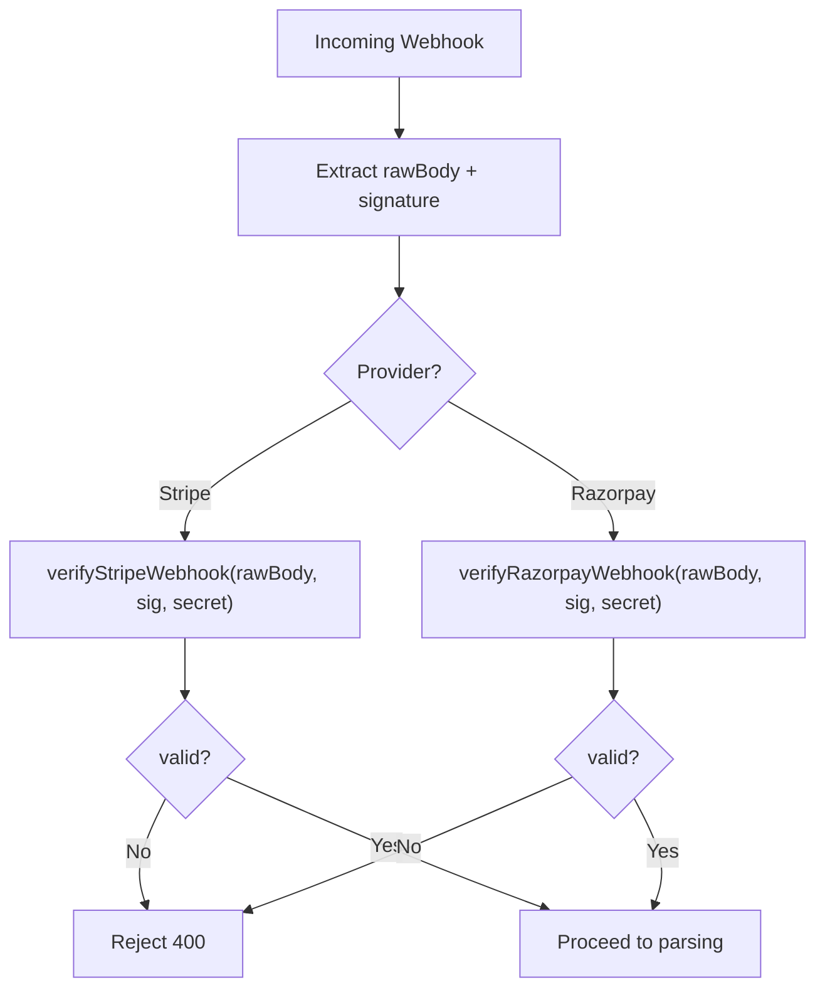
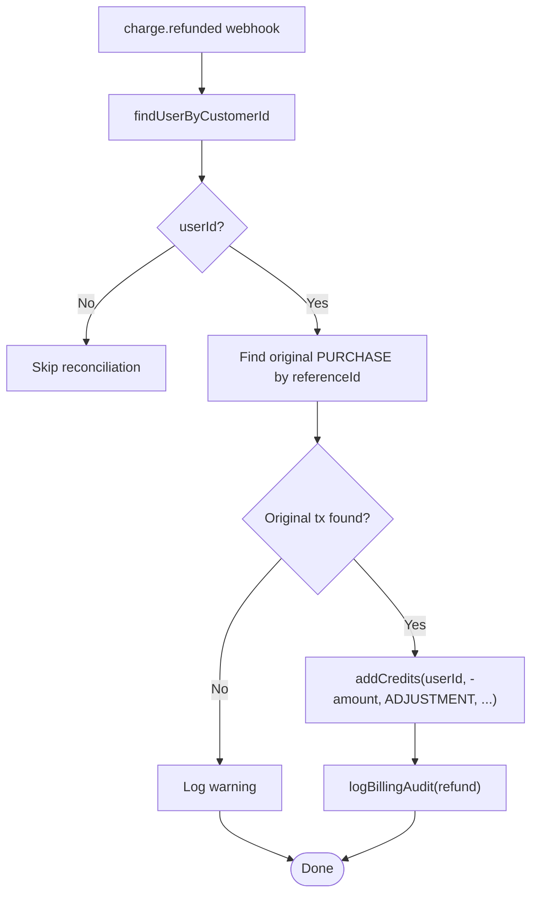
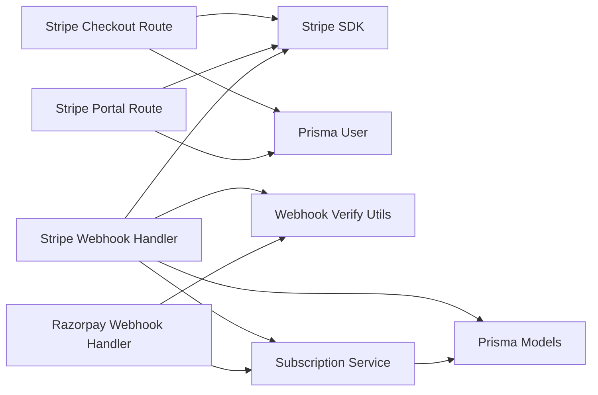

# Payment Processors

<cite>
**Referenced Files in This Document**
- [schema.prisma](file://prisma/schema.prisma)
- [subscription.service.ts](file://src/lib/payments/subscription.service.ts)
- [webhook-verify.ts](file://src/lib/payments/webhook-verify.ts)
- [route.ts (Stripe Webhook)](file://src/app/api/webhooks/stripe/route.ts)
- [route.ts (Razorpay Webhook)](file://src/app/api/webhooks/razorpay/route.ts)
- [route.ts (Stripe Checkout)](file://src/app/api/stripe/checkout/route.ts)
- [route.ts (Stripe Portal)](file://src/app/api/stripe/portal/route.ts)
- [config.ts](file://src/lib/config.ts)
</cite>

## Table of Contents
1. [Introduction](#introduction)
2. [Project Structure](#project-structure)
3. [Core Components](#core-components)
4. [Architecture Overview](#architecture-overview)
5. [Detailed Component Analysis](#detailed-component-analysis)
6. [Dependency Analysis](#dependency-analysis)
7. [Performance Considerations](#performance-considerations)
8. [Troubleshooting Guide](#troubleshooting-guide)
9. [Conclusion](#conclusion)
10. [Appendices](#appendices)

## Introduction
This document explains the integrated payment processor implementation for Stripe and Razorpay. It covers subscription management, credit purchase workflows, and webhook handling for payment events. It also documents Stripe Checkout integration, customer portal setup, subscription lifecycle management, credit bundle purchases, Razorpay regional payment processing (UPI, net banking, cards), webhook security and signature verification, event processing, reconciliation procedures, configuration requirements, environment setup, testing strategies, error handling for payment failures, refund processing, subscription upgrades/downgrades, and payment method management.

## Project Structure
The payment system spans several modules:
- Stripe integration: checkout session creation, billing portal, and webhook handlers.
- Razorpay integration: webhook handlers for subscription lifecycle and payment capture.
- Shared services: subscription lifecycle management, event deduplication, audit logging, and plan resolution.
- Webhook verification utilities for both providers.
- Database schema modeling for subscriptions, payment events, and credit transactions.

**Diagram sources**
- [route.ts (Stripe Checkout):19-107](file://src/app/api/stripe/checkout/route.ts#L19-L107)
- [route.ts (Stripe Portal):18-47](file://src/app/api/stripe/portal/route.ts#L18-L47)
- [route.ts (Stripe Webhook):123-429](file://src/app/api/webhooks/stripe/route.ts#L123-L429)
- [route.ts (Razorpay Webhook):30-154](file://src/app/api/webhooks/razorpay/route.ts#L30-L154)
- [subscription.service.ts:1-309](file://src/lib/payments/subscription.service.ts#L1-L309)
- [webhook-verify.ts:1-149](file://src/lib/payments/webhook-verify.ts#L1-L149)
- [schema.prisma:499-533](file://prisma/schema.prisma#L499-L533)

**Section sources**
- [route.ts (Stripe Checkout):1-108](file://src/app/api/stripe/checkout/route.ts#L1-L108)
- [route.ts (Stripe Portal):1-48](file://src/app/api/stripe/portal/route.ts#L1-L48)
- [route.ts (Stripe Webhook):1-430](file://src/app/api/webhooks/stripe/route.ts#L1-L430)
- [route.ts (Razorpay Webhook):1-155](file://src/app/api/webhooks/razorpay/route.ts#L1-L155)
- [subscription.service.ts:1-309](file://src/lib/payments/subscription.service.ts#L1-L309)
- [webhook-verify.ts:1-149](file://src/lib/payments/webhook-verify.ts#L1-L149)
- [schema.prisma:499-533](file://prisma/schema.prisma#L499-L533)

## Core Components
- Subscription Service: centralizes plan resolution, idempotent event processing, subscription activation/update/renewal, customer ID linking, and audit logging.
- Webhook Verify Utilities: provider-specific signature verification and replay protection.
- Stripe Checkout Route: creates subscription checkout sessions, persists customer IDs, and redirects users to Stripe-hosted pages.
- Stripe Portal Route: generates customer billing portal sessions for self-serve management.
- Stripe Webhook Handler: validates signatures, parses payloads, enforces idempotency, and orchestrates subscription and credit fulfillment.
- Razorpay Webhook Handler: validates signatures, constructs synthetic event IDs, and manages subscription lifecycle and payment capture.

Key database models:
- Subscription: tracks provider, provider-assigned subscription ID, status, plan tier, and period windows.
- PaymentEvent: records processed event IDs to ensure idempotency.
- CreditTransaction and CreditLot: manage credit purchases and expiring credit allocations.

**Section sources**
- [subscription.service.ts:15-42](file://src/lib/payments/subscription.service.ts#L15-L42)
- [subscription.service.ts:66-84](file://src/lib/payments/subscription.service.ts#L66-L84)
- [subscription.service.ts:88-161](file://src/lib/payments/subscription.service.ts#L88-L161)
- [subscription.service.ts:163-224](file://src/lib/payments/subscription.service.ts#L163-L224)
- [subscription.service.ts:226-258](file://src/lib/payments/subscription.service.ts#L226-L258)
- [subscription.service.ts:262-294](file://src/lib/payments/subscription.service.ts#L262-L294)
- [subscription.service.ts:298-309](file://src/lib/payments/subscription.service.ts#L298-L309)
- [webhook-verify.ts:14-71](file://src/lib/payments/webhook-verify.ts#L14-L71)
- [webhook-verify.ts:81-128](file://src/lib/payments/webhook-verify.ts#L81-L128)
- [webhook-verify.ts:132-148](file://src/lib/payments/webhook-verify.ts#L132-L148)
- [route.ts (Stripe Checkout):54-81](file://src/app/api/stripe/checkout/route.ts#L54-L81)
- [route.ts (Stripe Portal):25-42](file://src/app/api/stripe/portal/route.ts#L25-L42)
- [route.ts (Stripe Webhook):123-156](file://src/app/api/webhooks/stripe/route.ts#L123-L156)
- [route.ts (Razorpay Webhook):30-76](file://src/app/api/webhooks/razorpay/route.ts#L30-L76)
- [schema.prisma:499-533](file://prisma/schema.prisma#L499-L533)
- [schema.prisma:604-616](file://prisma/schema.prisma#L604-L616)
- [schema.prisma:568-602](file://prisma/schema.prisma#L568-L602)

## Architecture Overview
The system integrates two payment providers with a unified subscription service and shared persistence. Stripe is used for subscription billing and customer portals, while Razorpay is used for regional subscription events. Webhooks from both providers are verified, de-duplicated, and mapped to subscription lifecycle actions and credit purchases.

**Diagram sources**
- [route.ts (Stripe Checkout):19-107](file://src/app/api/stripe/checkout/route.ts#L19-L107)
- [route.ts (Stripe Webhook):123-238](file://src/app/api/webhooks/stripe/route.ts#L123-L238)
- [webhook-verify.ts:14-71](file://src/lib/payments/webhook-verify.ts#L14-L71)
- [subscription.service.ts:88-161](file://src/lib/payments/subscription.service.ts#L88-L161)
- [schema.prisma:499-533](file://prisma/schema.prisma#L499-L533)

## Detailed Component Analysis

### Stripe Checkout Integration
- Creates a Stripe customer if needed, persists the customer ID, and builds a subscription checkout session with success/cancel URLs and metadata.
- Supports region-aware pricing via plan resolution helpers.
- Redirects the user to Stripe-hosted checkout.

**Diagram sources**
- [route.ts (Stripe Checkout):19-107](file://src/app/api/stripe/checkout/route.ts#L19-L107)

**Section sources**
- [route.ts (Stripe Checkout):19-107](file://src/app/api/stripe/checkout/route.ts#L19-L107)

### Stripe Customer Portal Setup
- Generates a billing portal session for the authenticated user’s Stripe customer.
- Returns a URL to the client for self-service management.

**Diagram sources**
- [route.ts (Stripe Portal):18-47](file://src/app/api/stripe/portal/route.ts#L18-L47)

**Section sources**
- [route.ts (Stripe Portal):18-47](file://src/app/api/stripe/portal/route.ts#L18-L47)

### Stripe Subscription Lifecycle Management
- Webhook handler validates signatures, enforces idempotency, and processes key events:
  - checkout.session.completed: activates subscription and fulfills one-time credit purchases.
  - invoice.paid: idempotent provisioning on renewals.
  - invoice.payment_failed: marks subscriptions as past_due.
  - customer.subscription.*: handles creation, updates (including plan changes and cancel-at-period-end), deletion, and renewal period updates.
  - charge.refunded: performs credit clawback and audit logging.
  - charge.dispute.created: logs disputed state for escalation.

**Diagram sources**
- [route.ts (Stripe Webhook):123-429](file://src/app/api/webhooks/stripe/route.ts#L123-L429)
- [webhook-verify.ts:14-71](file://src/lib/payments/webhook-verify.ts#L14-L71)
- [subscription.service.ts:66-84](file://src/lib/payments/subscription.service.ts#L66-L84)
- [subscription.service.ts:88-161](file://src/lib/payments/subscription.service.ts#L88-L161)
- [subscription.service.ts:163-224](file://src/lib/payments/subscription.service.ts#L163-L224)
- [subscription.service.ts:226-258](file://src/lib/payments/subscription.service.ts#L226-L258)

**Section sources**
- [route.ts (Stripe Webhook):163-418](file://src/app/api/webhooks/stripe/route.ts#L163-L418)
- [subscription.service.ts:88-161](file://src/lib/payments/subscription.service.ts#L88-L161)
- [subscription.service.ts:163-224](file://src/lib/payments/subscription.service.ts#L163-L224)
- [subscription.service.ts:226-258](file://src/lib/payments/subscription.service.ts#L226-L258)

### Credit Bundle Purchases (Stripe)
- One-time payment checkout sessions trigger credit fulfillment upon checkout.session.completed.
- Credits are recorded as positive adjustments with reference IDs for reconciliation.

**Diagram sources**
- [route.ts (Stripe Webhook):221-234](file://src/app/api/webhooks/stripe/route.ts#L221-L234)
- [subscription.service.ts:66-84](file://src/lib/payments/subscription.service.ts#L66-L84)

**Section sources**
- [route.ts (Stripe Webhook):221-234](file://src/app/api/webhooks/stripe/route.ts#L221-L234)

### Razorpay Regional Payments Integration
- Webhook handler validates signatures, constructs synthetic event IDs, and processes:
  - subscription.activated and subscription.charged: activate subscription and link customer if metadata exists.
  - subscription.pending: set PAST_DUE.
  - subscription.halted and subscription.cancelled: set CANCELED.
  - payment.captured and payment.failed: informational logs.

**Diagram sources**
- [route.ts (Razorpay Webhook):30-154](file://src/app/api/webhooks/razorpay/route.ts#L30-L154)
- [webhook-verify.ts:81-128](file://src/lib/payments/webhook-verify.ts#L81-L128)
- [subscription.service.ts:66-84](file://src/lib/payments/subscription.service.ts#L66-L84)
- [subscription.service.ts:88-161](file://src/lib/payments/subscription.service.ts#L88-L161)
- [subscription.service.ts:163-224](file://src/lib/payments/subscription.service.ts#L163-L224)

**Section sources**
- [route.ts (Razorpay Webhook):30-154](file://src/app/api/webhooks/razorpay/route.ts#L30-L154)
- [webhook-verify.ts:81-128](file://src/lib/payments/webhook-verify.ts#L81-L128)

### Webhook Security and Signature Verification
- Stripe: HMAC SHA-256 verification with timestamp replay protection and support for multiple signatures during key rotation.
- Razorpay: HMAC SHA-256 verification with optional replay protection using event timestamps.
- Payment verification for Razorpay checkout callbacks uses order/payment ID concatenation.

**Diagram sources**
- [webhook-verify.ts:14-71](file://src/lib/payments/webhook-verify.ts#L14-L71)
- [webhook-verify.ts:81-128](file://src/lib/payments/webhook-verify.ts#L81-L128)
- [webhook-verify.ts:132-148](file://src/lib/payments/webhook-verify.ts#L132-L148)

**Section sources**
- [webhook-verify.ts:14-71](file://src/lib/payments/webhook-verify.ts#L14-L71)
- [webhook-verify.ts:81-128](file://src/lib/payments/webhook-verify.ts#L81-L128)
- [webhook-verify.ts:132-148](file://src/lib/payments/webhook-verify.ts#L132-L148)

### Reconciliation Procedures
- Stripe refunds trigger credit clawback by locating the original purchase transaction by reference ID and applying a negative adjustment.
- Audit logs record event types, amounts, currencies, and object IDs for reconciliation.
- PaymentEvent entries prevent duplicate processing.

**Diagram sources**
- [route.ts (Stripe Webhook):356-396](file://src/app/api/webhooks/stripe/route.ts#L356-L396)
- [subscription.service.ts:46-62](file://src/lib/payments/subscription.service.ts#L46-L62)
- [subscription.service.ts:74-84](file://src/lib/payments/subscription.service.ts#L74-L84)

**Section sources**
- [route.ts (Stripe Webhook):356-396](file://src/app/api/webhooks/stripe/route.ts#L356-L396)
- [subscription.service.ts:46-62](file://src/lib/payments/subscription.service.ts#L46-L62)
- [subscription.service.ts:74-84](file://src/lib/payments/subscription.service.ts#L74-L84)

### Subscription Upgrades/Downgrades and Payment Method Management
- Upgrades/downgrades are handled implicitly by plan resolution and subscription status transitions.
- Payment method updates are managed via the Stripe Customer Portal session generated by the portal route.
- Past-due subscriptions are marked accordingly and remain active until payment clears.

**Section sources**
- [route.ts (Stripe Portal):18-47](file://src/app/api/stripe/portal/route.ts#L18-L47)
- [route.ts (Stripe Webhook):263-279](file://src/app/api/webhooks/stripe/route.ts#L263-L279)
- [subscription.service.ts:163-224](file://src/lib/payments/subscription.service.ts#L163-L224)

## Dependency Analysis
- Stripe Checkout depends on Clerk for user context and Prisma for customer persistence.
- Stripe Webhook depends on Stripe SDK, verification utilities, subscription service, and Prisma models.
- Razorpay Webhook depends on Razorpay verification utilities and subscription service.
- Subscription Service encapsulates Prisma models and plan mapping logic.

**Diagram sources**
- [route.ts (Stripe Checkout):1-108](file://src/app/api/stripe/checkout/route.ts#L1-L108)
- [route.ts (Stripe Portal):1-48](file://src/app/api/stripe/portal/route.ts#L1-L48)
- [route.ts (Stripe Webhook):1-430](file://src/app/api/webhooks/stripe/route.ts#L1-L430)
- [route.ts (Razorpay Webhook):1-155](file://src/app/api/webhooks/razorpay/route.ts#L1-L155)
- [subscription.service.ts:1-309](file://src/lib/payments/subscription.service.ts#L1-L309)
- [webhook-verify.ts:1-149](file://src/lib/payments/webhook-verify.ts#L1-L149)
- [schema.prisma:499-533](file://prisma/schema.prisma#L499-L533)

**Section sources**
- [route.ts (Stripe Checkout):1-108](file://src/app/api/stripe/checkout/route.ts#L1-L108)
- [route.ts (Stripe Portal):1-48](file://src/app/api/stripe/portal/route.ts#L1-L48)
- [route.ts (Stripe Webhook):1-430](file://src/app/api/webhooks/stripe/route.ts#L1-L430)
- [route.ts (Razorpay Webhook):1-155](file://src/app/api/webhooks/razorpay/route.ts#L1-L155)
- [subscription.service.ts:1-309](file://src/lib/payments/subscription.service.ts#L1-L309)
- [webhook-verify.ts:1-149](file://src/lib/payments/webhook-verify.ts#L1-L149)
- [schema.prisma:499-533](file://prisma/schema.prisma#L499-L533)

## Performance Considerations
- Idempotent event processing prevents duplicate writes and reduces load.
- Batched operations (e.g., parallel user lookup and status updates) improve throughput.
- Lazy initialization of Stripe clients avoids cold starts and environment errors.
- TTL-based caching for external connector endpoints is available for other services and can inspire similar patterns for provider metadata caching.

**Section sources**
- [subscription.service.ts:66-84](file://src/lib/payments/subscription.service.ts#L66-L84)
- [route.ts (Stripe Webhook):268-275](file://src/app/api/webhooks/stripe/route.ts#L268-L275)
- [config.ts:69-75](file://src/lib/config.ts#L69-L75)

## Troubleshooting Guide
Common issues and resolutions:
- Missing webhook secrets: both providers require environment variables; handlers return 500 if not configured.
- Signature verification failures: inspect logs for “Missing X-Razorpay-Signature” or “Invalid signature” and confirm provider secret alignment.
- Replay protection: both providers enforce timestamp checks; ensure server time is synchronized.
- Duplicate events: PaymentEvent de-duplication prevents double fulfillment; investigate missing records if duplicates occur.
- Stripe customer metadata fallback: handler attempts to resolve user ID from Stripe customer metadata if DB linkage is pending.
- Razorpay event ID construction: synthetic IDs are derived from payment or subscription entity IDs; ensure entity IDs are present.

Operational checks:
- Confirm environment variables for provider secrets and price IDs.
- Validate webhook endpoints in provider dashboards and signing secrets.
- Monitor audit logs for event types and statuses.
- Review PaymentEvent table for processed event IDs.

**Section sources**
- [route.ts (Stripe Webhook):125-129](file://src/app/api/webhooks/stripe/route.ts#L125-L129)
- [route.ts (Razorpay Webhook):31-36](file://src/app/api/webhooks/razorpay/route.ts#L31-L36)
- [webhook-verify.ts:19-40](file://src/lib/payments/webhook-verify.ts#L19-L40)
- [webhook-verify.ts:111-121](file://src/lib/payments/webhook-verify.ts#L111-L121)
- [subscription.service.ts:79-96](file://src/lib/payments/subscription.service.ts#L79-L96)

## Conclusion
The payment processors integrate Stripe and Razorpay with a unified subscription service and robust webhook handling. The system supports subscription lifecycle management, credit purchases, customer portals, refund processing, reconciliation, and regional payment options. Strong emphasis on idempotency, signature verification, and audit logging ensures reliability and traceability.

## Appendices

### Configuration Requirements
- Environment variables:
  - Stripe: secret key, webhook secret, price IDs for plans.
  - Razorpay: webhook secret and plan IDs.
- Database: ensure Prisma models are migrated and seeded for subscriptions, payment events, and credit packages.

**Section sources**
- [route.ts (Stripe Webhook):125-129](file://src/app/api/webhooks/stripe/route.ts#L125-L129)
- [route.ts (Razorpay Webhook):31-36](file://src/app/api/webhooks/razorpay/route.ts#L31-L36)
- [subscription.service.ts:21-29](file://src/lib/payments/subscription.service.ts#L21-L29)

### Testing Strategies
- Unit tests for webhook verification utilities.
- End-to-end tests for Stripe checkout session creation and webhook fulfillment.
- Scenario tests for refund clawback and audit logging.
- Load tests for idempotent event processing under high concurrency.

[No sources needed since this section provides general guidance]