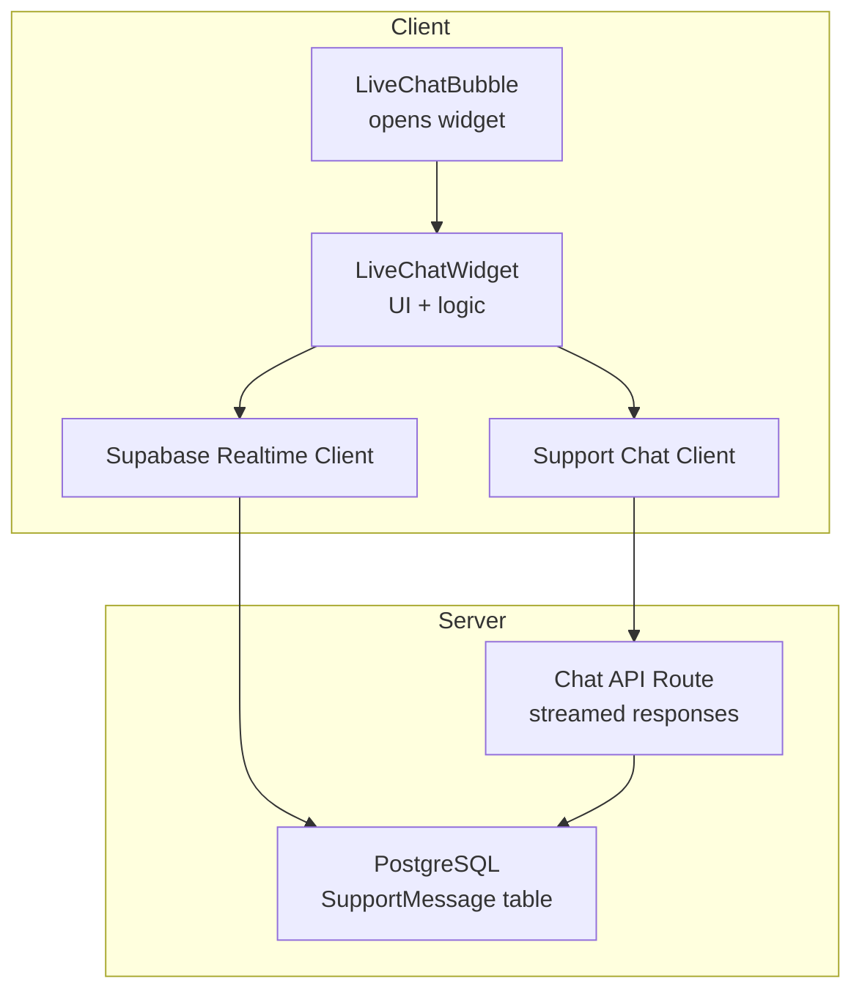
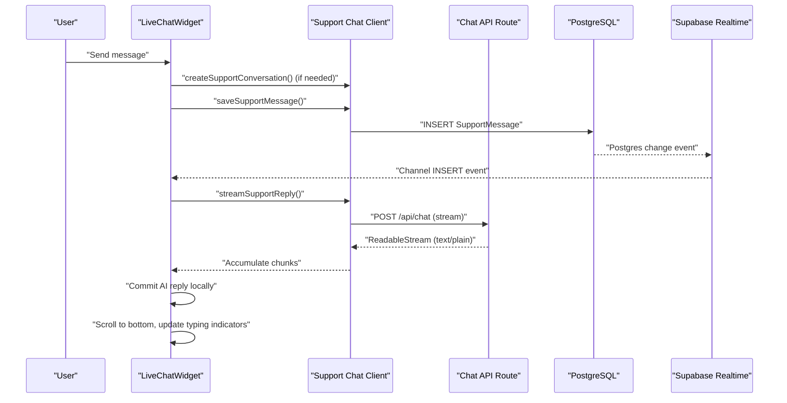
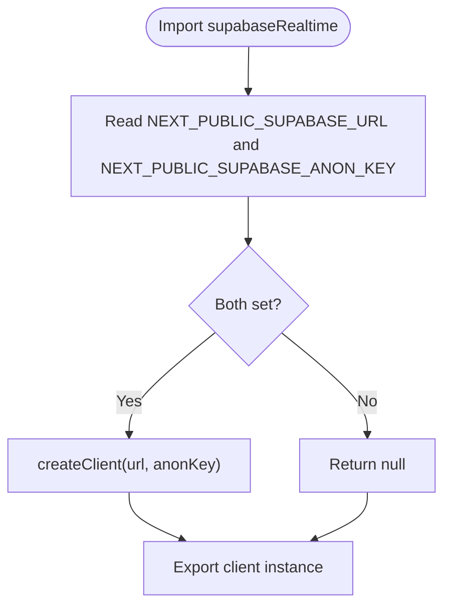
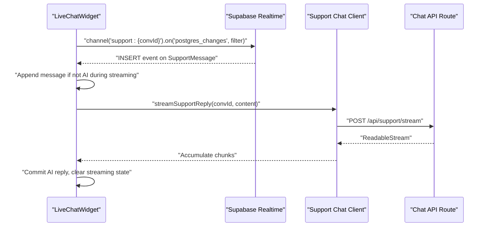
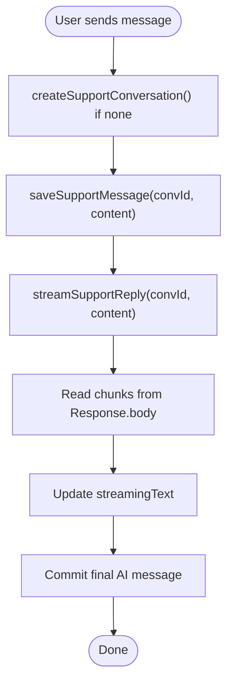
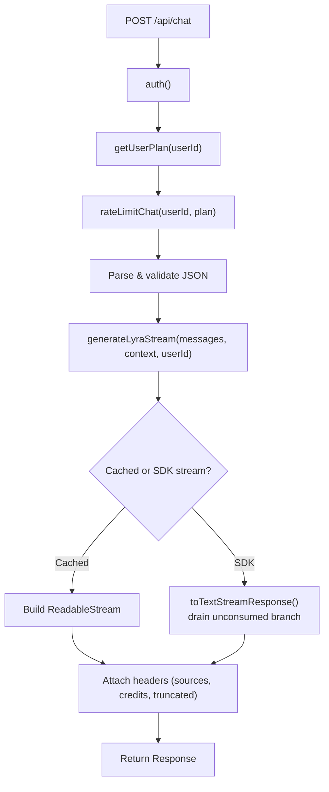
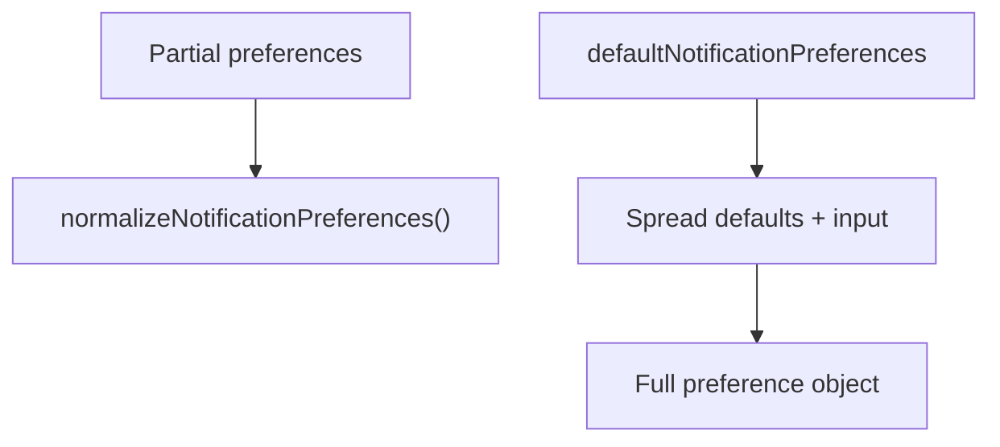
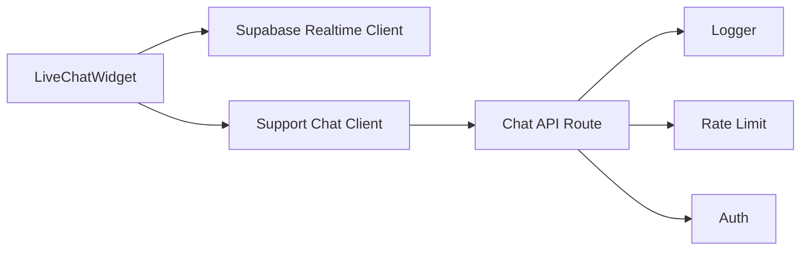

# Real-time Communication

<cite>
**Referenced Files in This Document**
- [supabase-realtime.ts](file://src/lib/supabase-realtime.ts)
- [support-chat-client.ts](file://src/lib/support-chat-client.ts)
- [route.ts](file://src/app/api/chat/route.ts)
- [live-chat-widget.tsx](file://src/components/dashboard/live-chat-widget.tsx)
- [live-chat-bubble.tsx](file://src/components/dashboard/live-chat-bubble.tsx)
- [notification-preferences.ts](file://src/lib/notification-preferences.ts)
</cite>

## Table of Contents
1. [Introduction](#introduction)
2. [Project Structure](#project-structure)
3. [Core Components](#core-components)
4. [Architecture Overview](#architecture-overview)
5. [Detailed Component Analysis](#detailed-component-analysis)
6. [Dependency Analysis](#dependency-analysis)
7. [Performance Considerations](#performance-considerations)
8. [Troubleshooting Guide](#troubleshooting-guide)
9. [Conclusion](#conclusion)

## Introduction
This document explains the real-time communication implementation in the project, focusing on Supabase real-time capabilities and WebSocket connections. It covers live chat, real-time notifications, push notification setup, and user presence tracking. It also details WebSocket connection management, message broadcasting, channel subscriptions, event handling, real-time data synchronization, conflict resolution, connection resilience, authentication and access control for real-time channels, secure message routing, configuration for real-time database triggers, client-side event listeners, connection state management, performance monitoring, connection pooling, and scaling considerations for high-concurrency scenarios.

## Project Structure
The real-time stack centers around:
- Supabase client initialization for real-time channels
- A live chat widget that subscribes to Supabase Postgres change events
- A support chat client that persists messages and streams AI replies
- A chat API that generates streamed responses and attaches metadata via headers
- Notification preferences for push and email alerts

**Diagram sources**
- [live-chat-bubble.tsx:32-91](file://src/components/dashboard/live-chat-bubble.tsx#L32-L91)
- [live-chat-widget.tsx:68-790](file://src/components/dashboard/live-chat-widget.tsx#L68-L790)
- [supabase-realtime.ts:1-9](file://src/lib/supabase-realtime.ts#L1-L9)
- [support-chat-client.ts:22-82](file://src/lib/support-chat-client.ts#L22-L82)
- [route.ts:21-206](file://src/app/api/chat/route.ts#L21-L206)

**Section sources**
- [supabase-realtime.ts:1-9](file://src/lib/supabase-realtime.ts#L1-L9)
- [support-chat-client.ts:22-82](file://src/lib/support-chat-client.ts#L22-L82)
- [route.ts:21-206](file://src/app/api/chat/route.ts#L21-L206)
- [live-chat-widget.tsx:68-790](file://src/components/dashboard/live-chat-widget.tsx#L68-L790)
- [live-chat-bubble.tsx:32-91](file://src/components/dashboard/live-chat-bubble.tsx#L32-L91)

## Core Components
- Supabase Realtime Client: Initializes a Supabase client for real-time channels when environment variables are present.
- Support Chat Client: Provides functions to fetch/create conversations, persist messages, and stream AI replies.
- Live Chat Widget: Manages UI state, optimistic rendering, real-time subscription to Supabase Postgres changes, and streaming of AI replies.
- Chat API: Generates streamed AI responses, attaches metadata via headers, and handles rate limits and safety guardrails.
- Notification Preferences: Defines default notification preferences and normalization logic for push/email/news alerts.

**Section sources**
- [supabase-realtime.ts:1-9](file://src/lib/supabase-realtime.ts#L1-L9)
- [support-chat-client.ts:22-82](file://src/lib/support-chat-client.ts#L22-L82)
- [live-chat-widget.tsx:68-790](file://src/components/dashboard/live-chat-widget.tsx#L68-L790)
- [route.ts:21-206](file://src/app/api/chat/route.ts#L21-L206)
- [notification-preferences.ts:1-35](file://src/lib/notification-preferences.ts#L1-L35)

## Architecture Overview
The real-time architecture integrates:
- Client-side Supabase channel subscriptions to PostgreSQL INSERT events on the SupportMessage table
- Server-side chat API that streams responses and commits messages to the database
- Client-side optimistic UI updates and subsequent reconciliation upon server acknowledgment
- Push notification preferences to gate delivery channels

**Diagram sources**
- [live-chat-widget.tsx:163-361](file://src/components/dashboard/live-chat-widget.tsx#L163-L361)
- [support-chat-client.ts:22-82](file://src/lib/support-chat-client.ts#L22-L82)
- [route.ts:21-206](file://src/app/api/chat/route.ts#L21-L206)

## Detailed Component Analysis

### Supabase Realtime Client
- Initializes a Supabase client only when both URL and anonymous key are present in environment variables.
- Exports a singleton-like client instance for reuse across components.

**Diagram sources**
- [supabase-realtime.ts:3-8](file://src/lib/supabase-realtime.ts#L3-L8)

**Section sources**
- [supabase-realtime.ts:1-9](file://src/lib/supabase-realtime.ts#L1-L9)

### Live Chat Widget
- Subscribes to Supabase channel events for the current conversation’s SupportMessage table.
- Handles INSERT events to append new messages, skipping AI replies during local streaming to prevent duplicates.
- Implements optimistic UI: renders user messages immediately, replaces temporary IDs with persisted IDs after save.
- Streams AI replies via the support chat client and commits the final message after streaming completes.
- Manages typing indicators, voice state, and scrolling behavior.

**Diagram sources**
- [live-chat-widget.tsx:180-214](file://src/components/dashboard/live-chat-widget.tsx#L180-L214)
- [live-chat-widget.tsx:314-359](file://src/components/dashboard/live-chat-widget.tsx#L314-L359)
- [support-chat-client.ts:53-82](file://src/lib/support-chat-client.ts#L53-L82)
- [route.ts:21-206](file://src/app/api/chat/route.ts#L21-L206)

**Section sources**
- [live-chat-widget.tsx:68-790](file://src/components/dashboard/live-chat-widget.tsx#L68-L790)

### Support Chat Client
- Fetches or creates a conversation, saves messages, and streams AI replies.
- Uses a readable stream reader to incrementally update the UI with server chunks.
- Handles fallbacks when a conversation is missing (404) by recreating it.

**Diagram sources**
- [support-chat-client.ts:31-82](file://src/lib/support-chat-client.ts#L31-L82)

**Section sources**
- [support-chat-client.ts:22-82](file://src/lib/support-chat-client.ts#L22-L82)

### Chat API
- Enforces authentication and rate limiting.
- Validates request payload and constructs a Lyra context.
- Streams responses either from a cached generator or from an SDK-backed stream.
- Drains the unconsumed tee branch to prevent backpressure and stalls.
- Attaches metadata via custom headers (sources, credits remaining, context truncated).

**Diagram sources**
- [route.ts:21-206](file://src/app/api/chat/route.ts#L21-L206)

**Section sources**
- [route.ts:21-206](file://src/app/api/chat/route.ts#L21-L206)

### Notification Preferences
- Defines default notification preferences for email, push, news alerts, and others.
- Provides a normalization function to merge partial preferences with defaults.

**Diagram sources**
- [notification-preferences.ts:1-35](file://src/lib/notification-preferences.ts#L1-L35)

**Section sources**
- [notification-preferences.ts:1-35](file://src/lib/notification-preferences.ts#L1-L35)

## Dependency Analysis
- LiveChatWidget depends on:
  - Supabase Realtime client for channel subscriptions
  - Support Chat Client for persistence and streaming
- Support Chat Client depends on:
  - Chat API for streamed responses
  - Backend database for message persistence
- Chat API depends on:
  - Authentication and rate-limiting utilities
  - AI generation service
  - Logging and error-handling utilities

**Diagram sources**
- [live-chat-widget.tsx:9-17](file://src/components/dashboard/live-chat-widget.tsx#L9-L17)
- [support-chat-client.ts:22-82](file://src/lib/support-chat-client.ts#L22-L82)
- [route.ts:1-15](file://src/app/api/chat/route.ts#L1-L15)

**Section sources**
- [live-chat-widget.tsx:9-17](file://src/components/dashboard/live-chat-widget.tsx#L9-L17)
- [support-chat-client.ts:22-82](file://src/lib/support-chat-client.ts#L22-L82)
- [route.ts:1-15](file://src/app/api/chat/route.ts#L1-L15)

## Performance Considerations
- Stream backpressure prevention: The SDK-backed stream drains the unconsumed tee branch to maintain throughput and avoid stalls.
- Header-based metadata: Sources list is capped and sent via headers to avoid body transformations and reduce overhead.
- Optimistic UI: Reduces perceived latency by rendering user messages immediately and reconciling with persisted IDs.
- Throttled scrolling: During streaming, scrolling is throttled to balance responsiveness and performance.
- Connection resilience: Channel subscriptions are attached when a conversation ID is available and cleaned up on unmount.

[No sources needed since this section provides general guidance]

## Troubleshooting Guide
- Real-time events not received:
  - Verify Supabase client initialization and environment variables.
  - Confirm the channel name pattern and filter conditions match the conversation ID.
- Duplicate AI messages during streaming:
  - The widget intentionally skips AI INSERT events while streaming to avoid duplication.
- Stream stalls or backpressure:
  - Ensure the unconsumed tee branch is drained for SDK-backed streams.
- Rate limit errors:
  - The Chat API returns 429 with Retry-After when usage limits are hit; surface a countdown UI.
- Push notification toggles:
  - Use normalized preferences to ensure defaults are applied consistently.

**Section sources**
- [supabase-realtime.ts:3-8](file://src/lib/supabase-realtime.ts#L3-L8)
- [live-chat-widget.tsx:180-214](file://src/components/dashboard/live-chat-widget.tsx#L180-L214)
- [route.ts:154-162](file://src/app/api/chat/route.ts#L154-L162)
- [route.ts:190-200](file://src/app/api/chat/route.ts#L190-L200)
- [notification-preferences.ts:27-34](file://src/lib/notification-preferences.ts#L27-L34)

## Conclusion
The project implements a robust real-time chat experience using Supabase Postgres change events and a streamed chat API. The client optimistically renders messages, subscribes to real-time updates, and streams AI responses with careful backpressure handling. Notification preferences provide a consistent baseline for push and email alerts. The architecture supports resilient connections, conflict-free updates, and scalable streaming for high-concurrency scenarios.