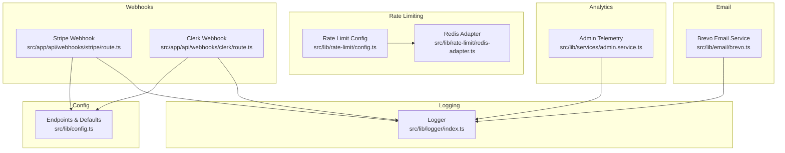
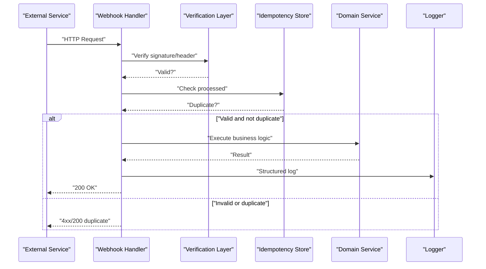
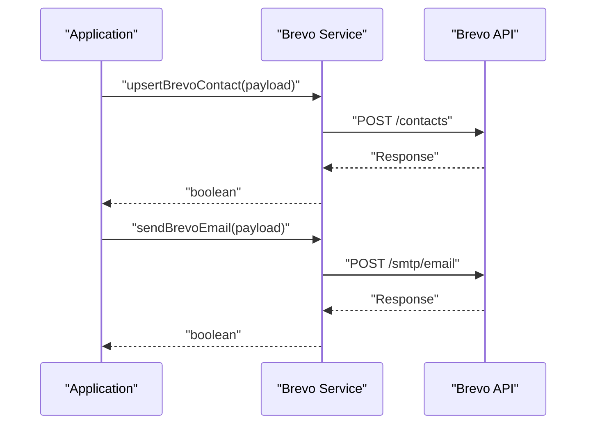
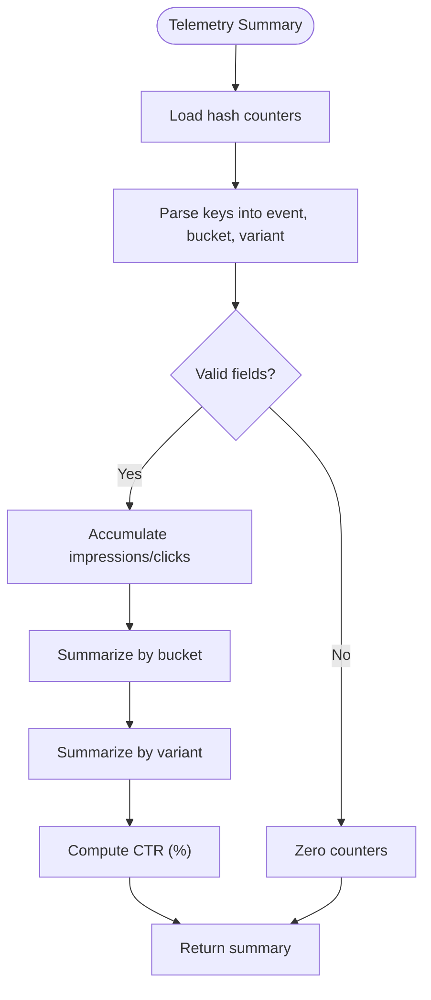
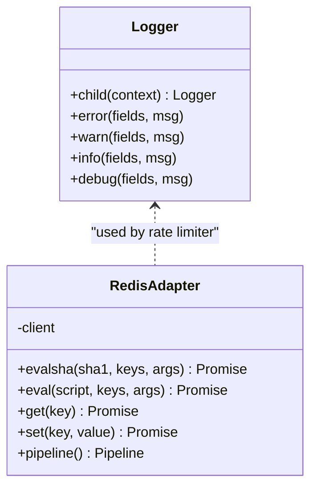
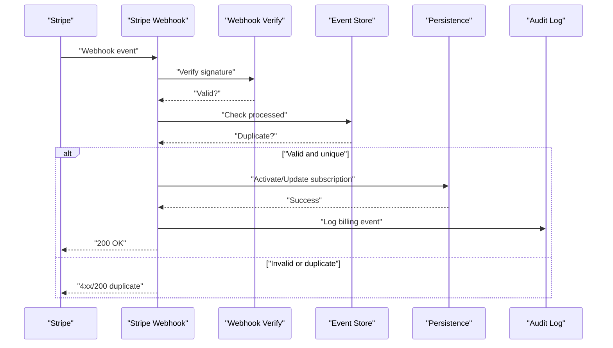
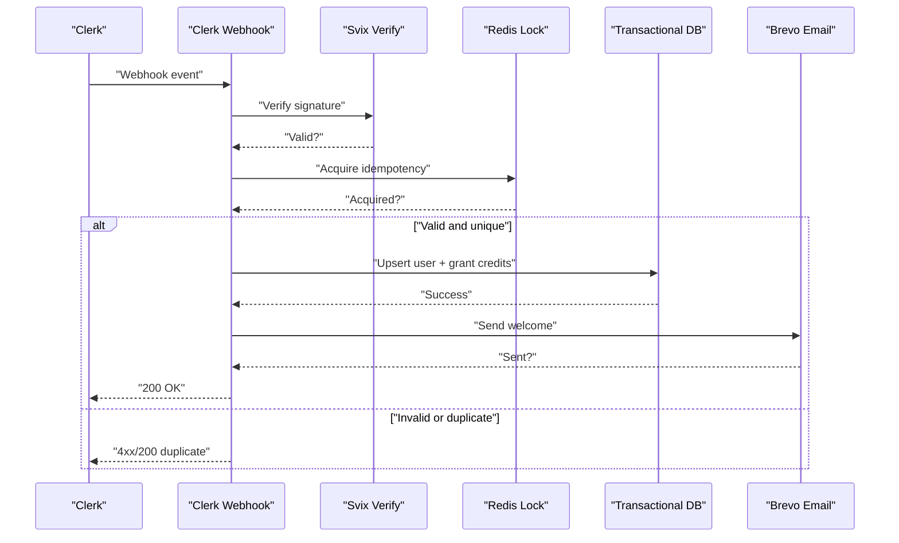
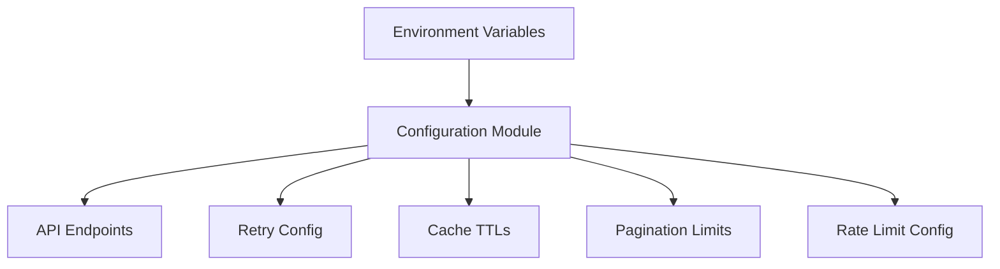
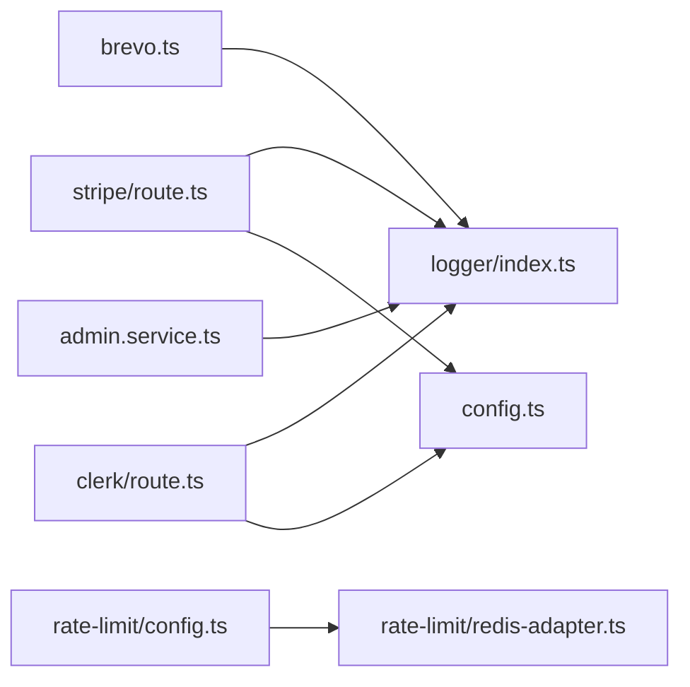

# Third-party Services

<cite>
**Referenced Files in This Document**
- [src/lib/email/brevo.ts](file://src/lib/email/brevo.ts)
- [src/lib/logger/index.ts](file://src/lib/logger/index.ts)
- [src/lib/rate-limit/config.ts](file://src/lib/rate-limit/config.ts)
- [src/lib/rate-limit/redis-adapter.ts](file://src/lib/rate-limit/redis-adapter.ts)
- [src/app/api/webhooks/stripe/route.ts](file://src/app/api/webhooks/stripe/route.ts)
- [src/app/api/webhooks/clerk/route.ts](file://src/app/api/webhooks/clerk/route.ts)
- [src/lib/config.ts](file://src/lib/config.ts)
- [src/lib/services/admin.service.ts](file://src/lib/services/admin.service.ts)
</cite>

## Table of Contents
1. [Introduction](#introduction)
2. [Project Structure](#project-structure)
3. [Core Components](#core-components)
4. [Architecture Overview](#architecture-overview)
5. [Detailed Component Analysis](#detailed-component-analysis)
6. [Dependency Analysis](#dependency-analysis)
7. [Performance Considerations](#performance-considerations)
8. [Troubleshooting Guide](#troubleshooting-guide)
9. [Conclusion](#conclusion)
10. [Appendices](#appendices)

## Introduction
This document explains third-party service integrations in the project, focusing on:
- Email delivery via Brevo for transactional emails, newsletters, and notifications
- Analytics and telemetry for usage tracking, user behavior analysis, and conversion metrics
- Monitoring and observability through structured logging and rate limiting
- Webhook integrations for external services (Stripe and Clerk), including idempotency, verification, and error handling
- Configuration management for multiple environments and service credentials
- Testing strategies, mock implementations, and graceful degradation
- Compliance and privacy considerations

## Project Structure
The relevant integration surfaces are organized by domain:
- Email: Brevo integration for contacts and sending
- Logging: Centralized logger with redaction and environment-aware formatting
- Rate limiting: Redis-backed sliding/fixed window limits with analytics toggles
- Webhooks: Stripe billing lifecycle and Clerk identity lifecycle
- Configuration: Environment-driven endpoints and defaults
- Analytics: Telemetry aggregation for experiments and engagement

**Diagram sources**
- [src/lib/email/brevo.ts:1-132](file://src/lib/email/brevo.ts#L1-L132)
- [src/lib/logger/index.ts:1-91](file://src/lib/logger/index.ts#L1-L91)
- [src/lib/rate-limit/config.ts:1-107](file://src/lib/rate-limit/config.ts#L1-L107)
- [src/lib/rate-limit/redis-adapter.ts:1-127](file://src/lib/rate-limit/redis-adapter.ts#L1-L127)
- [src/app/api/webhooks/stripe/route.ts:1-430](file://src/app/api/webhooks/stripe/route.ts#L1-L430)
- [src/app/api/webhooks/clerk/route.ts:1-379](file://src/app/api/webhooks/clerk/route.ts#L1-L379)
- [src/lib/config.ts:1-83](file://src/lib/config.ts#L1-L83)
- [src/lib/services/admin.service.ts:901-974](file://src/lib/services/admin.service.ts#L901-L974)

**Section sources**
- [src/lib/email/brevo.ts:1-132](file://src/lib/email/brevo.ts#L1-L132)
- [src/lib/logger/index.ts:1-91](file://src/lib/logger/index.ts#L1-L91)
- [src/lib/rate-limit/config.ts:1-107](file://src/lib/rate-limit/config.ts#L1-L107)
- [src/lib/rate-limit/redis-adapter.ts:1-127](file://src/lib/rate-limit/redis-adapter.ts#L1-L127)
- [src/app/api/webhooks/stripe/route.ts:1-430](file://src/app/api/webhooks/stripe/route.ts#L1-L430)
- [src/app/api/webhooks/clerk/route.ts:1-379](file://src/app/api/webhooks/clerk/route.ts#L1-L379)
- [src/lib/config.ts:1-83](file://src/lib/config.ts#L1-L83)
- [src/lib/services/admin.service.ts:901-974](file://src/lib/services/admin.service.ts#L901-L974)

## Core Components
- Email service (Brevo): Provides contact upsert, email send, and newsletter subscription/unsubscription with environment guards and robust error logging.
- Logging: Centralized logger with redaction, structured formatting, and child logger factory.
- Rate limiting: Tiered limits with sliding/fixed windows, analytics toggles, and Redis adapter compatibility.
- Webhooks: Stripe billing lifecycle and Clerk identity lifecycle with verification, idempotency, and transactional safety.
- Configuration: Environment-driven endpoints and defaults for broker connectors and other third-party APIs.
- Analytics: Telemetry aggregation for experiments and engagement metrics.

**Section sources**
- [src/lib/email/brevo.ts:1-132](file://src/lib/email/brevo.ts#L1-L132)
- [src/lib/logger/index.ts:1-91](file://src/lib/logger/index.ts#L1-L91)
- [src/lib/rate-limit/config.ts:1-107](file://src/lib/rate-limit/config.ts#L1-L107)
- [src/lib/rate-limit/redis-adapter.ts:1-127](file://src/lib/rate-limit/redis-adapter.ts#L1-L127)
- [src/app/api/webhooks/stripe/route.ts:1-430](file://src/app/api/webhooks/stripe/route.ts#L1-L430)
- [src/app/api/webhooks/clerk/route.ts:1-379](file://src/app/api/webhooks/clerk/route.ts#L1-L379)
- [src/lib/config.ts:1-83](file://src/lib/config.ts#L1-L83)
- [src/lib/services/admin.service.ts:901-974](file://src/lib/services/admin.service.ts#L901-L974)

## Architecture Overview
The integrations follow a layered pattern:
- Application handlers (webhooks) validate authenticity and idempotency, then orchestrate domain operations
- Domain services encapsulate business logic and persistence
- External clients (Brevo, Stripe, Redis) are accessed through typed adapters and environment-configured endpoints
- Observability is achieved via structured logs and telemetry aggregation

**Diagram sources**
- [src/app/api/webhooks/stripe/route.ts:123-429](file://src/app/api/webhooks/stripe/route.ts#L123-L429)
- [src/app/api/webhooks/clerk/route.ts:50-378](file://src/app/api/webhooks/clerk/route.ts#L50-L378)
- [src/lib/logger/index.ts:1-91](file://src/lib/logger/index.ts#L1-L91)

## Detailed Component Analysis

### Email Delivery (Brevo)
- Responsibilities:
  - Upsert contacts with attributes and list membership
  - Send transactional HTML/text emails with sender identity
  - Manage newsletter subscription/unsubscription via list IDs
- Configuration:
  - API key, sender email/name, list IDs via environment variables
  - Base URL for Brevo API
- Error handling:
  - Graceful no-op when secrets are missing
  - Structured warnings and errors with sanitized payloads
- Security and privacy:
  - Redacted logging paths protect sensitive fields

**Diagram sources**
- [src/lib/email/brevo.ts:66-106](file://src/lib/email/brevo.ts#L66-L106)

**Section sources**
- [src/lib/email/brevo.ts:1-132](file://src/lib/email/brevo.ts#L1-L132)
- [src/lib/logger/index.ts:1-91](file://src/lib/logger/index.ts#L1-L91)

### Analytics and Telemetry
- Experiment and engagement telemetry:
  - Aggregates impression/click counts by bucket and variant
  - Computes CTR percentages and rollups
  - Returns zeroed summaries when storage is unavailable (graceful degradation)
- Data model:
  - Hash keys encode event type, bucket, and variant
  - Rollups aggregated per variant and globally

**Diagram sources**
- [src/lib/services/admin.service.ts:901-974](file://src/lib/services/admin.service.ts#L901-L974)

**Section sources**
- [src/lib/services/admin.service.ts:901-974](file://src/lib/services/admin.service.ts#L901-L974)

### Monitoring and Observability
- Logging:
  - Environment-aware formatting (development vs production)
  - Automatic redaction of sensitive fields
  - Child logger factory for contextual logs
- Rate limiting:
  - Sliding/fixed window implementations
  - Analytics toggle per endpoint
  - Redis adapter compatibility for ioredis-like clients

**Diagram sources**
- [src/lib/logger/index.ts:1-91](file://src/lib/logger/index.ts#L1-L91)
- [src/lib/rate-limit/redis-adapter.ts:1-127](file://src/lib/rate-limit/redis-adapter.ts#L1-L127)

**Section sources**
- [src/lib/logger/index.ts:1-91](file://src/lib/logger/index.ts#L1-L91)
- [src/lib/rate-limit/config.ts:1-107](file://src/lib/rate-limit/config.ts#L1-L107)
- [src/lib/rate-limit/redis-adapter.ts:1-127](file://src/lib/rate-limit/redis-adapter.ts#L1-L127)

### Webhook Integrations

#### Stripe Webhook
- Purpose: Fulfill billing lifecycle events (checkout, invoices, subscriptions, disputes, refunds)
- Security:
  - Signature verification with webhook secret
  - Idempotency check to avoid duplicate processing
  - Validation of payload shape
- Orchestration:
  - Resolves user by customer ID or metadata fallback
  - Activates/updates subscriptions, grants credits, records billing audit events
  - Handles edge cases (zero-amount invoices, subscription changes)

**Diagram sources**
- [src/app/api/webhooks/stripe/route.ts:123-429](file://src/app/api/webhooks/stripe/route.ts#L123-L429)

**Section sources**
- [src/app/api/webhooks/stripe/route.ts:1-430](file://src/app/api/webhooks/stripe/route.ts#L1-L430)

#### Clerk Webhook
- Purpose: Sync identity lifecycle (created, updated, deleted) and send welcome emails
- Security:
  - Signature verification using Svix headers
  - Idempotency lock via Redis to prevent duplicates
- Operations:
  - Creates/updates users with plan and credits
  - Grants sign-up bonus credits atomically
  - Sends welcome email via Brevo with deduplication
  - GDPR-compliant deletion: anonymizes PII and purges user content

**Diagram sources**
- [src/app/api/webhooks/clerk/route.ts:50-378](file://src/app/api/webhooks/clerk/route.ts#L50-L378)
- [src/lib/email/brevo.ts:66-106](file://src/lib/email/brevo.ts#L66-L106)

**Section sources**
- [src/app/api/webhooks/clerk/route.ts:1-379](file://src/app/api/webhooks/clerk/route.ts#L1-L379)

### Configuration Management
- Environment-driven endpoints for broker connectors with strict overrides to prevent SSRF
- Retry, cache, pagination defaults centralized for data operations
- Rate limit tiers and windows defined centrally with analytics toggles

**Diagram sources**
- [src/lib/config.ts:1-83](file://src/lib/config.ts#L1-L83)
- [src/lib/rate-limit/config.ts:1-107](file://src/lib/rate-limit/config.ts#L1-L107)

**Section sources**
- [src/lib/config.ts:1-83](file://src/lib/config.ts#L1-L83)
- [src/lib/rate-limit/config.ts:1-107](file://src/lib/rate-limit/config.ts#L1-L107)

## Dependency Analysis
- Email service depends on:
  - Environment variables for API keys and sender identity
  - Logger for structured warnings/errors
- Webhooks depend on:
  - Verification libraries for authenticity
  - Idempotency stores (Redis) for duplicate prevention
  - Domain services for business logic
  - Logger for audit trails
- Rate limiting depends on:
  - Redis client via adapter
  - Configuration module for limits and analytics

**Diagram sources**
- [src/lib/email/brevo.ts:1-132](file://src/lib/email/brevo.ts#L1-L132)
- [src/lib/logger/index.ts:1-91](file://src/lib/logger/index.ts#L1-L91)
- [src/lib/rate-limit/config.ts:1-107](file://src/lib/rate-limit/config.ts#L1-L107)
- [src/lib/rate-limit/redis-adapter.ts:1-127](file://src/lib/rate-limit/redis-adapter.ts#L1-L127)
- [src/app/api/webhooks/stripe/route.ts:1-430](file://src/app/api/webhooks/stripe/route.ts#L1-L430)
- [src/app/api/webhooks/clerk/route.ts:1-379](file://src/app/api/webhooks/clerk/route.ts#L1-L379)
- [src/lib/config.ts:1-83](file://src/lib/config.ts#L1-L83)
- [src/lib/services/admin.service.ts:901-974](file://src/lib/services/admin.service.ts#L901-L974)

**Section sources**
- [src/lib/email/brevo.ts:1-132](file://src/lib/email/brevo.ts#L1-L132)
- [src/lib/logger/index.ts:1-91](file://src/lib/logger/index.ts#L1-L91)
- [src/lib/rate-limit/config.ts:1-107](file://src/lib/rate-limit/config.ts#L1-L107)
- [src/lib/rate-limit/redis-adapter.ts:1-127](file://src/lib/rate-limit/redis-adapter.ts#L1-L127)
- [src/app/api/webhooks/stripe/route.ts:1-430](file://src/app/api/webhooks/stripe/route.ts#L1-L430)
- [src/app/api/webhooks/clerk/route.ts:1-379](file://src/app/api/webhooks/clerk/route.ts#L1-L379)
- [src/lib/config.ts:1-83](file://src/lib/config.ts#L1-L83)
- [src/lib/services/admin.service.ts:901-974](file://src/lib/services/admin.service.ts#L901-L974)

## Performance Considerations
- Email operations:
  - Guarded by environment checks to avoid unnecessary network calls
  - Structured logging for latency and error visibility
- Rate limiting:
  - Sliding window for burst control; fixed window for cost efficiency
  - Analytics toggle to reduce overhead where not needed
  - Redis adapter minimizes round-trips via pipelining
- Webhooks:
  - Idempotency prevents redundant processing under retries
  - Transactional writes reduce partial state risk

[No sources needed since this section provides general guidance]

## Troubleshooting Guide
- Missing secrets:
  - Brevo API key or sender email/name: operations gracefully no-op with warnings
  - Stripe/Clerk webhook secrets: handlers return 500 or 400 depending on verification outcome
- Duplicate processing:
  - Stripe: idempotency check skips already-processed events
  - Clerk: Redis-based lock prevents duplicate user creation/updates
- Webhook verification failures:
  - Signature mismatch or malformed payload leads to explicit error logs and 400 responses
- Redis connectivity:
  - Rate limiter falls back to in-memory behavior via adapter; telemetry returns zeroed summaries when storage is unavailable

**Section sources**
- [src/lib/email/brevo.ts:23-64](file://src/lib/email/brevo.ts#L23-L64)
- [src/app/api/webhooks/stripe/route.ts:123-155](file://src/app/api/webhooks/stripe/route.ts#L123-L155)
- [src/app/api/webhooks/clerk/route.ts:42-92](file://src/app/api/webhooks/clerk/route.ts#L42-L92)
- [src/lib/rate-limit/redis-adapter.ts:87-90](file://src/lib/rate-limit/redis-adapter.ts#L87-L90)
- [src/lib/services/admin.service.ts:925-927](file://src/lib/services/admin.service.ts#L925-L927)

## Conclusion
The project integrates third-party services with strong emphasis on:
- Security: signature verification, idempotency, and environment-guarded operations
- Observability: structured logs, telemetry aggregation, and rate-limit analytics
- Reliability: graceful degradation, transactional writes, and robust error handling
- Compliance: GDPR-compliant deletion flows and redacted logging

[No sources needed since this section summarizes without analyzing specific files]

## Appendices

### Configuration Reference
- Email (Brevo):
  - Required: BREVO_API_KEY, BREVO_SENDER_EMAIL, optional BREVO_SENDER_NAME
  - Lists: BREVO_ONBOARDING_LIST_ID, BREVO_BLOG_LIST_ID
- Stripe:
  - Required: STRIPE_WEBHOOK_SECRET, STRIPE_SECRET_KEY
- Clerk:
  - Required: CLERK_WEBHOOK_SECRET
- Broker endpoints:
  - Override base URLs via environment variables (e.g., KOINX_API_URL, BINANCE_API_URL, etc.)

**Section sources**
- [src/lib/email/brevo.ts:23-25](file://src/lib/email/brevo.ts#L23-L25)
- [src/app/api/webhooks/stripe/route.ts:125-129](file://src/app/api/webhooks/stripe/route.ts#L125-L129)
- [src/app/api/webhooks/clerk/route.ts:51-56](file://src/app/api/webhooks/clerk/route.ts#L51-L56)
- [src/lib/config.ts:6-59](file://src/lib/config.ts#L6-L59)