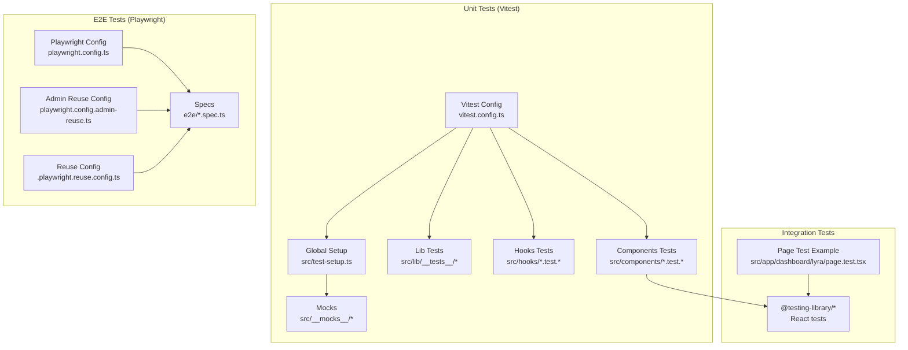
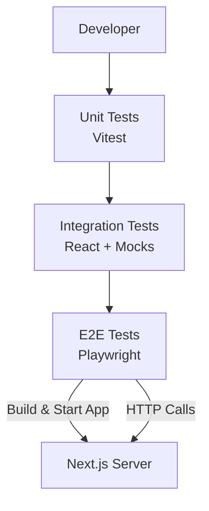
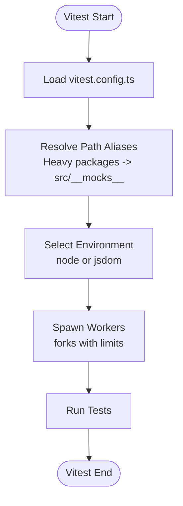
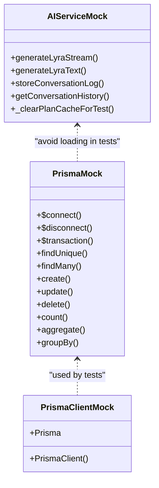
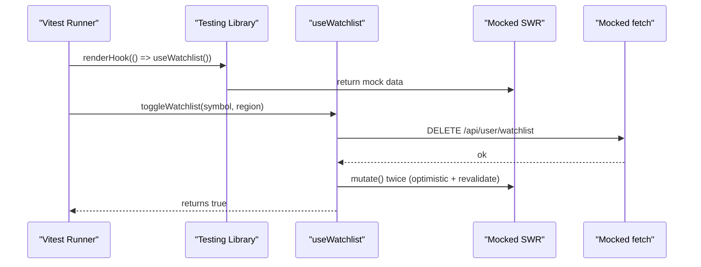
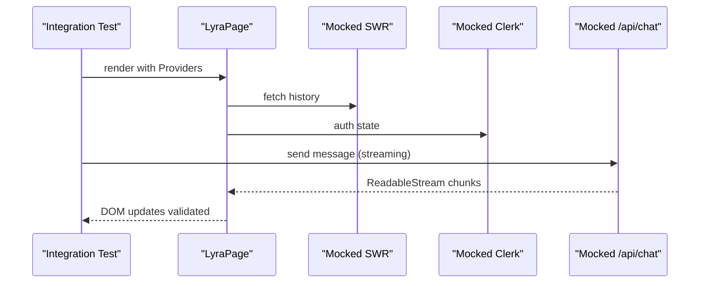
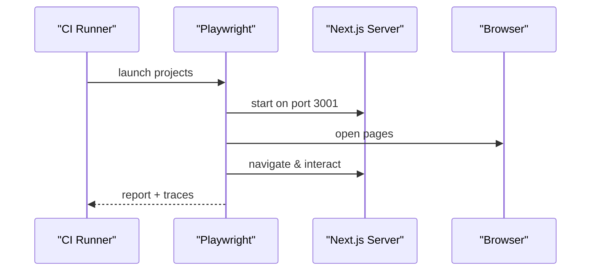
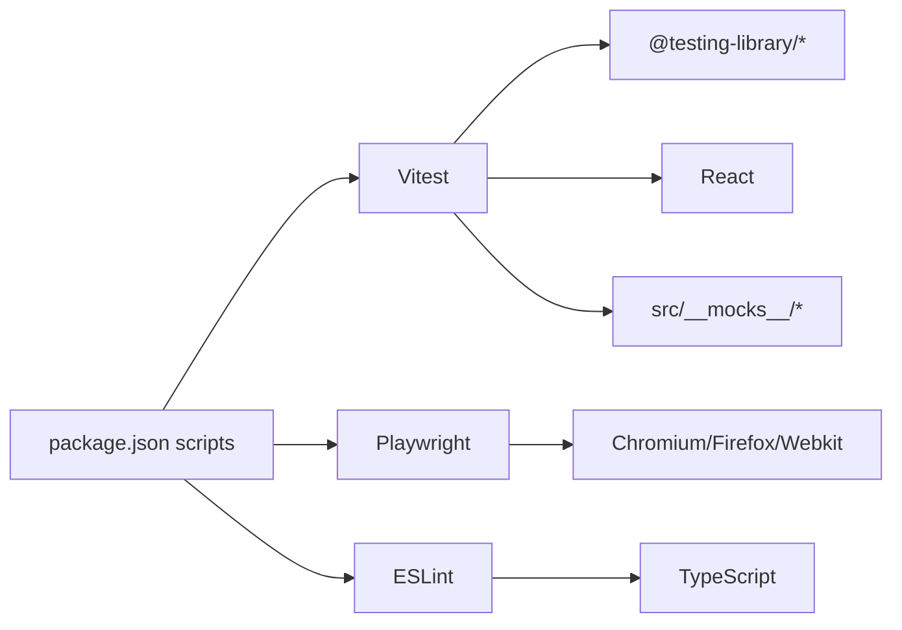

# Testing & Quality Assurance

<cite>
**Referenced Files in This Document**
- [vitest.config.ts](file://vitest.config.ts)
- [playwright.config.ts](file://playwright.config.ts)
- [.playwright.reuse.config.ts](file://.playwright.reuse.config.ts)
- [playwright.config.admin-reuse.ts](file://playwright.config.admin-reuse.ts)
- [eslint.config.mjs](file://eslint.config.mjs)
- [package.json](file://package.json)
- [src/test-setup.ts](file://src/test-setup.ts)
- [src/__mocks__/prisma.ts](file://src/__mocks__/prisma.ts)
- [src/__mocks__/prisma-client.ts](file://src/__mocks__/prisma-client.ts)
- [src/__mocks__/ai-service.ts](file://src/__mocks__/ai-service.ts)
- [src/lib/__tests__/utils.test.ts](file://src/lib/__tests__/utils.test.ts)
- [src/lib/__tests__/schemas-context.test.ts](file://src/lib/__tests__/schemas-context.test.ts)
- [src/hooks/use-watchlist.test.ts](file://src/hooks/use-watchlist.test.ts)
- [src/components/theme-toggle.test.tsx](file://src/components/theme-toggle.test.tsx)
- [src/app/dashboard/lyra/page.test.tsx](file://src/app/dashboard/lyra/page.test.tsx)
- [e2e/full-e2e-audit.spec.ts](file://e2e/full-e2e-audit.spec.ts)
- [e2e/admin-analytics.spec.ts](file://e2e/admin-analytics.spec.ts)
- [e2e/visual-snapshots.spec.ts](file://e2e/visual-snapshots.spec.ts)
- [e2e/mobile-responsive.spec.ts](file://e2e/mobile-responsive.spec.ts)
- [e2e/onboarding.spec.ts](file://e2e/onboarding.spec.ts)
</cite>

## Table of Contents
1. [Introduction](#introduction)
2. [Project Structure](#project-structure)
3. [Core Components](#core-components)
4. [Architecture Overview](#architecture-overview)
5. [Detailed Component Analysis](#detailed-component-analysis)
6. [Dependency Analysis](#dependency-analysis)
7. [Performance Considerations](#performance-considerations)
8. [Troubleshooting Guide](#troubleshooting-guide)
9. [Conclusion](#conclusion)
10. [Appendices](#appendices)

## Introduction
This document defines LyraAlpha’s testing and quality assurance strategy. It covers unit testing with Vitest, integration testing, and end-to-end testing with Playwright. It also documents test organization, mocking strategies, test data management, code quality tooling (ESLint, TypeScript compilation, static analysis), performance and load testing procedures, memory optimization validation, continuous integration practices, automated workflows, quality gates, and guidelines for writing effective tests and maintaining coverage.

## Project Structure
The repository organizes tests across three layers:
- Unit tests: Located under src/lib/__tests__, src/components/*.test.* files, and src/hooks/*.test.* files.
- Integration tests: Mixed with unit tests in the same directories, often using React Testing Library and targeted mocks.
- End-to-end tests: Located under e2e/*.spec.ts, driven by Playwright.

Key configuration files:
- Vitest: [vitest.config.ts](file://vitest.config.ts)
- Playwright: [playwright.config.ts](file://playwright.config.ts), plus reuse variants [playwright.config.admin-reuse.ts](file://playwright.config.admin-reuse.ts) and [.playwright.reuse.config.ts](file://.playwright.reuse.config.ts)
- Linting: [eslint.config.mjs](file://eslint.config.mjs)
- Scripts and tooling: [package.json](file://package.json)

**Diagram sources**
- [vitest.config.ts](file://vitest.config.ts)
- [src/test-setup.ts](file://src/test-setup.ts)
- [src/__mocks__/prisma.ts](file://src/__mocks__/prisma.ts)
- [src/lib/__tests__/utils.test.ts](file://src/lib/__tests__/utils.test.ts)
- [src/hooks/use-watchlist.test.ts](file://src/hooks/use-watchlist.test.ts)
- [src/components/theme-toggle.test.tsx](file://src/components/theme-toggle.test.tsx)
- [src/app/dashboard/lyra/page.test.tsx](file://src/app/dashboard/lyra/page.test.tsx)
- [playwright.config.ts](file://playwright.config.ts)
- [playwright.config.admin-reuse.ts](file://playwright.config.admin-reuse.ts)
- [.playwright.reuse.config.ts](file://.playwright.reuse.config.ts)
- [e2e/full-e2e-audit.spec.ts](file://e2e/full-e2e-audit.spec.ts)

**Section sources**
- [vitest.config.ts](file://vitest.config.ts)
- [playwright.config.ts](file://playwright.config.ts)
- [eslint.config.mjs](file://eslint.config.mjs)
- [package.json](file://package.json)

## Core Components
- Vitest configuration sets up React plugin, path aliases, Node environment, global setup, worker pools, and timeouts. It excludes E2E directories and targets test/spec files under src/.
- Playwright configuration defines parallelism, retries, workers, reporters, device projects, base URL, traces, and a web server that builds and starts the app on a dedicated port for E2E runs.
- ESLint configuration composes Next.js core-web-vitals and TypeScript configs, overrides ignores, and customizes unused variable rules.
- Global test setup prevents native Node addon crashes by mocking heavy packages in fork workers.

Key behaviors:
- Aliasing heavy packages to lightweight mocks prevents OOM and segfaults during parallel test execution.
- Environment selection: most tests run in Node; browser-dependent components opt into jsdom via environment markers.
- Mocks are centralized under src/__mocks__ and complement per-test mocks for precise control.

**Section sources**
- [vitest.config.ts](file://vitest.config.ts)
- [src/test-setup.ts](file://src/test-setup.ts)
- [eslint.config.mjs](file://eslint.config.mjs)
- [package.json](file://package.json)

## Architecture Overview
The testing architecture separates concerns:
- Unit tests validate pure logic and component behavior with minimal external dependencies.
- Integration tests validate component interactions and API integrations using targeted mocks.
- E2E tests validate cross-feature workflows against a real server instance.

[No sources needed since this diagram shows conceptual workflow, not actual code structure]

## Detailed Component Analysis

### Vitest Configuration and Global Setup
- Environment: Node by default; opt-in jsdom via environment markers in specific tests.
- Aliases: Heavy native packages are redirected to lightweight mocks; path alias "@" resolves to src/.
- Worker pool: Forks with bounded concurrency to balance speed and memory.
- Global setup: Prevents pg and Prisma native binaries from loading in workers.
- Test inclusion: Includes src/**/*.{test,spec}.{js,mjs,cjs,ts,mts,cts,jsx,tsx}, excluding e2e and node_modules.

**Diagram sources**
- [vitest.config.ts](file://vitest.config.ts)
- [src/test-setup.ts](file://src/test-setup.ts)

**Section sources**
- [vitest.config.ts](file://vitest.config.ts)
- [src/test-setup.ts](file://src/test-setup.ts)

### Mocking Strategies
- Centralized mocks: src/__mocks__ provides no-op implementations for Prisma, Prisma client, and AI service to avoid loading native binaries and heavy dependencies.
- Per-test mocks: Tests can override specific methods using vi.mock to isolate behavior and assert interactions precisely.
- Example patterns:
  - Prisma: Proxy-based mock that returns model stubs for any table name.
  - AI service: Lightweight mock of generation and logging functions.
  - React/SWR/Clerk: Mocked to avoid network calls and heavy UI libraries in tests.

**Diagram sources**
- [src/__mocks__/prisma.ts](file://src/__mocks__/prisma.ts)
- [src/__mocks__/prisma-client.ts](file://src/__mocks__/prisma-client.ts)
- [src/__mocks__/ai-service.ts](file://src/__mocks__/ai-service.ts)

**Section sources**
- [src/__mocks__/prisma.ts](file://src/__mocks__/prisma.ts)
- [src/__mocks__/prisma-client.ts](file://src/__mocks__/prisma-client.ts)
- [src/__mocks__/ai-service.ts](file://src/__mocks__/ai-service.ts)

### Unit Testing Examples
- Utils library tests validate formatting, currency, and computation helpers with region-aware logic.
- Schemas context tests enforce structural validation for chat context data to prevent injection and enforce length limits.
- Hooks tests validate state transitions and optimistic updates using mocked SWR and fetch.
- Component tests validate rendering, user interactions, and theme switching behavior.

**Diagram sources**
- [src/hooks/use-watchlist.test.ts](file://src/hooks/use-watchlist.test.ts)

**Section sources**
- [src/lib/__tests__/utils.test.ts](file://src/lib/__tests__/utils.test.ts)
- [src/lib/__tests__/schemas-context.test.ts](file://src/lib/__tests__/schemas-context.test.ts)
- [src/hooks/use-watchlist.test.ts](file://src/hooks/use-watchlist.test.ts)
- [src/components/theme-toggle.test.tsx](file://src/components/theme-toggle.test.tsx)

### Integration Testing Patterns
- Page-level integration tests demonstrate realistic flows: dynamic imports, navigation, error boundaries, and API interactions.
- Mock strategies include next/dynamic, next/link, Clerk auth, SWR, and UI components to isolate behavior and avoid browser/UI complexities.
- Streaming responses are simulated using ReadableStream to validate UI behavior during long-running operations.

**Diagram sources**
- [src/app/dashboard/lyra/page.test.tsx](file://src/app/dashboard/lyra/page.test.tsx)

**Section sources**
- [src/app/dashboard/lyra/page.test.tsx](file://src/app/dashboard/lyra/page.test.tsx)

### End-to-End Testing with Playwright
- Projects: Chromium, Firefox, WebKit, Mobile Chrome, Mobile Safari.
- Base URL: http://127.0.0.1:3001; reusable server avoids startup overhead in CI.
- Headers: Skip auth and rate limit for deterministic runs.
- Web server: Builds and starts the app on a dedicated port; environment variables enable E2E user plan gating.
- Reports: HTML in CI, list locally; traces captured on first retry.

**Diagram sources**
- [playwright.config.ts](file://playwright.config.ts)

**Section sources**
- [playwright.config.ts](file://playwright.config.ts)
- [playwright.config.admin-reuse.ts](file://playwright.config.admin-reuse.ts)
- [.playwright.reuse.config.ts](file://.playwright.reuse.config.ts)

### Test Organization and Naming Conventions
- Unit tests: src/lib/__tests__ for pure logic; src/hooks/*.test.ts for hook logic; src/components/*.test.tsx for component logic.
- Integration tests: colocated with the tested components/pages (e.g., src/app/dashboard/lyra/page.test.tsx).
- E2E tests: under e2e/*.spec.ts with descriptive names indicating scope (audit, admin, visual snapshots, mobile responsiveness, onboarding).

**Section sources**
- [src/lib/__tests__/utils.test.ts](file://src/lib/__tests__/utils.test.ts)
- [src/lib/__tests__/schemas-context.test.ts](file://src/lib/__tests__/schemas-context.test.ts)
- [src/hooks/use-watchlist.test.ts](file://src/hooks/use-watchlist.test.ts)
- [src/components/theme-toggle.test.tsx](file://src/components/theme-toggle.test.tsx)
- [src/app/dashboard/lyra/page.test.tsx](file://src/app/dashboard/lyra/page.test.tsx)
- [e2e/full-e2e-audit.spec.ts](file://e2e/full-e2e-audit.spec.ts)
- [e2e/admin-analytics.spec.ts](file://e2e/admin-analytics.spec.ts)
- [e2e/visual-snapshots.spec.ts](file://e2e/visual-snapshots.spec.ts)
- [e2e/mobile-responsive.spec.ts](file://e2e/mobile-responsive.spec.ts)
- [e2e/onboarding.spec.ts](file://e2e/onboarding.spec.ts)

### Test Data Management
- Mocked data: Returned from vi.mocked(...) calls and returned by mocked SWR/useSWR.
- Streaming simulation: ReadableStream is constructed per test to emulate server-sent events.
- Environment-driven seeding: E2E uses environment variables to seed plan-gated features deterministically.

**Section sources**
- [src/app/dashboard/lyra/page.test.tsx](file://src/app/dashboard/lyra/page.test.tsx)
- [playwright.config.ts](file://playwright.config.ts)

## Dependency Analysis
- Toolchain dependencies:
  - Vitest: test runner and assertion library.
  - React Testing Library: DOM-centric testing utilities.
  - Playwright: browser automation and E2E orchestration.
  - ESLint + Next configs: linting and TypeScript enforcement.
- Internal dependencies:
  - src/__mocks__ provides shared mocks for heavy packages.
  - src/test-setup.ts centralizes global mock registrations.

**Diagram sources**
- [package.json](file://package.json)
- [vitest.config.ts](file://vitest.config.ts)
- [playwright.config.ts](file://playwright.config.ts)
- [eslint.config.mjs](file://eslint.config.mjs)

**Section sources**
- [package.json](file://package.json)
- [vitest.config.ts](file://vitest.config.ts)
- [playwright.config.ts](file://playwright.config.ts)
- [eslint.config.mjs](file://eslint.config.mjs)

## Performance Considerations
- Unit test performance:
  - Node environment reduces overhead compared to jsdom.
  - Fork workers with bounded concurrency minimize memory pressure.
  - Aliasing heavy packages prevents native binary loading and OOM.
- E2E performance:
  - Reuse existing server in CI to avoid repeated builds.
  - Device projects reduce resource contention; adjust workers accordingly.
  - Shorten timeouts for local runs; increase in CI.
- Memory optimization validation:
  - Global setup mocks heavy native packages to prevent crashes.
  - Use per-test mocks to limit scope and avoid accumulating state.

[No sources needed since this section provides general guidance]

## Troubleshooting Guide
Common issues and resolutions:
- Native addon crashes in tests:
  - Ensure global setup is loaded and heavy packages are mocked.
  - Keep environment default to Node; opt into jsdom only where necessary.
- OOM during large test suites:
  - Reduce worker count or increase memory via NODE_OPTIONS.
  - Prefer targeted mocks and avoid loading real clients in workers.
- E2E flakiness:
  - Increase retries and enable trace capture on first retry.
  - Use reusable server in CI to stabilize startup.
- Lint/type failures:
  - Run lint and typecheck scripts locally before committing.
  - Adjust ESLint rules to match team conventions while preserving safety.

**Section sources**
- [src/test-setup.ts](file://src/test-setup.ts)
- [vitest.config.ts](file://vitest.config.ts)
- [playwright.config.ts](file://playwright.config.ts)
- [eslint.config.mjs](file://eslint.config.mjs)
- [package.json](file://package.json)

## Conclusion
LyraAlpha’s QA stack combines fast unit tests with targeted mocks, robust integration tests using React Testing Library, and comprehensive E2E coverage with Playwright across multiple browsers and devices. Centralized mocking and global setup ensure stability and performance. Code quality is enforced through ESLint and TypeScript. CI practices leverage retries, trace collection, and reusable servers to maintain reliability. The documented patterns and guidelines provide a foundation for scalable, maintainable testing and continuous quality.

[No sources needed since this section summarizes without analyzing specific files]

## Appendices

### Continuous Integration Practices and Quality Gates
- Scripts:
  - test: Runs Vitest with increased Node heap.
  - test:watch: Starts Vitest watcher.
  - lint: Runs ESLint.
  - typecheck: Validates TypeScript without emitting.
  - build:check: Ensures type correctness before building.
- CI-friendly defaults:
  - Playwright retries configured for CI.
  - HTML reporter in CI; list reporter locally.
  - Trace capture on first retry for diagnostics.

**Section sources**
- [package.json](file://package.json)
- [playwright.config.ts](file://playwright.config.ts)

### Guidelines for Writing Effective Tests
- Prefer unit tests for pure logic and component logic; use integration tests for component interactions and API flows.
- Use jsdom only when browser APIs are required; otherwise keep tests in Node.
- Mock minimally and precisely; override only what is necessary for the current assertion.
- Validate error paths and edge cases; ensure tests fail meaningfully when expectations change.
- Keep test data small and deterministic; use mocks to avoid external dependencies.
- Maintain descriptive test names and group related assertions under nested describe blocks.

[No sources needed since this section provides general guidance]