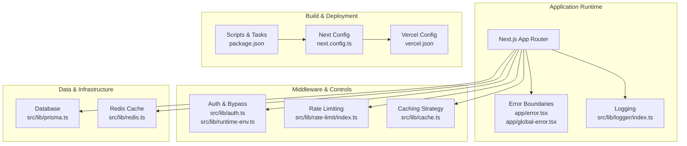
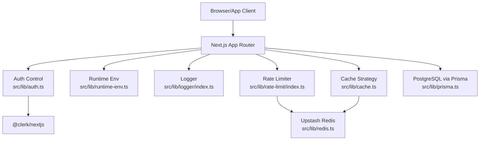
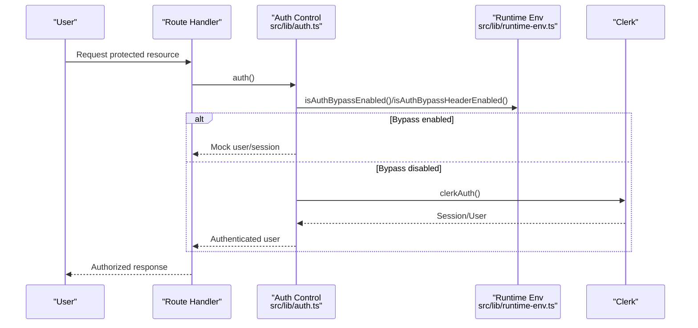
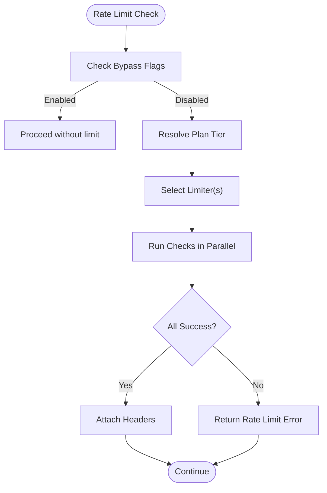
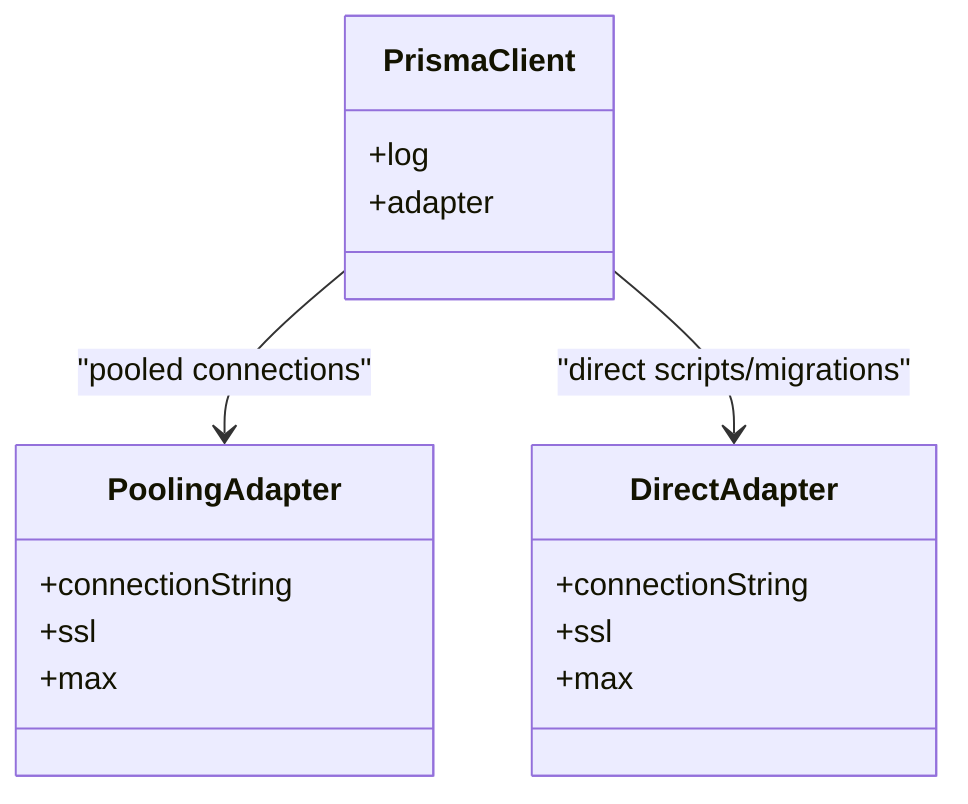
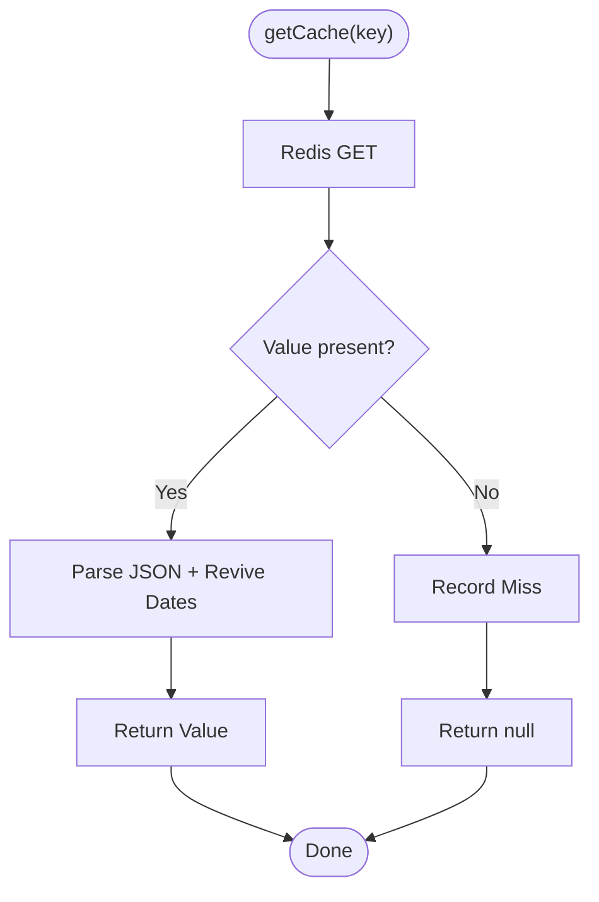
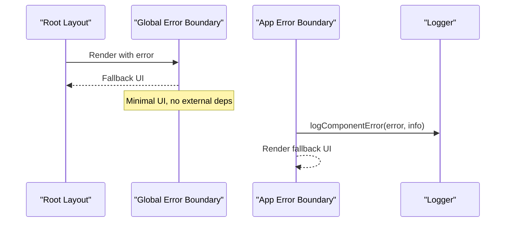
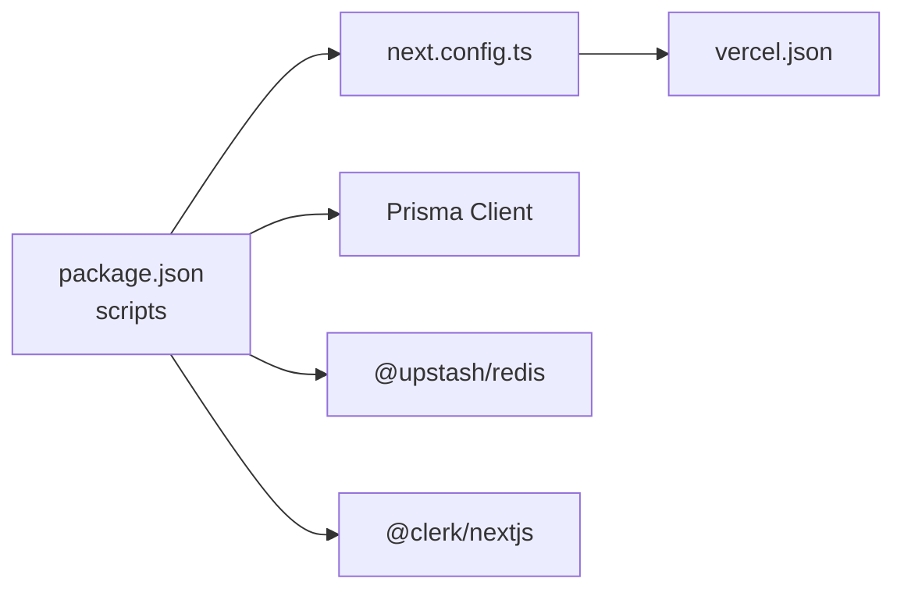

# Troubleshooting & FAQ

<cite>
**Referenced Files in This Document**
- [package.json](file://package.json)
- [next.config.ts](file://next.config.ts)
- [vercel.json](file://vercel.json)
- [src/lib/logger/index.ts](file://src/lib/logger/index.ts)
- [src/lib/auth.ts](file://src/lib/auth.ts)
- [src/lib/runtime-env.ts](file://src/lib/runtime-env.ts)
- [src/lib/prisma.ts](file://src/lib/prisma.ts)
- [src/lib/redis.ts](file://src/lib/redis.ts)
- [src/lib/rate-limit/index.ts](file://src/lib/rate-limit/index.ts)
- [src/lib/cache.ts](file://src/lib/cache.ts)
- [src/app/error.tsx](file://src/app/error.tsx)
- [src/app/global-error.tsx](file://src/app/global-error.tsx)
</cite>

## Table of Contents
1. [Introduction](#introduction)
2. [Project Structure](#project-structure)
3. [Core Components](#core-components)
4. [Architecture Overview](#architecture-overview)
5. [Detailed Component Analysis](#detailed-component-analysis)
6. [Dependency Analysis](#dependency-analysis)
7. [Performance Considerations](#performance-considerations)
8. [Troubleshooting Guide](#troubleshooting-guide)
9. [Conclusion](#conclusion)
10. [Appendices](#appendices)

## Introduction
This document provides a comprehensive troubleshooting guide and FAQ for LyraAlpha. It focuses on diagnosing and resolving common issues across authentication, performance, integrations, and deployments. It also outlines systematic debugging approaches for development and production environments, error code references, log analysis techniques, diagnostic procedures, escalation paths, and preventive best practices.

## Project Structure
LyraAlpha is a Next.js application with integrated services for authentication, caching, rate limiting, and persistence. Key areas relevant to troubleshooting include:
- Logging and error boundaries
- Authentication and environment bypass controls
- Database connectivity and pooling
- Redis-backed caching and metrics
- Rate limiting and timeouts
- Build and deployment configuration

**Diagram sources**
- [next.config.ts:1-232](file://next.config.ts#L1-L232)
- [vercel.json:1-4](file://vercel.json#L1-L4)
- [package.json:1-125](file://package.json#L1-L125)
- [src/lib/logger/index.ts:1-91](file://src/lib/logger/index.ts#L1-L91)
- [src/lib/auth.ts:1-89](file://src/lib/auth.ts#L1-L89)
- [src/lib/runtime-env.ts:1-59](file://src/lib/runtime-env.ts#L1-L59)
- [src/lib/cache.ts:1-21](file://src/lib/cache.ts#L1-L21)
- [src/lib/prisma.ts:1-69](file://src/lib/prisma.ts#L1-L69)
- [src/lib/redis.ts:1-455](file://src/lib/redis.ts#L1-L455)
- [src/lib/rate-limit/index.ts:1-372](file://src/lib/rate-limit/index.ts#L1-L372)
- [src/app/error.tsx:1-28](file://src/app/error.tsx#L1-L28)
- [src/app/global-error.tsx:1-156](file://src/app/global-error.tsx#L1-L156)

**Section sources**
- [next.config.ts:1-232](file://next.config.ts#L1-L232)
- [vercel.json:1-4](file://vercel.json#L1-L4)
- [package.json:1-125](file://package.json#L1-L125)

## Core Components
- Logging and redaction: Structured logs with environment-aware formatting and sensitive field redaction.
- Authentication and bypass: Clerk-based auth with development/test bypass mechanisms and admin allowlists.
- Database: Prisma client with connection pooling tailored for serverless environments.
- Redis cache: Robust caching with metrics, date hydration, and fail-open semantics for resilience.
- Rate limiting: Tiered limits with timeouts and fail-open/fail-close variants depending on operation safety.
- Error boundaries: App-level and global-level boundaries to gracefully handle rendering and root layout errors.

**Section sources**
- [src/lib/logger/index.ts:1-91](file://src/lib/logger/index.ts#L1-L91)
- [src/lib/auth.ts:1-89](file://src/lib/auth.ts#L1-L89)
- [src/lib/runtime-env.ts:1-59](file://src/lib/runtime-env.ts#L1-L59)
- [src/lib/prisma.ts:1-69](file://src/lib/prisma.ts#L1-L69)
- [src/lib/redis.ts:1-455](file://src/lib/redis.ts#L1-L455)
- [src/lib/rate-limit/index.ts:1-372](file://src/lib/rate-limit/index.ts#L1-L372)
- [src/app/error.tsx:1-28](file://src/app/error.tsx#L1-L28)
- [src/app/global-error.tsx:1-156](file://src/app/global-error.tsx#L1-L156)

## Architecture Overview
The system integrates Clerk for authentication, Upstash Redis for caching and rate limiting, Prisma for database access, and Next.js for routing and SSR. Security headers and cache policies are applied globally, with environment-specific behavior for development and production.

**Diagram sources**
- [src/lib/auth.ts:1-89](file://src/lib/auth.ts#L1-L89)
- [src/lib/runtime-env.ts:1-59](file://src/lib/runtime-env.ts#L1-L59)
- [src/lib/logger/index.ts:1-91](file://src/lib/logger/index.ts#L1-L91)
- [src/lib/rate-limit/index.ts:1-372](file://src/lib/rate-limit/index.ts#L1-L372)
- [src/lib/cache.ts:1-21](file://src/lib/cache.ts#L1-L21)
- [src/lib/redis.ts:1-455](file://src/lib/redis.ts#L1-L455)
- [src/lib/prisma.ts:1-69](file://src/lib/prisma.ts#L1-L69)

## Detailed Component Analysis

### Authentication and Authorization Troubleshooting
Common symptoms:
- Users cannot sign in or are redirected unexpectedly.
- Admin features inaccessible despite correct credentials.
- Auth bypass not working in development or E2E tests.

Diagnostic steps:
- Verify environment variables controlling auth bypass and admin allowlist.
- Confirm Clerk integration and session retrieval.
- Check bypass fallback logic and plan-based seeding.

**Diagram sources**
- [src/lib/auth.ts:32-88](file://src/lib/auth.ts#L32-L88)
- [src/lib/runtime-env.ts:15-31](file://src/lib/runtime-env.ts#L15-L31)

**Section sources**
- [src/lib/auth.ts:1-89](file://src/lib/auth.ts#L1-L89)
- [src/lib/runtime-env.ts:1-59](file://src/lib/runtime-env.ts#L1-L59)

### Rate Limiting and Timeouts
Common symptoms:
- 429 responses or unexpected throttling.
- 503 responses during rate limit service unavailability.
- Requests timing out during rate limit checks.

Behavior highlights:
- Parallel Redis checks for chat endpoints.
- Tiered limits per plan.
- Timeout handling with fail-open/fail-close semantics depending on operation.

**Diagram sources**
- [src/lib/rate-limit/index.ts:94-190](file://src/lib/rate-limit/index.ts#L94-L190)

**Section sources**
- [src/lib/rate-limit/index.ts:1-372](file://src/lib/rate-limit/index.ts#L1-L372)

### Database Connectivity and Pooling
Common symptoms:
- Connection exhaustion or timeouts.
- Slow queries or timeouts in production.
- Migration or script failures.

Behavior highlights:
- Separate adapters for pooled and direct connections.
- Environment-specific log levels.
- SSL configuration for Supabase/Supavisor.

**Diagram sources**
- [src/lib/prisma.ts:29-60](file://src/lib/prisma.ts#L29-L60)

**Section sources**
- [src/lib/prisma.ts:1-69](file://src/lib/prisma.ts#L1-L69)

### Redis Cache and Metrics
Common symptoms:
- Cache misses or stale data.
- Redis client initialization failures.
- Pipeline metrics not recorded.

Behavior highlights:
- JSON serialization/deserialization with date revival.
- In-flight deduplication to prevent thundering herds.
- Fail-open semantics for idempotency; fail-closed for strict dedup.
- Weekly TTL on cache stats and pipeline metrics.

**Diagram sources**
- [src/lib/redis.ts:142-174](file://src/lib/redis.ts#L142-L174)

**Section sources**
- [src/lib/redis.ts:1-455](file://src/lib/redis.ts#L1-L455)

### Error Boundaries and Rendering Failures
Common symptoms:
- Blank pages or critical errors on navigation.
- Error logs missing context or stack traces.

Behavior highlights:
- App-level error boundary for page components.
- Global error boundary for root layout.
- Logging of component errors with sanitized stacks.

**Diagram sources**
- [src/app/global-error.tsx:1-156](file://src/app/global-error.tsx#L1-L156)
- [src/app/error.tsx:1-28](file://src/app/error.tsx#L1-L28)
- [src/lib/logger/index.ts:67-80](file://src/lib/logger/index.ts#L67-L80)

**Section sources**
- [src/app/error.tsx:1-28](file://src/app/error.tsx#L1-L28)
- [src/app/global-error.tsx:1-156](file://src/app/global-error.tsx#L1-L156)
- [src/lib/logger/index.ts:61-80](file://src/lib/logger/index.ts#L61-L80)

## Dependency Analysis
- Next.js configuration defines CSP, security headers, cache policies, and server actions allowed origins.
- Vercel configuration delegates build command to npm.
- Scripts orchestrate database migrations, seeding, and operational tasks.

**Diagram sources**
- [package.json:5-29](file://package.json#L5-L29)
- [next.config.ts:17-45](file://next.config.ts#L17-L45)
- [vercel.json:1-4](file://vercel.json#L1-L4)

**Section sources**
- [package.json:1-125](file://package.json#L1-L125)
- [next.config.ts:1-232](file://next.config.ts#L1-L232)
- [vercel.json:1-4](file://vercel.json#L1-L4)

## Performance Considerations
- Use Redis caching with in-flight deduplication to mitigate thundering herds.
- Prefer parallel rate limit checks for chat endpoints.
- Tune Prisma pool sizes and monitor Supabase pooler usage.
- Apply appropriate cache headers and public/private directives per route.
- Enable structured logging with redaction in production for observability without leaking secrets.

[No sources needed since this section provides general guidance]

## Troubleshooting Guide

### Authentication Problems
Symptoms:
- Cannot sign in or redirected to sign-in repeatedly.
- Admin features inaccessible.
- Auth bypass not functioning in development.

Checklist:
- Confirm environment variables for auth bypass and admin allowlist.
- Verify Clerk integration and session retrieval.
- Review bypass logic and plan-based seeding fallbacks.

Diagnostics:
- Inspect auth bypass flags and headers.
- Validate admin email allowlist resolution.
- Confirm mock user/session generation when bypass is enabled.

**Section sources**
- [src/lib/auth.ts:32-88](file://src/lib/auth.ts#L32-L88)
- [src/lib/runtime-env.ts:15-31](file://src/lib/runtime-env.ts#L15-L31)

### Performance Bottlenecks
Symptoms:
- Slow responses or timeouts.
- Rate limit 429 or 503 errors.
- Database connection exhaustion.

Checklist:
- Review rate limiter timeouts and fail-open/fail-close behavior.
- Inspect Redis availability and pipeline metrics.
- Monitor Prisma pool usage and query logs.

Diagnostics:
- Measure latency around rate limit checks and Redis operations.
- Validate cache hit ratios and staleness windows.
- Confirm pool sizes and SSL configuration for PostgreSQL.

**Section sources**
- [src/lib/rate-limit/index.ts:46-79](file://src/lib/rate-limit/index.ts#L46-L79)
- [src/lib/redis.ts:142-174](file://src/lib/redis.ts#L142-L174)
- [src/lib/prisma.ts:19-60](file://src/lib/prisma.ts#L19-L60)

### Integration Failures
Symptoms:
- Redis client initialization failures.
- Database connectivity issues.
- Webhook idempotency drops events.

Checklist:
- Verify Upstash Redis environment variables.
- Confirm Prisma connection strings and SSL settings.
- Test webhook retry behavior and lock semantics.

Diagnostics:
- Initialize Redis client and fall back to noop when unavailable.
- Validate database adapter configuration and pool sizes.
- Test redisSetNX vs redisSetNXStrict for fail-closed scenarios.

**Section sources**
- [src/lib/redis.ts:49-67](file://src/lib/redis.ts#L49-L67)
- [src/lib/prisma.ts:29-60](file://src/lib/prisma.ts#L29-L60)
- [src/lib/redis.ts:218-245](file://src/lib/redis.ts#L218-L245)

### Deployment Errors
Symptoms:
- Build failures or misconfigured headers.
- CSP or cache policy conflicts.
- Vercel build command issues.

Checklist:
- Confirm Next.js security headers and cache policies.
- Validate Vercel build command.
- Review allowed dev origins and server actions configuration.

Diagnostics:
- Inspect CSP and HSTS settings.
- Verify redirect rules and header precedence.
- Ensure build command aligns with package scripts.

**Section sources**
- [next.config.ts:17-45](file://next.config.ts#L17-L45)
- [next.config.ts:123-151](file://next.config.ts#L123-L151)
- [next.config.ts:152-214](file://next.config.ts#L152-L214)
- [vercel.json:1-4](file://vercel.json#L1-L4)

### Logging and Error Analysis
Symptoms:
- Missing context in logs or sensitive data exposure.
- Component errors without stack traces.

Checklist:
- Ensure LOG_LEVEL is set appropriately.
- Confirm redaction paths for tokens and cookies.
- Use structured logs with child loggers for context.

Diagnostics:
- Review log levels and pretty-printing in development.
- Sanitize errors and component stacks before logging.
- Use logComponentError for React error boundaries.

**Section sources**
- [src/lib/logger/index.ts:11-51](file://src/lib/logger/index.ts#L11-L51)
- [src/lib/logger/index.ts:67-80](file://src/lib/logger/index.ts#L67-L80)
- [src/app/error.tsx:17-22](file://src/app/error.tsx#L17-L22)
- [src/app/global-error.tsx:17-21](file://src/app/global-error.tsx#L17-L21)

### Frequently Asked Questions (FAQ)
Q: Why am I seeing 503 during rate limit checks?
A: The rate limiter timed out and returned a 503 to prevent fail-open. Retry the request or reduce load.

Q: How do I bypass auth in development?
A: Set the auth bypass environment variable and confirm runtime allows bypass outside Vercel.

Q: Why is my cache not persisting dates correctly?
A: Values are JSON serialized; date revival occurs automatically. Ensure stored values are valid JSON.

Q: How do I diagnose database pool exhaustion?
A: Check Prisma pool sizes and monitor PostgreSQL pooler usage. Adjust pool_max based on observed concurrency.

Q: What headers should I check for caching?
A: Review Next.js cache headers for API routes, dashboard pages, and specific endpoints.

**Section sources**
- [src/lib/rate-limit/index.ts:166-189](file://src/lib/rate-limit/index.ts#L166-L189)
- [src/lib/runtime-env.ts:5-13](file://src/lib/runtime-env.ts#L5-L13)
- [src/lib/redis.ts:142-174](file://src/lib/redis.ts#L142-L174)
- [src/lib/prisma.ts:19-27](file://src/lib/prisma.ts#L19-L27)
- [next.config.ts:166-213](file://next.config.ts#L166-L213)

### Escalation Procedures and Support Resources
Escalation:
- Capture logs with timestamps and request IDs.
- Provide environment details (development vs production).
- Include relevant error codes and stack traces.

Support resources:
- Community help channels and documentation links are maintained in the repository.

[No sources needed since this section provides general guidance]

### Preventive Measures and Best Practices
- Keep environment variables secure and avoid committing secrets.
- Use fail-open for idempotent operations; fail-closed for strict dedup.
- Monitor cache hit ratios and adjust TTLs accordingly.
- Regularly review rate limit tiers and timeouts.
- Validate database and Redis connectivity in staging before production.

[No sources needed since this section provides general guidance]

## Conclusion
This guide consolidates practical troubleshooting steps, diagnostic procedures, and best practices for LyraAlpha. By leveraging structured logging, robust error boundaries, resilient caching, and environment-aware controls, teams can quickly isolate and resolve issues in both development and production.

[No sources needed since this section summarizes without analyzing specific files]

## Appendices

### Error Codes and Responses Reference
- Rate limit timeout: Returned as a 503 to prevent fail-open during critical checks.
- Rate limit exceeded: Returns a 429 with limit, remaining, and reset headers.
- Component errors: Logged with sanitized error and component stack via logger.

**Section sources**
- [src/lib/rate-limit/index.ts:166-189](file://src/lib/rate-limit/index.ts#L166-L189)
- [src/lib/rate-limit/index.ts:134-151](file://src/lib/rate-limit/index.ts#L134-L151)
- [src/lib/logger/index.ts:67-80](file://src/lib/logger/index.ts#L67-L80)