# Dashboard Components

<cite>
**Referenced Files in This Document**
- [layout.tsx](file://src/app/dashboard/layout.tsx)
- [dashboard-home-content.tsx](file://src/app/dashboard/dashboard-home-content.tsx)
- [dashboard-home-content-skeleton.tsx](file://src/app/dashboard/dashboard-home-content-skeleton.tsx)
- [dashboard-market-brief-card.tsx](file://src/components/dashboard/dashboard-market-brief-card.tsx)
- [dashboard-insight-feed.tsx](file://src/components/dashboard/dashboard-insight-feed.tsx)
- [personal-briefing-card.tsx](file://src/components/dashboard/personal-briefing-card.tsx)
- [discovery-feed.tsx](file://src/components/dashboard/discovery-feed.tsx)
- [discovery-feed-card.tsx](file://src/components/dashboard/discovery-feed-card.tsx)
- [crypto-card.tsx](file://src/components/dashboard/crypto-card.tsx)
- [metric-card.tsx](file://src/components/dashboard/metric-card.tsx)
- [density-toggle-provider.tsx](file://src/components/dashboard/density-toggle-provider.tsx)
- [types.ts](file://src/components/dashboard/types.ts)
- [index.ts](file://src/components/dashboard/index.ts)
</cite>

## Table of Contents
1. [Introduction](#introduction)
2. [Project Structure](#project-structure)
3. [Core Components](#core-components)
4. [Architecture Overview](#architecture-overview)
5. [Detailed Component Analysis](#detailed-component-analysis)
6. [Dependency Analysis](#dependency-analysis)
7. [Performance Considerations](#performance-considerations)
8. [Troubleshooting Guide](#troubleshooting-guide)
9. [Conclusion](#conclusion)

## Introduction
This document describes LyraAlpha’s dashboard component library with a focus on key widgets used in the home dashboard and related discovery and intelligence surfaces. It covers market cards, intelligence feeds, personal briefings, discovery components, and analytics panels. For each component, we detail props, state management, data binding patterns, and integration with the dashboard layout system. We also document the dashboard grid system, responsive behavior, customization options, performance optimization techniques, and the relationship between dashboard components and the overall application state.

## Project Structure
The dashboard is composed of:
- A Next.js App Router page and layout that initialize viewer context and region preferences.
- A home content shell that composes three primary areas: market brief, feed previews, and insight feed.
- Multiple reusable dashboard components including cards, lists, and analytics panels.
- A provider that wires keyboard shortcuts for density and theme toggles.

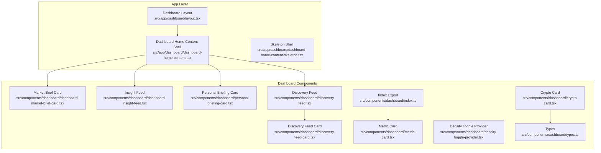

**Diagram sources**
- [layout.tsx:24-49](file://src/app/dashboard/layout.tsx#L24-L49)
- [dashboard-home-content.tsx:10-41](file://src/app/dashboard/dashboard-home-content.tsx#L10-L41)
- [dashboard-market-brief-card.tsx:18-232](file://src/components/dashboard/dashboard-market-brief-card.tsx#L18-L232)
- [dashboard-insight-feed.tsx:39-125](file://src/components/dashboard/dashboard-insight-feed.tsx#L39-L125)
- [personal-briefing-card.tsx:34-203](file://src/components/dashboard/personal-briefing-card.tsx#L34-L203)
- [discovery-feed.tsx:50-287](file://src/components/dashboard/discovery-feed.tsx#L50-L287)
- [discovery-feed-card.tsx:197-597](file://src/components/dashboard/discovery-feed-card.tsx#L197-L597)
- [crypto-card.tsx:60-386](file://src/components/dashboard/crypto-card.tsx#L60-L386)
- [metric-card.tsx:18-146](file://src/components/dashboard/metric-card.tsx#L18-L146)
- [density-toggle-provider.tsx:12-43](file://src/components/dashboard/density-toggle-provider.tsx#L12-L43)
- [types.ts:1-36](file://src/components/dashboard/types.ts#L1-L36)
- [index.ts:1-12](file://src/components/dashboard/index.ts#L1-L12)

**Section sources**
- [layout.tsx:24-49](file://src/app/dashboard/layout.tsx#L24-L49)
- [dashboard-home-content.tsx:10-41](file://src/app/dashboard/dashboard-home-content.tsx#L10-L41)
- [dashboard-home-content-skeleton.tsx:1-35](file://src/app/dashboard/dashboard-home-content-skeleton.tsx#L1-L35)
- [index.ts:1-12](file://src/components/dashboard/index.ts#L1-L12)

## Core Components
This section outlines the primary dashboard widgets and their roles.

- Market Brief Card
  - Purpose: Presents the daily market intelligence and narrative pulse.
  - Props: briefing (DailyBriefing | null), narrativePreview (DashboardNarrativePreview | null).
  - Data binding: Uses generated timestamps, regime labels, movers, and curated insights.
  - Integration: Rendered inside the home content shell.

- Insight Feed
  - Purpose: Displays ranked insights grouped by type and tone.
  - Props: items (DashboardInsightFeedItem[]).
  - Data binding: Icons and tone classes adapt per item type and tone.
  - Integration: Rendered inside the home content shell.

- Personal Briefing Card
  - Purpose: Summarizes personalized signals from watchlist and portfolio context.
  - Props: none (fetches via SWR).
  - State: Local expand/collapse state; SWR-managed remote data.
  - Integration: Rendered inside the home content shell.

- Discovery Feed
  - Purpose: Infinite-scrolling list of relevance-ranked discovery signals.
  - Props: initialData (optional), initialRegion (optional).
  - State: offset, enableAutoLoad, previous items, scroll restoration refs.
  - Data binding: SWR-backed pagination with deduping and keep-previous semantics.
  - Integration: Rendered inside the home content shell.

- Discovery Feed Card
  - Purpose: Individual discovery item with archetype badges, DRS score, mini sparkline, and actions.
  - Props: item (DiscoveryFeedItem).
  - State: Local learn-why expanded state, XP award tracking, locked item impression tracking.
  - Data binding: Archetype tooltips, type badges, and score pills.

- Crypto Card
  - Purpose: Institutional-grade asset card with ratings, signals, and Lyra Research integration.
  - Props: data (CryptoCardData), inclusionReason (optional).
  - State: Local explanation fetch state, loading, and Lyra sheet open state.
  - Data binding: Signals grid, ratings, metrics, and credit header updates.

- Metric Card
  - Purpose: Compact KPI card with trend indicator and optional sparkline.
  - Props: label, value, trend, trendLabel, tooltip, icon, className, sparklineData.
  - State: None (pure presentation).
  - Data binding: Positive/negative/neutral coloring and SVG sparkline path.

- Density Toggle Provider
  - Purpose: Registers keyboard shortcuts to toggle density and theme.
  - Props: none.
  - State: None (side-effect provider).

**Section sources**
- [dashboard-market-brief-card.tsx:18-232](file://src/components/dashboard/dashboard-market-brief-card.tsx#L18-L232)
- [dashboard-insight-feed.tsx:39-125](file://src/components/dashboard/dashboard-insight-feed.tsx#L39-L125)
- [personal-briefing-card.tsx:34-203](file://src/components/dashboard/personal-briefing-card.tsx#L34-L203)
- [discovery-feed.tsx:50-287](file://src/components/dashboard/discovery-feed.tsx#L50-L287)
- [discovery-feed-card.tsx:197-597](file://src/components/dashboard/discovery-feed-card.tsx#L197-L597)
- [crypto-card.tsx:60-386](file://src/components/dashboard/crypto-card.tsx#L60-L386)
- [metric-card.tsx:18-146](file://src/components/dashboard/metric-card.tsx#L18-L146)
- [density-toggle-provider.tsx:12-43](file://src/components/dashboard/density-toggle-provider.tsx#L12-L43)

## Architecture Overview
The dashboard composes a responsive grid of cards and lists. The App Router layout initializes region and plan context and enforces authentication. The home content shell orchestrates three major areas: market brief, feed previews, and insight feed. Discovery and intelligence components are rendered as separate lists and cards, with SWR managing data fetching and caching. The density toggle provider wires keyboard shortcuts for power-user ergonomics.

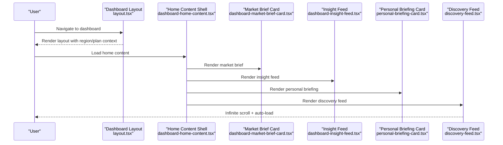

**Diagram sources**
- [layout.tsx:24-49](file://src/app/dashboard/layout.tsx#L24-L49)
- [dashboard-home-content.tsx:10-41](file://src/app/dashboard/dashboard-home-content.tsx#L10-L41)
- [dashboard-market-brief-card.tsx:18-232](file://src/components/dashboard/dashboard-market-brief-card.tsx#L18-L232)
- [dashboard-insight-feed.tsx:39-125](file://src/components/dashboard/dashboard-insight-feed.tsx#L39-L125)
- [personal-briefing-card.tsx:34-203](file://src/components/dashboard/personal-briefing-card.tsx#L34-L203)
- [discovery-feed.tsx:50-287](file://src/components/dashboard/discovery-feed.tsx#L50-L287)

## Detailed Component Analysis

### Market Brief Card
- Purpose: Consolidates the day’s market overview, regime context, movers, risks, and narrative pulse.
- Props:
  - briefing: DailyBriefing | null
  - narrativePreview: DashboardNarrativePreview | null
- State: None (presentation).
- Data binding:
  - Regime label and source badge.
  - Top gainers/losers via helpers.
  - Risks and insights grid.
  - Narrative preview chips and divergence cues.
- Integration:
  - Used by the home content shell to render the “market intelligence” section.

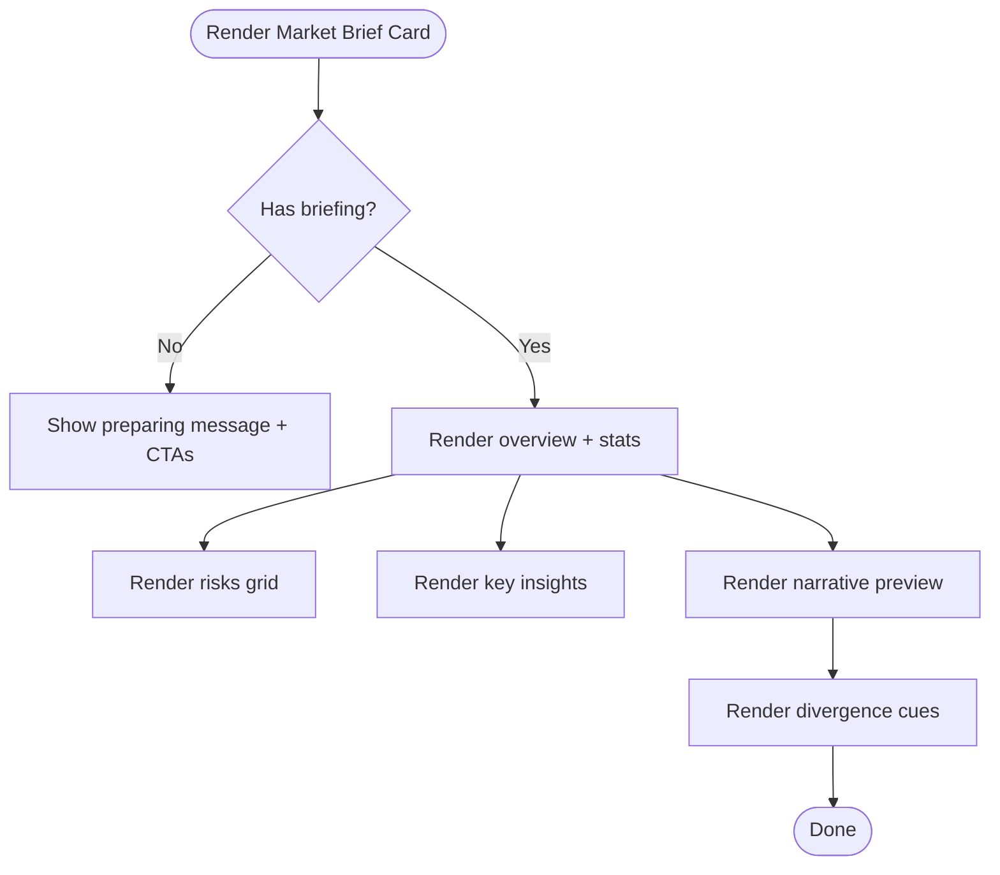

**Diagram sources**
- [dashboard-market-brief-card.tsx:18-232](file://src/components/dashboard/dashboard-market-brief-card.tsx#L18-L232)

**Section sources**
- [dashboard-market-brief-card.tsx:18-232](file://src/components/dashboard/dashboard-market-brief-card.tsx#L18-L232)

### Insight Feed
- Purpose: Present top-ranked insights with type-specific icons and tone-appropriate styling.
- Props:
  - items: DashboardInsightFeedItem[]
- State: None (presentation).
- Data binding:
  - Icon selection by type.
  - Tone classes for panel and badge.
  - Featured vs secondary layout.
- Integration:
  - Used by the home content shell under the “Insight feed” header.

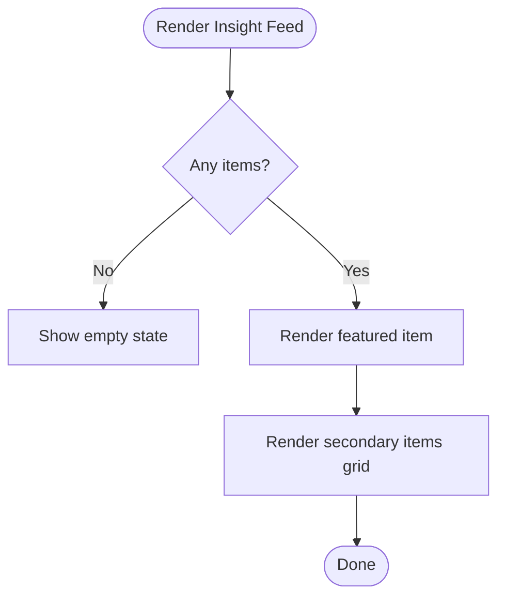

**Diagram sources**
- [dashboard-insight-feed.tsx:39-125](file://src/components/dashboard/dashboard-insight-feed.tsx#L39-L125)

**Section sources**
- [dashboard-insight-feed.tsx:39-125](file://src/components/dashboard/dashboard-insight-feed.tsx#L39-L125)

### Personal Briefing Card
- Purpose: Personalized watchlist signals with top assets, momentum alerts, and regime-misalignment warnings.
- Props: none.
- State:
  - Local: expanded/collapsed.
  - Remote: SWR-managed personal briefing data.
- Data binding:
  - Top assets with signal scores and price changes.
  - Alerts for strong momentum and misalignment.
- Integration:
  - Used by the home content shell.

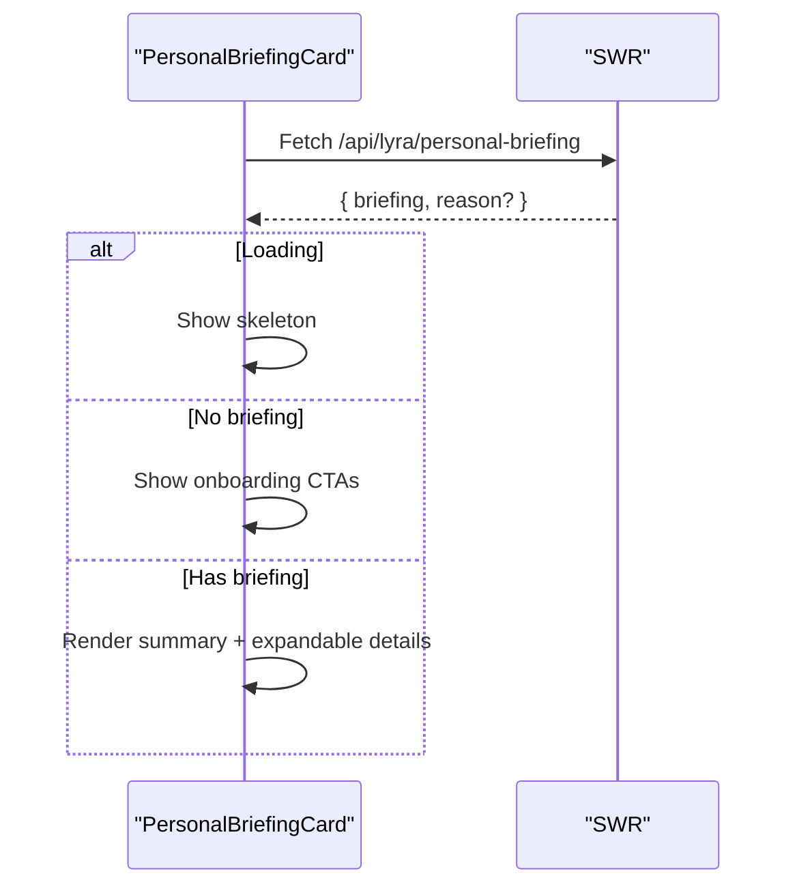

**Diagram sources**
- [personal-briefing-card.tsx:34-203](file://src/components/dashboard/personal-briefing-card.tsx#L34-L203)

**Section sources**
- [personal-briefing-card.tsx:34-203](file://src/components/dashboard/personal-briefing-card.tsx#L34-L203)

### Discovery Feed
- Purpose: Infinite scrolling list of discovery signals with automatic load-more and scroll restoration.
- Props:
  - initialData: DiscoveryFeedResponse (optional)
  - initialRegion: "US" | "IN" (optional)
- State:
  - offset, enableAutoLoad, prevItems, lastRequestedOffsetRef, pendingScrollRestoreRef.
- Data binding:
  - SWR with keepPreviousData, dedupingInterval, and fallbackData.
  - IntersectionObserver triggers load-more near bottom.
  - Scroll container resolution via data-slot attributes.
- Integration:
  - Used by the home content shell as “feed previews”.

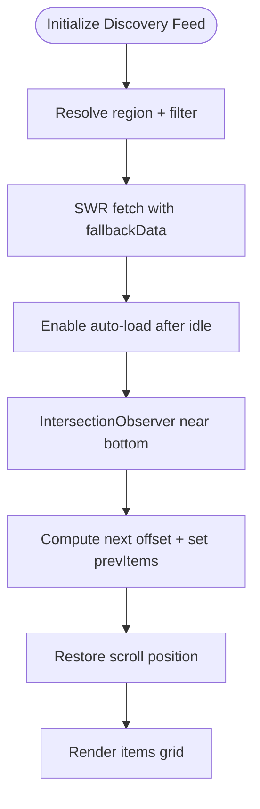

**Diagram sources**
- [discovery-feed.tsx:50-287](file://src/components/dashboard/discovery-feed.tsx#L50-L287)

**Section sources**
- [discovery-feed.tsx:50-287](file://src/components/dashboard/discovery-feed.tsx#L50-L287)

### Discovery Feed Card
- Purpose: Individual discovery item with archetype badges, DRS score, mini sparkline, and actions.
- Props:
  - item: DiscoveryFeedItem
- State:
  - learnWhyOpen, xpAwarded, experimentVariant, hasTrackedLockedImpression.
- Data binding:
  - Archetype config for label, tooltip, icon, colors.
  - Type badges and DRS color.
  - Score pills mapped from item.scores.
  - Mini sparkline seeded by item id/symbol.
  - Locked items show blurred overlay and upgrade CTA.
- Integration:
  - Used by DiscoveryFeed.

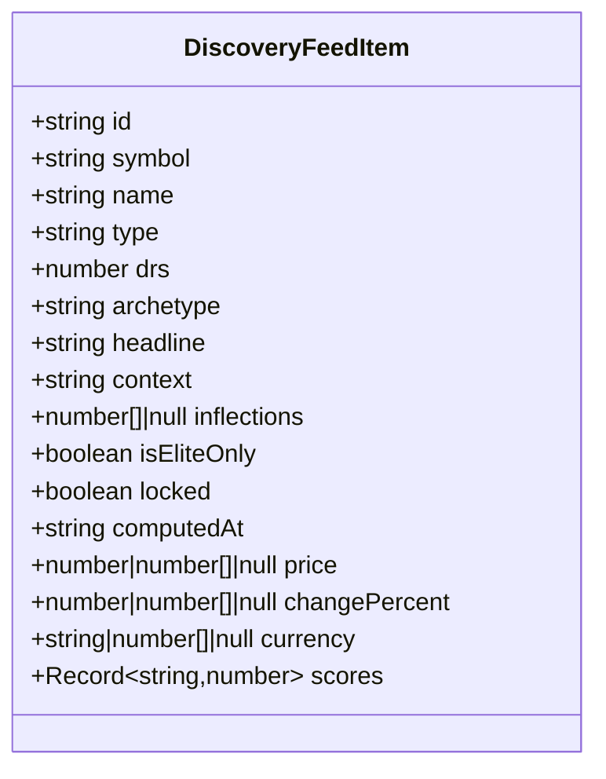

**Diagram sources**
- [discovery-feed-card.tsx:34-52](file://src/components/dashboard/discovery-feed-card.tsx#L34-L52)

**Section sources**
- [discovery-feed-card.tsx:197-597](file://src/components/dashboard/discovery-feed-card.tsx#L197-L597)

### Crypto Card
- Purpose: Institutional-grade asset card integrating ratings, signals, and Lyra Research.
- Props:
  - data: CryptoCardData
  - inclusionReason: string (optional)
- State:
  - explanation, loading, lyraOpen.
- Data binding:
  - Signals grid with progress bars and color-coded labels.
  - Ratings formatted to human-friendly labels and colors.
  - Market cap and yearly change.
  - Lyra Insight Sheet and tabbed interface for insight/chat.
  - Credit header updates via response headers.
- Integration:
  - Used in discovery and asset pages.

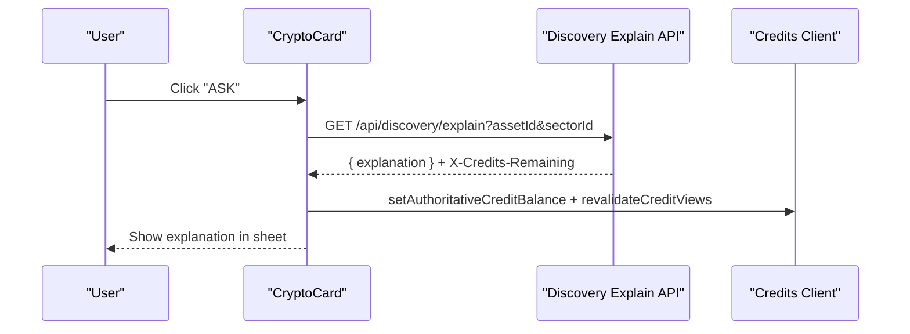

**Diagram sources**
- [crypto-card.tsx:60-386](file://src/components/dashboard/crypto-card.tsx#L60-L386)

**Section sources**
- [crypto-card.tsx:60-386](file://src/components/dashboard/crypto-card.tsx#L60-L386)
- [types.ts:1-36](file://src/components/dashboard/types.ts#L1-L36)

### Metric Card
- Purpose: Lightweight KPI card with trend and optional sparkline.
- Props:
  - label, value, trend, trendLabel, tooltip, icon, className, sparklineData
- State: None.
- Data binding:
  - Positive/negative/neutral coloring.
  - SVG polyline and area path for sparkline.
- Integration:
  - Exported via dashboard index for reuse across panels.

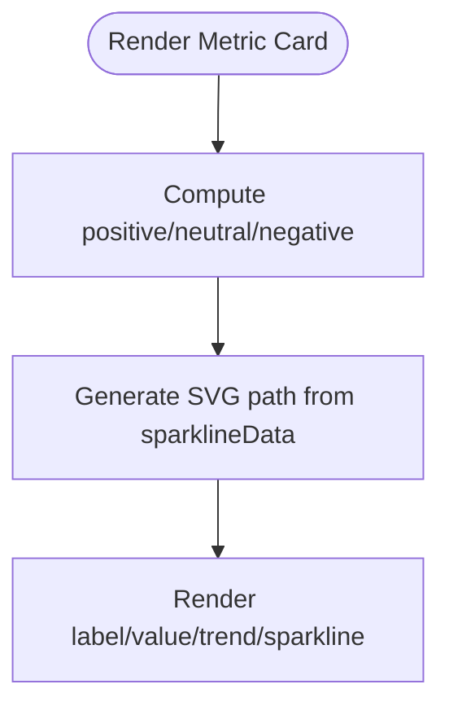

**Diagram sources**
- [metric-card.tsx:18-146](file://src/components/dashboard/metric-card.tsx#L18-L146)

**Section sources**
- [metric-card.tsx:18-146](file://src/components/dashboard/metric-card.tsx#L18-L146)
- [index.ts:1-12](file://src/components/dashboard/index.ts#L1-L12)

### Density Toggle Provider
- Purpose: Register keyboard shortcuts to toggle density and theme.
- Props: none.
- State: None.
- Behavior:
  - Command+Shift+P toggles density and shows toast.
  - Command+Shift+D toggles theme and shows toast.

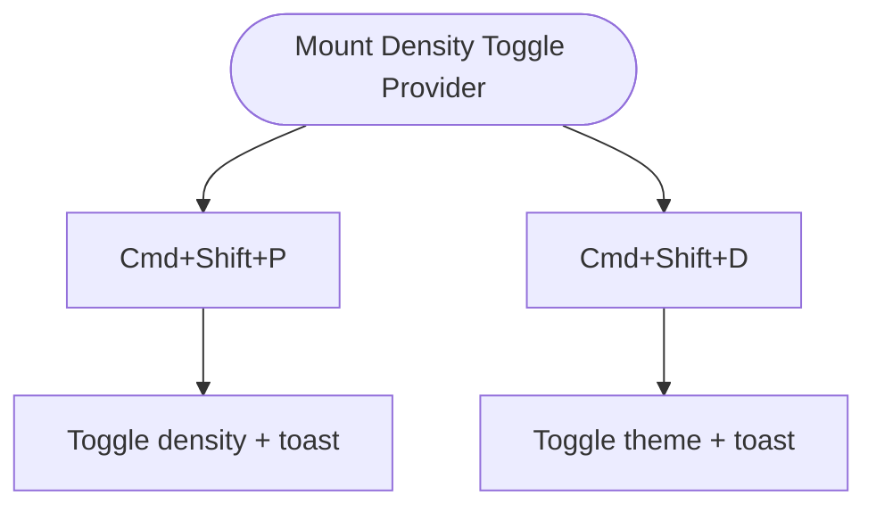

**Diagram sources**
- [density-toggle-provider.tsx:12-43](file://src/components/dashboard/density-toggle-provider.tsx#L12-L43)

**Section sources**
- [density-toggle-provider.tsx:12-43](file://src/components/dashboard/density-toggle-provider.tsx#L12-L43)

## Dependency Analysis
- Layout and Viewer Context
  - The dashboard layout reads a user region preference cookie and passes initialRegion, initialPlan, and userId to the client layout wrapper. It redirects unauthenticated users to sign-in.
- Home Content Shell
  - The home content shell orchestrates three areas: market brief, feed previews, and insight feed. It delegates to service-layer data retrieval and composes the animated shell.
- Discovery Feed
  - Uses SWR with a custom fetcher, deduping interval, keep-previous data, and fallback data when appropriate. It computes next offsets and restores scroll positions after data loads.
- Personal Briefing Card
  - Uses SWR to fetch a personal briefing endpoint with a long dedupe interval to avoid frequent refreshes.
- Crypto Card
  - Fetches institutional explanations from the discovery API and updates the credit balance via response headers. Integrates with a Lyra Insight Sheet for richer analysis.

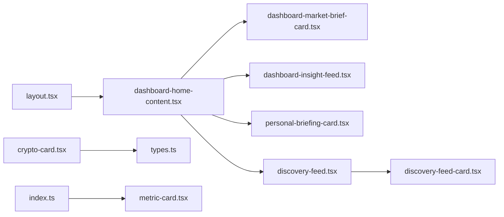

**Diagram sources**
- [layout.tsx:24-49](file://src/app/dashboard/layout.tsx#L24-L49)
- [dashboard-home-content.tsx:10-41](file://src/app/dashboard/dashboard-home-content.tsx#L10-L41)
- [dashboard-market-brief-card.tsx:18-232](file://src/components/dashboard/dashboard-market-brief-card.tsx#L18-L232)
- [dashboard-insight-feed.tsx:39-125](file://src/components/dashboard/dashboard-insight-feed.tsx#L39-L125)
- [personal-briefing-card.tsx:34-203](file://src/components/dashboard/personal-briefing-card.tsx#L34-L203)
- [discovery-feed.tsx:50-287](file://src/components/dashboard/discovery-feed.tsx#L50-L287)
- [discovery-feed-card.tsx:197-597](file://src/components/dashboard/discovery-feed-card.tsx#L197-L597)
- [crypto-card.tsx:60-386](file://src/components/dashboard/crypto-card.tsx#L60-L386)
- [types.ts:1-36](file://src/components/dashboard/types.ts#L1-L36)
- [index.ts:1-12](file://src/components/dashboard/index.ts#L1-L12)
- [metric-card.tsx:18-146](file://src/components/dashboard/metric-card.tsx#L18-L146)

**Section sources**
- [layout.tsx:24-49](file://src/app/dashboard/layout.tsx#L24-L49)
- [dashboard-home-content.tsx:10-41](file://src/app/dashboard/dashboard-home-content.tsx#L10-L41)
- [discovery-feed.tsx:50-287](file://src/components/dashboard/discovery-feed.tsx#L50-L287)
- [personal-briefing-card.tsx:34-203](file://src/components/dashboard/personal-briefing-card.tsx#L34-L203)
- [crypto-card.tsx:60-386](file://src/components/dashboard/crypto-card.tsx#L60-L386)

## Performance Considerations
- SWR Deduplication and Keep-Previous Data
  - Discovery Feed uses dedupingInterval and keepPreviousData to avoid redundant network requests and maintain UI stability during pagination.
- Scroll Restoration After Load
  - The feed tracks scroll container height and distance from bottom to restore position after new items are appended, preventing jumpy UI.
- Skeletons and Lazy Initialization
  - The home content skeleton provides structured placeholders to reduce layout shift while data loads.
- Keyboard Shortcuts
  - DensityToggleProvider avoids heavy computations and uses lightweight toasts to minimize overhead.
- Sparklines and SVG Rendering
  - Metric Card and Discovery Feed Card compute SVG paths efficiently; avoid excessive re-renders by passing memoized data.

[No sources needed since this section provides general guidance]

## Troubleshooting Guide
- Discovery Feed Not Loading More
  - Ensure IntersectionObserver detects the sentinel element within the correct scroll container (data-slot attribute). Verify enableAutoLoad is true and hasMore is present.
- Scroll Jumps During Pagination
  - Confirm scroll restoration logic runs after DOM updates. On platforms without ResizeObserver, a fallback applies after animation frame.
- Personal Briefing Shows Empty State
  - Add portfolio or watchlist context to generate a briefing. The card renders onboarding CTAs when no briefing is available.
- Credit Updates Not Reflecting
  - When fetching explanations, the response headers carry the remaining credits. Ensure the client-side credits module is invoked to update authoritative balance and revalidate views.
- Market Brief Not Available
  - The card displays a placeholder with guidance to open discovery or ask Lyra while the daily brief is being prepared.

**Section sources**
- [discovery-feed.tsx:50-287](file://src/components/dashboard/discovery-feed.tsx#L50-L287)
- [personal-briefing-card.tsx:34-203](file://src/components/dashboard/personal-briefing-card.tsx#L34-L203)
- [crypto-card.tsx:60-386](file://src/components/dashboard/crypto-card.tsx#L60-L386)
- [dashboard-market-brief-card.tsx:18-232](file://src/components/dashboard/dashboard-market-brief-card.tsx#L18-L232)

## Conclusion
LyraAlpha’s dashboard component library combines robust data fetching (SWR), responsive layouts, and interactive widgets to deliver a powerful, real-time intelligence experience. Components are modular, reusable, and integrated with the App Router layout and viewer context. The grid system and responsive breakpoints ensure usability across devices, while performance techniques like deduplication, keep-previous data, and scroll restoration provide a smooth user experience. The density toggle provider enhances productivity for power users, and the overall architecture cleanly separates concerns between orchestration (home content shell), presentation (cards), and data access (SWR and APIs).