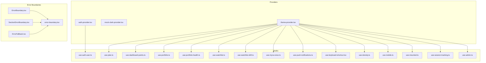
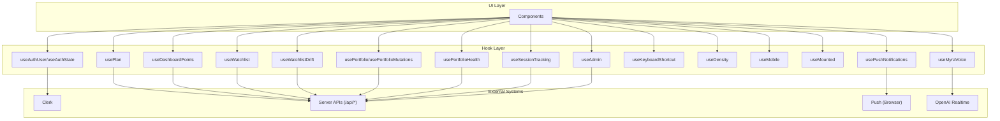
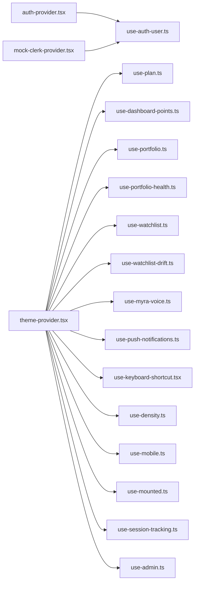

# Hooks & Providers

<cite>
**Referenced Files in This Document**
- [use-watchlist.ts](file://src/hooks/use-watchlist.ts)
- [use-auth-user.ts](file://src/hooks/use-auth-user.ts)
- [use-plan.ts](file://src/hooks/use-plan.ts)
- [use-dashboard-points.ts](file://src/hooks/use-dashboard-points.ts)
- [use-portfolio.ts](file://src/hooks/use-portfolio.ts)
- [use-portfolio-health.ts](file://src/hooks/use-portfolio-health.ts)
- [use-myra-voice.ts](file://src/hooks/use-myra-voice.ts)
- [use-push-notifications.ts](file://src/hooks/use-push-notifications.ts)
- [use-keyboard-shortcut.tsx](file://src/hooks/use-keyboard-shortcut.tsx)
- [use-density.ts](file://src/hooks/use-density.ts)
- [use-mobile.ts](file://src/hooks/use-mobile.ts)
- [use-mounted.ts](file://src/hooks/use-mounted.ts)
- [use-session-tracking.ts](file://src/hooks/use-session-tracking.ts)
- [use-watchlist-drift.ts](file://src/hooks/use-watchlist-drift.ts)
- [use-admin.ts](file://src/hooks/use-admin.ts)
- [auth-provider.tsx](file://src/providers/auth-provider.tsx)
- [mock-clerk-provider.tsx](file://src/providers/mock-clerk-provider.tsx)
- [theme-provider.tsx](file://src/providers/theme-provider.tsx)
- [ErrorBoundary.tsx](file://src/components/error-boundary/ErrorBoundary.tsx)
- [ErrorFallback.tsx](file://src/components/error-boundary/ErrorFallback.tsx)
- [SectionErrorBoundary.tsx](file://src/components/error-boundary/SectionErrorBoundary.tsx)
- [error-boundary.tsx](file://src/components/dashboard/error-boundary.tsx)
</cite>

## Table of Contents
1. [Introduction](#introduction)
2. [Project Structure](#project-structure)
3. [Core Components](#core-components)
4. [Architecture Overview](#architecture-overview)
5. [Detailed Component Analysis](#detailed-component-analysis)
6. [Dependency Analysis](#dependency-analysis)
7. [Performance Considerations](#performance-considerations)
8. [Troubleshooting Guide](#troubleshooting-guide)
9. [Conclusion](#conclusion)

## Introduction
This document explains the custom hooks and context providers used across the component library. It focuses on state management hooks, authentication hooks, dashboard utilities, and specialized providers. For each hook/provider, you will find purpose, parameters, return values, usage patterns, error handling, and integration tips. It also covers the relationship between hooks and providers, performance characteristics, and best practices for extending the hook ecosystem. Finally, it documents error boundary components and their role in component resilience.

## Project Structure
The hooks and providers are organized by domain:
- Hooks: located under src/hooks, grouped by responsibility (authentication, dashboard, portfolio, voice, notifications, UI density, mobile detection, mounted state, session tracking, watchlist).
- Providers: located under src/providers, wrapping authentication and theme contexts.
- Error boundaries: located under src/components/error-boundary and src/components/dashboard, enabling resilient UI fallbacks.

**Diagram sources**
- [auth-provider.tsx](file://src/providers/auth-provider.tsx)
- [mock-clerk-provider.tsx](file://src/providers/mock-clerk-provider.tsx)
- [theme-provider.tsx](file://src/providers/theme-provider.tsx)
- [use-auth-user.ts](file://src/hooks/use-auth-user.ts)
- [use-plan.ts](file://src/hooks/use-plan.ts)
- [use-dashboard-points.ts](file://src/hooks/use-dashboard-points.ts)
- [use-portfolio.ts](file://src/hooks/use-portfolio.ts)
- [use-portfolio-health.ts](file://src/hooks/use-portfolio-health.ts)
- [use-watchlist.ts](file://src/hooks/use-watchlist.ts)
- [use-watchlist-drift.ts](file://src/hooks/use-watchlist-drift.ts)
- [use-myra-voice.ts](file://src/hooks/use-myra-voice.ts)
- [use-push-notifications.ts](file://src/hooks/use-push-notifications.ts)
- [use-keyboard-shortcut.tsx](file://src/hooks/use-keyboard-shortcut.tsx)
- [use-density.ts](file://src/hooks/use-density.ts)
- [use-mobile.ts](file://src/hooks/use-mobile.ts)
- [use-mounted.ts](file://src/hooks/use-mounted.ts)
- [use-session-tracking.ts](file://src/hooks/use-session-tracking.ts)
- [use-admin.ts](file://src/hooks/use-admin.ts)
- [ErrorBoundary.tsx](file://src/components/error-boundary/ErrorBoundary.tsx)
- [ErrorFallback.tsx](file://src/components/error-boundary/ErrorFallback.tsx)
- [SectionErrorBoundary.tsx](file://src/components/error-boundary/SectionErrorBoundary.tsx)
- [error-boundary.tsx](file://src/components/dashboard/error-boundary.tsx)

**Section sources**
- [use-watchlist.ts](file://src/hooks/use-watchlist.ts)
- [use-auth-user.ts](file://src/hooks/use-auth-user.ts)
- [use-plan.ts](file://src/hooks/use-plan.ts)
- [use-dashboard-points.ts](file://src/hooks/use-dashboard-points.ts)
- [use-portfolio.ts](file://src/hooks/use-portfolio.ts)
- [use-portfolio-health.ts](file://src/hooks/use-portfolio-health.ts)
- [use-myra-voice.ts](file://src/hooks/use-myra-voice.ts)
- [use-push-notifications.ts](file://src/hooks/use-push-notifications.ts)
- [use-keyboard-shortcut.tsx](file://src/hooks/use-keyboard-shortcut.tsx)
- [use-density.ts](file://src/hooks/use-density.ts)
- [use-mobile.ts](file://src/hooks/use-mobile.ts)
- [use-mounted.ts](file://src/hooks/use-mounted.ts)
- [use-session-tracking.ts](file://src/hooks/use-session-tracking.ts)
- [use-watchlist-drift.ts](file://src/hooks/use-watchlist-drift.ts)
- [use-admin.ts](file://src/hooks/use-admin.ts)
- [auth-provider.tsx](file://src/providers/auth-provider.tsx)
- [mock-clerk-provider.tsx](file://src/providers/mock-clerk-provider.tsx)
- [theme-provider.tsx](file://src/providers/theme-provider.tsx)
- [ErrorBoundary.tsx](file://src/components/error-boundary/ErrorBoundary.tsx)
- [ErrorFallback.tsx](file://src/components/error-boundary/ErrorFallback.tsx)
- [SectionErrorBoundary.tsx](file://src/components/error-boundary/SectionErrorBoundary.tsx)
- [error-boundary.tsx](file://src/components/dashboard/error-boundary.tsx)

## Core Components
This section summarizes the primary hooks and providers, their responsibilities, and how they fit into the system.

- Authentication hooks
  - useAuthUser: wraps Clerk user state with a dev-time client bypass and mock fallback.
  - useAuthState: wraps Clerk auth state similarly.
  - Providers: auth-provider, mock-clerk-provider.

- Plan and dashboard utilities
  - usePlan: resolves plan tier either from a PlanProvider context or via SWR polling.
  - useDashboardPoints: loads points, history, and redemption options with controlled revalidation and mount gating.
  - useWatchlist: manages watchlist items with optimistic updates and rollback on errors.
  - useWatchlistDrift: counts assets with low regime compatibility.

- Portfolio and health
  - usePortfolios/usePortfolio: lists and fetches portfolio details.
  - usePortfolioMutations: creates/deletes portfolios and adds/removes/updates holdings with optimistic updates and rollbacks.
  - usePortfolioHealth: retrieves health snapshots and computes bands/colors.

- Voice and notifications
  - useMyraVoice: orchestrates a Realtime voice session with audio capture, playback, silence auto-stop, and client-side safety checks.
  - usePushNotifications: handles browser Push API subscription lifecycle.

- UI and UX helpers
  - useKeyboardShortcut: composable keyboard shortcut handler with modifier matching and input gating.
  - useDensity: persists and applies a global density mode ("cozy"/"compact").
  - useMobile: detects mobile viewport.
  - useMounted: SSR-safe mounted indicator.
  - useSessionTracking: starts/heartbeats/end sessions and tracks page views and events.

- Admin utilities
  - useAdmin: typed SWR wrappers for admin dashboards with tuned refresh intervals.

- Error boundaries
  - ErrorBoundary, SectionErrorBoundary, ErrorFallback, dashboard error-boundary: resilient UI fallbacks.

**Section sources**
- [use-auth-user.ts](file://src/hooks/use-auth-user.ts)
- [use-plan.ts](file://src/hooks/use-plan.ts)
- [use-dashboard-points.ts](file://src/hooks/use-dashboard-points.ts)
- [use-watchlist.ts](file://src/hooks/use-watchlist.ts)
- [use-watchlist-drift.ts](file://src/hooks/use-watchlist-drift.ts)
- [use-portfolio.ts](file://src/hooks/use-portfolio.ts)
- [use-portfolio-health.ts](file://src/hooks/use-portfolio-health.ts)
- [use-myra-voice.ts](file://src/hooks/use-myra-voice.ts)
- [use-push-notifications.ts](file://src/hooks/use-push-notifications.ts)
- [use-keyboard-shortcut.tsx](file://src/hooks/use-keyboard-shortcut.tsx)
- [use-density.ts](file://src/hooks/use-density.ts)
- [use-mobile.ts](file://src/hooks/use-mobile.ts)
- [use-mounted.ts](file://src/hooks/use-mounted.ts)
- [use-session-tracking.ts](file://src/hooks/use-session-tracking.ts)
- [use-admin.ts](file://src/hooks/use-admin.ts)
- [ErrorBoundary.tsx](file://src/components/error-boundary/ErrorBoundary.tsx)
- [ErrorFallback.tsx](file://src/components/error-boundary/ErrorFallback.tsx)
- [SectionErrorBoundary.tsx](file://src/components/error-boundary/SectionErrorBoundary.tsx)
- [error-boundary.tsx](file://src/components/dashboard/error-boundary.tsx)

## Architecture Overview
The hooks rely on:
- React state and refs for local UI state.
- SWR for server state fetching, caching, and revalidation.
- Browser APIs (Push, Web Audio, MediaDevices, ServiceWorker).
- Clerk for authentication.
- Theme provider for global density and theme.

**Diagram sources**
- [use-auth-user.ts](file://src/hooks/use-auth-user.ts)
- [use-plan.ts](file://src/hooks/use-plan.ts)
- [use-dashboard-points.ts](file://src/hooks/use-dashboard-points.ts)
- [use-watchlist.ts](file://src/hooks/use-watchlist.ts)
- [use-watchlist-drift.ts](file://src/hooks/use-watchlist-drift.ts)
- [use-portfolio.ts](file://src/hooks/use-portfolio.ts)
- [use-portfolio-health.ts](file://src/hooks/use-portfolio-health.ts)
- [use-myra-voice.ts](file://src/hooks/use-myra-voice.ts)
- [use-push-notifications.ts](file://src/hooks/use-push-notifications.ts)
- [use-keyboard-shortcut.tsx](file://src/hooks/use-keyboard-shortcut.tsx)
- [use-density.ts](file://src/hooks/use-density.ts)
- [use-mobile.ts](file://src/hooks/use-mobile.ts)
- [use-mounted.ts](file://src/hooks/use-mounted.ts)
- [use-session-tracking.ts](file://src/hooks/use-session-tracking.ts)
- [use-admin.ts](file://src/hooks/use-admin.ts)

## Detailed Component Analysis

### Authentication Hooks
- useAuthUser
  - Purpose: Provide a normalized user object with Clerk fallback and dev-time client bypass.
  - Parameters: None.
  - Returns: { user, isLoaded, isSignedIn, isMock }.
  - Behavior: Attempts Clerk user; if client auth bypass is enabled, returns a mock user and marks isMock.
  - Usage: Wrap app with auth-provider or mock-clerk-provider to supply Clerk context.
  - Error handling: On exceptions, falls back to mock user.
  - Integration: Used by components requiring user identity.

- useAuthState
  - Purpose: Provide Clerk auth state (userId, sessionId, getToken).
  - Parameters: None.
  - Returns: { isLoaded, isSignedIn, userId, sessionId, getToken }.
  - Behavior: Similar to useAuthUser but for auth-level info; includes a mock fallback.
  - Usage: For guards and auth-dependent logic.

**Section sources**
- [use-auth-user.ts](file://src/hooks/use-auth-user.ts)
- [auth-provider.tsx](file://src/providers/auth-provider.tsx)
- [mock-clerk-provider.tsx](file://src/providers/mock-clerk-provider.tsx)

### Plan and Dashboard Utilities
- usePlan
  - Purpose: Resolve plan tier and convenience booleans (isElite/isPro/isStarter).
  - Parameters: None.
  - Returns: { plan, isElite, isPro, isStarter, isLoading, revalidate }.
  - Behavior: If used within a PlanProvider, reads from context; otherwise polls /api/user/plan every 60s.
  - Usage: Use in dashboard and feature gating.
  - Error handling: Delegated to context or SWR.

- useDashboardPoints
  - Purpose: Load points, history, and redemption options.
  - Parameters: options { enabled?, revalidateOnFocus? }.
  - Returns: { data, points, history, redemptionOptions, mounted, isLoading, error, mutate }.
  - Behavior: Gate requests until mounted; dedupe and throttle revalidation.
  - Usage: Display points cards and redemption UI.

- useWatchlist
  - Purpose: Manage watchlist items with optimistic updates and rollback.
  - Parameters: region?.
  - Returns: { items, isLoading, error, isWatchlisted, addToWatchlist, removeFromWatchlist, toggleWatchlist, mutate }.
  - Behavior: Optimistically inserts/removes items; revalidates on success; rolls back on error with toast feedback.
  - Usage: Star/unstar assets across the app.

- useWatchlistDrift
  - Purpose: Count assets with low regime compatibility.
  - Parameters: None.
  - Returns: { driftCount, isLoading }.
  - Behavior: Polls /api/user/watchlist/drift-alert with long deduping interval.

**Section sources**
- [use-plan.ts](file://src/hooks/use-plan.ts)
- [use-dashboard-points.ts](file://src/hooks/use-dashboard-points.ts)
- [use-watchlist.ts](file://src/hooks/use-watchlist.ts)
- [use-watchlist-drift.ts](file://src/hooks/use-watchlist-drift.ts)

### Portfolio and Health
- usePortfolios / usePortfolio
  - Purpose: List and fetch portfolio details.
  - Parameters: usePortfolios(region?), usePortfolio(portfolioId?).
  - Returns: { portfolios, isLoading, error, mutate } and { portfolio, isLoading, error, mutate }.
  - Behavior: Fetch via /api/portfolio with deduping and focus revalidation disabled.

- usePortfolioMutations
  - Purpose: Create/delete portfolios and manage holdings with optimistic updates.
  - Parameters: None.
  - Returns: { createPortfolio, deletePortfolio, addHolding, removeHolding, updateHolding, importBrokerSnapshot }.
  - Behavior: Optimistic mutations with rollbackOnError; revalidates after server response; supports broker snapshot import.

- usePortfolioHealth
  - Purpose: Retrieve health snapshot and compute band/color.
  - Parameters: portfolioId?.
  - Returns: { snapshot, band, bandColor, isLoading, error, mutate }.
  - Behavior: Computes band from score thresholds; exposes color mapping.

**Section sources**
- [use-portfolio.ts](file://src/hooks/use-portfolio.ts)
- [use-portfolio-health.ts](file://src/hooks/use-portfolio-health.ts)

### Voice and Notifications
- useMyraVoice
  - Purpose: Realtime voice session with audio capture/playback, silence auto-stop, and safety checks.
  - Parameters: { onTranscript }.
  - Returns: { state, startVoice, stopVoice, prefetchSession, errorMessage, isThinking, isSpeaking, silenceCountdown, keepAlive, micLevel }.
  - Behavior: Prefetches ephemeral session; selects real microphone; resumes AudioContexts; monitors RMS; auto-stop on silence; client-side injection and PII detection; emits transcripts.
  - Usage: Integrate with voice widget/chat UI.

- usePushNotifications
  - Purpose: Browser Push subscription lifecycle.
  - Parameters: None.
  - Returns: { isSupported, isSubscribed, isLoading, permission, subscribe, unsubscribe }.
  - Behavior: Validates environment and browser support; requests permission; subscribes via PushManager; POST/DELETE to /api/notifications/subscribe.

**Section sources**
- [use-myra-voice.ts](file://src/hooks/use-myra-voice.ts)
- [use-push-notifications.ts](file://src/hooks/use-push-notifications.ts)

### UI and UX Helpers
- useKeyboardShortcut
  - Purpose: Composable keyboard shortcut handler.
  - Parameters: config { key, modifiers?, onTrigger, enabled?, preventDefault?, stopPropagation?, allowInInput? }.
  - Returns: None (effect hook).
  - Behavior: Matches key/modifiers; respects input gating; supports allowInInput for Escape-like shortcuts.

- useDensity
  - Purpose: Global density mode persistence and application.
  - Parameters: None.
  - Returns: { density, setDensity, toggleDensity }.
  - Behavior: Persists to localStorage; applies data-density attribute on html; toggles cozy/compact.

- useMobile
  - Purpose: Mobile viewport detection.
  - Parameters: None.
  - Returns: boolean.
  - Behavior: Uses matchMedia and window width.

- useMounted
  - Purpose: SSR-safe mounted indicator.
  - Parameters: None.
  - Returns: boolean.
  - Behavior: Uses useSyncExternalStore with server snapshot false.

- useSessionTracking
  - Purpose: Session lifecycle and page/event tracking.
  - Parameters: options { heartbeatInterval?, trackPaths?, userId? }.
  - Returns: { sessionId, isTracking, trackEvent }.
  - Behavior: Starts session on mount with userId; heartbeat loop; tracks page views; ends session on unmount; supports pending page view replay.

**Section sources**
- [use-keyboard-shortcut.tsx](file://src/hooks/use-keyboard-shortcut.tsx)
- [use-density.ts](file://src/hooks/use-density.ts)
- [use-mobile.ts](file://src/hooks/use-mobile.ts)
- [use-mounted.ts](file://src/hooks/use-mounted.ts)
- [use-session-tracking.ts](file://src/hooks/use-session-tracking.ts)

### Admin Utilities
- useAdmin
  - Purpose: Typed SWR wrappers for admin dashboards.
  - Parameters: Range selectors for usage; pagination for users; optional range for growth.
  - Returns: SWR response objects with tuned refresh intervals.
  - Behavior: Admin widgets poll less frequently than real-time dashboards; AI ops refresh faster.

**Section sources**
- [use-admin.ts](file://src/hooks/use-admin.ts)

### Providers
- auth-provider
  - Purpose: Supply Clerk user/auth context to the app.
  - Integration: Wrap app/layout to enable useAuthUser/useAuthState.

- mock-clerk-provider
  - Purpose: Dev-time mock Clerk context for local development.
  - Integration: Enable client auth bypass via localStorage flag.

- theme-provider
  - Purpose: Provide theme and density context; integrates with useDensity and other UI hooks.
  - Integration: Wrap app/layout to enable plan, points, portfolio, and watchlist hooks.

**Section sources**
- [auth-provider.tsx](file://src/providers/auth-provider.tsx)
- [mock-clerk-provider.tsx](file://src/providers/mock-clerk-provider.tsx)
- [theme-provider.tsx](file://src/providers/theme-provider.tsx)

### Error Boundaries
- ErrorBoundary
  - Purpose: Top-level error boundary component.
  - Integration: Wrap app to catch errors and render fallback UI.

- SectionErrorBoundary
  - Purpose: Scoped error boundary for sections.
  - Integration: Wrap parts of the UI to isolate failures.

- ErrorFallback
  - Purpose: Fallback UI rendered by error boundaries.
  - Integration: Configure via ErrorBoundary props.

- dashboard/error-boundary
  - Purpose: Dashboard-specific error boundary component.
  - Integration: Use within dashboard pages/components.

**Section sources**
- [ErrorBoundary.tsx](file://src/components/error-boundary/ErrorBoundary.tsx)
- [ErrorFallback.tsx](file://src/components/error-boundary/ErrorFallback.tsx)
- [SectionErrorBoundary.tsx](file://src/components/error-boundary/SectionErrorBoundary.tsx)
- [error-boundary.tsx](file://src/components/dashboard/error-boundary.tsx)

## Dependency Analysis
- Hook-to-hook dependencies
  - usePlan depends on PlanProvider context or SWR.
  - useDashboardPoints depends on useMounted and shared fetcher.
  - usePortfolioMutations depends on useSWRConfig for cache invalidation.
  - useMyraVoice depends on browser APIs and Realtime SDK.
  - usePushNotifications depends on PushManager and service worker.
  - useSessionTracking depends on Next router and SWR-like semantics via fetch.

- Provider-to-hook dependencies
  - auth-provider and mock-clerk-provider supply Clerk context used by useAuthUser/useAuthState.
  - theme-provider supplies density and plan context used by usePlan, useDashboardPoints, and others.

- External dependencies
  - Clerk SDK for authentication.
  - SWR for data fetching and caching.
  - Browser APIs for voice, push, and media.

**Diagram sources**
- [auth-provider.tsx](file://src/providers/auth-provider.tsx)
- [mock-clerk-provider.tsx](file://src/providers/mock-clerk-provider.tsx)
- [theme-provider.tsx](file://src/providers/theme-provider.tsx)
- [use-auth-user.ts](file://src/hooks/use-auth-user.ts)
- [use-plan.ts](file://src/hooks/use-plan.ts)
- [use-dashboard-points.ts](file://src/hooks/use-dashboard-points.ts)
- [use-portfolio.ts](file://src/hooks/use-portfolio.ts)
- [use-portfolio-health.ts](file://src/hooks/use-portfolio-health.ts)
- [use-watchlist.ts](file://src/hooks/use-watchlist.ts)
- [use-watchlist-drift.ts](file://src/hooks/use-watchlist-drift.ts)
- [use-myra-voice.ts](file://src/hooks/use-myra-voice.ts)
- [use-push-notifications.ts](file://src/hooks/use-push-notifications.ts)
- [use-keyboard-shortcut.tsx](file://src/hooks/use-keyboard-shortcut.tsx)
- [use-density.ts](file://src/hooks/use-density.ts)
- [use-mobile.ts](file://src/hooks/use-mobile.ts)
- [use-mounted.ts](file://src/hooks/use-mounted.ts)
- [use-session-tracking.ts](file://src/hooks/use-session-tracking.ts)
- [use-admin.ts](file://src/hooks/use-admin.ts)

**Section sources**
- [use-plan.ts](file://src/hooks/use-plan.ts)
- [use-dashboard-points.ts](file://src/hooks/use-dashboard-points.ts)
- [use-portfolio.ts](file://src/hooks/use-portfolio.ts)
- [use-portfolio-health.ts](file://src/hooks/use-portfolio-health.ts)
- [use-watchlist.ts](file://src/hooks/use-watchlist.ts)
- [use-watchlist-drift.ts](file://src/hooks/use-watchlist-drift.ts)
- [use-myra-voice.ts](file://src/hooks/use-myra-voice.ts)
- [use-push-notifications.ts](file://src/hooks/use-push-notifications.ts)
- [use-keyboard-shortcut.tsx](file://src/hooks/use-keyboard-shortcut.tsx)
- [use-density.ts](file://src/hooks/use-density.ts)
- [use-mobile.ts](file://src/hooks/use-mobile.ts)
- [use-mounted.ts](file://src/hooks/use-mounted.ts)
- [use-session-tracking.ts](file://src/hooks/use-session-tracking.ts)
- [use-admin.ts](file://src/hooks/use-admin.ts)
- [auth-provider.tsx](file://src/providers/auth-provider.tsx)
- [mock-clerk-provider.tsx](file://src/providers/mock-clerk-provider.tsx)
- [theme-provider.tsx](file://src/providers/theme-provider.tsx)

## Performance Considerations
- SWR tuning
  - usePlan: dedupingInterval 60s; revalidateOnFocus false.
  - useDashboardPoints: dedupingInterval 5s; keepPreviousData true; focusThrottleInterval 30s.
  - usePortfolio/usePortfolioHealth: dedupingInterval 30–60s; revalidateOnFocus false.
  - useWatchlist: dedupingInterval 30s; revalidateOnFocus false.
  - useWatchlistDrift: dedupingInterval 300s; revalidateOnFocus false.
  - useAdmin: refreshInterval 15–60s depending on widget.

- Optimistic updates
  - useWatchlist and usePortfolioMutations use optimisticData and rollbackOnError to minimize perceived latency and maintain consistency.

- Browser APIs
  - useMyraVoice: resumes AudioContexts, uses AudioWorklet, and logs diagnostics; ensures silence detection and auto-stop to reduce resource usage.
  - usePushNotifications: validates environment and browser support before subscribing.

- SSR and hydration
  - useMounted prevents SSR mismatches for mounted-dependent logic.
  - useDensity applies data-density on the server snapshot to avoid layout shifts.

- Memory and cleanup
  - useMyraVoice and useSessionTracking clean up timers, listeners, and media resources on unmount.

[No sources needed since this section provides general guidance]

## Troubleshooting Guide
- Authentication
  - useAuthUser/useAuthState: If mocks appear unexpectedly, verify client auth bypass flag and environment. Ensure auth-provider or mock-clerk-provider is present in the tree.

- Plan and dashboard
  - usePlan: If plan is undefined, confirm PlanProvider presence or that SWR fetch succeeds. Check dedupingInterval and revalidateOnFocus behavior.
  - useDashboardPoints: If points do not load, ensure component is mounted and enabled is true; verify fetcher and API endpoint.

- Watchlist
  - useWatchlist: If optimistic updates fail, inspect rollback logic and toast messages. Confirm server endpoints for add/remove/toggle.

- Portfolio
  - usePortfolioMutations: If optimistic rows persist after errors, ensure rollbackOnError is respected and mutate is invoked for cache invalidation.

- Voice
  - useMyraVoice: If microphone is silent, check device selection and virtual audio device warnings; ensure AudioContext resume and worklet module load. For silence auto-stop, verify greeting completion and response.done events.

- Push notifications
  - usePushNotifications: If subscription fails, verify VAPID_PUBLIC_KEY, browser support, and service worker readiness. Check POST/DELETE endpoints.

- Session tracking
  - useSessionTracking: If heartbeats stop, confirm sessionId and userId refs. For pending page views, ensure session is established before tracking.

- Error boundaries
  - ErrorBoundary/SectionErrorBoundary/ErrorFallback: Verify fallback UI and error propagation. Use dashboard error-boundary for dashboard-specific resilience.

**Section sources**
- [use-auth-user.ts](file://src/hooks/use-auth-user.ts)
- [use-plan.ts](file://src/hooks/use-plan.ts)
- [use-dashboard-points.ts](file://src/hooks/use-dashboard-points.ts)
- [use-watchlist.ts](file://src/hooks/use-watchlist.ts)
- [use-portfolio.ts](file://src/hooks/use-portfolio.ts)
- [use-myra-voice.ts](file://src/hooks/use-myra-voice.ts)
- [use-push-notifications.ts](file://src/hooks/use-push-notifications.ts)
- [use-session-tracking.ts](file://src/hooks/use-session-tracking.ts)
- [ErrorBoundary.tsx](file://src/components/error-boundary/ErrorBoundary.tsx)
- [ErrorFallback.tsx](file://src/components/error-boundary/ErrorFallback.tsx)
- [SectionErrorBoundary.tsx](file://src/components/error-boundary/SectionErrorBoundary.tsx)
- [error-boundary.tsx](file://src/components/dashboard/error-boundary.tsx)

## Conclusion
The hook and provider ecosystem provides a cohesive, resilient, and performant foundation for the application’s state management, authentication, dashboard utilities, portfolio operations, voice interactions, and notifications. By leveraging SWR for caching, optimistic updates for responsiveness, and robust error boundaries for resilience, the system balances UX quality with reliability. Extending the hook ecosystem follows established patterns: wrap SWR, implement optimistic updates with rollbacks, and integrate with providers for context and theme.

[No sources needed since this section summarizes without analyzing specific files]