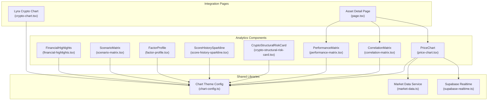
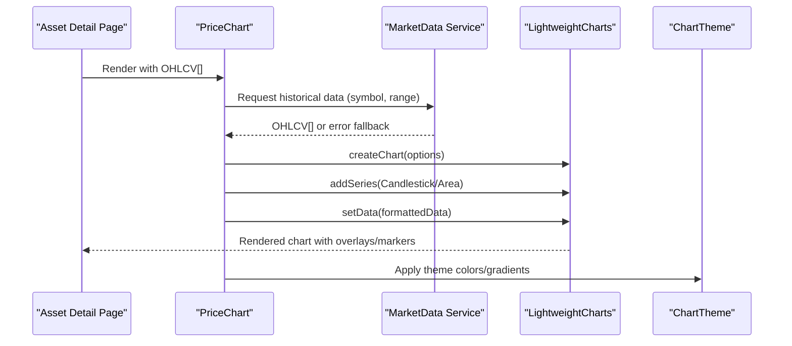
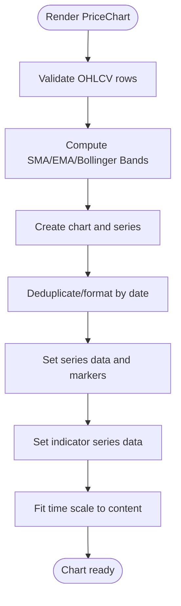
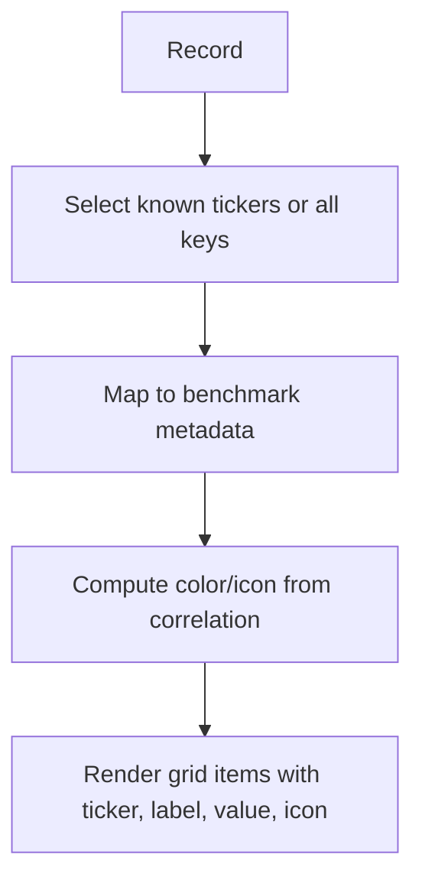
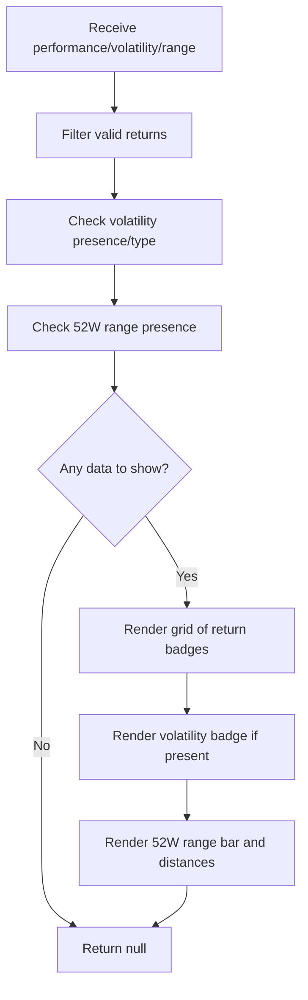
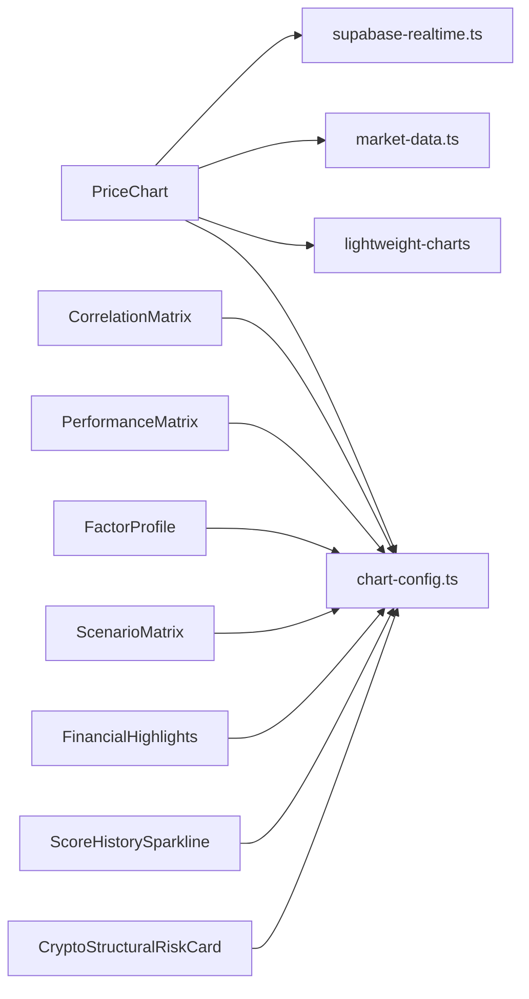

# Market Data Visualization

<cite>
**Referenced Files in This Document**
- [price-chart.tsx](file://src/components/analytics/price-chart.tsx)
- [correlation-matrix.tsx](file://src/components/analytics/correlation-matrix.tsx)
- [performance-matrix.tsx](file://src/components/analytics/performance-matrix.tsx)
- [crypto-structural-risk-card.tsx](file://src/components/analytics/crypto-structural-risk-card.tsx)
- [score-history-sparkline.tsx](file://src/components/analytics/score-history-sparkline.tsx)
- [factor-profile.tsx](file://src/components/analytics/factor-profile.tsx)
- [scenario-matrix.tsx](file://src/components/analytics/scenario-matrix.tsx)
- [financial-highlights.tsx](file://src/components/analytics/financial-highlights.tsx)
- [chart-config.ts](file://src/lib/chart-config.ts)
- [market-data.ts](file://src/lib/market-data.ts)
- [supabase-realtime.ts](file://src/lib/supabase-realtime.ts)
- [crypto-chart.tsx](file://src/components/lyra/crypto-chart.tsx)
- [page.tsx](file://src/app/dashboard/assets/[symbol]/page.tsx)
</cite>

## Table of Contents
1. [Introduction](#introduction)
2. [Project Structure](#project-structure)
3. [Core Components](#core-components)
4. [Architecture Overview](#architecture-overview)
5. [Detailed Component Analysis](#detailed-component-analysis)
6. [Dependency Analysis](#dependency-analysis)
7. [Performance Considerations](#performance-considerations)
8. [Troubleshooting Guide](#troubleshooting-guide)
9. [Conclusion](#conclusion)

## Introduction
This document explains the market data visualization components in LyraAlpha. It focuses on price charts, correlation matrices, performance matrices, and structural risk displays. For each visualization, it documents data formatting requirements, configuration options, interactive features, customization capabilities, integration with market data services, real-time update patterns, accessibility, performance for large datasets, and best practices for financial data visualization.

## Project Structure
The visualization components are primarily located under src/components/analytics and integrate with shared chart themes and market data utilities.

**Diagram sources**
- [price-chart.tsx:1-317](file://src/components/analytics/price-chart.tsx#L1-L317)
- [correlation-matrix.tsx:1-117](file://src/components/analytics/correlation-matrix.tsx#L1-L117)
- [performance-matrix.tsx:1-193](file://src/components/analytics/performance-matrix.tsx#L1-L193)
- [crypto-structural-risk-card.tsx:1-138](file://src/components/analytics/crypto-structural-risk-card.tsx#L1-L138)
- [score-history-sparkline.tsx:1-112](file://src/components/analytics/score-history-sparkline.tsx#L1-L112)
- [factor-profile.tsx:1-71](file://src/components/analytics/factor-profile.tsx#L1-L71)
- [scenario-matrix.tsx:1-186](file://src/components/analytics/scenario-matrix.tsx#L1-L186)
- [financial-highlights.tsx:1-222](file://src/components/analytics/financial-highlights.tsx#L1-L222)
- [chart-config.ts:1-89](file://src/lib/chart-config.ts#L1-L89)
- [market-data.ts:1-113](file://src/lib/market-data.ts#L1-L113)
- [supabase-realtime.ts:1-9](file://src/lib/supabase-realtime.ts#L1-L9)
- [page.tsx:1133-1172](file://src/app/dashboard/assets/[symbol]/page.tsx#L1133-L1172)
- [crypto-chart.tsx:33-95](file://src/components/lyra/crypto-chart.tsx#L33-L95)

**Section sources**
- [price-chart.tsx:1-317](file://src/components/analytics/price-chart.tsx#L1-L317)
- [chart-config.ts:1-89](file://src/lib/chart-config.ts#L1-L89)
- [market-data.ts:1-113](file://src/lib/market-data.ts#L1-L113)
- [supabase-realtime.ts:1-9](file://src/lib/supabase-realtime.ts#L1-L9)
- [page.tsx:1133-1172](file://src/app/dashboard/assets/[symbol]/page.tsx#L1133-L1172)
- [crypto-chart.tsx:33-95](file://src/components/lyra/crypto-chart.tsx#L33-L95)

## Core Components
- PriceChart: Interactive OHLCV candlestick or area chart with SMA/EMA/Bollinger Bands overlays, event markers, responsive sizing, and memoized rendering.
- CorrelationMatrix: Grid of benchmark correlations with color-coded direction and icons.
- PerformanceMatrix: Multi-horizon returns, volatility, and 52-week range analysis with visual indicators.
- CryptoStructuralRiskCard: Risk and trust breakdown for crypto assets with severity levels.
- ScoreHistorySparkline: Minimal sparkline with gradient fill and trend indicator.
- FactorProfile: Factor exposure radar-like bars for Value/Growth/Momentum/Volatility.
- ScenarioMatrix: Scenario analysis cards with VaR/Expected Shortfall and fragility metrics.
- FinancialHighlights: Compact financial statement highlights with tooltips and compact formatting.

**Section sources**
- [price-chart.tsx:101-111](file://src/components/analytics/price-chart.tsx#L101-L111)
- [correlation-matrix.tsx:7-10](file://src/components/analytics/correlation-matrix.tsx#L7-L10)
- [performance-matrix.tsx:5-31](file://src/components/analytics/performance-matrix.tsx#L5-L31)
- [crypto-structural-risk-card.tsx:7-12](file://src/components/analytics/crypto-structural-risk-card.tsx#L7-L12)
- [score-history-sparkline.tsx:11-18](file://src/components/analytics/score-history-sparkline.tsx#L11-L18)
- [factor-profile.tsx:5-14](file://src/components/analytics/factor-profile.tsx#L5-L14)
- [scenario-matrix.tsx:29-32](file://src/components/analytics/scenario-matrix.tsx#L29-L32)
- [financial-highlights.tsx:51-56](file://src/components/analytics/financial-highlights.tsx#L51-L56)

## Architecture Overview
The visualization stack integrates:
- Data ingestion via market-data utilities (historical OHLCV, fallbacks, and crypto-specific sources).
- Rendering via lightweight-charts for interactive price charts.
- Shared theming and gradients via chart-config.
- Optional real-time updates via Supabase client initialization.
- Composition on asset detail pages and specialized dashboards.

**Diagram sources**
- [page.tsx:1133-1172](file://src/app/dashboard/assets/[symbol]/page.tsx#L1133-L1172)
- [price-chart.tsx:135-300](file://src/components/analytics/price-chart.tsx#L135-L300)
- [market-data.ts:23-112](file://src/lib/market-data.ts#L23-L112)
- [chart-config.ts:1-89](file://src/lib/chart-config.ts#L1-L89)

## Detailed Component Analysis

### PriceChart
- Purpose: Render interactive OHLCV or area charts with technical overlays and event markers.
- Data format:
  - Array of OHLCV objects with date (ISO date string), open, high, low, close, optional volume.
  - Optional events array per bar for markers.
- Configuration:
  - chartType: "CANDLESTICK" or "AREA".
  - colors: backgroundColor, lineColor, textColor, areaTopColor, areaBottomColor.
- Interactivity:
  - Responsive resize via ResizeObserver.
  - Overlays: SMA(20), EMA(20), Bollinger Bands (20, 2).
  - Markers: Earnings/Dividend markers placed below bars.
- Customization:
  - Theme-driven colors from chart-config.
  - Memoization via PriceChartMemo to prevent unnecessary re-renders.
- Integration:
  - Consumes market-data utilities for OHLCV retrieval.
  - Uses lightweight-charts APIs for series creation and updates.

**Diagram sources**
- [price-chart.tsx:24-300](file://src/components/analytics/price-chart.tsx#L24-L300)

**Section sources**
- [price-chart.tsx:101-111](file://src/components/analytics/price-chart.tsx#L101-L111)
- [price-chart.tsx:135-300](file://src/components/analytics/price-chart.tsx#L135-L300)
- [price-chart.tsx:305-317](file://src/components/analytics/price-chart.tsx#L305-L317)
- [market-data.ts:23-112](file://src/lib/market-data.ts#L23-L112)
- [chart-config.ts:1-89](file://src/lib/chart-config.ts#L1-L89)

### CorrelationMatrix
- Purpose: Display Pearson correlation coefficients against benchmarks with directional icons and colors.
- Data format:
  - Record<string, number> mapping tickers to correlation values.
- Configuration:
  - className for container styling.
- Interactivity:
  - Hover effects on rows; icons reflect positive/negative/no correlation.
- Customization:
  - Benchmarks mapped to labels/icons/colors; fallback for unknown tickers.
- Usage:
  - Integrated alongside factor profiles and performance matrices on asset pages.

**Diagram sources**
- [correlation-matrix.tsx:37-117](file://src/components/analytics/correlation-matrix.tsx#L37-L117)

**Section sources**
- [correlation-matrix.tsx:7-10](file://src/components/analytics/correlation-matrix.tsx#L7-L10)
- [correlation-matrix.tsx:37-117](file://src/components/analytics/correlation-matrix.tsx#L37-L117)
- [page.tsx:1139-1152](file://src/app/dashboard/assets/[symbol]/page.tsx#L1139-L1152)

### PerformanceMatrix
- Purpose: Present multi-horizon returns, volatility, and 52-week range analysis.
- Data format:
  - performance: returns (1D..1Y) and range52W (high, low, current, distances).
  - volatility: string/number/object with label/score.
  - currencySymbol and region for formatting.
- Configuration:
  - className for container styling.
- Interactivity:
  - No interactive chart; static badges and bars.
- Customization:
  - Conditional rendering based on presence of data.
  - Color-coded badges and range bar with current position indicator.

**Diagram sources**
- [performance-matrix.tsx:68-193](file://src/components/analytics/performance-matrix.tsx#L68-L193)

**Section sources**
- [performance-matrix.tsx:5-31](file://src/components/analytics/performance-matrix.tsx#L5-L31)
- [performance-matrix.tsx:68-193](file://src/components/analytics/performance-matrix.tsx#L68-L193)
- [page.tsx:1159-1171](file://src/app/dashboard/assets/[symbol]/page.tsx#L1159-L1171)

### CryptoStructuralRiskCard
- Purpose: Summarize structural risk, enhanced trust, and holder stability for crypto assets.
- Data format:
  - structuralRisk: dependency/governance/maturity risks with levels and descriptions.
  - enhancedTrust: score and level.
  - holderStability: score and drivers.
- Configuration:
  - className for container styling.
- Interactivity:
  - No interactive chart; summary cards with severity badges.
- Customization:
  - Severity levels mapped to color classes; trust levels mapped to color classes.

**Section sources**
- [crypto-structural-risk-card.tsx:7-12](file://src/components/analytics/crypto-structural-risk-card.tsx#L7-L12)
- [crypto-structural-risk-card.tsx:49-138](file://src/components/analytics/crypto-structural-risk-card.tsx#L49-L138)

### ScoreHistorySparkline
- Purpose: Lightweight trend visualization for scores with gradient fill and trend indicator.
- Data format:
  - data: array of { date, value } points.
  - currentScore: numeric baseline for color selection.
- Configuration:
  - className, height, width, color override.
- Interactivity:
  - Minimal; hover tooltips not implemented here.
- Customization:
  - Dynamic gradient fill; trend computed from recent points.

**Section sources**
- [score-history-sparkline.tsx:11-18](file://src/components/analytics/score-history-sparkline.tsx#L11-L18)
- [score-history-sparkline.tsx:20-112](file://src/components/analytics/score-history-sparkline.tsx#L20-L112)

### FactorProfile
- Purpose: Visualize factor exposures (Value, Growth, Momentum, Volatility).
- Data format:
  - data: { value, growth, momentum, volatility } as numbers.
- Configuration:
  - className for container styling.
- Interactivity:
  - Static bars with animated widths.
- Customization:
  - Color-coded bars per factor; centered explanatory note.

**Section sources**
- [factor-profile.tsx:5-14](file://src/components/analytics/factor-profile.tsx#L5-L14)
- [factor-profile.tsx:16-71](file://src/components/analytics/factor-profile.tsx#L16-L71)
- [page.tsx:1139-1152](file://src/app/dashboard/assets/[symbol]/page.tsx#L1139-L1152)

### ScenarioMatrix
- Purpose: Present Bull/Base/Bear scenarios with probabilities and expected returns; optionally include risk metrics and fragility.
- Data format:
  - scenarioData: bull/base/bear with expectedReturn/probability/explanation.
  - Optional: var95, expectedShortfall, fragilityScore.
- Configuration:
  - className for container styling.
- Interactivity:
  - View mode context toggles simple vs advanced layout.
- Customization:
  - Color-coded cards per scenario; risk metrics rendered conditionally.

**Section sources**
- [scenario-matrix.tsx:8-32](file://src/components/analytics/scenario-matrix.tsx#L8-L32)
- [scenario-matrix.tsx:34-186](file://src/components/analytics/scenario-matrix.tsx#L34-L186)

### FinancialHighlights
- Purpose: Condensed financial statement metrics with tooltips and compact formatting.
- Data format:
  - FinancialStatement object with incomeStatement, balanceSheet, cashflow, plus derived ratios.
- Configuration:
  - currencySymbol and region for formatting; className for container styling.
- Interactivity:
  - Tooltips for metric definitions.
- Customization:
  - Three-column layout; conditional rendering based on available data.

**Section sources**
- [financial-highlights.tsx:11-56](file://src/components/analytics/financial-highlights.tsx#L11-L56)
- [financial-highlights.tsx:98-222](file://src/components/analytics/financial-highlights.tsx#L98-L222)

## Dependency Analysis
- PriceChart depends on:
  - lightweight-charts for rendering.
  - market-data utilities for OHLCV retrieval.
  - chart-config for theme colors.
  - supabase-realtime client initialization for optional real-time updates.
- CorrelationMatrix, PerformanceMatrix, FactorProfile, ScenarioMatrix, and FinancialHighlights are self-contained UI components with no external chart engine dependencies.
- ScoreHistorySparkline is a pure SVG-based component with no external dependencies.

**Diagram sources**
- [price-chart.tsx:1-30](file://src/components/analytics/price-chart.tsx#L1-L30)
- [market-data.ts:1-113](file://src/lib/market-data.ts#L1-L113)
- [chart-config.ts:1-89](file://src/lib/chart-config.ts#L1-L89)
- [supabase-realtime.ts:1-9](file://src/lib/supabase-realtime.ts#L1-L9)
- [correlation-matrix.tsx:1-117](file://src/components/analytics/correlation-matrix.tsx#L1-L117)
- [performance-matrix.tsx:1-193](file://src/components/analytics/performance-matrix.tsx#L1-L193)
- [factor-profile.tsx:1-71](file://src/components/analytics/factor-profile.tsx#L1-L71)
- [scenario-matrix.tsx:1-186](file://src/components/analytics/scenario-matrix.tsx#L1-L186)
- [financial-highlights.tsx:1-222](file://src/components/analytics/financial-highlights.tsx#L1-L222)
- [score-history-sparkline.tsx:1-112](file://src/components/analytics/score-history-sparkline.tsx#L1-L112)
- [crypto-structural-risk-card.tsx:1-138](file://src/components/analytics/crypto-structural-risk-card.tsx#L1-L138)

**Section sources**
- [price-chart.tsx:1-317](file://src/components/analytics/price-chart.tsx#L1-L317)
- [chart-config.ts:1-89](file://src/lib/chart-config.ts#L1-L89)
- [market-data.ts:1-113](file://src/lib/market-data.ts#L1-L113)
- [supabase-realtime.ts:1-9](file://src/lib/supabase-realtime.ts#L1-L9)

## Performance Considerations
- PriceChart:
  - Uses memoization (PriceChartMemo) to avoid re-creating the chart on trivial prop changes.
  - Applies ResizeObserver for responsive sizing without layout thrashing.
  - Deduplicates daily data and sorts ascending to satisfy lightweight-charts requirements.
  - Computes SMA/EMA/Bollinger Bands client-side; consider server-side computation for very large histories.
- CorrelationMatrix, PerformanceMatrix, FactorProfile, ScenarioMatrix, FinancialHighlights:
  - Pure UI components with minimal DOM; efficient rendering via grid layouts.
- ScoreHistorySparkline:
  - Renders SVG path dynamically; ensure small data arrays to keep recomputation cheap.
- Data fetching:
  - market-data fetchAssetData prioritizes database history and falls back to CoinGecko for crypto; consider caching and pagination for extended ranges.

[No sources needed since this section provides general guidance]

## Troubleshooting Guide
- PriceChart not rendering:
  - Verify data is an array of valid OHLCV objects with date and numeric prices.
  - Ensure container has non-zero dimensions before mount; ResizeObserver handles dynamic sizing.
- Unexpected chart colors:
  - Confirm colors props are passed correctly; otherwise defaults apply.
- CorrelationMatrix shows empty or unexpected tickers:
  - Ensure input record keys match known benchmark metadata; fallback label is applied otherwise.
- PerformanceMatrix shows blank:
  - All return values, volatility, and range fields are null/undefined will hide the component; provide at least one valid field.
- FinancialHighlights shows blank:
  - Requires at least one of incomeStatement, balanceSheet, or cashflow to contain non-null values.
- Real-time updates:
  - supabaseRealtime client is initialized only when environment variables are present; confirm NEXT_PUBLIC_SUPABASE_URL and NEXT_PUBLIC_SUPABASE_ANON_KEY are set.

**Section sources**
- [price-chart.tsx:123-127](file://src/components/analytics/price-chart.tsx#L123-L127)
- [price-chart.tsx:198-219](file://src/components/analytics/price-chart.tsx#L198-L219)
- [correlation-matrix.tsx:37-41](file://src/components/analytics/correlation-matrix.tsx#L37-L41)
- [performance-matrix.tsx:68-95](file://src/components/analytics/performance-matrix.tsx#L68-L95)
- [financial-highlights.tsx:98-112](file://src/components/analytics/financial-highlights.tsx#L98-L112)
- [supabase-realtime.ts:1-9](file://src/lib/supabase-realtime.ts#L1-L9)

## Conclusion
LyraAlpha’s visualization components combine robust data handling, theme-consistent styling, and efficient rendering. PriceChart delivers interactive OHLCV views with overlays; CorrelationMatrix and PerformanceMatrix provide comparative insights; CryptoStructuralRiskCard and ScenarioMatrix support risk-focused analysis; FactorProfile and FinancialHighlights offer concise factor and financial summaries. Together, they form a cohesive toolkit for financial market data visualization, with room for enhancements such as server-side indicators and expanded real-time integrations.