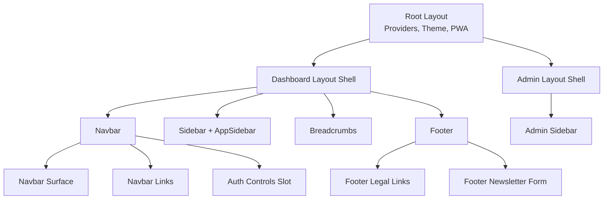
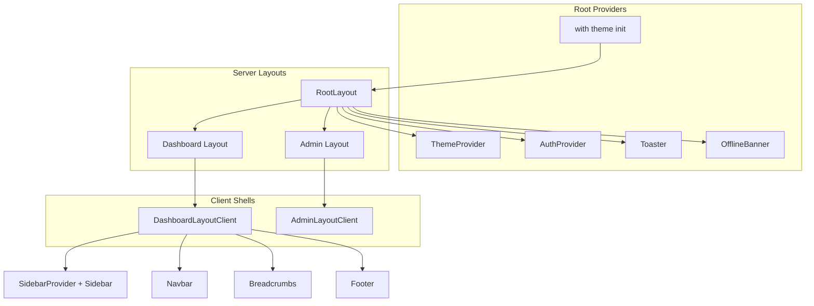
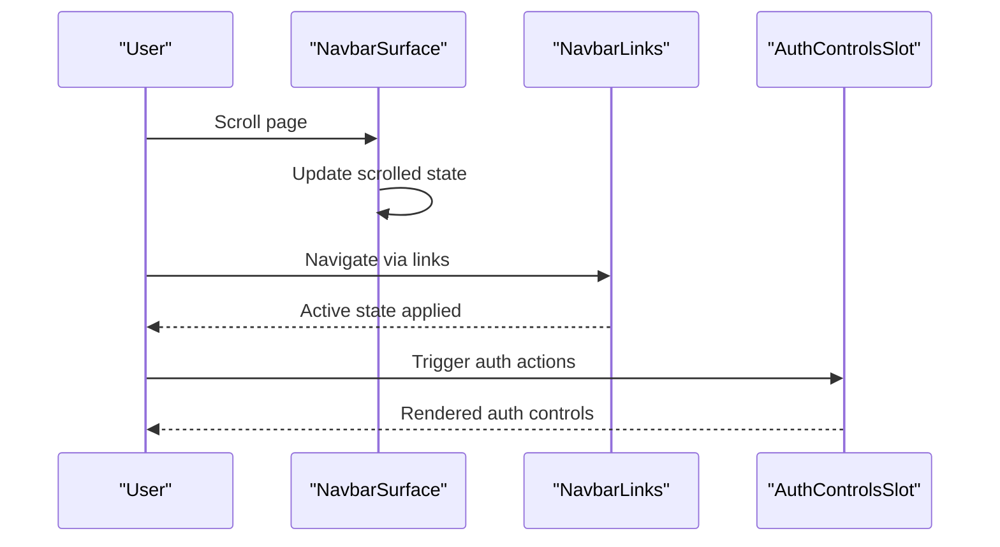
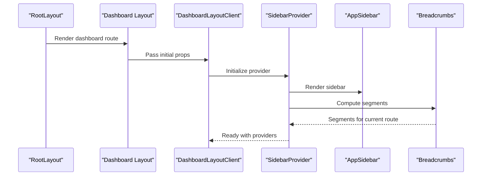
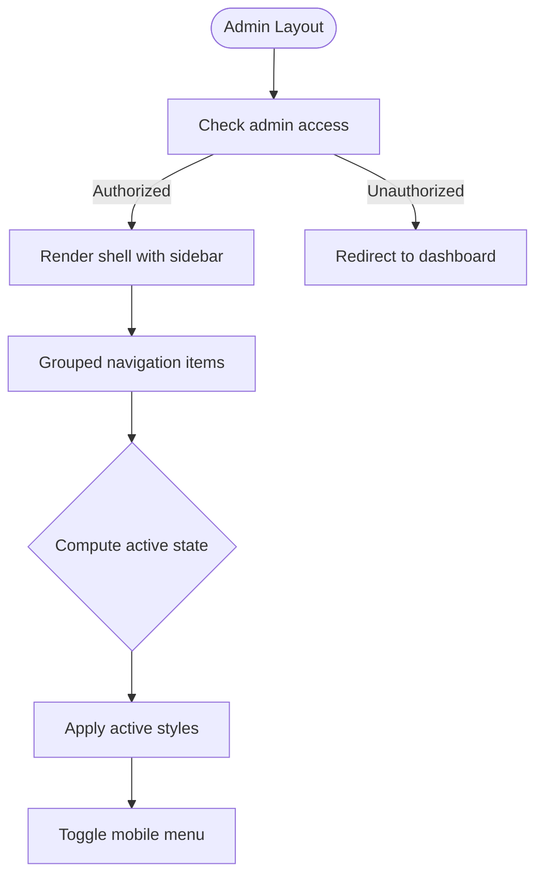
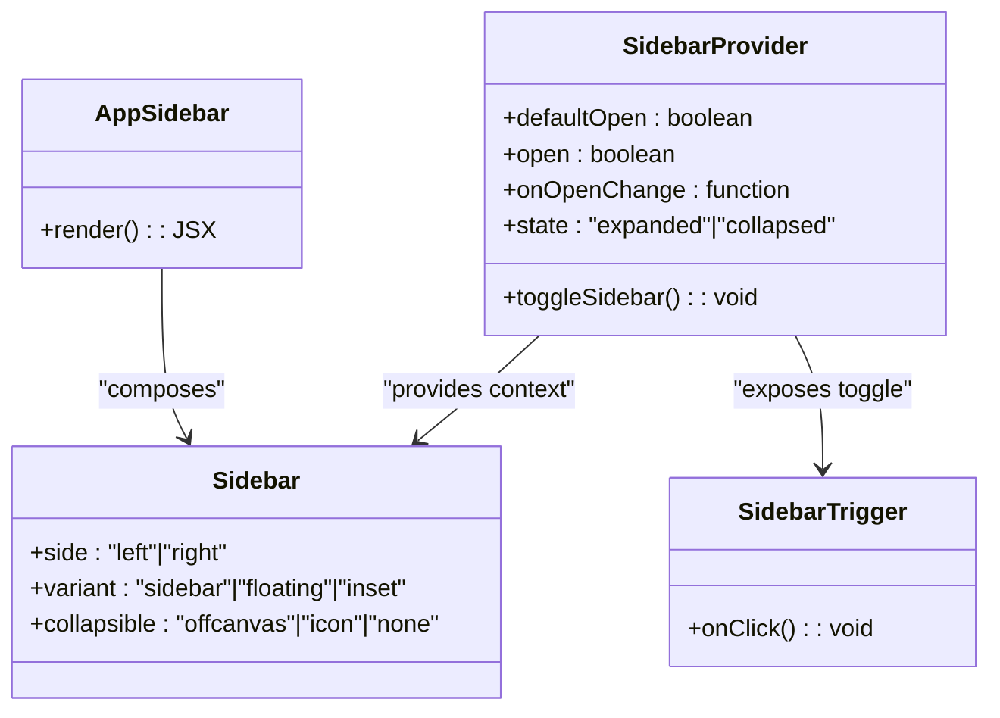
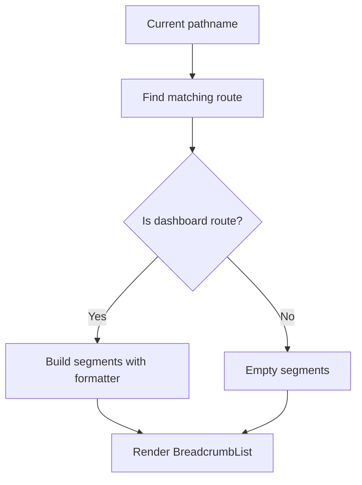
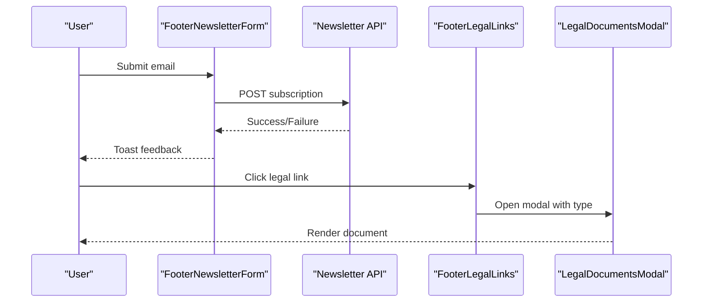
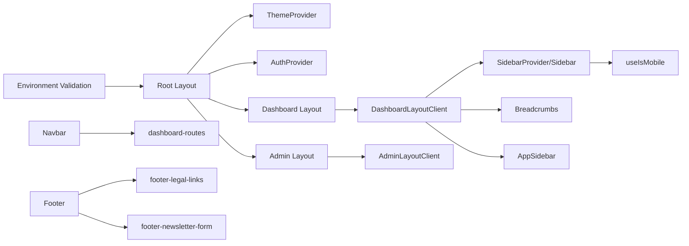

# Navigation & Layout

<cite>
**Referenced Files in This Document**
- [src/app/layout.tsx](file://src/app/layout.tsx)
- [src/app/dashboard/layout.tsx](file://src/app/dashboard/layout.tsx)
- [src/app/admin/layout.tsx](file://src/app/admin/layout.tsx)
- [src/app/dashboard/DashboardLayoutClient.tsx](file://src/app/dashboard/DashboardLayoutClient.tsx)
- [src/app/admin/AdminLayoutClient.tsx](file://src/app/admin/AdminLayoutClient.tsx)
- [src/components/layout/Navbar.tsx](file://src/components/layout/Navbar.tsx)
- [src/components/layout/navbar-surface.tsx](file://src/components/layout/navbar-surface.tsx)
- [src/components/layout/navbar-links.tsx](file://src/components/layout/navbar-links.tsx)
- [src/components/layout/navbar-auth-controls-slot.tsx](file://src/components/layout/navbar-auth-controls-slot.tsx)
- [src/components/layout/Footer.tsx](file://src/components/layout/Footer.tsx)
- [src/components/layout/footer-legal-links.tsx](file://src/components/layout/footer-legal-links.tsx)
- [src/components/layout/footer-newsletter-form.tsx](file://src/components/layout/footer-newsletter-form.tsx)
- [src/components/ui/breadcrumb.tsx](file://src/components/ui/breadcrumb.tsx)
- [src/components/ui/sidebar.tsx](file://src/components/ui/sidebar.tsx)
- [src/components/dashboard/app-sidebar.tsx](file://src/components/dashboard/app-sidebar.tsx)
- [src/hooks/use-mobile.ts](file://src/hooks/use-mobile.ts)
- [src/lib/dashboard-routes.ts](file://src/lib/dashboard-routes.ts)
</cite>

## Table of Contents
1. [Introduction](#introduction)
2. [Project Structure](#project-structure)
3. [Core Components](#core-components)
4. [Architecture Overview](#architecture-overview)
5. [Detailed Component Analysis](#detailed-component-analysis)
6. [Dependency Analysis](#dependency-analysis)
7. [Performance Considerations](#performance-considerations)
8. [Accessibility Compliance](#accessibility-compliance)
9. [Troubleshooting Guide](#troubleshooting-guide)
10. [Conclusion](#conclusion)

## Introduction
This document explains the navigation and layout system in LyraAlpha. It covers the main navbar, sidebar, breadcrumbs, and footer components, detailing their positioning, responsive behavior, state management, and integration with routing. It also documents the layout system architecture, theme integration, customization options, accessibility compliance, mobile responsiveness, and performance considerations for complex layouts.

## Project Structure
The layout system spans three primary areas:
- Root application layout and providers
- Dashboard layout with sidebar, breadcrumbs, and navbar integration
- Admin layout with a dedicated sidebar and responsive mobile menu
- Shared UI components for breadcrumbs and sidebar
- Utility hooks and route definitions for navigation

**Diagram sources**
- [src/app/layout.tsx:79-197](file://src/app/layout.tsx#L79-L197)
- [src/app/dashboard/layout.tsx:24-49](file://src/app/dashboard/layout.tsx#L24-L49)
- [src/app/admin/layout.tsx:5-12](file://src/app/admin/layout.tsx#L5-L12)
- [src/app/dashboard/DashboardLayoutClient.tsx:137-234](file://src/app/dashboard/DashboardLayoutClient.tsx#L137-L234)
- [src/components/layout/Navbar.tsx:9-53](file://src/components/layout/Navbar.tsx#L9-L53)
- [src/components/layout/navbar-surface.tsx:7-49](file://src/components/layout/navbar-surface.tsx#L7-L49)
- [src/components/layout/navbar-links.tsx:11-31](file://src/components/layout/navbar-links.tsx#L11-L31)
- [src/components/layout/navbar-auth-controls-slot.tsx:18-20](file://src/components/layout/navbar-auth-controls-slot.tsx#L18-L20)
- [src/components/ui/sidebar.tsx:155-259](file://src/components/ui/sidebar.tsx#L155-L259)
- [src/components/dashboard/app-sidebar.tsx:120-307](file://src/components/dashboard/app-sidebar.tsx#L120-L307)
- [src/components/ui/breadcrumb.tsx:7-112](file://src/components/ui/breadcrumb.tsx#L7-L112)
- [src/components/layout/Footer.tsx:28-124](file://src/components/layout/Footer.tsx#L28-L124)
- [src/components/layout/footer-legal-links.tsx:13-60](file://src/components/layout/footer-legal-links.tsx#L13-L60)
- [src/components/layout/footer-newsletter-form.tsx:9-58](file://src/components/layout/footer-newsletter-form.tsx#L9-L58)

**Section sources**
- [src/app/layout.tsx:79-197](file://src/app/layout.tsx#L79-L197)
- [src/app/dashboard/layout.tsx:24-49](file://src/app/dashboard/layout.tsx#L24-L49)
- [src/app/admin/layout.tsx:5-12](file://src/app/admin/layout.tsx#L5-L12)

## Core Components
- Root layout and providers: Initializes theme, hydration mitigation, PWA offline banner, and global toasts.
- Dashboard layout: Provides a client-side shell with sidebar, breadcrumbs, navbar controls, overlays, and onboarding gating.
- Admin layout: Provides a responsive admin sidebar with grouped navigation and a mobile menu.
- Navbar: Branding, links, sign-up CTA, and auth controls slot.
- Sidebar: A flexible, responsive sidebar with off-canvas/mobile modes, keyboard shortcut, and cookie-persisted state.
- Breadcrumbs: Accessible breadcrumb navigation tailored for dashboard routes.
- Footer: Multi-column navigation, newsletter subscription, and legal modal integration.

**Section sources**
- [src/app/layout.tsx:79-197](file://src/app/layout.tsx#L79-L197)
- [src/app/dashboard/DashboardLayoutClient.tsx:238-260](file://src/app/dashboard/DashboardLayoutClient.tsx#L238-L260)
- [src/app/admin/AdminLayoutClient.tsx:53-188](file://src/app/admin/AdminLayoutClient.tsx#L53-L188)
- [src/components/layout/Navbar.tsx:9-53](file://src/components/layout/Navbar.tsx#L9-L53)
- [src/components/ui/sidebar.tsx:155-259](file://src/components/ui/sidebar.tsx#L155-L259)
- [src/components/ui/breadcrumb.tsx:7-112](file://src/components/ui/breadcrumb.tsx#L7-L112)
- [src/components/layout/Footer.tsx:28-124](file://src/components/layout/Footer.tsx#L28-L124)

## Architecture Overview
The layout architecture is composed of:
- Provider stack at the root level (theme, auth, PWA, toasts).
- Route-specific server-side guards and client-side shells.
- Dashboard layout with nested providers for plan and region contexts.
- Shared UI components for navigation and layout primitives.

**Diagram sources**
- [src/app/layout.tsx:79-197](file://src/app/layout.tsx#L79-L197)
- [src/app/dashboard/layout.tsx:24-49](file://src/app/dashboard/layout.tsx#L24-L49)
- [src/app/admin/layout.tsx:5-12](file://src/app/admin/layout.tsx#L5-L12)
- [src/app/dashboard/DashboardLayoutClient.tsx:137-234](file://src/app/dashboard/DashboardLayoutClient.tsx#L137-L234)
- [src/app/admin/AdminLayoutClient.tsx:53-188](file://src/app/admin/AdminLayoutClient.tsx#L53-L188)

## Detailed Component Analysis

### Navbar
- Composition: Brand lockup and Beta badge on desktop; symbol-only on mobile; links, sign-up CTA, and auth controls slot.
- Positioning: Fixed at the top with rounded backdrop container and subtle elevation on scroll.
- State management: Tracks scroll position to adjust appearance; defers mounting to avoid hydration warnings.
- Routing integration: Uses Next.js Link and path-based active state for navigation items.

**Diagram sources**
- [src/components/layout/navbar-surface.tsx:7-49](file://src/components/layout/navbar-surface.tsx#L7-L49)
- [src/components/layout/navbar-links.tsx:11-31](file://src/components/layout/navbar-links.tsx#L11-L31)
- [src/components/layout/navbar-auth-controls-slot.tsx:18-20](file://src/components/layout/navbar-auth-controls-slot.tsx#L18-L20)

**Section sources**
- [src/components/layout/Navbar.tsx:9-53](file://src/components/layout/Navbar.tsx#L9-L53)
- [src/components/layout/navbar-surface.tsx:7-49](file://src/components/layout/navbar-surface.tsx#L7-L49)
- [src/components/layout/navbar-links.tsx:11-31](file://src/components/layout/navbar-links.tsx#L11-L31)
- [src/components/layout/navbar-auth-controls-slot.tsx:18-20](file://src/components/layout/navbar-auth-controls-slot.tsx#L18-L20)

### Dashboard Layout Shell
- Purpose: Client-side shell that wires providers, sidebar, breadcrumbs, overlays, and error boundary.
- State management: Uses plan and region providers; toggles deferred features after first interaction; tracks session.
- Integration: Breadcrumb generation uses route metadata; sidebar trigger toggles AppSidebar; mobile page title fallback.

**Diagram sources**
- [src/app/dashboard/layout.tsx:24-49](file://src/app/dashboard/layout.tsx#L24-L49)
- [src/app/dashboard/DashboardLayoutClient.tsx:137-234](file://src/app/dashboard/DashboardLayoutClient.tsx#L137-L234)
- [src/lib/dashboard-routes.ts:78-92](file://src/lib/dashboard-routes.ts#L78-L92)

**Section sources**
- [src/app/dashboard/layout.tsx:24-49](file://src/app/dashboard/layout.tsx#L24-L49)
- [src/app/dashboard/DashboardLayoutClient.tsx:114-234](file://src/app/dashboard/DashboardLayoutClient.tsx#L114-L234)
- [src/lib/dashboard-routes.ts:78-92](file://src/lib/dashboard-routes.ts#L78-L92)

### Admin Layout
- Purpose: Dedicated admin console with grouped navigation and responsive mobile menu.
- State management: Tracks mobile menu open state; computes active state from pathname.
- Integration: Renders grouped items with icons; includes back-to-dashboard link.

**Diagram sources**
- [src/app/admin/layout.tsx:5-12](file://src/app/admin/layout.tsx#L5-L12)
- [src/app/admin/AdminLayoutClient.tsx:53-188](file://src/app/admin/AdminLayoutClient.tsx#L53-L188)

**Section sources**
- [src/app/admin/layout.tsx:5-12](file://src/app/admin/layout.tsx#L5-L12)
- [src/app/admin/AdminLayoutClient.tsx:53-188](file://src/app/admin/AdminLayoutClient.tsx#L53-L188)

### Sidebar
- Variants and behavior: Off-canvas desktop, sheet-based mobile, icon-only collapsible mode, keyboard shortcut, cookie-persisted state.
- State management: Internal state with controlled prop support; toggled via trigger or keyboard; mobile overlay handled by Sheet.
- Integration: Used by DashboardLayoutClient; AppSidebar composes Sidebar with sections and icons.

**Diagram sources**
- [src/components/ui/sidebar.tsx:56-153](file://src/components/ui/sidebar.tsx#L56-L153)
- [src/components/ui/sidebar.tsx:155-259](file://src/components/ui/sidebar.tsx#L155-L259)
- [src/components/ui/sidebar.tsx:261-285](file://src/components/ui/sidebar.tsx#L261-L285)
- [src/components/dashboard/app-sidebar.tsx:120-307](file://src/components/dashboard/app-sidebar.tsx#L120-L307)

**Section sources**
- [src/components/ui/sidebar.tsx:56-259](file://src/components/ui/sidebar.tsx#L56-L259)
- [src/components/dashboard/app-sidebar.tsx:120-307](file://src/components/dashboard/app-sidebar.tsx#L120-L307)

### Breadcrumbs
- Accessibility: Uses semantic roles and aria attributes for screen readers.
- Behavior: Generates segments based on current route; displays either as a desktop-only bar or a mobile title.
- Integration: Dashboard breadcrumbs derive from route metadata and detail segment formatters.

**Diagram sources**
- [src/lib/dashboard-routes.ts:78-92](file://src/lib/dashboard-routes.ts#L78-L92)
- [src/app/dashboard/DashboardLayoutClient.tsx:167-188](file://src/app/dashboard/DashboardLayoutClient.tsx#L167-L188)
- [src/components/ui/breadcrumb.tsx:7-112](file://src/components/ui/breadcrumb.tsx#L7-L112)

**Section sources**
- [src/lib/dashboard-routes.ts:78-92](file://src/lib/dashboard-routes.ts#L78-L92)
- [src/app/dashboard/DashboardLayoutClient.tsx:156-190](file://src/app/dashboard/DashboardLayoutClient.tsx#L156-L190)
- [src/components/ui/breadcrumb.tsx:7-112](file://src/components/ui/breadcrumb.tsx#L7-L112)

### Footer
- Structure: Brand, three-column navigation, newsletter subscription, and legal links.
- Interaction: Newsletter form posts to backend endpoint; legal links open a modal lazily.
- Responsiveness: Grid-based layout adapts columns at larger breakpoints.

**Diagram sources**
- [src/components/layout/footer-newsletter-form.tsx:9-58](file://src/components/layout/footer-newsletter-form.tsx#L9-L58)
- [src/components/layout/footer-legal-links.tsx:13-60](file://src/components/layout/footer-legal-links.tsx#L13-L60)
- [src/components/layout/Footer.tsx:28-124](file://src/components/layout/Footer.tsx#L28-L124)

**Section sources**
- [src/components/layout/Footer.tsx:28-124](file://src/components/layout/Footer.tsx#L28-L124)
- [src/components/layout/footer-newsletter-form.tsx:9-58](file://src/components/layout/footer-newsletter-form.tsx#L9-L58)
- [src/components/layout/footer-legal-links.tsx:13-60](file://src/components/layout/footer-legal-links.tsx#L13-L60)

## Dependency Analysis
- Root providers depend on theme initialization and environment validation.
- Dashboard layout depends on route metadata and plan/region contexts.
- Sidebar depends on a mobile detection hook and cookie persistence.
- Navbar depends on path-based active state and dynamic auth controls.
- Footer integrates with legal modal and newsletter API.

**Diagram sources**
- [src/app/layout.tsx:10-11](file://src/app/layout.tsx#L10-L11)
- [src/app/layout.tsx:159-193](file://src/app/layout.tsx#L159-L193)
- [src/app/dashboard/layout.tsx:24-49](file://src/app/dashboard/layout.tsx#L24-L49)
- [src/app/admin/layout.tsx:5-12](file://src/app/admin/layout.tsx#L5-L12)
- [src/app/dashboard/DashboardLayoutClient.tsx:137-234](file://src/app/dashboard/DashboardLayoutClient.tsx#L137-L234)
- [src/components/ui/sidebar.tsx:8-8](file://src/components/ui/sidebar.tsx#L8-L8)
- [src/hooks/use-mobile.ts:7-23](file://src/hooks/use-mobile.ts#L7-L23)
- [src/lib/dashboard-routes.ts:78-92](file://src/lib/dashboard-routes.ts#L78-L92)
- [src/components/layout/Footer.tsx:28-124](file://src/components/layout/Footer.tsx#L28-L124)

**Section sources**
- [src/app/layout.tsx:10-11](file://src/app/layout.tsx#L10-L11)
- [src/app/layout.tsx:159-193](file://src/app/layout.tsx#L159-L193)
- [src/app/dashboard/layout.tsx:24-49](file://src/app/dashboard/layout.tsx#L24-L49)
- [src/app/admin/layout.tsx:5-12](file://src/app/admin/layout.tsx#L5-L12)
- [src/components/ui/sidebar.tsx:8-8](file://src/components/ui/sidebar.tsx#L8-L8)
- [src/hooks/use-mobile.ts:7-23](file://src/hooks/use-mobile.ts#L7-L23)
- [src/lib/dashboard-routes.ts:78-92](file://src/lib/dashboard-routes.ts#L78-L92)
- [src/components/layout/Footer.tsx:28-124](file://src/components/layout/Footer.tsx#L28-L124)

## Performance Considerations
- Deferred rendering: DashboardLayoutClient defers overlays and extras until first interaction to reduce initial bundle size and improve TTI.
- Dynamic imports: Auth controls, live chat bubble, command palette, and coachmarks are loaded on demand.
- Cookie-backed sidebar state: Reduces layout thrash by persisting expanded/collapsed state.
- Hydration mitigation: Root script strips injected attributes before React mounts to prevent hydration mismatches.
- Scroll-aware navbar: Uses passive listeners and requestAnimationFrame to minimize layout shifts.

[No sources needed since this section provides general guidance]

## Accessibility Compliance
- Skip link: First focusable element jumps to main content for keyboard users.
- Breadcrumb roles: Uses aria-current and aria-disabled for screen reader compatibility.
- Focus management: Keyboard shortcuts and tooltips respect focus order and visibility.
- Semantic markup: nav, ol, li, header, main, footer elements used appropriately.
- Reduced motion: Respects OS-level reduced motion preference.

**Section sources**
- [src/app/layout.tsx:160-166](file://src/app/layout.tsx#L160-L166)
- [src/components/ui/breadcrumb.tsx:54-65](file://src/components/ui/breadcrumb.tsx#L54-L65)
- [src/app/dashboard/DashboardLayoutClient.tsx:135-136](file://src/app/dashboard/DashboardLayoutClient.tsx#L135-L136)

## Troubleshooting Guide
- Hydration warnings: Ensure dynamic imports are used for client-only components and SSR is disabled where necessary.
- Sidebar not toggling: Verify keyboard shortcut handler and cookie persistence; confirm SidebarProvider wraps Sidebar.
- Breadcrumb missing segments: Confirm pathname matches a route definition and detailSegmentFormatter is appropriate.
- Footer newsletter failure: Check API endpoint availability and network connectivity; verify form submission flow.
- Admin menu not opening: Confirm mobile breakpoint and click-outside handler are functioning.

**Section sources**
- [src/components/layout/navbar-auth-controls-slot.tsx:5-16](file://src/components/layout/navbar-auth-controls-slot.tsx#L5-L16)
- [src/components/ui/sidebar.tsx:96-110](file://src/components/ui/sidebar.tsx#L96-L110)
- [src/lib/dashboard-routes.ts:78-92](file://src/lib/dashboard-routes.ts#L78-L92)
- [src/components/layout/footer-newsletter-form.tsx:13-36](file://src/components/layout/footer-newsletter-form.tsx#L13-L36)
- [src/app/admin/AdminLayoutClient.tsx:130-181](file://src/app/admin/AdminLayoutClient.tsx#L130-L181)

## Conclusion
LyraAlpha’s navigation and layout system combines robust providers, responsive components, and thoughtful accessibility to deliver a scalable and performant user experience. The dashboard and admin layouts demonstrate modular composition, deferred rendering, and strong integration with routing and context providers, enabling maintainable customization and future enhancements.