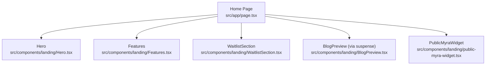
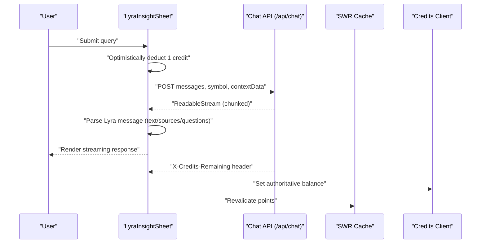
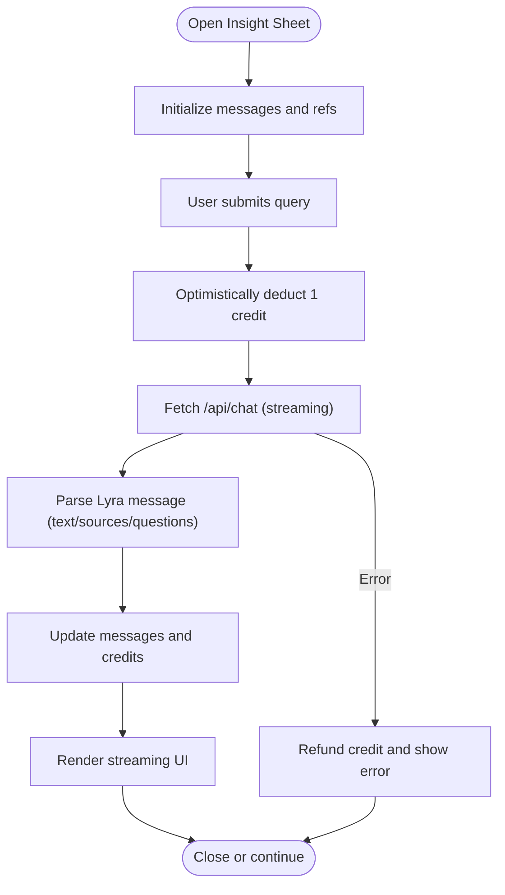
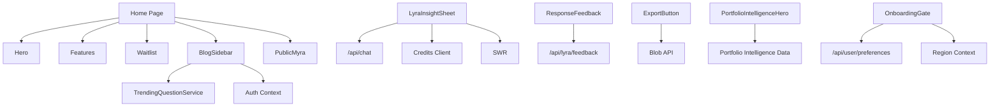

# Specialized Components

<cite>
**Referenced Files in This Document**
- [src/app/page.tsx](file://src/app/page.tsx)
- [src/components/landing/Hero.tsx](file://src/components/landing/Hero.tsx)
- [src/components/landing/Features.tsx](file://src/components/landing/Features.tsx)
- [src/components/landing/WaitlistSection.tsx](file://src/components/landing/WaitlistSection.tsx)
- [src/components/lyra/lyra-insight-sheet.tsx](file://src/components/lyra/lyra-insight-sheet.tsx)
- [src/components/lyra/response-feedback.tsx](file://src/components/lyra/response-feedback.tsx)
- [src/components/lyra/export-button.tsx](file://src/components/lyra/export-button.tsx)
- [src/components/portfolio/portfolio-intelligence-hero.tsx](file://src/components/portfolio/portfolio-intelligence-hero.tsx)
- [src/components/blog/BlogSidebar.tsx](file://src/components/blog/BlogSidebar.tsx)
- [src/components/onboarding/onboarding-gate.tsx](file://src/components/onboarding/onboarding-gate.tsx)
</cite>

## Table of Contents
1. [Introduction](#introduction)
2. [Project Structure](#project-structure)
3. [Core Components](#core-components)
4. [Architecture Overview](#architecture-overview)
5. [Detailed Component Analysis](#detailed-component-analysis)
6. [Dependency Analysis](#dependency-analysis)
7. [Performance Considerations](#performance-considerations)
8. [Troubleshooting Guide](#troubleshooting-guide)
9. [Conclusion](#conclusion)

## Introduction
This document focuses on specialized components that serve distinct application domains within the product:
- Landing page components: hero sections, feature showcases, and waitlist integration
- AI interaction components: insight sheets, response feedback, and export functionality
- Portfolio management components
- Blog components
- Onboarding elements

For each component, we describe domain-specific props, internal state management, integration patterns with backend APIs and client-side caches, and practical usage examples. We also illustrate relationships among components and highlight customization and extension possibilities.

## Project Structure
The specialized components are organized by domain:
- Landing: Hero, Features, WaitlistSection
- Lyra (AI): LyraInsightSheet, ResponseFeedback, ExportButton
- Portfolio: PortfolioIntelligenceHero
- Blog: BlogSidebar
- Onboarding: OnboardingGate

The home page composes landing components and integrates a public Myra widget and blog preview.

**Diagram sources**
- [src/app/page.tsx:15-34](file://src/app/page.tsx#L15-L34)
- [src/components/landing/Hero.tsx:44-221](file://src/components/landing/Hero.tsx#L44-L221)
- [src/components/landing/Features.tsx:74-243](file://src/components/landing/Features.tsx#L74-L243)
- [src/components/landing/WaitlistSection.tsx:152-316](file://src/components/landing/WaitlistSection.tsx#L152-L316)

**Section sources**
- [src/app/page.tsx:15-34](file://src/app/page.tsx#L15-L34)

## Core Components
This section summarizes the primary specialized components and their roles.

- Hero: Prominent landing hero with search CTA, stats, and feature panels.
- Features: Feature showcase with capability cards and entry points to tools.
- WaitlistSection: Roadmap and beta signup section.
- LyraInsightSheet: AI-powered insight sheet with streaming responses, sources, and follow-ups.
- ResponseFeedback: Feedback mechanism for AI responses with optimistic voting.
- ExportButton: Export conversation to Markdown with sanitization.
- PortfolioIntelligenceHero: Portfolio health visualization with signals and components.
- BlogSidebar: Blog post sidebar with trending topics and contextual CTAs.
- OnboardingGate: Multi-step onboarding gate to capture user preferences.

**Section sources**
- [src/components/landing/Hero.tsx:44-221](file://src/components/landing/Hero.tsx#L44-L221)
- [src/components/landing/Features.tsx:74-243](file://src/components/landing/Features.tsx#L74-L243)
- [src/components/landing/WaitlistSection.tsx:152-316](file://src/components/landing/WaitlistSection.tsx#L152-L316)
- [src/components/lyra/lyra-insight-sheet.tsx:147-521](file://src/components/lyra/lyra-insight-sheet.tsx#L147-L521)
- [src/components/lyra/response-feedback.tsx:74-188](file://src/components/lyra/response-feedback.tsx#L74-L188)
- [src/components/lyra/export-button.tsx:68-125](file://src/components/lyra/export-button.tsx#L68-L125)
- [src/components/portfolio/portfolio-intelligence-hero.tsx:105-222](file://src/components/portfolio/portfolio-intelligence-hero.tsx#L105-L222)
- [src/components/blog/BlogSidebar.tsx:65-133](file://src/components/blog/BlogSidebar.tsx#L65-L133)
- [src/components/onboarding/onboarding-gate.tsx:46-392](file://src/components/onboarding/onboarding-gate.tsx#L46-L392)

## Architecture Overview
The specialized components integrate with backend APIs and client-side systems:
- AI insight sheet streams responses from a chat endpoint, parses structured content, and updates credits via headers.
- Response feedback persists votes and reflects prior votes on mount.
- Export button generates downloadable Markdown reports.
- Portfolio intelligence hero renders a score visualization and signal cards.
- Blog sidebar fetches trending queries and constructs contextual CTAs.
- Onboarding gate persists preferences locally and to the server, and sets region context.

**Diagram sources**
- [src/components/lyra/lyra-insight-sheet.tsx:198-302](file://src/components/lyra/lyra-insight-sheet.tsx#L198-L302)

## Detailed Component Analysis

### Landing Hero
- Purpose: Capture attention, communicate value, and drive conversions.
- Domain-specific props:
  - None (self-contained)
- State management:
  - Local form state for search input; navigates on submit.
- Integration patterns:
  - Uses router to navigate to sign-up with optional query param.
  - Renders reveal animations and stat panels.
- Usage example:
  - Included in the home page composition.

**Section sources**
- [src/components/landing/Hero.tsx:44-221](file://src/components/landing/Hero.tsx#L44-L221)
- [src/app/page.tsx:15-34](file://src/app/page.tsx#L15-L34)

### Landing Features
- Purpose: Showcase capabilities and guide users to tools.
- Domain-specific props:
  - Feature cards accept icon, title, description, and accent.
- State management:
  - None (static feature lists and capability cards).
- Integration patterns:
  - Links to dashboard routes for portfolio, narratives, Lyra, and assets.
- Usage example:
  - Included in the home page composition.

**Section sources**
- [src/components/landing/Features.tsx:74-243](file://src/components/landing/Features.tsx#L74-L243)
- [src/app/page.tsx:15-34](file://src/app/page.tsx#L15-L34)

### Waitlist Section
- Purpose: Present roadmap and encourage sign-ups.
- Domain-specific props:
  - None (renders roadmap and beta signup panels).
- State management:
  - None (static roadmap and benefits).
- Integration patterns:
  - Uses a dedicated section ID for navigation targets.
- Usage example:
  - Included in the home page composition.

**Section sources**
- [src/components/landing/WaitlistSection.tsx:152-316](file://src/components/landing/WaitlistSection.tsx#L152-L316)
- [src/app/page.tsx:15-34](file://src/app/page.tsx#L15-L34)

### Lyra Insight Sheet
- Purpose: Provide an AI-powered institutional analysis panel with streaming responses, sources, and follow-ups.
- Domain-specific props:
  - open, onClose, symbol, assetName, contextData, initialQuery, initialDisplayQuery, sourcesLimit
- State management:
  - Tracks messages, loading state, error, and user scroll position.
  - Uses refs to avoid stale closures when sending messages.
  - Applies optimistic credit deduction and refunds on failure.
- Integration patterns:
  - Streams from /api/chat; reads X-Lyra-Sources and X-Credits-Remaining headers.
  - Parses Lyra message content into text, sources, and related questions.
  - Revalidates points via SWR.
- Usage example:
  - Opened programmatically from asset pages or dashboards; displays follow-up suggestions and copy/export controls.

**Diagram sources**
- [src/components/lyra/lyra-insight-sheet.tsx:147-313](file://src/components/lyra/lyra-insight-sheet.tsx#L147-L313)

**Section sources**
- [src/components/lyra/lyra-insight-sheet.tsx:147-521](file://src/components/lyra/lyra-insight-sheet.tsx#L147-L521)

### Response Feedback
- Purpose: Collect user feedback on AI responses with optimistic locking after two votes.
- Domain-specific props:
  - answerId, query, responseSnippet?, symbol?, queryTier?, model?
- State management:
  - Tracks current vote, change count, submission state, and thanks message visibility.
  - Restores prior vote on mount via a GET request.
- Integration patterns:
  - POSTs feedback to /api/lyra/feedback with structured payload.
  - Disables further voting after two changes.
- Usage example:
  - Rendered beneath AI responses to capture sentiment and improve model quality.

**Section sources**
- [src/components/lyra/response-feedback.tsx:74-188](file://src/components/lyra/response-feedback.tsx#L74-L188)

### Export Button
- Purpose: Export a sanitized Markdown report of the conversation.
- Domain-specific props:
  - messages, symbol?, assetName?, className?
- State management:
  - Tracks copied state for UI feedback.
- Integration patterns:
  - Builds Markdown with cleaned content, downloads a .md file, and sets copied state.
- Usage example:
  - Appears in insight sheets and other AI interaction contexts.

**Section sources**
- [src/components/lyra/export-button.tsx:68-125](file://src/components/lyra/export-button.tsx#L68-L125)

### Portfolio Intelligence Hero
- Purpose: Visualize portfolio health with a score ring, signals, and component metrics.
- Domain-specific props:
  - intelligence (PortfolioIntelligenceResult), supportNote?, marketLabel?
- State management:
  - None (pure rendering).
- Integration patterns:
  - Uses motion animations and SVG rings for score visualization.
  - Renders signal cards and component bars with color-coded bands.
- Usage example:
  - Used in portfolio dashboards to summarize health and suggest next actions.

**Section sources**
- [src/components/portfolio/portfolio-intelligence-hero.tsx:105-222](file://src/components/portfolio/portfolio-intelligence-hero.tsx#L105-L222)

### Blog Sidebar
- Purpose: Provide contextual navigation and CTAs within blog posts.
- Domain-specific props:
  - post (BlogPost)
- State management:
  - None (server-rendered widgets).
- Integration patterns:
  - Fetches trending queries from cache or database; falls back to curated list.
  - Constructs contextual CTAs based on auth state (logged-in vs guest).
- Usage example:
  - Included in blog post layouts to guide readers to AI tools or sign-ups.

**Section sources**
- [src/components/blog/BlogSidebar.tsx:65-133](file://src/components/blog/BlogSidebar.tsx#L65-L133)

### Onboarding Gate
- Purpose: Capture user preferences and region selection to personalize the experience.
- Domain-specific props:
  - initialCompleted? (boolean)
- State management:
  - Tracks step, selections (region, experience, interests), saving/loading state, and errors.
  - Persists to localStorage and server; sets region context.
- Integration patterns:
  - Loads preferences from /api/user/preferences; saves via PUT/PATCH.
  - Supports skipping onboarding and falls back to defaults.
- Usage example:
  - Mounted as a full-screen overlay until completed or skipped.

**Section sources**
- [src/components/onboarding/onboarding-gate.tsx:46-392](file://src/components/onboarding/onboarding-gate.tsx#L46-L392)

## Dependency Analysis
Key relationships and dependencies:
- Home page composes landing components and integrates external widgets.
- LyraInsightSheet depends on:
  - Backend chat API for streaming
  - Credit client for optimistic updates and authoritative balance
  - SWR for cache revalidation
- ResponseFeedback depends on:
  - Backend feedback API
  - Prior vote restoration on mount
- ExportButton depends on:
  - Client-side blob generation and download
- PortfolioIntelligenceHero depends on:
  - Engine-provided intelligence data
  - Motion animations for visual effects
- BlogSidebar depends on:
  - Trending query service and caching
  - Auth context for CTAs
- OnboardingGate depends on:
  - Preferences API
  - Region context provider

**Diagram sources**
- [src/app/page.tsx:15-34](file://src/app/page.tsx#L15-L34)
- [src/components/lyra/lyra-insight-sheet.tsx:198-302](file://src/components/lyra/lyra-insight-sheet.tsx#L198-L302)
- [src/components/lyra/response-feedback.tsx:116-143](file://src/components/lyra/response-feedback.tsx#L116-L143)
- [src/components/lyra/export-button.tsx:68-95](file://src/components/lyra/export-button.tsx#L68-L95)
- [src/components/portfolio/portfolio-intelligence-hero.tsx:105-222](file://src/components/portfolio/portfolio-intelligence-hero.tsx#L105-L222)
- [src/components/blog/BlogSidebar.tsx:13-37](file://src/components/blog/BlogSidebar.tsx#L13-L37)
- [src/components/onboarding/onboarding-gate.tsx:122-163](file://src/components/onboarding/onboarding-gate.tsx#L122-L163)

**Section sources**
- [src/app/page.tsx:15-34](file://src/app/page.tsx#L15-L34)
- [src/components/lyra/lyra-insight-sheet.tsx:147-313](file://src/components/lyra/lyra-insight-sheet.tsx#L147-L313)
- [src/components/lyra/response-feedback.tsx:74-143](file://src/components/lyra/response-feedback.tsx#L74-L143)
- [src/components/lyra/export-button.tsx:68-95](file://src/components/lyra/export-button.tsx#L68-L95)
- [src/components/portfolio/portfolio-intelligence-hero.tsx:105-222](file://src/components/portfolio/portfolio-intelligence-hero.tsx#L105-L222)
- [src/components/blog/BlogSidebar.tsx:65-133](file://src/components/blog/BlogSidebar.tsx#L65-L133)
- [src/components/onboarding/onboarding-gate.tsx:46-163](file://src/components/onboarding/onboarding-gate.tsx#L46-L163)

## Performance Considerations
- Streaming responses: LyraInsightSheet uses a streaming reader to render progressively, reducing perceived latency.
- Optimistic updates: Credits are deducted optimistically and corrected by server headers to minimize perceived lag.
- Memoization: ChatMessageItem uses memoization to avoid unnecessary re-renders.
- Lazy loading: Dynamic imports are used for heavy subcomponents to reduce initial bundle size.
- Motion and animations: PortfolioIntelligenceHero uses lightweight SVG and motion primitives; ensure throttling on lower-end devices.
- Client-side caching: SWR revalidation keeps views consistent after AI interactions.

[No sources needed since this section provides general guidance]

## Troubleshooting Guide
- LyraInsightSheet shows an error:
  - Verify /api/chat availability and headers (X-Lyra-Sources, X-Credits-Remaining).
  - Confirm optimistic credit refund occurs on failure.
- ResponseFeedback does not reflect prior vote:
  - Ensure /api/lyra/feedback?answerId returns a vote value.
- ExportButton does nothing:
  - Confirm messages contain assistant content and browser supports Blob/download.
- PortfolioIntelligenceHero renders incorrectly:
  - Validate intelligence data shape and ensure numeric component scores.
- BlogSidebar shows no trending:
  - Check cache retrieval and database fallback logic.
- OnboardingGate stuck on loading:
  - Inspect /api/user/preferences and localStorage access.

**Section sources**
- [src/components/lyra/lyra-insight-sheet.tsx:294-302](file://src/components/lyra/lyra-insight-sheet.tsx#L294-L302)
- [src/components/lyra/response-feedback.tsx:95-111](file://src/components/lyra/response-feedback.tsx#L95-L111)
- [src/components/lyra/export-button.tsx:68-95](file://src/components/lyra/export-button.tsx#L68-L95)
- [src/components/portfolio/portfolio-intelligence-hero.tsx:105-222](file://src/components/portfolio/portfolio-intelligence-hero.tsx#L105-L222)
- [src/components/blog/BlogSidebar.tsx:13-37](file://src/components/blog/BlogSidebar.tsx#L13-L37)
- [src/components/onboarding/onboarding-gate.tsx:69-103](file://src/components/onboarding/onboarding-gate.tsx#L69-L103)

## Conclusion
These specialized components collectively deliver a cohesive user experience across marketing, AI interaction, portfolio management, content, and onboarding. They emphasize robust integrations with backend APIs, optimistic client-side updates, and accessible UI patterns. Extending these components typically involves:
- Adding domain-specific props and rendering logic
- Integrating with new APIs or data sources
- Leveraging existing patterns for state, streaming, and caching

[No sources needed since this section summarizes without analyzing specific files]