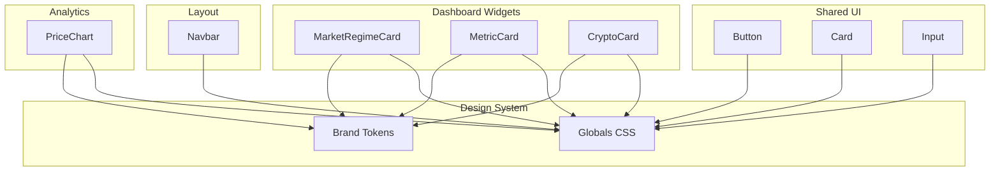
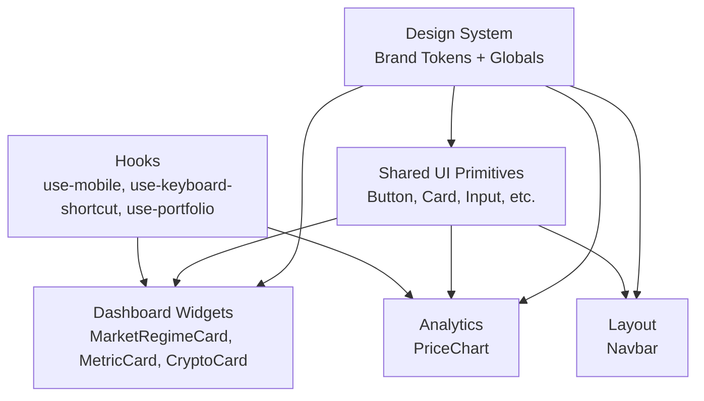
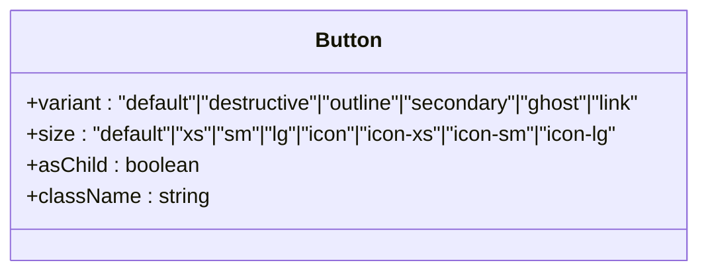
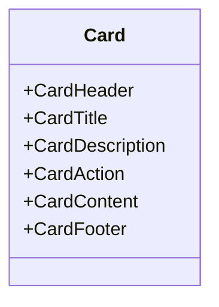
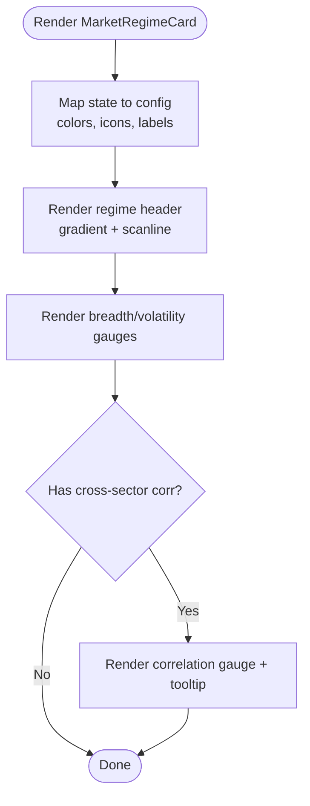
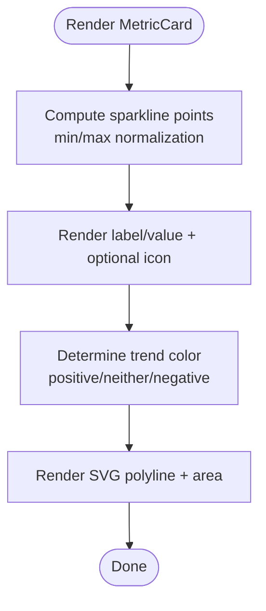
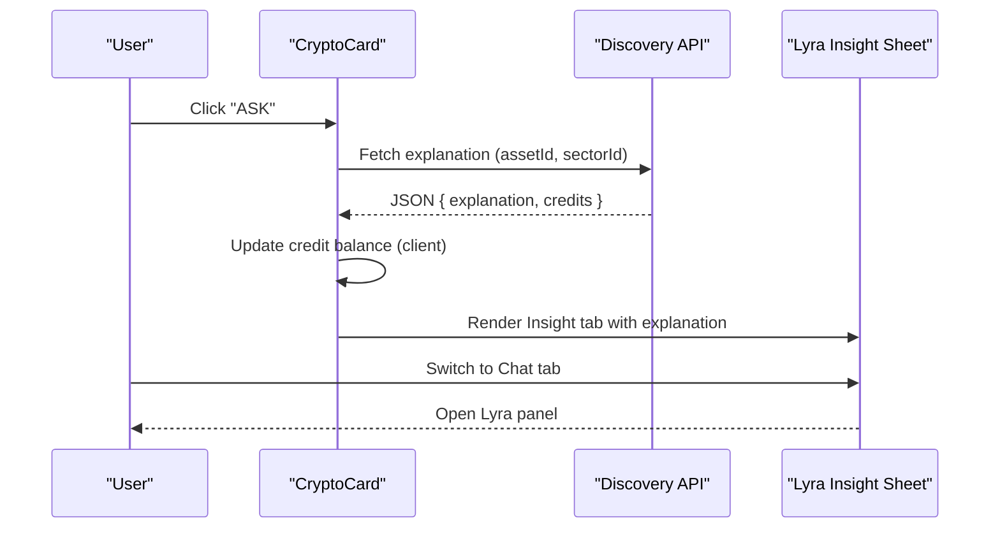
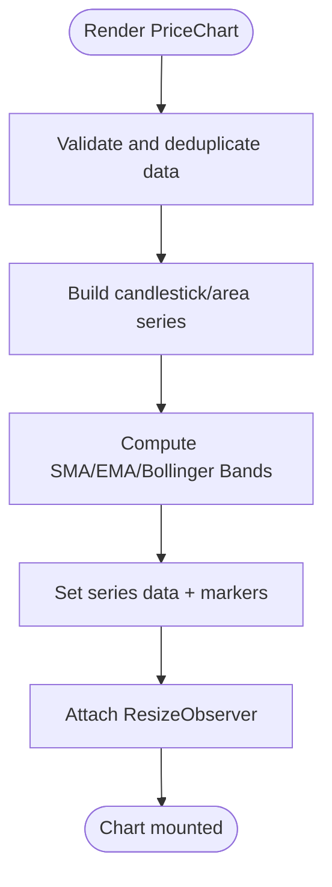
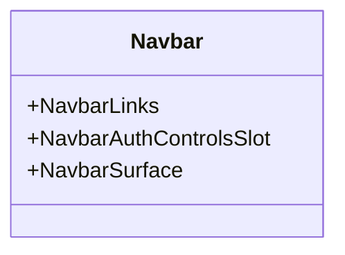
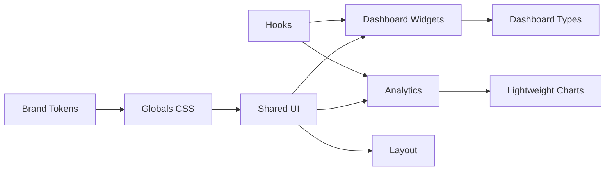

# UI Components

<cite>
**Referenced Files in This Document**
- [src/components/ui/button.tsx](file://src/components/ui/button.tsx)
- [src/components/ui/card.tsx](file://src/components/ui/card.tsx)
- [src/components/ui/input.tsx](file://src/components/ui/input.tsx)
- [src/components/dashboard/market-regime-card.tsx](file://src/components/dashboard/market-regime-card.tsx)
- [src/components/dashboard/metric-card.tsx](file://src/components/dashboard/metric-card.tsx)
- [src/components/dashboard/crypto-card.tsx](file://src/components/dashboard/crypto-card.tsx)
- [src/components/dashboard/types.ts](file://src/components/dashboard/types.ts)
- [src/components/analytics/price-chart.tsx](file://src/components/analytics/price-chart.tsx)
- [src/components/layout/Navbar.tsx](file://src/components/layout/Navbar.tsx)
- [src/app/lyraiq-brand-tokens.css](file://src/app/lyraiq-brand-tokens.css)
- [src/app/globals.css](file://src/app/globals.css)
- [src/lib/chart-config.ts](file://src/lib/chart-config.ts)
- [src/hooks/use-mobile.ts](file://src/hooks/use-mobile.ts)
- [src/hooks/use-keyboard-shortcut.tsx](file://src/hooks/use-keyboard-shortcut.tsx)
- [src/hooks/use-portfolio.ts](file://src/hooks/use-portfolio.ts)
- [src/hooks/use-dashboard-points.ts](file://src/hooks/use-dashboard-points.ts)
- [src/lib/motion.ts](file://src/lib/motion.ts)
</cite>

## Table of Contents
1. [Introduction](#introduction)
2. [Project Structure](#project-structure)
3. [Core Components](#core-components)
4. [Architecture Overview](#architecture-overview)
5. [Detailed Component Analysis](#detailed-component-analysis)
6. [Dependency Analysis](#dependency-analysis)
7. [Performance Considerations](#performance-considerations)
8. [Accessibility Compliance](#accessibility-compliance)
9. [Troubleshooting Guide](#troubleshooting-guide)
10. [Conclusion](#conclusion)
11. [Appendices](#appendices)

## Introduction
This document describes LyraAlpha’s React component library focused on reusable UI elements for dashboards, market insights, charts, forms, and navigation. It covers props, events, styling, customization, state management patterns, hooks usage, composition strategies, accessibility, performance, and cross-browser compatibility. Examples are provided via code snippet paths to guide implementation without embedding code directly.

## Project Structure
The component library is organized by domain:
- Shared primitives: buttons, inputs, cards, dialogs, tooltips, tabs, etc.
- Dashboard widgets: market regime, metrics, crypto cards, feeds, and navigation helpers
- Analytics: price charts and related visualizations
- Layout: navigation bars, footers, and auth controls
- Design system: brand tokens and global CSS for themes, typography, spacing, and motion

**Diagram sources**
- [src/components/ui/button.tsx:1-65](file://src/components/ui/button.tsx#L1-L65)
- [src/components/ui/card.tsx:1-93](file://src/components/ui/card.tsx#L1-L93)
- [src/components/ui/input.tsx:1-23](file://src/components/ui/input.tsx#L1-L23)
- [src/components/dashboard/market-regime-card.tsx:1-239](file://src/components/dashboard/market-regime-card.tsx#L1-L239)
- [src/components/dashboard/metric-card.tsx:1-147](file://src/components/dashboard/metric-card.tsx#L1-L147)
- [src/components/dashboard/crypto-card.tsx:1-482](file://src/components/dashboard/crypto-card.tsx#L1-L482)
- [src/components/analytics/price-chart.tsx:1-317](file://src/components/analytics/price-chart.tsx#L1-L317)
- [src/components/layout/Navbar.tsx:1-54](file://src/components/layout/Navbar.tsx#L1-L54)
- [src/app/lyraiq-brand-tokens.css:1-21](file://src/app/lyraiq-brand-tokens.css#L1-L21)
- [src/app/globals.css:1-880](file://src/app/globals.css#L1-L880)

**Section sources**
- [src/components/ui/button.tsx:1-65](file://src/components/ui/button.tsx#L1-L65)
- [src/components/ui/card.tsx:1-93](file://src/components/ui/card.tsx#L1-L93)
- [src/components/ui/input.tsx:1-23](file://src/components/ui/input.tsx#L1-L23)
- [src/components/dashboard/market-regime-card.tsx:1-239](file://src/components/dashboard/market-regime-card.tsx#L1-L239)
- [src/components/dashboard/metric-card.tsx:1-147](file://src/components/dashboard/metric-card.tsx#L1-L147)
- [src/components/dashboard/crypto-card.tsx:1-482](file://src/components/dashboard/crypto-card.tsx#L1-L482)
- [src/components/analytics/price-chart.tsx:1-317](file://src/components/analytics/price-chart.tsx#L1-L317)
- [src/components/layout/Navbar.tsx:1-54](file://src/components/layout/Navbar.tsx#L1-L54)
- [src/app/lyraiq-brand-tokens.css:1-21](file://src/app/lyraiq-brand-tokens.css#L1-L21)
- [src/app/globals.css:1-880](file://src/app/globals.css#L1-L880)

## Core Components
This section documents the most frequently used reusable components and their capabilities.

- Button
  - Purpose: Unified action element with variants, sizes, and slot semantics
  - Props:
    - variant: default | destructive | outline | secondary | ghost | link
    - size: default | xs | sm | lg | icon | icon-xs | icon-sm | icon-lg
    - asChild: wrap children in a Radix Slot
    - Additional native button props
  - Events: Standard click and keyboard activation
  - Styling: Uses class variance authority (CVA) tokens and focus-visible ring
  - Customization: Accepts className; variant and size control background, borders, and typography
  - Accessibility: Inherits focus-visible outline; supports aria-invalid
  - Example snippet path: [Button usage:41-62](file://src/components/ui/button.tsx#L41-L62)

- Card
  - Purpose: Container with header/title/description/action/content/footer slots
  - Props: className for all subcomponents
  - Slots: CardHeader, CardTitle, CardDescription, CardAction, CardContent, CardFooter
  - Styling: Backdrop blur, glass-like surfaces, and responsive paddings
  - Customization: Extendable via className; maintains semantic data-slot attributes
  - Accessibility: No special roles; relies on semantic HTML structure
  - Example snippet path: [Card composition:5-92](file://src/components/ui/card.tsx#L5-L92)

- Input
  - Purpose: Text input with focus-visible ring and invalid state styling
  - Props: type, className, plus standard input attributes
  - Styling: Tailwind-based focus-visible ring, aria-invalid highlighting, and selection colors
  - Customization: Pass className to override defaults
  - Accessibility: Supports aria-invalid and focus-visible outlines
  - Example snippet path: [Input usage:5-20](file://src/components/ui/input.tsx#L5-L20)

- MarketRegimeCard
  - Purpose: Visualize macro regime with breadth, volatility, and sector correlation
  - Props:
    - state: RegimeState
    - breadth: number (%)
    - volatility: number (e.g., VIX)
    - context: string (description)
    - crossSectorCorrelation?: CrossSectorCorrelation
  - Events: None (display-only)
  - Styling: Animated gradients, scanline overlay, backdrop blur, and color-coded regime
  - Customization: Tailwind classes via className; regime mapping defines colors and icons
  - Accessibility: Tooltip usage for contextual help
  - Example snippet path: [MarketRegimeCard props and rendering:8-238](file://src/components/dashboard/market-regime-card.tsx#L8-L238)

- MetricCard
  - Purpose: Highlight KPIs with trend direction, sparkline, and optional tooltip
  - Props:
    - label: string
    - value: string
    - trend: number
    - trendLabel?: string
    - tooltip?: string
    - icon?: LucideIcon
    - sparklineData?: number[]
  - Events: None (display-only)
  - Styling: Hover effects, gradient overlays, and color-coded trend
  - Customization: Adjust className and sparklineData; tooltip optional
  - Accessibility: Tooltip for extended info
  - Example snippet path: [MetricCard props and rendering:7-146](file://src/components/dashboard/metric-card.tsx#L7-L146)

- CryptoCard
  - Purpose: Institutional-grade asset card with ratings, signals, and Lyra insights
  - Props:
    - data: CryptoCardData (includes symbol, name, scores, ratings, signals, IDs)
    - inclusionReason?: string
  - Events: Fetch explanation via API; opens Lyra insight sheet
  - Styling: Glass blur, hover elevation, and color-coded metrics
  - Customization: Conditional rendering for signals and metrics; tabbed insight/chat panels
  - Accessibility: Tabs, sheets, and tooltips; links for navigation
  - Example snippet path: [CryptoCard props and rendering:55-385](file://src/components/dashboard/crypto-card.tsx#L55-L385)

- PriceChart
  - Purpose: Interactive OHLC/area chart with SMA, EMA, and Bollinger Bands
  - Props:
    - data: Array of OHLCV with optional events
    - colors?: { backgroundColor, lineColor, textColor, areaTopColor, areaBottomColor }
    - chartType?: "CANDLESTICK" | "AREA"
  - Events: None (render-only)
  - Styling: Lightweight Charts integration with responsive sizing and theme-aware colors
  - Customization: Configure series colors and chart type; memoized for performance
  - Accessibility: Chart-specific; ensure external labeling for screen readers
  - Example snippet path: [PriceChart props and rendering:101-316](file://src/components/analytics/price-chart.tsx#L101-L316)

- Navbar
  - Purpose: Primary navigation bar with branding, links, and auth controls
  - Props: None
  - Events: None (render-only)
  - Styling: Responsive logo lockup, themed badges, and hover states
  - Customization: Replace brand assets and adjust layout classes
  - Accessibility: Semantic links and buttons; ensure keyboard navigation
  - Example snippet path: [Navbar composition:9-53](file://src/components/layout/Navbar.tsx#L9-L53)

**Section sources**
- [src/components/ui/button.tsx:1-65](file://src/components/ui/button.tsx#L1-L65)
- [src/components/ui/card.tsx:1-93](file://src/components/ui/card.tsx#L1-L93)
- [src/components/ui/input.tsx:1-23](file://src/components/ui/input.tsx#L1-L23)
- [src/components/dashboard/market-regime-card.tsx:1-239](file://src/components/dashboard/market-regime-card.tsx#L1-L239)
- [src/components/dashboard/metric-card.tsx:1-147](file://src/components/dashboard/metric-card.tsx#L1-L147)
- [src/components/dashboard/crypto-card.tsx:1-482](file://src/components/dashboard/crypto-card.tsx#L1-L482)
- [src/components/analytics/price-chart.tsx:1-317](file://src/components/analytics/price-chart.tsx#L1-L317)
- [src/components/layout/Navbar.tsx:1-54](file://src/components/layout/Navbar.tsx#L1-L54)

## Architecture Overview
The component library follows a layered approach:
- Shared UI primitives provide consistent styling and behavior
- Domain components (dashboard, analytics) compose primitives and integrate with hooks/services
- Design system tokens (brand, theme, motion) unify appearance and interaction
- Hooks encapsulate state and platform concerns (mobile detection, keyboard shortcuts, portfolio)

**Diagram sources**
- [src/app/lyraiq-brand-tokens.css:1-21](file://src/app/lyraiq-brand-tokens.css#L1-L21)
- [src/app/globals.css:1-880](file://src/app/globals.css#L1-L880)
- [src/components/ui/button.tsx:1-65](file://src/components/ui/button.tsx#L1-L65)
- [src/components/ui/card.tsx:1-93](file://src/components/ui/card.tsx#L1-L93)
- [src/components/ui/input.tsx:1-23](file://src/components/ui/input.tsx#L1-L23)
- [src/components/dashboard/market-regime-card.tsx:1-239](file://src/components/dashboard/market-regime-card.tsx#L1-L239)
- [src/components/dashboard/metric-card.tsx:1-147](file://src/components/dashboard/metric-card.tsx#L1-L147)
- [src/components/dashboard/crypto-card.tsx:1-482](file://src/components/dashboard/crypto-card.tsx#L1-L482)
- [src/components/analytics/price-chart.tsx:1-317](file://src/components/analytics/price-chart.tsx#L1-L317)
- [src/components/layout/Navbar.tsx:1-54](file://src/components/layout/Navbar.tsx#L1-L54)
- [src/hooks/use-mobile.ts](file://src/hooks/use-mobile.ts)
- [src/hooks/use-keyboard-shortcut.tsx](file://src/hooks/use-keyboard-shortcut.tsx)
- [src/hooks/use-portfolio.ts](file://src/hooks/use-portfolio.ts)

## Detailed Component Analysis

### Button
- Implementation pattern: CVA-based variants and sizes; accepts asChild to render as a Radix Slot
- Data structures: variant and size enums defined in CVA
- Dependencies: cn utility, focus-visible ring, aria-invalid
- Customization: className augmentation; variant and size tokens applied
- Accessibility: focus-visible outline; aria-invalid support

**Diagram sources**
- [src/components/ui/button.tsx:7-39](file://src/components/ui/button.tsx#L7-L39)

**Section sources**
- [src/components/ui/button.tsx:1-65](file://src/components/ui/button.tsx#L1-L65)

### Card
- Implementation pattern: Multiple subcomponents composing a cohesive layout
- Data structures: No props for Card itself; subcomponents accept className
- Dependencies: cn utility; data-slot attributes for testing
- Customization: className on each subcomponent; grid-based header layout

**Diagram sources**
- [src/components/ui/card.tsx:5-92](file://src/components/ui/card.tsx#L5-L92)

**Section sources**
- [src/components/ui/card.tsx:1-93](file://src/components/ui/card.tsx#L1-L93)

### MarketRegimeCard
- Implementation pattern: Maps regime state to visuals; renders gauges and tooltips
- Data structures: RegimeState and CrossSectorCorrelation interfaces
- Dependencies: Tooltip, icons, cn utility, motion classes
- Customization: className on Card wrapper; regime mapping controls colors/icons

**Diagram sources**
- [src/components/dashboard/market-regime-card.tsx:24-238](file://src/components/dashboard/market-regime-card.tsx#L24-L238)

**Section sources**
- [src/components/dashboard/market-regime-card.tsx:1-239](file://src/components/dashboard/market-regime-card.tsx#L1-L239)

### MetricCard
- Implementation pattern: Trend-aware rendering with sparkline SVG generation
- Data structures: Numeric arrays for sparklines; trend comparison logic
- Dependencies: motion variants, Tooltip, cn utility
- Customization: className; optional tooltip; configurable sparkline data

**Diagram sources**
- [src/components/dashboard/metric-card.tsx:31-146](file://src/components/dashboard/metric-card.tsx#L31-L146)

**Section sources**
- [src/components/dashboard/metric-card.tsx:1-147](file://src/components/dashboard/metric-card.tsx#L1-L147)

### CryptoCard
- Implementation pattern: Rich asset card with tabs, sheets, and external API integration
- Data structures: CryptoCardData interface; optional signals and ratings
- Dependencies: Tabs, Sheet, LyraInsightSheet, react-markdown, cn utility
- Customization: Conditional rendering for signals/metrics; credit-based explanation fetching

**Diagram sources**
- [src/components/dashboard/crypto-card.tsx:65-99](file://src/components/dashboard/crypto-card.tsx#L65-L99)
- [src/components/dashboard/crypto-card.tsx:164-288](file://src/components/dashboard/crypto-card.tsx#L164-L288)

**Section sources**
- [src/components/dashboard/crypto-card.tsx:1-482](file://src/components/dashboard/crypto-card.tsx#L1-L482)
- [src/components/dashboard/types.ts:1-36](file://src/components/dashboard/types.ts#L1-L36)

### PriceChart
- Implementation pattern: Lightweight Charts integration with SMA/EMA/Bollinger Bands
- Data structures: OHLCV rows; ChartMarker types; memoization for performance
- Dependencies: lightweight-charts, ResizeObserver, memo
- Customization: Colors, chart type, responsive sizing

**Diagram sources**
- [src/components/analytics/price-chart.tsx:135-302](file://src/components/analytics/price-chart.tsx#L135-L302)

**Section sources**
- [src/components/analytics/price-chart.tsx:1-317](file://src/components/analytics/price-chart.tsx#L1-L317)

### Navbar
- Implementation pattern: Branding + navigation links + auth controls slot
- Data structures: None (static composition)
- Dependencies: Next.js Image/Link, slots for auth controls and links
- Customization: Replace logos and adjust layout classes

**Diagram sources**
- [src/components/layout/Navbar.tsx:5-7](file://src/components/layout/Navbar.tsx#L5-L7)

**Section sources**
- [src/components/layout/Navbar.tsx:1-54](file://src/components/layout/Navbar.tsx#L1-L54)

## Dependency Analysis
Component dependencies emphasize composition and shared utilities:
- Shared UI depends on design system tokens and cn utility
- Dashboard widgets depend on shared UI and domain types
- Analytics depends on third-party charting library and memoization
- Layout composes shared UI and slots for extensibility

**Diagram sources**
- [src/app/lyraiq-brand-tokens.css:1-21](file://src/app/lyraiq-brand-tokens.css#L1-L21)
- [src/app/globals.css:1-880](file://src/app/globals.css#L1-L880)
- [src/components/ui/button.tsx:1-65](file://src/components/ui/button.tsx#L1-L65)
- [src/components/ui/card.tsx:1-93](file://src/components/ui/card.tsx#L1-L93)
- [src/components/ui/input.tsx:1-23](file://src/components/ui/input.tsx#L1-L23)
- [src/components/dashboard/market-regime-card.tsx:1-239](file://src/components/dashboard/market-regime-card.tsx#L1-L239)
- [src/components/dashboard/metric-card.tsx:1-147](file://src/components/dashboard/metric-card.tsx#L1-L147)
- [src/components/dashboard/crypto-card.tsx:1-482](file://src/components/dashboard/crypto-card.tsx#L1-L482)
- [src/components/analytics/price-chart.tsx:1-317](file://src/components/analytics/price-chart.tsx#L1-L317)
- [src/components/layout/Navbar.tsx:1-54](file://src/components/layout/Navbar.tsx#L1-L54)
- [src/components/dashboard/types.ts:1-36](file://src/components/dashboard/types.ts#L1-L36)

**Section sources**
- [src/app/lyraiq-brand-tokens.css:1-21](file://src/app/lyraiq-brand-tokens.css#L1-L21)
- [src/app/globals.css:1-880](file://src/app/globals.css#L1-L880)
- [src/components/dashboard/types.ts:1-36](file://src/components/dashboard/types.ts#L1-L36)

## Performance Considerations
- Memoization: PriceChart uses memo to avoid unnecessary re-renders when props are unchanged
- Lightweight Charts: Efficient rendering with ResizeObserver and minimal DOM updates
- Motion: Framer Motion variants configured for smooth transitions; reduced-motion media queries respected
- CSS: Utility-first approach reduces bundle size; global animations throttled to reduce GPU wakeups
- Mobile: Touch-action manipulation and optimized scroll behavior for iOS

Recommendations:
- Prefer memo for heavy chart components
- Defer non-critical data fetching (e.g., Lyra explanation) until user interaction
- Use compact density tokens for dense grids on mobile
- Limit backdrop blur intensity on low-power devices

**Section sources**
- [src/components/analytics/price-chart.tsx:305-316](file://src/components/analytics/price-chart.tsx#L305-L316)
- [src/app/globals.css:13-52](file://src/app/globals.css#L13-L52)
- [src/app/globals.css:198-297](file://src/app/globals.css#L198-L297)

## Accessibility Compliance
- Focus management: Focus-visible outlines on interactive elements; consistent ring behavior
- Keyboard navigation: Proper cmdk and radix collection item handling
- ARIA: aria-invalid states for inputs; tooltips for contextual help
- Reduced motion: Prefers-reduced-motion media queries disable animations
- Contrast and color: Theme-aware tokens ensure sufficient contrast in light/dark modes

Guidelines:
- Ensure all interactive elements are reachable via keyboard
- Provide meaningful labels for charts and tabs
- Test with screen readers and high contrast modes

**Section sources**
- [src/app/globals.css:54-112](file://src/app/globals.css#L54-L112)
- [src/app/globals.css:160-170](file://src/app/globals.css#L160-L170)
- [src/components/ui/input.tsx:5-20](file://src/components/ui/input.tsx#L5-L20)
- [src/components/dashboard/market-regime-card.tsx:170-218](file://src/components/dashboard/market-regime-card.tsx#L170-L218)

## Troubleshooting Guide
Common issues and resolutions:
- Chart not resizing: Verify container has a defined width and ResizeObserver is attached
- Tooltip not appearing: Confirm TooltipTrigger and TooltipContent are paired and accessible
- Input focus ring missing: Ensure focus-visible styles are not overridden by global resets
- Motion conflicts: Disable reduced-motion or adjust duration tokens for problematic animations
- Credit balance not updating after Lyra fetch: Confirm X-Credits-Remaining header handling and client-side update

**Section sources**
- [src/components/analytics/price-chart.tsx:198-205](file://src/components/analytics/price-chart.tsx#L198-L205)
- [src/components/dashboard/crypto-card.tsx:82-91](file://src/components/dashboard/crypto-card.tsx#L82-L91)
- [src/app/globals.css:160-170](file://src/app/globals.css#L160-L170)

## Conclusion
LyraAlpha’s component library emphasizes composability, consistency, and performance. Shared primitives provide a uniform foundation; domain components encapsulate complex behaviors; and the design system ensures coherent theming and accessibility. By leveraging hooks, memoization, and thoughtful motion, the library scales across desktop and mobile while maintaining clarity and responsiveness.

## Appendices

### Design System Tokens
- Brand tokens: Primary colors, gradients, and typography families
- Theme tokens: Light/dark mode palettes, borders, backgrounds, and rings
- Motion tokens: Durations and easing curves
- Utilities: Surface classes, glass effects, and scrollbar styling

**Section sources**
- [src/app/lyraiq-brand-tokens.css:1-21](file://src/app/lyraiq-brand-tokens.css#L1-L21)
- [src/app/globals.css:173-362](file://src/app/globals.css#L173-L362)
- [src/app/globals.css:376-640](file://src/app/globals.css#L376-L640)

### State Management Patterns and Hooks
- use-mobile: Detect mobile viewport for responsive behavior
- use-keyboard-shortcut: Register global keyboard shortcuts
- use-portfolio: Manage portfolio-related state
- use-dashboard-points: Track dashboard engagement points

**Section sources**
- [src/hooks/use-mobile.ts](file://src/hooks/use-mobile.ts)
- [src/hooks/use-keyboard-shortcut.tsx](file://src/hooks/use-keyboard-shortcut.tsx)
- [src/hooks/use-portfolio.ts](file://src/hooks/use-portfolio.ts)
- [src/hooks/use-dashboard-points.ts](file://src/hooks/use-dashboard-points.ts)

### Chart Configuration Reference
- Chart types: Candlestick and Area series
- Indicators: SMA, EMA, Bollinger Bands
- Theming: Colors for series and background/text

**Section sources**
- [src/components/analytics/price-chart.tsx:101-133](file://src/components/analytics/price-chart.tsx#L101-L133)
- [src/lib/chart-config.ts](file://src/lib/chart-config.ts)