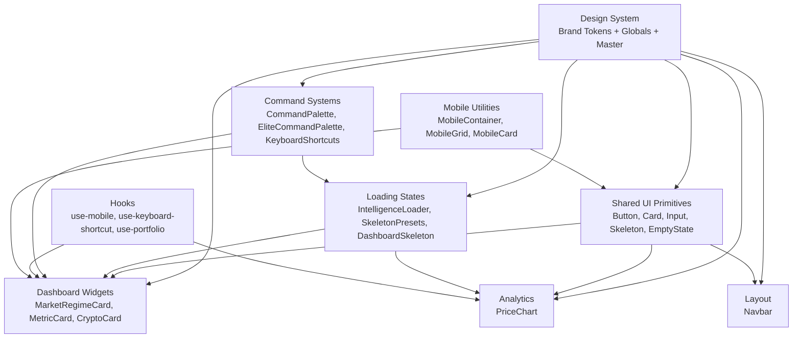
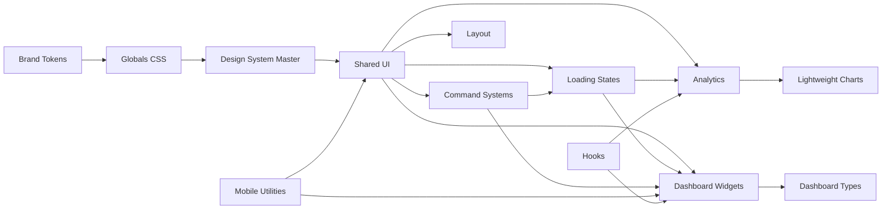

# UI Components

<cite>
**Referenced Files in This Document**
- [src/components/ui/button.tsx](file://src/components/ui/button.tsx)
- [src/components/ui/card.tsx](file://src/components/ui/card.tsx)
- [src/components/ui/input.tsx](file://src/components/ui/input.tsx)
- [src/components/ui/skeleton.tsx](file://src/components/ui/skeleton.tsx)
- [src/components/ui/skeleton-presets.tsx](file://src/components/ui/skeleton-presets.tsx)
- [src/components/ui/empty-state.tsx](file://src/components/ui/empty-state.tsx)
- [src/components/ui/intelligence-loader.tsx](file://src/components/ui/intelligence-loader.tsx)
- [src/components/ui/mobile-container.tsx](file://src/components/ui/mobile-container.tsx)
- [src/components/dashboard/market-regime-card.tsx](file://src/components/dashboard/market-regime-card.tsx)
- [src/components/dashboard/metric-card.tsx](file://src/components/dashboard/metric-card.tsx)
- [src/components/dashboard/crypto-card.tsx](file://src/components/dashboard/crypto-card.tsx)
- [src/components/dashboard/command-palette.tsx](file://src/components/dashboard/command-palette.tsx)
- [src/components/dashboard/elite-command-palette.tsx](file://src/components/dashboard/elite-command-palette.tsx)
- [src/components/dashboard/keyboard-shortcuts-provider.tsx](file://src/components/dashboard/keyboard-shortcuts-provider.tsx)
- [src/components/dashboard/types.ts](file://src/components/dashboard/types.ts)
- [src/components/analytics/price-chart.tsx](file://src/components/analytics/price-chart.tsx)
- [src/components/layout/Navbar.tsx](file://src/components/layout/Navbar.tsx)
- [src/app/dashboard/dashboard-home-content-skeleton.tsx](file://src/app/dashboard/dashboard-home-content-skeleton.tsx)
- [src/app/lyraiq-brand-tokens.css](file://src/app/lyraiq-brand-tokens.css)
- [src/app/globals.css](file://src/app/globals.css)
- [src/lib/chart-config.ts](file://src/lib/chart-config.ts)
- [src/hooks/use-mobile.ts](file://src/hooks/use-mobile.ts)
- [src/hooks/use-keyboard-shortcut.tsx](file://src/hooks/use-keyboard-shortcut.tsx)
- [src/hooks/use-portfolio.ts](file://src/hooks/use-portfolio.ts)
- [src/hooks/use-dashboard-points.ts](file://src/hooks/use-dashboard-points.ts)
- [src/lib/motion.ts](file://src/lib/motion.ts)
- [design-system/lyraalpha/MASTER.md](file://design-system/lyraalpha/MASTER.md)
</cite>

## Update Summary
**Changes Made**
- Added comprehensive skeleton loading states documentation with new presets
- Documented empty state component system for user-friendly data absence scenarios
- Added command palette system documentation covering both standard and elite versions
- Documented keyboard shortcuts provider with cheatsheet overlay
- Enhanced dashboard components with new loading states and intelligence loaders
- Added mobile container utilities for responsive design patterns
- Expanded design system documentation with color, typography, and spacing guidelines

## Table of Contents
1. [Introduction](#introduction)
2. [Project Structure](#project-structure)
3. [Core Components](#core-components)
4. [Architecture Overview](#architecture-overview)
5. [Detailed Component Analysis](#detailed-component-analysis)
6. [Loading States and User Experience](#loading-states-and-user-experience)
7. [Command Palette System](#command-palette-system)
8. [Keyboard Shortcuts Integration](#keyboard-shortcuts-integration)
9. [Mobile Responsiveness](#mobile-responsiveness)
10. [Design System Documentation](#design-system-documentation)
11. [Dependency Analysis](#dependency-analysis)
12. [Performance Considerations](#performance-considerations)
13. [Accessibility Compliance](#accessibility-compliance)
14. [Troubleshooting Guide](#troubleshooting-guide)
15. [Conclusion](#conclusion)
16. [Appendices](#appendices)

## Introduction
This document describes LyraAlpha's React component library focused on reusable UI elements for dashboards, market insights, charts, forms, and navigation. The library now includes comprehensive loading states, empty state management, command palette systems, keyboard shortcuts integration, and enhanced mobile responsiveness. It covers props, events, styling, customization, state management patterns, hooks usage, composition strategies, accessibility, performance, and cross-browser compatibility. Examples are provided via code snippet paths to guide implementation without embedding code directly.

## Project Structure
The component library is organized by domain with enhanced loading and interaction patterns:
- Shared primitives: buttons, inputs, cards, dialogs, tooltips, tabs, skeletons, and empty states
- Dashboard widgets: market regime, metrics, crypto cards, feeds, command palettes, and navigation helpers
- Loading states: intelligence loaders, skeleton presets, and dashboard content skeletons
- Interaction systems: command palettes, keyboard shortcuts provider, and mobile containers
- Analytics: price charts and related visualizations
- Layout: navigation bars, footers, and auth controls
- Design system: comprehensive brand tokens, typography, spacing, and responsive guidelines

```mermaid
graph TB
subgraph "Shared UI Primitives"
B["Button"]
C["Card"]
I["Input"]
SK["Skeleton"]
ESP["EmptyState Presets"]
IL["IntelligenceLoader"]
MC["MobileContainer"]
end
subgraph "Dashboard Widgets"
MRC["MarketRegimeCard"]
MCARD["MetricCard"]
CC["CryptoCard"]
end
subgraph "Command Systems"
CP["CommandPalette"]
ECP["EliteCommandPalette"]
KSP["KeyboardShortcutsProvider"]
end
subgraph "Loading States"
DHCS["DashboardHomeContentSkeleton"]
SKP["SkeletonPresets"]
IL["IntelligenceLoader"]
end
subgraph "Analytics"
PC["PriceChart"]
end
subgraph "Layout"
NB["Navbar"]
end
subgraph "Design System"
DS["Design System Master"]
BT["Brand Tokens"]
G["Globals CSS"]
end
B --> G
C --> G
I --> G
SK --> G
ESP --> G
IL --> G
MC --> G
MRC --> G
MCARD --> G
CC --> G
CP --> G
ECP --> G
KSP --> G
DHCS --> G
SKP --> G
PC --> G
NB --> G
MRC --> BT
MCARD --> BT
CC --> BT
CP --> BT
ECP --> BT
KSP --> BT
PC --> BT
DS --> BT
```

**Diagram sources**
- [src/components/ui/button.tsx:1-65](file://src/components/ui/button.tsx#L1-L65)
- [src/components/ui/card.tsx:1-93](file://src/components/ui/card.tsx#L1-L93)
- [src/components/ui/input.tsx:1-23](file://src/components/ui/input.tsx#L1-L23)
- [src/components/ui/skeleton.tsx:1-15](file://src/components/ui/skeleton.tsx#L1-L15)
- [src/components/ui/skeleton-presets.tsx:1-85](file://src/components/ui/skeleton-presets.tsx#L1-L85)
- [src/components/ui/empty-state.tsx:1-67](file://src/components/ui/empty-state.tsx#L1-L67)
- [src/components/ui/intelligence-loader.tsx:1-61](file://src/components/ui/intelligence-loader.tsx#L1-L61)
- [src/components/ui/mobile-container.tsx:1-150](file://src/components/ui/mobile-container.tsx#L1-L150)
- [src/components/dashboard/market-regime-card.tsx:1-239](file://src/components/dashboard/market-regime-card.tsx#L1-L239)
- [src/components/dashboard/metric-card.tsx:1-147](file://src/components/dashboard/metric-card.tsx#L1-L147)
- [src/components/dashboard/crypto-card.tsx:1-482](file://src/components/dashboard/crypto-card.tsx#L1-L482)
- [src/components/dashboard/command-palette.tsx:1-461](file://src/components/dashboard/command-palette.tsx#L1-L461)
- [src/components/dashboard/elite-command-palette.tsx:1-294](file://src/components/dashboard/elite-command-palette.tsx#L1-L294)
- [src/components/dashboard/keyboard-shortcuts-provider.tsx:1-117](file://src/components/dashboard/keyboard-shortcuts-provider.tsx#L1-L117)
- [src/app/dashboard/dashboard-home-content-skeleton.tsx:1-35](file://src/app/dashboard/dashboard-home-content-skeleton.tsx#L1-L35)
- [src/components/analytics/price-chart.tsx:1-317](file://src/components/analytics/price-chart.tsx#L1-L317)
- [src/components/layout/Navbar.tsx:1-54](file://src/components/layout/Navbar.tsx#L1-L54)
- [design-system/lyraalpha/MASTER.md:1-203](file://design-system/lyraalpha/MASTER.md#L1-L203)

**Section sources**
- [src/components/ui/button.tsx:1-65](file://src/components/ui/button.tsx#L1-L65)
- [src/components/ui/card.tsx:1-93](file://src/components/ui/card.tsx#L1-L93)
- [src/components/ui/input.tsx:1-23](file://src/components/ui/input.tsx#L1-L23)
- [src/components/ui/skeleton.tsx:1-15](file://src/components/ui/skeleton.tsx#L1-L15)
- [src/components/ui/skeleton-presets.tsx:1-85](file://src/components/ui/skeleton-presets.tsx#L1-L85)
- [src/components/ui/empty-state.tsx:1-67](file://src/components/ui/empty-state.tsx#L1-L67)
- [src/components/ui/intelligence-loader.tsx:1-61](file://src/components/ui/intelligence-loader.tsx#L1-L61)
- [src/components/ui/mobile-container.tsx:1-150](file://src/components/ui/mobile-container.tsx#L1-L150)
- [src/components/dashboard/market-regime-card.tsx:1-239](file://src/components/dashboard/market-regime-card.tsx#L1-L239)
- [src/components/dashboard/metric-card.tsx:1-147](file://src/components/dashboard/metric-card.tsx#L1-L147)
- [src/components/dashboard/crypto-card.tsx:1-482](file://src/components/dashboard/crypto-card.tsx#L1-L482)
- [src/components/dashboard/command-palette.tsx:1-461](file://src/components/dashboard/command-palette.tsx#L1-L461)
- [src/components/dashboard/elite-command-palette.tsx:1-294](file://src/components/dashboard/elite-command-palette.tsx#L1-L294)
- [src/components/dashboard/keyboard-shortcuts-provider.tsx:1-117](file://src/components/dashboard/keyboard-shortcuts-provider.tsx#L1-L117)
- [src/app/dashboard/dashboard-home-content-skeleton.tsx:1-35](file://src/app/dashboard/dashboard-home-content-skeleton.tsx#L1-L35)
- [src/components/analytics/price-chart.tsx:1-317](file://src/components/analytics/price-chart.tsx#L1-L317)
- [src/components/layout/Navbar.tsx:1-54](file://src/components/layout/Navbar.tsx#L1-L54)
- [design-system/lyraalpha/MASTER.md:1-203](file://design-system/lyraalpha/MASTER.md#L1-L203)

## Core Components
This section documents the most frequently used reusable components and their capabilities, now enhanced with loading states and interaction systems.

### Shared UI Primitives
- **Button**: Unified action element with variants, sizes, and slot semantics
- **Card**: Container with header/title/description/action/content/footer slots
- **Input**: Text input with focus-visible ring and invalid state styling
- **Skeleton**: Base skeleton component with pulse animation
- **EmptyState**: Comprehensive empty state component with actions
- **IntelligenceLoader**: Specialized loading component with animated spinner
- **MobileContainer**: Responsive container utilities for mobile-first design

### Dashboard Widgets
- **MarketRegimeCard**: Visualize macro regime with breadth, volatility, and sector correlation
- **MetricCard**: Highlight KPIs with trend direction, sparkline, and optional tooltip
- **CryptoCard**: Institutional-grade asset card with ratings, signals, and Lyra insights

### Command Systems
- **CommandPalette**: Universal command palette with navigation, AI, and action commands
- **EliteCommandPalette**: Premium command palette for elite users with enhanced features
- **KeyboardShortcutsProvider**: Global keyboard shortcuts system with cheatsheet overlay

### Analytics
- **PriceChart**: Interactive OHLC/area chart with SMA, EMA, and Bollinger Bands

### Layout
- **Navbar**: Primary navigation bar with branding, links, and auth controls

**Section sources**
- [src/components/ui/button.tsx:1-65](file://src/components/ui/button.tsx#L1-L65)
- [src/components/ui/card.tsx:1-93](file://src/components/ui/card.tsx#L1-L93)
- [src/components/ui/input.tsx:1-23](file://src/components/ui/input.tsx#L1-L23)
- [src/components/ui/skeleton.tsx:1-15](file://src/components/ui/skeleton.tsx#L1-L15)
- [src/components/ui/empty-state.tsx:1-67](file://src/components/ui/empty-state.tsx#L1-L67)
- [src/components/ui/intelligence-loader.tsx:1-61](file://src/components/ui/intelligence-loader.tsx#L1-L61)
- [src/components/ui/mobile-container.tsx:1-150](file://src/components/ui/mobile-container.tsx#L1-L150)
- [src/components/dashboard/market-regime-card.tsx:1-239](file://src/components/dashboard/market-regime-card.tsx#L1-L239)
- [src/components/dashboard/metric-card.tsx:1-147](file://src/components/dashboard/metric-card.tsx#L1-L147)
- [src/components/dashboard/crypto-card.tsx:1-482](file://src/components/dashboard/crypto-card.tsx#L1-L482)
- [src/components/dashboard/command-palette.tsx:1-461](file://src/components/dashboard/command-palette.tsx#L1-L461)
- [src/components/dashboard/elite-command-palette.tsx:1-294](file://src/components/dashboard/elite-command-palette.tsx#L1-L294)
- [src/components/dashboard/keyboard-shortcuts-provider.tsx:1-117](file://src/components/dashboard/keyboard-shortcuts-provider.tsx#L1-L117)
- [src/components/analytics/price-chart.tsx:1-317](file://src/components/analytics/price-chart.tsx#L1-L317)
- [src/components/layout/Navbar.tsx:1-54](file://src/components/layout/Navbar.tsx#L1-L54)

## Architecture Overview
The component library follows a layered approach with enhanced loading and interaction patterns:
- Shared UI primitives provide consistent styling and behavior with comprehensive loading states
- Domain components (dashboard, analytics) compose primitives and integrate with hooks/services
- Command systems provide unified navigation and interaction patterns
- Loading states ensure smooth user experience during data transitions
- Design system tokens (brand, theme, motion) unify appearance and interaction
- Hooks encapsulate state and platform concerns (mobile detection, keyboard shortcuts, portfolio)

**Diagram sources**
- [design-system/lyraalpha/MASTER.md:1-203](file://design-system/lyraalpha/MASTER.md#L1-L203)
- [src/app/lyraiq-brand-tokens.css:1-21](file://src/app/lyraiq-brand-tokens.css#L1-L21)
- [src/app/globals.css:1-880](file://src/app/globals.css#L1-L880)
- [src/components/ui/button.tsx:1-65](file://src/components/ui/button.tsx#L1-L65)
- [src/components/ui/card.tsx:1-93](file://src/components/ui/card.tsx#L1-L93)
- [src/components/ui/input.tsx:1-23](file://src/components/ui/input.tsx#L1-L23)
- [src/components/ui/skeleton.tsx:1-15](file://src/components/ui/skeleton.tsx#L1-L15)
- [src/components/ui/empty-state.tsx:1-67](file://src/components/ui/empty-state.tsx#L1-L67)
- [src/components/ui/intelligence-loader.tsx:1-61](file://src/components/ui/intelligence-loader.tsx#L1-L61)
- [src/components/ui/mobile-container.tsx:1-150](file://src/components/ui/mobile-container.tsx#L1-L150)
- [src/components/dashboard/market-regime-card.tsx:1-239](file://src/components/dashboard/market-regime-card.tsx#L1-L239)
- [src/components/dashboard/metric-card.tsx:1-147](file://src/components/dashboard/metric-card.tsx#L1-L147)
- [src/components/dashboard/crypto-card.tsx:1-482](file://src/components/dashboard/crypto-card.tsx#L1-L482)
- [src/components/dashboard/command-palette.tsx:1-461](file://src/components/dashboard/command-palette.tsx#L1-L461)
- [src/components/dashboard/elite-command-palette.tsx:1-294](file://src/components/dashboard/elite-command-palette.tsx#L1-L294)
- [src/components/dashboard/keyboard-shortcuts-provider.tsx:1-117](file://src/components/dashboard/keyboard-shortcuts-provider.tsx#L1-L117)
- [src/components/analytics/price-chart.tsx:1-317](file://src/components/analytics/price-chart.tsx#L1-L317)
- [src/components/layout/Navbar.tsx:1-54](file://src/components/layout/Navbar.tsx#L1-L54)
- [src/hooks/use-mobile.ts](file://src/hooks/use-mobile.ts)
- [src/hooks/use-keyboard-shortcut.tsx](file://src/hooks/use-keyboard-shortcut.tsx)
- [src/hooks/use-portfolio.ts](file://src/hooks/use-portfolio.ts)

## Detailed Component Analysis

### Skeleton System
The skeleton loading system provides comprehensive loading states for different content types:

- **Base Skeleton**: Core skeleton component with pulse animation and accent-based styling
- **CardSkeleton**: Template for intelligence cards and metric cards with proper spacing
- **TableSkeleton**: Optimized for watchlist, portfolio, and admin tables with density awareness
- **ChartSkeleton**: Designed for briefing charts, sparklines, and gauge loading states
- **ListSkeleton**: Tailored for discovery feeds, news, and movers with consistent item layouts

**Section sources**
- [src/components/ui/skeleton.tsx:1-15](file://src/components/ui/skeleton.tsx#L1-L15)
- [src/components/ui/skeleton-presets.tsx:1-85](file://src/components/ui/skeleton-presets.tsx#L1-L85)

### Empty State Management
The EmptyState component provides a comprehensive solution for handling empty data scenarios:

- **Flexible Props**: Supports custom icons, titles, descriptions, and action buttons
- **Action Support**: Both primary and secondary actions with proper styling
- **Responsive Design**: Adapts to different screen sizes and content densities
- **Accessibility**: Proper semantic structure with ARIA labels and keyboard navigation

**Section sources**
- [src/components/ui/empty-state.tsx:1-67](file://src/components/ui/empty-state.tsx#L1-L67)

### Intelligence Loader
The IntelligenceLoader provides specialized loading states for AI-powered features:

- **Animated Spinner**: Complex multi-layered spinner with glow effects
- **Message System**: Configurable main message and subtext for context
- **Glassmorphism**: Blurred background with frosted glass effect
- **Performance**: Optimized animations with proper hydration handling

**Section sources**
- [src/components/ui/intelligence-loader.tsx:1-61](file://src/components/ui/intelligence-loader.tsx#L1-L61)

### Mobile Container Utilities
Mobile-first responsive utilities for consistent cross-device experiences:

- **MobileContainer**: Responsive padding and max-width management
- **MobileSection**: Consistent vertical spacing across breakpoints
- **MobileGrid**: Flexible grid system with responsive column configuration
- **MobileCard**: Enhanced card styling for mobile touch interactions
- **MobileHeading**: Responsive typography scaling
- **MobileText**: Adaptive text sizing for different content types

**Section sources**
- [src/components/ui/mobile-container.tsx:1-150](file://src/components/ui/mobile-container.tsx#L1-L150)

### Command Palette System
Two-tier command palette system for enhanced navigation:

#### Standard CommandPalette
- **Universal Commands**: Navigation, AI analysis, asset searches, and actions
- **Plan-Based Gating**: Premium features restricted by subscription tiers
- **Keyboard Navigation**: Full arrow key support with enter selection
- **Global Hotkeys**: ⌘K/Ctrl+K to open/close palette
- **Category Organization**: Logical grouping of commands by function
- **Search Filtering**: Real-time filtering with keyword matching

#### EliteCommandPalette
- **Premium Focus**: Elite-specific commands and features
- **Simplified Interface**: Streamlined design for elite users
- **Static Commands**: Fixed command set without plan restrictions
- **Enhanced AI Access**: Direct access to advanced AI features

**Section sources**
- [src/components/dashboard/command-palette.tsx:1-461](file://src/components/dashboard/command-palette.tsx#L1-L461)
- [src/components/dashboard/elite-command-palette.tsx:1-294](file://src/components/dashboard/elite-command-palette.tsx#L1-L294)

### Keyboard Shortcuts Provider
Centralized keyboard shortcut management system:

- **Global Registration**: Automatic registration of keyboard shortcuts
- **Cheatsheet Overlay**: Comprehensive keyboard shortcuts reference
- **Category Organization**: Logical grouping of shortcuts by function
- **Accessibility**: Proper ARIA labels and keyboard navigation support
- **Conditional Activation**: Context-aware shortcut handling

**Section sources**
- [src/components/dashboard/keyboard-shortcuts-provider.tsx:1-117](file://src/components/dashboard/keyboard-shortcuts-provider.tsx#L1-L117)

### Dashboard Home Content Skeleton
Specialized skeleton for dashboard home page:

- **Layered Animation**: Staggered entrance animations for content sections
- **Grid Layout**: Responsive two-column layout for main content
- **Feed Previews**: Skeleton for today's feeds section
- **Insight Feed**: Skeleton for ranked insight feed
- **Performance Optimization**: Minimal DOM nodes for smooth animations

**Section sources**
- [src/app/dashboard/dashboard-home-content-skeleton.tsx:1-35](file://src/app/dashboard/dashboard-home-content-skeleton.tsx#L1-L35)

## Loading States and User Experience
The enhanced loading state system ensures smooth user experience across all interactions:

### Loading State Patterns
- **IntelligenceLoader**: Specialized for AI-powered features with animated spinner
- **SkeletonPresets**: Context-specific loading states for different content types
- **DashboardSkeleton**: Complete page skeleton for initial load scenarios
- **EmptyState**: User-friendly handling of empty data scenarios

### Performance Considerations
- **Animation Optimization**: CSS-based animations for smooth performance
- **Memory Management**: Proper cleanup of event listeners and timeouts
- **Accessibility**: Screen reader friendly loading states
- **Progressive Enhancement**: Graceful degradation for limited environments

**Section sources**
- [src/components/ui/intelligence-loader.tsx:1-61](file://src/components/ui/intelligence-loader.tsx#L1-L61)
- [src/components/ui/skeleton-presets.tsx:1-85](file://src/components/ui/skeleton-presets.tsx#L1-L85)
- [src/app/dashboard/dashboard-home-content-skeleton.tsx:1-35](file://src/app/dashboard/dashboard-home-content-skeleton.tsx#L1-L35)
- [src/components/ui/empty-state.tsx:1-67](file://src/components/ui/empty-state.tsx#L1-L67)

## Command Palette System
The command palette system provides unified navigation and interaction patterns:

### Command Structure
- **CommandItem Interface**: Standardized command definition with metadata
- **Category Classification**: Logical grouping by function (navigate, ai, action, asset)
- **Keyword Indexing**: Fast search through command keywords and labels
- **Plan-Based Access Control**: Subscription tier restrictions for premium features

### Navigation Commands
- **Dashboard Navigation**: Quick access to core application sections
- **Asset Exploration**: Direct navigation to asset analysis and comparison
- **Learning Resources**: Access to educational content and modules
- **Portfolio Management**: Direct access to portfolio analysis tools

### AI Integration Commands
- **Deep Dive Analysis**: Full asset analysis requests
- **Watchlist Audit**: Comprehensive watchlist evaluation
- **Custom Queries**: Advanced AI analysis requests

**Section sources**
- [src/components/dashboard/command-palette.tsx:33-43](file://src/components/dashboard/command-palette.tsx#L33-L43)
- [src/components/dashboard/elite-command-palette.tsx:20-28](file://src/components/dashboard/elite-command-palette.tsx#L20-L28)

## Keyboard Shortcuts Integration
The keyboard shortcuts system enhances accessibility and productivity:

### Shortcut Categories
- **Navigation Shortcuts**: Quick access to major application sections
- **System Shortcuts**: Theme toggling, density mode switching
- **Application Shortcuts**: AI interactions and feature access
- **Utility Shortcuts**: Common actions and operations

### Implementation Patterns
- **Global Event Handling**: Window-level keyboard event listeners
- **Context Awareness**: Shortcuts disabled in input fields when appropriate
- **Cheatsheet Display**: Visual reference for available shortcuts
- **Accessibility Compliance**: Proper ARIA labels and keyboard navigation

**Section sources**
- [src/components/dashboard/keyboard-shortcuts-provider.tsx:9-26](file://src/components/dashboard/keyboard-shortcuts-provider.tsx#L9-L26)
- [src/hooks/use-keyboard-shortcut.tsx](file://src/hooks/use-keyboard-shortcut.tsx)

## Mobile Responsiveness
The mobile container system ensures optimal touch interactions:

### Responsive Patterns
- **Flexible Grid System**: Adaptive column counts based on screen size
- **Touch-Friendly Spacing**: Appropriate touch target sizes and spacing
- **Performance Optimization**: Reduced complexity on mobile devices
- **Consistent Styling**: Maintained design language across all devices

### Mobile-Specific Components
- **MobileGrid**: Responsive grid with configurable column counts
- **MobileCard**: Enhanced card styling optimized for touch interactions
- **MobileHeading**: Scalable typography for different screen sizes
- **MobileText**: Adaptive text sizing for readability

**Section sources**
- [src/components/ui/mobile-container.tsx:61-77](file://src/components/ui/mobile-container.tsx#L61-L77)
- [src/components/ui/mobile-container.tsx:82-99](file://src/components/ui/mobile-container.tsx#L82-L99)
- [src/components/ui/mobile-container.tsx:104-127](file://src/components/ui/mobile-container.tsx#L104-L127)
- [src/components/ui/mobile-container.tsx:132-149](file://src/components/ui/mobile-container.tsx#L132-L149)

## Design System Documentation
The comprehensive design system provides guidelines for consistent visual language:

### Color Palette
- **Primary Colors**: Trust-building orange (#F59E0B) with vibrant purple accents (#8B5CF6)
- **Dark Tech Aesthetic**: Deep blue background (#0F172A) with light text (#F8FAFC)
- **Semantic Usage**: Clear distinction between primary, secondary, and accent colors
- **Theme Support**: Seamless light and dark mode transitions

### Typography System
- **Font Pairing**: Satoshi for headings, General Sans for body text
- **Scale Ratios**: Thoughtful scaling for different content types
- **Readability Focus**: Optimal line lengths and spacing for web content
- **Accessibility**: WCAG-compliant color contrasts across themes

### Spacing and Layout
- **8-Point Grid**: Consistent spacing system based on multiples of 8px
- **Responsive Breakpoints**: Strategic breakpoints for mobile, tablet, and desktop
- **Content Density**: Flexible density options for different use cases
- **Visual Hierarchy**: Clear typographic and spatial hierarchy

### Visual Effects
- **Glassmorphism**: Frosted glass effects with backdrop blur
- **Shadow System**: Layered shadows for depth perception
- **Motion Design**: Smooth transitions and micro-interactions
- **Gradient Usage**: Harmonious gradients with careful application

**Section sources**
- [design-system/lyraalpha/MASTER.md:17-61](file://design-system/lyraalpha/MASTER.md#L17-L61)
- [design-system/lyraalpha/MASTER.md:98-150](file://design-system/lyraalpha/MASTER.md#L98-L150)
- [design-system/lyraalpha/MASTER.md:154-171](file://design-system/lyraalpha/MASTER.md#L154-L171)

## Dependency Analysis
Component dependencies emphasize composition, loading states, and interaction patterns:
- Shared UI depends on design system tokens and cn utility
- Loading states integrate with skeleton system and motion utilities
- Command systems depend on hooks and router integration
- Mobile utilities provide responsive layering
- Dashboard widgets depend on shared UI, loading states, and domain types
- Analytics depends on third-party charting library and memoization
- Layout composes shared UI and slots for extensibility

**Diagram sources**
- [design-system/lyraalpha/MASTER.md:1-203](file://design-system/lyraalpha/MASTER.md#L1-L203)
- [src/app/lyraiq-brand-tokens.css:1-21](file://src/app/lyraiq-brand-tokens.css#L1-L21)
- [src/app/globals.css:1-880](file://src/app/globals.css#L1-L880)
- [src/components/ui/button.tsx:1-65](file://src/components/ui/button.tsx#L1-L65)
- [src/components/ui/card.tsx:1-93](file://src/components/ui/card.tsx#L1-L93)
- [src/components/ui/input.tsx:1-23](file://src/components/ui/input.tsx#L1-L23)
- [src/components/ui/skeleton.tsx:1-15](file://src/components/ui/skeleton.tsx#L1-L15)
- [src/components/ui/empty-state.tsx:1-67](file://src/components/ui/empty-state.tsx#L1-L67)
- [src/components/ui/intelligence-loader.tsx:1-61](file://src/components/ui/intelligence-loader.tsx#L1-L61)
- [src/components/ui/mobile-container.tsx:1-150](file://src/components/ui/mobile-container.tsx#L1-L150)
- [src/components/dashboard/market-regime-card.tsx:1-239](file://src/components/dashboard/market-regime-card.tsx#L1-L239)
- [src/components/dashboard/metric-card.tsx:1-147](file://src/components/dashboard/metric-card.tsx#L1-L147)
- [src/components/dashboard/crypto-card.tsx:1-482](file://src/components/dashboard/crypto-card.tsx#L1-L482)
- [src/components/dashboard/command-palette.tsx:1-461](file://src/components/dashboard/command-palette.tsx#L1-L461)
- [src/components/dashboard/elite-command-palette.tsx:1-294](file://src/components/dashboard/elite-command-palette.tsx#L1-L294)
- [src/components/dashboard/keyboard-shortcuts-provider.tsx:1-117](file://src/components/dashboard/keyboard-shortcuts-provider.tsx#L1-L117)
- [src/components/analytics/price-chart.tsx:1-317](file://src/components/analytics/price-chart.tsx#L1-L317)
- [src/components/layout/Navbar.tsx:1-54](file://src/components/layout/Navbar.tsx#L1-L54)
- [src/components/dashboard/types.ts:1-36](file://src/components/dashboard/types.ts#L1-L36)

**Section sources**
- [design-system/lyraalpha/MASTER.md:1-203](file://design-system/lyraalpha/MASTER.md#L1-L203)
- [src/app/lyraiq-brand-tokens.css:1-21](file://src/app/lyraiq-brand-tokens.css#L1-L21)
- [src/app/globals.css:1-880](file://src/app/globals.css#L1-L880)
- [src/components/dashboard/types.ts:1-36](file://src/components/dashboard/types.ts#L1-L36)

## Performance Considerations
Enhanced performance optimizations for the expanded component library:

- **Memoization**: PriceChart uses memo to avoid unnecessary re-renders when props are unchanged
- **Skeleton Optimization**: Minimal DOM nodes in skeleton components for smooth animations
- **Command Palette Debouncing**: Efficient filtering with memoized command lists
- **Lazy Loading**: IntelligenceLoader components lazy-loaded for AI features
- **Animation Performance**: CSS-based animations with hardware acceleration
- **Memory Management**: Proper cleanup of keyboard event listeners and timeouts
- **Mobile Optimization**: Reduced complexity and optimized touch interactions
- **Bundle Splitting**: Separate bundles for command palettes and loading states

Recommendations:
- Prefer skeleton states for initial page loads
- Implement debounced search for command palettes
- Use mobile-specific optimizations for touch interactions
- Leverage CSS animations over JavaScript for better performance
- Monitor memory usage with keyboard shortcuts and command palettes

**Section sources**
- [src/components/analytics/price-chart.tsx:305-316](file://src/components/analytics/price-chart.tsx#L305-L316)
- [src/components/ui/skeleton-presets.tsx:24-46](file://src/components/ui/skeleton-presets.tsx#L24-L46)
- [src/components/dashboard/command-palette.tsx:254-257](file://src/components/dashboard/command-palette.tsx#L254-L257)
- [src/components/ui/intelligence-loader.tsx:18-22](file://src/components/ui/intelligence-loader.tsx#L18-L22)
- [src/components/ui/mobile-container.tsx:1-150](file://src/components/ui/mobile-container.tsx#L1-L150)

## Accessibility Compliance
Enhanced accessibility features across the expanded component library:

- **Focus Management**: Comprehensive focus-visible outlines across all interactive elements
- **Keyboard Navigation**: Full keyboard support for command palettes and shortcuts
- **Screen Reader Support**: Proper ARIA labels and semantic structure
- **Reduced Motion**: Prefers-reduced-motion media queries for all animations
- **Color Contrast**: WCAG-compliant color ratios across light and dark themes
- **Empty State Accessibility**: Proper semantic structure for empty data scenarios
- **Command Palette ARIA**: Role-based labeling and keyboard navigation support
- **Mobile Accessibility**: Touch-friendly interactions with proper spacing

Guidelines:
- Ensure all interactive elements are reachable via keyboard
- Provide meaningful labels for all commands and actions
- Test with screen readers and assistive technologies
- Verify proper focus management in command palettes
- Validate color contrast in all theme variations

**Section sources**
- [src/app/globals.css:54-112](file://src/app/globals.css#L54-L112)
- [src/app/globals.css:160-170](file://src/app/globals.css#L160-L170)
- [src/components/ui/input.tsx:5-20](file://src/components/ui/input.tsx#L5-L20)
- [src/components/ui/empty-state.tsx:32-66](file://src/components/ui/empty-state.tsx#L32-L66)
- [src/components/dashboard/command-palette.tsx:390-455](file://src/components/dashboard/command-palette.tsx#L390-L455)
- [src/components/dashboard/keyboard-shortcuts-provider.tsx:28-92](file://src/components/dashboard/keyboard-shortcuts-provider.tsx#L28-L92)

## Troubleshooting Guide
Common issues and resolutions for the enhanced component library:

### Loading State Issues
- **Skeleton not animating**: Verify CSS animations are not disabled by reduced-motion preferences
- **IntelligenceLoader not displaying**: Check for proper hydration handling and SSR considerations
- **Empty state not showing**: Ensure proper prop passing and conditional rendering logic

### Command Palette Issues
- **Commands not filtering**: Verify keyword indexing and case-insensitive matching
- **Keyboard shortcuts not working**: Check event listener registration and context awareness
- **Plan gating not functioning**: Validate subscription tier checking logic

### Mobile Responsiveness
- **Touch targets too small**: Review mobile container specifications and touch target sizing
- **Grid layout issues**: Verify responsive breakpoint configurations
- **Performance on mobile**: Check for excessive animations and optimize accordingly

### Design System Issues
- **Color inconsistencies**: Verify CSS variable usage and theme switching
- **Typography scaling**: Check responsive font sizing and breakpoint configurations
- **Spacing variations**: Ensure 8-point grid adherence across components

**Section sources**
- [src/components/ui/skeleton-presets.tsx:1-85](file://src/components/ui/skeleton-presets.tsx#L1-L85)
- [src/components/ui/intelligence-loader.tsx:1-61](file://src/components/ui/intelligence-loader.tsx#L1-L61)
- [src/components/ui/empty-state.tsx:1-67](file://src/components/ui/empty-state.tsx#L1-L67)
- [src/components/dashboard/command-palette.tsx:259-268](file://src/components/dashboard/command-palette.tsx#L259-L268)
- [src/components/dashboard/keyboard-shortcuts-provider.tsx:98-116](file://src/components/dashboard/keyboard-shortcuts-provider.tsx#L98-L116)
- [src/components/ui/mobile-container.tsx:14-21](file://src/components/ui/mobile-container.tsx#L14-L21)
- [design-system/lyraalpha/MASTER.md:41-61](file://design-system/lyraalpha/MASTER.md#L41-L61)

## Conclusion
LyraAlpha's enhanced component library emphasizes composability, consistency, performance, and user experience across loading states, interaction patterns, and mobile responsiveness. The addition of comprehensive skeleton loading states, empty state management, command palette systems, and keyboard shortcuts integration significantly improves the overall user experience. Shared primitives provide a uniform foundation; domain components encapsulate complex behaviors; the design system ensures coherent theming and accessibility; and the mobile utilities guarantee optimal touch interactions. By leveraging hooks, memoization, thoughtful motion, and comprehensive loading states, the library scales across desktop and mobile while maintaining clarity, responsiveness, and accessibility.

## Appendices

### Design System Tokens
- **Brand tokens**: Primary colors, gradients, and typography families
- **Theme tokens**: Light/dark mode palettes, borders, backgrounds, and rings
- **Motion tokens**: Durations and easing curves for animations
- **Mobile tokens**: Responsive breakpoints and touch interaction guidelines
- **Utilities**: Surface classes, glass effects, and scrollbar styling

**Section sources**
- [design-system/lyraalpha/MASTER.md:17-61](file://design-system/lyraalpha/MASTER.md#L17-L61)
- [design-system/lyraalpha/MASTER.md:98-150](file://design-system/lyraalpha/MASTER.md#L98-L150)
- [design-system/lyraalpha/MASTER.md:154-171](file://design-system/lyraalpha/MASTER.md#L154-L171)

### State Management Patterns and Hooks
- **use-mobile**: Detect mobile viewport for responsive behavior
- **use-keyboard-shortcut**: Register global keyboard shortcuts with context awareness
- **use-portfolio**: Manage portfolio-related state
- **use-dashboard-points**: Track dashboard engagement points
- **Enhanced hook patterns**: Command palette state management and keyboard shortcut handling

**Section sources**
- [src/hooks/use-mobile.ts](file://src/hooks/use-mobile.ts)
- [src/hooks/use-keyboard-shortcut.tsx](file://src/hooks/use-keyboard-shortcut.tsx)
- [src/hooks/use-portfolio.ts](file://src/hooks/use-portfolio.ts)
- [src/hooks/use-dashboard-points.ts](file://src/hooks/use-dashboard-points.ts)

### Chart Configuration Reference
- **Chart types**: Candlestick and Area series
- **Indicators**: SMA, EMA, Bollinger Bands
- **Themings**: Colors for series and background/text
- **Responsive behavior**: Mobile-optimized chart rendering

**Section sources**
- [src/components/analytics/price-chart.tsx:101-133](file://src/components/analytics/price-chart.tsx#L101-L133)
- [src/lib/chart-config.ts](file://src/lib/chart-config.ts)

### Loading State Reference
- **Skeleton presets**: Card, table, chart, and list loading states
- **Intelligence loader**: AI-powered feature loading
- **Dashboard skeleton**: Complete page loading states
- **Empty state patterns**: User-friendly data absence handling

**Section sources**
- [src/components/ui/skeleton-presets.tsx:6-85](file://src/components/ui/skeleton-presets.tsx#L6-L85)
- [src/components/ui/intelligence-loader.tsx:4-8](file://src/components/ui/intelligence-loader.tsx#L4-L8)
- [src/app/dashboard/dashboard-home-content-skeleton.tsx:1-35](file://src/app/dashboard/dashboard-home-content-skeleton.tsx#L1-L35)
- [src/components/ui/empty-state.tsx:7-21](file://src/components/ui/empty-state.tsx#L7-L21)

### Command System Reference
- **Command structure**: Standardized command definition and categorization
- **Plan gating**: Subscription tier-based feature access
- **Keyboard navigation**: Arrow key and enter key support
- **Search functionality**: Keyword-based command filtering

**Section sources**
- [src/components/dashboard/command-palette.tsx:33-43](file://src/components/dashboard/command-palette.tsx#L33-L43)
- [src/components/dashboard/elite-command-palette.tsx:20-28](file://src/components/dashboard/elite-command-palette.tsx#L20-L28)
- [src/components/dashboard/keyboard-shortcuts-provider.tsx:9-26](file://src/components/dashboard/keyboard-shortcuts-provider.tsx#L9-L26)

### Mobile Utility Reference
- **Container patterns**: Responsive padding and max-width management
- **Grid system**: Flexible column configuration
- **Touch optimization**: Appropriate sizing and spacing
- **Typography scaling**: Responsive text sizing

**Section sources**
- [src/components/ui/mobile-container.tsx:14-39](file://src/components/ui/mobile-container.tsx#L14-L39)
- [src/components/ui/mobile-container.tsx:61-77](file://src/components/ui/mobile-container.tsx#L61-L77)
- [src/components/ui/mobile-container.tsx:104-127](file://src/components/ui/mobile-container.tsx#L104-L127)
- [src/components/ui/mobile-container.tsx:132-149](file://src/components/ui/mobile-container.tsx#L132-L149)