# UI Primitive Components

<cite>
**Referenced Files in This Document**
- [button.tsx](file://src/components/ui/button.tsx)
- [input.tsx](file://src/components/ui/input.tsx)
- [textarea.tsx](file://src/components/ui/textarea.tsx)
- [card.tsx](file://src/components/ui/card.tsx)
- [dialog.tsx](file://src/components/ui/dialog.tsx)
- [dropdown-menu.tsx](file://src/components/ui/dropdown-menu.tsx)
- [select.tsx](file://src/components/ui/select.tsx)
- [table.tsx](file://src/components/ui/table.tsx)
- [label.tsx](file://src/components/ui/label.tsx)
- [badge.tsx](file://src/components/ui/badge.tsx)
- [avatar.tsx](file://src/components/ui/avatar.tsx)
- [switch.tsx](file://src/components/ui/switch.tsx)
- [theme-provider.tsx](file://src/providers/theme-provider.tsx)
- [utils.ts](file://src/lib/utils.ts)
</cite>

## Table of Contents
1. [Introduction](#introduction)
2. [Project Structure](#project-structure)
3. [Core Components](#core-components)
4. [Architecture Overview](#architecture-overview)
5. [Detailed Component Analysis](#detailed-component-analysis)
6. [Dependency Analysis](#dependency-analysis)
7. [Performance Considerations](#performance-considerations)
8. [Troubleshooting Guide](#troubleshooting-guide)
9. [Conclusion](#conclusion)
10. [Appendices](#appendices)

## Introduction
This document describes LyraAlpha’s foundational UI primitive components and how to use them effectively. It focuses on buttons, inputs, cards, dialogs, dropdowns, tables, and form elements. For each primitive, we document props, variants, sizes, styling options, and accessibility features. We also cover usage patterns, state management, integration with the design system, theming, customization, performance, browser compatibility, and best practices for extension.

## Project Structure
The UI primitives live under src/components/ui and are thin wrappers around Radix UI primitives and Tailwind classes. They expose consistent props, variants, and slots to enable predictable composition and theming.

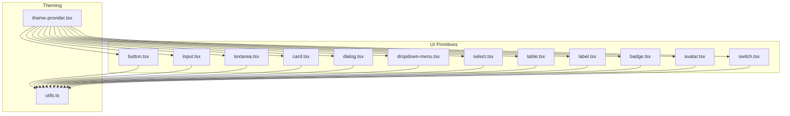

**Diagram sources**
- [button.tsx:1-65](file://src/components/ui/button.tsx#L1-L65)
- [input.tsx:1-23](file://src/components/ui/input.tsx#L1-L23)
- [textarea.tsx:1-19](file://src/components/ui/textarea.tsx#L1-L19)
- [card.tsx:1-93](file://src/components/ui/card.tsx#L1-L93)
- [dialog.tsx:1-90](file://src/components/ui/dialog.tsx#L1-L90)
- [dropdown-menu.tsx:1-258](file://src/components/ui/dropdown-menu.tsx#L1-L258)
- [select.tsx:1-161](file://src/components/ui/select.tsx#L1-L161)
- [table.tsx:1-117](file://src/components/ui/table.tsx#L1-L117)
- [label.tsx:1-25](file://src/components/ui/label.tsx#L1-L25)
- [badge.tsx:1-49](file://src/components/ui/badge.tsx#L1-L49)
- [avatar.tsx:1-110](file://src/components/ui/avatar.tsx#L1-L110)
- [switch.tsx:1-36](file://src/components/ui/switch.tsx#L1-L36)
- [theme-provider.tsx:1-30](file://src/providers/theme-provider.tsx#L1-L30)
- [utils.ts:1-181](file://src/lib/utils.ts#L1-L181)

**Section sources**
- [button.tsx:1-65](file://src/components/ui/button.tsx#L1-L65)
- [input.tsx:1-23](file://src/components/ui/input.tsx#L1-L23)
- [card.tsx:1-93](file://src/components/ui/card.tsx#L1-L93)
- [dialog.tsx:1-90](file://src/components/ui/dialog.tsx#L1-L90)
- [dropdown-menu.tsx:1-258](file://src/components/ui/dropdown-menu.tsx#L1-L258)
- [table.tsx:1-117](file://src/components/ui/table.tsx#L1-L117)
- [select.tsx:1-161](file://src/components/ui/select.tsx#L1-L161)
- [label.tsx:1-25](file://src/components/ui/label.tsx#L1-L25)
- [badge.tsx:1-49](file://src/components/ui/badge.tsx#L1-L49)
- [avatar.tsx:1-110](file://src/components/ui/avatar.tsx#L1-L110)
- [switch.tsx:1-36](file://src/components/ui/switch.tsx#L1-L36)
- [theme-provider.tsx:1-30](file://src/providers/theme-provider.tsx#L1-L30)
- [utils.ts:1-181](file://src/lib/utils.ts#L1-L181)

## Core Components
This section summarizes the primitives covered in this guide, their primary props, and typical usage patterns.

- Button
  - Props: variant, size, asChild, className, and native button attributes.
  - Variants: default, destructive, outline, secondary, ghost, link.
  - Sizes: default, xs, sm, lg, icon, icon-xs, icon-sm, icon-lg.
  - Accessibility: focus-visible ring, aria-invalid integration, pointer-events disabled state.
  - Usage pattern: render as a button or wrap children via asChild for semantic anchors.

- Input
  - Props: type, className, and native input attributes.
  - Accessibility: focus-visible ring, aria-invalid integration, selection color.
  - Usage pattern: controlled via form libraries or React state; pair with Label.

- Textarea
  - Props: className and native textarea attributes.
  - Accessibility: focus-visible ring, aria-invalid integration.
  - Usage pattern: controlled state; consider autosizing libraries if needed.

- Card
  - Subcomponents: Card, CardHeader, CardTitle, CardDescription, CardAction, CardContent, CardFooter.
  - Props: className for each subcomponent.
  - Usage pattern: layout content with consistent spacing and typography.

- Dialog
  - Subcomponents: Dialog, DialogTrigger, DialogPortal, DialogClose, DialogOverlay, DialogContent, DialogHeader, DialogFooter, DialogTitle, DialogDescription.
  - Props: showCloseButton flag on DialogContent.
  - Accessibility: Radix UI semantics, focus trapping, escape-to-close, screen reader labels.
  - Usage pattern: open/close via DialogTrigger; manage state externally or via Radix.

- Dropdown Menu
  - Subcomponents: Root, Portal, Trigger, Content, Group, Label, Item, CheckboxItem, RadioGroup, RadioItem, Separator, Shortcut, Sub, SubTrigger, SubContent.
  - Props: inset, variant, sideOffset, position, and native attributes.
  - Accessibility: keyboard navigation, focus management, nested submenus.
  - Usage pattern: bind to click/touch events; handle selection via controlled state.

- Select
  - Subcomponents: Root, Group, Value, Trigger, Content, Label, Item, Separator, ScrollUp/Down buttons.
  - Props: position, className, and native attributes.
  - Accessibility: keyboard navigation, virtual scrolling viewport, selection indicators.
  - Usage pattern: controlled value; use ItemText for display.

- Table
  - Subcomponents: Table, TableHeader, TableBody, TableFooter, TableRow, TableHead, TableCell, TableCaption.
  - Props: className for each subcomponent.
  - Accessibility: hover and selected states; checkbox alignment helpers.
  - Usage pattern: horizontal scrolling container for wide tables.

- Label
  - Props: className and native label attributes.
  - Accessibility: integrates with form controls via htmlFor; peer/for disabled states.

- Badge
  - Props: variant, asChild, className.
  - Variants: default, secondary, destructive, outline, ghost, link.
  - Usage pattern: lightweight status or tag; supports anchor children.

- Avatar
  - Props: size (default, sm, lg), className.
  - Subcomponents: Avatar, AvatarImage, AvatarFallback, AvatarBadge, AvatarGroup, AvatarGroupCount.
  - Usage pattern: initials fallback; grouped avatars with overlap.

- Switch
  - Props: size (sm, default), className.
  - Accessibility: focus-visible ring; controlled via checked prop.
  - Usage pattern: controlled state; pair with Label.

**Section sources**
- [button.tsx:1-65](file://src/components/ui/button.tsx#L1-L65)
- [input.tsx:1-23](file://src/components/ui/input.tsx#L1-L23)
- [textarea.tsx:1-19](file://src/components/ui/textarea.tsx#L1-L19)
- [card.tsx:1-93](file://src/components/ui/card.tsx#L1-L93)
- [dialog.tsx:1-90](file://src/components/ui/dialog.tsx#L1-L90)
- [dropdown-menu.tsx:1-258](file://src/components/ui/dropdown-menu.tsx#L1-L258)
- [select.tsx:1-161](file://src/components/ui/select.tsx#L1-L161)
- [table.tsx:1-117](file://src/components/ui/table.tsx#L1-L117)
- [label.tsx:1-25](file://src/components/ui/label.tsx#L1-L25)
- [badge.tsx:1-49](file://src/components/ui/badge.tsx#L1-L49)
- [avatar.tsx:1-110](file://src/components/ui/avatar.tsx#L1-L110)
- [switch.tsx:1-36](file://src/components/ui/switch.tsx#L1-L36)

## Architecture Overview
The primitives follow a consistent pattern:
- Use Radix UI for accessible base semantics.
- Apply Tailwind classes via a composable cn utility.
- Expose variants/sizes via class-variance-authority (CVA) where applicable.
- Provide subcomponents for composite widgets (Card, Dialog, DropdownMenu, Select, Table).
- Integrate with the theming provider for light/dark mode and persistence.

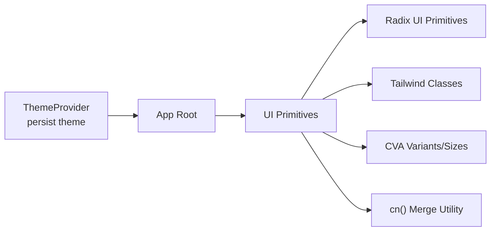

**Diagram sources**
- [theme-provider.tsx:1-30](file://src/providers/theme-provider.tsx#L1-L30)
- [button.tsx:1-65](file://src/components/ui/button.tsx#L1-L65)
- [card.tsx:1-93](file://src/components/ui/card.tsx#L1-L93)
- [dialog.tsx:1-90](file://src/components/ui/dialog.tsx#L1-L90)
- [dropdown-menu.tsx:1-258](file://src/components/ui/dropdown-menu.tsx#L1-L258)
- [select.tsx:1-161](file://src/components/ui/select.tsx#L1-L161)
- [table.tsx:1-117](file://src/components/ui/table.tsx#L1-L117)
- [utils.ts:1-6](file://src/lib/utils.ts#L1-L6)

**Section sources**
- [theme-provider.tsx:1-30](file://src/providers/theme-provider.tsx#L1-L30)
- [utils.ts:1-6](file://src/lib/utils.ts#L1-L6)

## Detailed Component Analysis

### Button
- Purpose: Primary action element with consistent spacing, transitions, and focus styles.
- Props:
  - variant: default, destructive, outline, secondary, ghost, link.
  - size: default, xs, sm, lg, icon, icon-xs, icon-sm, icon-lg.
  - asChild: renders children as a slot for semantic anchors.
  - className and native button props.
- Accessibility:
  - Focus ring via focus-visible utilities.
  - aria-invalid integration for form feedback.
  - Disabled state prevents pointer events and reduces opacity.
- Styling:
  - Uses CVA for variant and size combinations.
  - Ensures SVG sizing consistency inside button content.
- Usage patterns:
  - Render as a button for actions; use asChild to wrap links or other elements.
  - Combine with icons; ensure proper spacing and sizing.

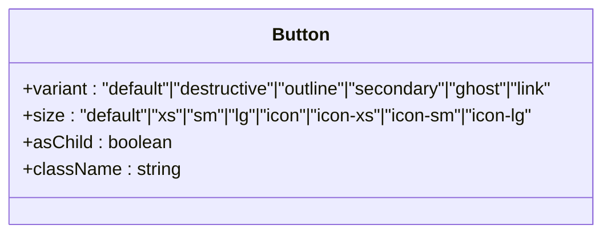

**Diagram sources**
- [button.tsx:41-62](file://src/components/ui/button.tsx#L41-L62)

**Section sources**
- [button.tsx:1-65](file://src/components/ui/button.tsx#L1-L65)

### Input
- Purpose: Text input with consistent focus states and selection colors.
- Props:
  - type: input type.
  - className and native input props.
- Accessibility:
  - Focus ring and ring color on invalid state.
  - Selection highlighting matches primary palette.
- Styling:
  - Border, background, and text colors adapt to theme.
  - Disabled state handled with opacity and pointer-events.
- Usage patterns:
  - Controlled via React state or form libraries.
  - Pair with Label for accessibility.

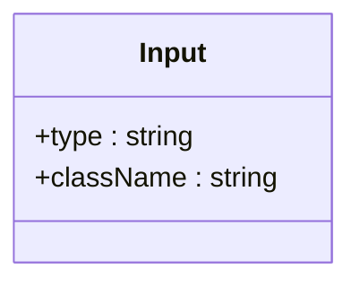

**Diagram sources**
- [input.tsx:5-20](file://src/components/ui/input.tsx#L5-L20)

**Section sources**
- [input.tsx:1-23](file://src/components/ui/input.tsx#L1-L23)

### Textarea
- Purpose: Multiline text input with consistent focus and invalid states.
- Props:
  - className and native textarea props.
- Accessibility:
  - Focus ring and aria-invalid integration.
- Styling:
  - Rounded borders, background, and placeholder colors adapt to theme.
- Usage patterns:
  - Controlled state; consider autosize libraries for dynamic height.

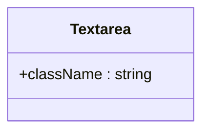

**Diagram sources**
- [textarea.tsx:5-15](file://src/components/ui/textarea.tsx#L5-L15)

**Section sources**
- [textarea.tsx:1-19](file://src/components/ui/textarea.tsx#L1-L19)

### Card
- Purpose: Container with header, title, description, content, and footer slots.
- Subcomponents:
  - Card, CardHeader, CardTitle, CardDescription, CardAction, CardContent, CardFooter.
- Props:
  - className for each subcomponent.
- Styling:
  - Consistent rounded corners, shadows, and padding.
  - Grid layout in CardHeader adapts to presence of CardAction.
- Usage patterns:
  - Compose with Typography and Buttons for consistent layouts.

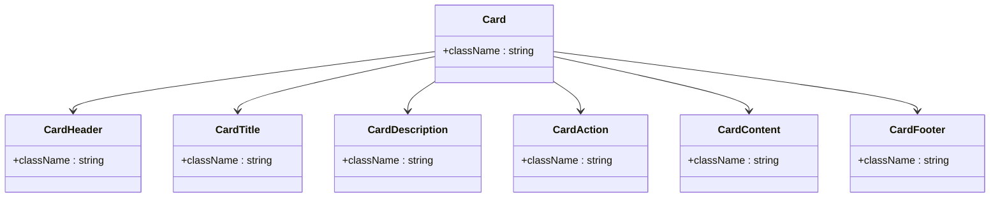

**Diagram sources**
- [card.tsx:5-82](file://src/components/ui/card.tsx#L5-L82)

**Section sources**
- [card.tsx:1-93](file://src/components/ui/card.tsx#L1-L93)

### Dialog
- Purpose: Modal overlay with focus trapping and optional close button.
- Subcomponents:
  - Dialog, DialogTrigger, DialogPortal, DialogClose, DialogOverlay, DialogContent, DialogHeader, DialogFooter, DialogTitle, DialogDescription.
- Props:
  - showCloseButton flag on DialogContent.
  - sideOffset, position, and native attributes for content.
- Accessibility:
  - Radix UI focus trap, escape-to-close, ARIA roles and labels.
- Styling:
  - Backdrop blur and slide/fade animations.
  - Responsive max-width and scrollable content area.
- Usage patterns:
  - Manage open state externally; trigger opens DialogRoot.

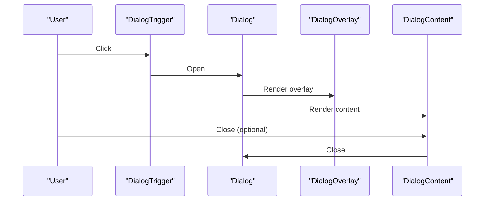

**Diagram sources**
- [dialog.tsx:9-60](file://src/components/ui/dialog.tsx#L9-L60)

**Section sources**
- [dialog.tsx:1-90](file://src/components/ui/dialog.tsx#L1-L90)

### Dropdown Menu
- Purpose: Flexible menu with groups, checkboxes, radios, separators, and submenus.
- Subcomponents:
  - Root, Portal, Trigger, Content, Group, Label, Item, CheckboxItem, RadioGroup, RadioItem, Separator, Shortcut, Sub, SubTrigger, SubContent.
- Props:
  - inset, variant, sideOffset, position, and native attributes.
- Accessibility:
  - Keyboard navigation, focus management, nested menus.
- Styling:
  - Backdrop blur, slide-in animations, and scrollable viewport.
- Usage patterns:
  - Controlled selection via parent state; handle item clicks.

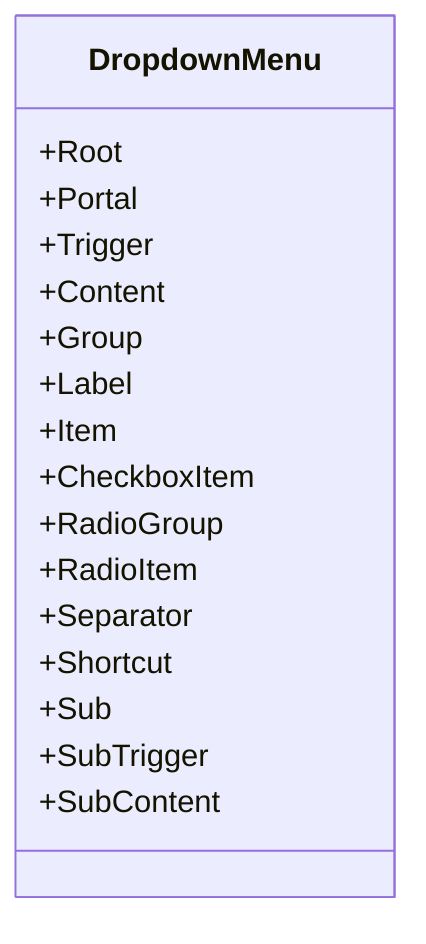

**Diagram sources**
- [dropdown-menu.tsx:9-257](file://src/components/ui/dropdown-menu.tsx#L9-L257)

**Section sources**
- [dropdown-menu.tsx:1-258](file://src/components/ui/dropdown-menu.tsx#L1-L258)

### Select
- Purpose: Accessible single/multi-selection dropdown with virtualized viewport.
- Subcomponents:
  - Root, Group, Value, Trigger, Content, Label, Item, Separator, ScrollUp/Down buttons.
- Props:
  - position (popper vs inline), className, and native attributes.
- Accessibility:
  - Keyboard navigation, selection indicators, scroll buttons.
- Styling:
  - Popper positioning adjustments and fade/zoom animations.
- Usage patterns:
  - Controlled value; use ItemText for display; handle change externally.

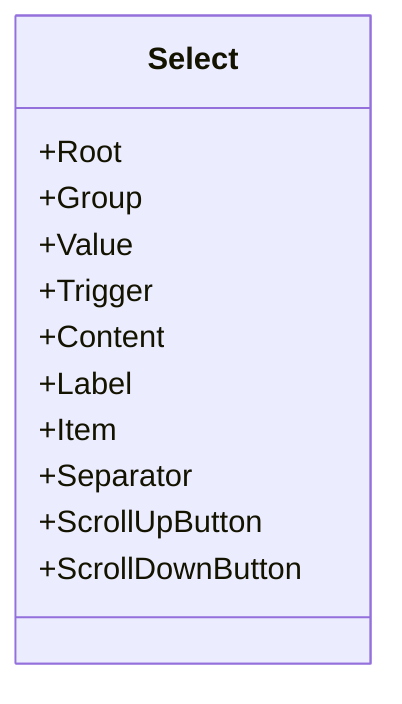

**Diagram sources**
- [select.tsx:9-160](file://src/components/ui/select.tsx#L9-L160)

**Section sources**
- [select.tsx:1-161](file://src/components/ui/select.tsx#L1-L161)

### Table
- Purpose: Structured tabular data with responsive container and hover/selected states.
- Subcomponents:
  - Table, TableHeader, TableBody, TableFooter, TableRow, TableHead, TableCell, TableCaption.
- Props:
  - className for each subcomponent.
- Accessibility:
  - Hover and selected states; checkbox alignment helpers.
- Styling:
  - Horizontal scrolling container for narrow screens.
- Usage patterns:
  - Wrap in a scroll container for wide datasets.

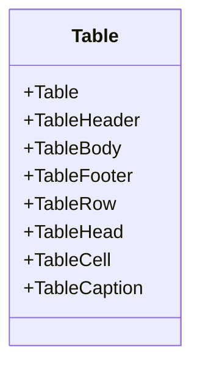

**Diagram sources**
- [table.tsx:7-116](file://src/components/ui/table.tsx#L7-L116)

**Section sources**
- [table.tsx:1-117](file://src/components/ui/table.tsx#L1-L117)

### Label
- Purpose: Associates text with form controls for accessibility.
- Props:
  - className and native label attributes.
- Accessibility:
  - Integrates with peer/for disabled states; supports disabled groups.
- Usage patterns:
  - Use htmlFor to connect with inputs/textarea/select.

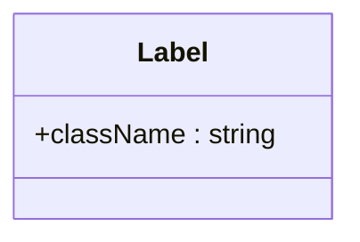

**Diagram sources**
- [label.tsx:8-22](file://src/components/ui/label.tsx#L8-L22)

**Section sources**
- [label.tsx:1-25](file://src/components/ui/label.tsx#L1-L25)

### Badge
- Purpose: Lightweight status or tag with variants.
- Props:
  - variant: default, secondary, destructive, outline, ghost, link.
  - asChild: render children as a slot.
  - className and native span props.
- Accessibility:
  - Focus ring and aria-invalid integration.
- Styling:
  - CVA variants with hover states and link variant underline.
- Usage patterns:
  - Use asChild to render anchors; combine with icons.

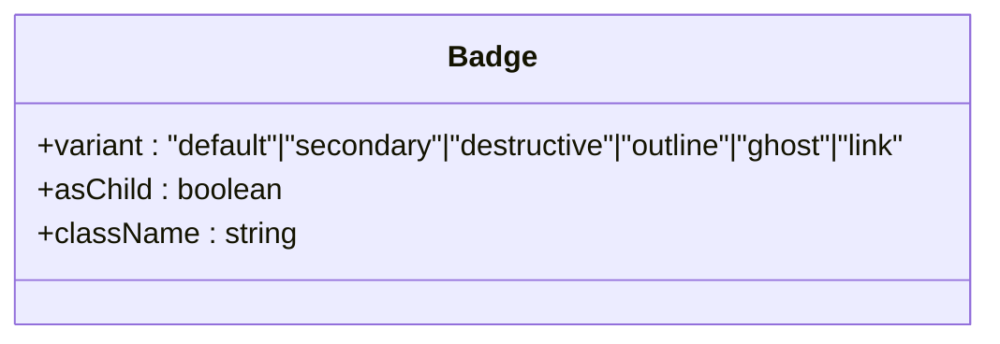

**Diagram sources**
- [badge.tsx:29-46](file://src/components/ui/badge.tsx#L29-L46)

**Section sources**
- [badge.tsx:1-49](file://src/components/ui/badge.tsx#L1-L49)

### Avatar
- Purpose: User identity with image, fallback, badge, and group utilities.
- Subcomponents:
  - Avatar, AvatarImage, AvatarFallback, AvatarBadge, AvatarGroup, AvatarGroupCount.
- Props:
  - size: default, sm, lg.
  - className and native attributes.
- Accessibility:
  - Semantic grouping and fallback text.
- Styling:
  - Size variants and ring overlap in groups.
- Usage patterns:
  - Use fallback initials; apply badges for status.

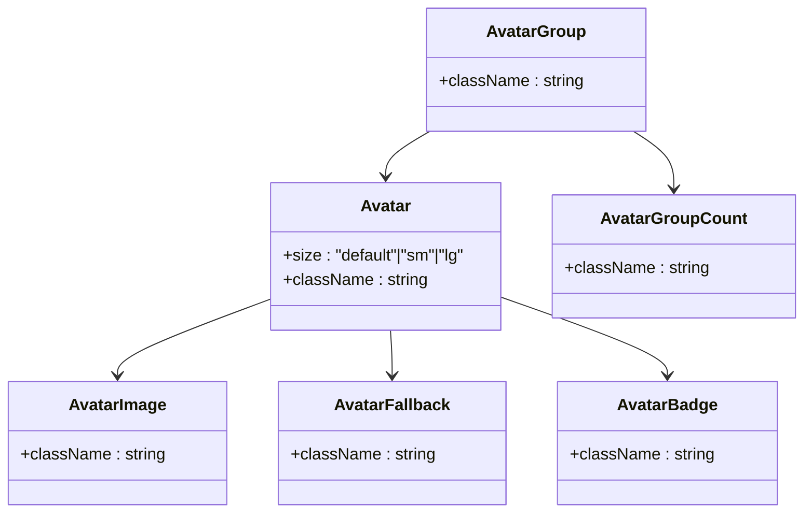

**Diagram sources**
- [avatar.tsx:8-109](file://src/components/ui/avatar.tsx#L8-L109)

**Section sources**
- [avatar.tsx:1-110](file://src/components/ui/avatar.tsx#L1-L110)

### Switch
- Purpose: Toggle control with focus and size variants.
- Props:
  - size: sm, default.
  - className and native switch attributes.
- Accessibility:
  - Focus ring; controlled via checked prop.
- Styling:
  - Thumb translation and size variants.
- Usage patterns:
  - Controlled state; pair with Label.

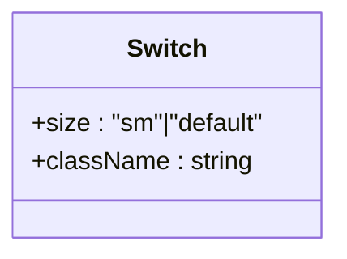

**Diagram sources**
- [switch.tsx:8-33](file://src/components/ui/switch.tsx#L8-L33)

**Section sources**
- [switch.tsx:1-36](file://src/components/ui/switch.tsx#L1-L36)

## Dependency Analysis
- Theming:
  - ThemeProvider persists theme to localStorage and cookies and wraps the app.
  - Components rely on CSS variables and Tailwind classes that adapt to theme.
- Utilities:
  - cn merges Tailwind classes safely; used across all primitives.
- Radix UI:
  - Dialog, DropdownMenu, Select, Switch, and Avatar use Radix primitives for accessible base behavior.

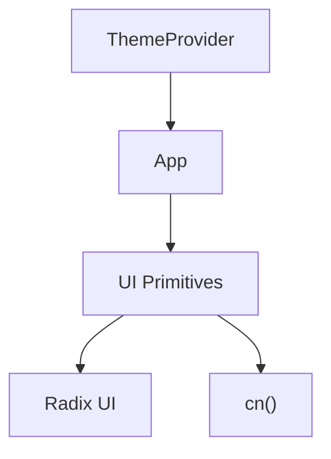

**Diagram sources**
- [theme-provider.tsx:19-29](file://src/providers/theme-provider.tsx#L19-L29)
- [utils.ts:4-6](file://src/lib/utils.ts#L4-L6)

**Section sources**
- [theme-provider.tsx:1-30](file://src/providers/theme-provider.tsx#L1-L30)
- [utils.ts:1-6](file://src/lib/utils.ts#L1-L6)

## Performance Considerations
- Prefer controlled components for forms to avoid unnecessary re-renders.
- Use minimal className overrides; leverage variants/sizes to reduce style churn.
- For large tables, keep rows virtualized or paginated to limit DOM nodes.
- Debounce heavy input handlers (e.g., search) to improve responsiveness.
- Avoid deep nesting in composite components to reduce layout thrashing.
- Use CSS containment sparingly; ensure it does not interfere with Radix animations.

## Troubleshooting Guide
- Focus ring not visible:
  - Ensure focus-visible utilities are applied and theme variables are set.
- Disabled state not working:
  - Verify disabled prop is passed and pointer-events are disabled.
- Dropdown/Select not opening:
  - Confirm Trigger is used and Portal is rendered; check sideOffset and position.
- Dialog not closing:
  - Ensure DialogClose is present or state is managed externally.
- Label not focusing input:
  - Use htmlFor on Label and match it with input id.

**Section sources**
- [button.tsx:8-62](file://src/components/ui/button.tsx#L8-L62)
- [input.tsx:5-20](file://src/components/ui/input.tsx#L5-L20)
- [textarea.tsx:5-15](file://src/components/ui/textarea.tsx#L5-L15)
- [label.tsx:8-22](file://src/components/ui/label.tsx#L8-L22)
- [dialog.tsx:38-60](file://src/components/ui/dialog.tsx#L38-L60)
- [dropdown-menu.tsx:23-52](file://src/components/ui/dropdown-menu.tsx#L23-L52)
- [select.tsx:15-100](file://src/components/ui/select.tsx#L15-L100)

## Conclusion
LyraAlpha’s UI primitives provide a consistent, accessible, and theme-aware foundation for building interfaces. By leveraging variants, sizes, and subcomponents, teams can compose reliable experiences while maintaining design system alignment. Use controlled state patterns, accessibility attributes, and the theming provider to ensure robust, inclusive, and performant UI.

## Appendices

### Props Reference Summary
- Button: variant, size, asChild, className, native button props.
- Input: type, className, native input props.
- Textarea: className, native textarea props.
- Card: className for each subcomponent.
- Dialog: showCloseButton, className, native attributes.
- DropdownMenu: inset, variant, sideOffset, position, className, native attributes.
- Select: position, className, native attributes.
- Table: className for each subcomponent.
- Label: className, native label props.
- Badge: variant, asChild, className.
- Avatar: size, className.
- Switch: size, className.

### Theming and Customization
- Theme persistence:
  - ThemeProvider stores theme in localStorage and cookies.
- Utility:
  - cn merges classes safely; used across primitives.
- Extending:
  - Add new variants via CVA in components that use it (e.g., Button, Badge).
  - Override className selectively; avoid overriding core styles.

**Section sources**
- [theme-provider.tsx:6-29](file://src/providers/theme-provider.tsx#L6-L29)
- [utils.ts:4-6](file://src/lib/utils.ts#L4-L6)